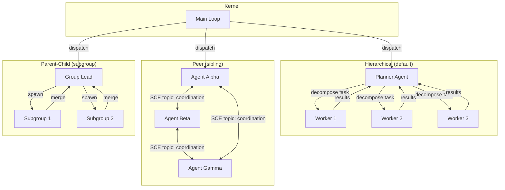

# Multi-Agent Orchestration

> **Domain:** Multi-Agent Coordination
> **Applies to:** Kernel, AI Group System, SCE, Merge Manager
> **Last updated:** 2026-07-22

## Overview

Multiple agents can be assigned to a single run, coordinating through a combination of hierarchical control, peer-to-peer communication, and shared state. The orchestration system ensures that agents can work in parallel without conflicts, share intermediate results, and synchronize at defined barriers.



## Coordination Patterns

### Hierarchical (Kernel → Planner → Workers)

The default pattern. A **Planner agent** receives a high-level task from the Kernel, decomposes it into sub-tasks, and dispatches each sub-task to a **Worker agent**. Workers operate independently and report back to the Planner, which merges results and returns the final output to the Kernel.

- **Use case:** Complex coding tasks (e.g., "implement feature X across 5 files").
- **Concurrency:** All workers run in parallel.
- **Failure handling:** If a worker fails, the Planner can re-dispatch the sub-task to another worker or adjust the plan.

### Peer (Sibling Agents)

Agents at the same level communicate directly via the SCE event bus. Each agent subscribes to a shared coordination topic and publishes status updates, intermediate results, and requests for input.

- **Use case:** Collaborative debugging (e.g., "agent-alpha investigates the frontend, agent-beta investigates the backend, they share findings").
- **Concurrency:** All agents run in parallel, communicating asynchronously.
- **Failure handling:** One agent failing does not block others if tasks are independent. Dependent agents wait for a timeout and proceed with partial information.

### Parent-Child (Group Spawning Subgroups)

A **Group Lead** agent spawns child subgroups, each of which has its own internal hierarchy. Subgroups work in parallel and merge their results back to the Group Lead.

- **Use case:** Large refactors where each module is handled by its own team of agents.
- **Concurrency:** Subgroups run in parallel; within each subgroup, the pattern can be hierarchical.
- **Failure handling:** Subgroup failure is isolated to that subgroup. The Group Lead can redistribute the work.

## Task Distribution Strategy

| Factor | Strategy |
|--------|----------|
| **Task granularity** | Planner decomposes into tasks that take 30–120 seconds each. |
| **Dependency analysis** | Tasks with dependencies are serialized; independent tasks are parallelized. |
| **Load balancing** | Workers are assigned tasks greedily (next free worker gets the next task). |
| **Affinity** | Agents with relevant context (from memory) are preferred for related sub-tasks. |

## Cross-Agent Communication

All cross-agent communication happens through the **SCE event bus** (see [Agent Communication](AGENT_COMMUNICATION.md)):

| Concept | Representation |
|---------|---------------|
| **Topic** | `aidevos.<workspace_id>.<run_id>.coordination` |
| **Envelope** | `{ topic, sender_id, correlation_id, event_type, payload, timestamp }` |
| **correlation_id** | UUID v4 linking all messages in a coordination flow. |
| **Delivery** | At-least-once (consumers must idempotently deduplicate). |

**Message types:**

| Event Type | Payload | Direction |
|------------|---------|-----------|
| `task.assigned` | `{ task_id, description, dependencies }` | Planner → Worker |
| `task.completed` | `{ task_id, result_summary, artifacts[] }` | Worker → Planner |
| `task.failed` | `{ task_id, error, recoverable }` | Worker → Planner |
| `sync.request` | `{ resource_id, requester }` | Peer → Peer |
| `sync.grant` | `{ resource_id, holder, ttl }` | Peer → Peer |
| `barrier.reached` | `{ barrier_id, agent_id }` | Any → All |
| `barrier.released` | `{ barrier_id }` | Coordinator → All |

## Shared State Model

The **SCE event log is the source of truth** for multi-agent state:

- Every state-changing event is appended to the SCE log.
- Agents reconstruct state by replaying relevant events (event sourcing pattern).
- No shared mutable memory — agents communicate through immutable events.
- The event log is compacted periodically (snapshot + trim) to bound storage.

## Conflict Prevention

### Merge Protocol (merge.begin / merge.commit)

When two agents need to modify the same resource (e.g., the same file):

1. **Lock:** `merge.begin(resource_id, agent_id)` — acquires an advisory lock.
   - Returns `Ok` if the lock is acquired, `ErrResourceLocked` if held by another agent.
   - Locks have a TTL (30 seconds). If the lock holder does not call `merge.commit` in time, the lock is released.
2. **Modify:** The agent performs its changes.
3. **Commit:** `merge.commit(resource_id, agent_id)` — releases the lock and records the change.
   - Uses **optimistic concurrency**: the commit includes a version number. If the resource has been modified since the lock was acquired, the commit fails and the agent must retry.

```typescript
// Agent workflow
const lock = await merge.begin("src/main.rs", "agent-alpha");
if (lock.status === "acquired") {
  const edit = await agent.editFile("src/main.rs", patch);
  const result = await merge.commit("src/main.rs", "agent-alpha", edit.version);
  if (result.status === "conflict") {
    // Another agent modified the file concurrently — rebase and retry
    await merge.begin("src/main.rs", "agent-alpha"); // re-lock
    // ... re-apply changes on top of the new version
  }
}
```

## Failure Handling

| Scenario | Behavior |
|----------|----------|
| **Worker agent crashes** | Planner detects via SCE heartbeat timeout (30s). Re-dispatches the task to another worker. If no worker available, the Planner escalates to the Kernel. |
| **Planner agent crashes** | Kernel detects the Planner failure. If the run has checkpoints, a new Planner is spawned from the last checkpoint. If not, the run fails with a partial-results report. |
| **Peer agent fails (independent task)** | Other peers continue unaffected. The failed agent's tasks are re-assigned by the Kernel. |
| **Peer agent fails (dependent task)** | Dependent agents wait up to `dependency_timeout` (60s), then proceed without the blocked results. |
| **SCE broker failure** | The Kernel restarts the SCE broker. In-flight messages are lost (at-most-once delivery is restored). Agents reconnect and re-request state. |

## Synchronization Points

| Point | Mechanism | Description |
|-------|-----------|-------------|
| **Merge stage** | `merge.begin/commit` | All agents with changes to the same resource converge at a merge barrier. No agent proceeds past the barrier until all changes are merged. |
| **Barrier task** | `coordinate.barrier(name)` | Explicit synchronization point. All agents must call `barrier.reached` before any agent proceeds past the barrier. |
| **Checkpoint** | Run-level snapshot | The Kernel can request a full state checkpoint. All agents pause, flush state to the SCE log, and resume. |

## Interfaces

| Interface | Description |
|-----------|-------------|
| `coordinate.barrier(name, timeout?)` | Declare and wait for a synchronization barrier. Returns when all agents in the group have reached the barrier. |
| `coordinate.broadcast(topic, event_type, payload)` | Send an event to all agents subscribed to the topic. |
| `coordinate.gather(topic, event_type, timeout?)` | Collect responses from all agents on a topic. Returns `Map<AgentId, payload>`. |
| `coordinate.send(agent_id, topic, event_type, payload)` | Send a direct message to a specific agent. |
| `merge.begin(resource_id)` | Acquire an advisory lock on a resource. |
| `merge.commit(resource_id, version)` | Commit changes and release the lock. |
| `merge.status(resource_id)` | Check lock status and current version. |

## Failure Modes

| Mode | Detection | Response |
|------|-----------|----------|
| Agent deadlock | Two agents each hold a lock on a resource the other needs | Deadlock detector (background thread) identifies cycle; break by force-releasing lock on lower-priority agent; escalate to Kernel |
| Message loss | Gap in SCE event sequence numbers | Re-request missing events from SCE event log; if unavailable, proceed with best-effort state reconstruction |
| Timeout cascade | One agent's timeout triggers re-dispatch, which triggers further timeouts | Inject jitter into re-dispatch delay (1–5 s random); cap cascade depth at 3; escalate to human if exceeded |
| Resource starvation | All workers in pool are blocked on I/O or lock acquisition | Shed non-critical tasks; expand pool if configured with headroom; log CRITICAL if pool exhausted > 30 s |
| Split-brain (coordination failure) | Two agents independently believe they hold the same lock | SCE lock state is authoritative: agents must verify lock ownership before every write; detect conflict during merge.commit |
| Unhandled agent crash with dirty state | Agent terminates mid-write without releasing resources | Heartbeat monitor detects failure within 30 s; lease-based locks auto-release after TTL expiry (default 30 s) |
| Coordination topic saturation | > 1000 events/s on a single coordination topic | Throttle event publishing; partition topic by sub-task; scale SCE broker if sustained |

## Observability

| Metric | Labels | Description |
|--------|--------|-------------|
| `orchestration_active_agents` | `pattern` | Gauge: number of currently active agents by coordination pattern |
| `orchestration_task_duration_seconds` | `task_type`, `result` | Wall-clock duration per sub-task |
| `orchestration_message_total` | `event_type` | Messages exchanged between agents by event type |
| `orchestration_lock_contention_ratio` | `resource_type` | Fraction of merge.begin calls that returned ErrResourceLocked |
| `orchestration_deadlock_total` | — | Count of deadlock cycles detected and resolved |
| `orchestration_pool_utilization` | `pool_name` | Percentage of worker pool slots in use |
| `orchestration_barrier_wait_seconds` | `barrier_id` | Time all agents waited at a synchronization barrier |

Traces: one trace per multi-agent run, with a root span for the Kernel dispatch and child spans for each agent's task execution, merge operations, and barrier synchronization.

## Related Documents

| Document | Description |
|----------|-------------|
| [Main AI Kernel](MAIN_AI_KERNEL.md) | Kernel loop, event dispatch, lifecycle management |
| [AI Group System](AI_GROUP_SYSTEM.md) | Agent group creation, supervision, scaling |
| [Dynamic Workers](DYNAMIC_WORKERS.md) | Worker process lifecycle, resource management |
| [Agent Communication](AGENT_COMMUNICATION.md) | SCE message format, topics, delivery guarantees |
| [Merge Manager](MERGE_MANAGER.md) | Merge protocol, conflict resolution, lock management |
| [Task Graph](TASK_GRAPH.md) | Task dependency graphs, scheduling, DAG execution |
