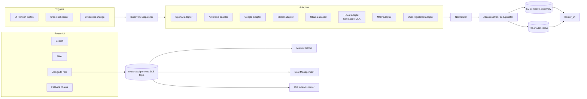

# Nine Router

> Model discovery, provider grouping, role assignment, and fallback-chain management across every connected AI provider.

## Overview

The Nine Router is the model-routing and role-assignment subsystem of AI Dev OS. It is the single point of truth for "which model is active for each of the nine canonical roles." The Router discovers every model reachable from the workspace, normalises their metadata into a common schema, groups them by provider, exposes a filterable UI, and lets the user (or the [Main AI Kernel](./MAIN_AI_KERNEL.md)) assign models to roles with optional per-project overrides and fallback chains.

The Nine Router is not a load balancer and it is not a proxy. It produces a `ModelBinding` for each role, which the Kernel hands to [Dynamic Workers](./DYNAMIC_WORKERS.md) at task-start time. Actual provider I/O is then handled exclusively by [Model Providers](./MODEL_PROVIDERS.md).

Every decision the Router makes is published as an event on the [Shared Context Engine](./SHARED_CONTEXT_ENGINE.md) so that other subsystems (Cost Management, Observability, the CLI) can react to role changes without polling.

## Goals

- Discover every model available across all configured providers by querying each provider's `/models` endpoint (or documented equivalent) with a single normalised adapter interface.
- Group and display results in a stable provider order: Local → OpenAI → Anthropic → Google → Mistral → MCP-exposed catalogs → User-registered.
- Let the user or Kernel assign any discovered model to any of the nine roles, with per-project and per-group overrides on top of workspace defaults.
- Support ordered fallback chains per role so the Kernel can slide down the chain on provider errors without re-entering the Router.
- Degrade per provider: one unreachable provider MUST NOT block discovery for others.
- Publish `router.assignments` events whenever a role assignment changes so subscribers update without polling.

## Non-Goals

- Actual provider I/O — belongs in [Model Providers](./MODEL_PROVIDERS.md).
- Model performance benchmarking — belongs in [Benchmarks](./BENCHMARKS.md).
- Cost accounting beyond pricing hints from the provider catalog — belongs in [Cost Management](./COST_MANAGEMENT.md).
- Implementation code — this repository is documentation-only (see [AI Coding Rules](./AI_CODING_RULES.md)).

## The Nine Roles

Each role maps to a distinct responsibility in the Kernel loop. Every role MUST have exactly one primary model assigned; a fallback chain MAY list additional models tried in order when the primary is unavailable.

| # | Role | Responsibility | Recommended capability |
|---|------|----------------|----------------------|
| 1 | **Kernel** | Top-level orchestrator; owns the loop | High reasoning, large context |
| 2 | **Planner** | Decomposes goals into `TaskGraph` nodes | Strong instruction-following |
| 3 | **Router** | Selects models per subtask (recursive) | Fast, cheap, reliable |
| 4 | **Researcher** | Retrieval, synthesis, web search | Tool-use, long context |
| 5 | **Builder** | Code generation and file edits | Code-specialist, tool-use |
| 6 | **Critic** | Reviews output; issues `Verdict` | Analytical, low temperature |
| 7 | **Merger** | Reconciles concurrent edits; calls [Merge Manager](./MERGE_MANAGER.md) | Structured-output |
| 8 | **Guardian** | Enforces architectural invariants; calls [Architecture Guardian](./ARCHITECTURE_GUARDIAN.md) | Rule-following, structured-output |
| 9 | **Voice** | Speech-to-text and text-to-speech routing; calls [Voice System](./VOICE_SYSTEM.md) | Audio modality |

### Role assignment rules

- The workspace-level assignment is the default for every project unless overridden.
- A project-level override applies to all groups within that project unless a group-level override exists.
- A group-level override applies to all tasks within that group.
- Role assignments are versioned; the Kernel always reads the assignment that was active when the run was submitted (snapshot semantics).
- Changing an assignment while a run is in flight does NOT affect that run; the new assignment takes effect for the next run.

## Model Discovery

Discovery is the mechanism by which the Router learns what models exist. See [Model Discovery](./MODEL_DISCOVERY.md) for the complete adapter-by-adapter specification. The key contracts from the Router's perspective:

- Discovery runs on three triggers: **manual Refresh** (UI or `aidevos models refresh`), **scheduled** (via [Job Scheduler](./JOB_SCHEDULER.md), default every 10 minutes), and **credential change** (a new or updated provider key triggers a targeted refresh for that provider only).
- Each provider's response is normalised into the [canonical `Model` schema](./MODEL_DISCOVERY.md#canonical-schema).
- A `DiscoveryReport` is published on the `models.discovery` SCE topic after every run; the Router UI subscribes and updates without a page reload.
- The Router caches the last successful `Model[]` per provider with a configurable TTL (default `10m`). The `list()` call always reads from cache; it never hits providers.

### Provider endpoint table

| Provider  | Endpoint | Auth method |
|-----------|----------|-------------|
| OpenAI | `GET https://api.openai.com/v1/models` | `Authorization: Bearer <key>` |
| Anthropic | `GET https://api.anthropic.com/v1/models` | `x-api-key`, `anthropic-version` |
| Google | `GET https://generativelanguage.googleapis.com/v1beta/models` | `?key=…` or ADC |
| Mistral | `GET https://api.mistral.ai/v1/models` | `Authorization: Bearer <key>` |
| Ollama | `GET http://localhost:11434/api/tags` | none |
| llama.cpp | `GET http://localhost:8080/v1/models` (OpenAI-compat) | none |
| MLX | Filesystem scan of model cache | none |
| MCP servers | `tools/list` on servers advertising `model` resources | per-server |
| User-registered | Configurable base URL + auth | configurable |

## Architecture



## Requirements

- **MUST** query each provider's documented `/models` endpoint (table above) via an adapter that conforms to the normalised interface.
- **MUST** group results in the stable provider order: Local, OpenAI, Anthropic, Google, Mistral, MCP-exposed, User-registered.
- **MUST** render providers that returned an error in the UI with an error badge and a Retry action; MUST NOT hide them.
- **MUST** support search across `id`, `display_name`, `family`, and `aliases`.
- **MUST** support filter by: provider, capability (tools, vision, audio, json_mode, streaming, embeddings), context window range, deprecated status, modality.
- **MUST** allow the user to assign any model to any role from the filtered list.
- **MUST** store ordered fallback chains per role and expose them via `router.fallbacks(role) → Model[]`.
- **MUST** publish a `RoleAssignment` event on `router.assignments` whenever a role changes; event carries `{ role, model_id, previous_model_id, actor, ts }`.
- **MUST** enforce that every role always has a primary model — the Kernel MUST NOT start a run with a role unassigned.
- **MUST** never store provider credentials; always pull from [Secrets Management](./SECRETS_MANAGEMENT.md) at call time.
- **SHOULD** support pluggable providers via the [Plugin SDK](./PLUGIN_SDK.md).
- **SHOULD** ship shell completions for `aidevos router assign <TAB>` that enumerate discovered model IDs.
- **MAY** offer a "Pick for me" smart-assign that reads the role description and recommends a model from the cache.

## Interfaces

```
# Discovery
router.discover(provider_id?) → DiscoveryReport
router.refresh_all(force?: bool) → DiscoveryReport
router.list(filter?: ModelFilter) → Model[]
router.get(model_id) → Model
router.subscribe_discovery() → AsyncIterator<DiscoveryReport>

# Role assignment
router.roles() → RoleAssignment[]           // all nine roles + current assignment
router.get_role(role) → RoleAssignment
router.assign(role, model_id, scope?)       // scope: workspace|project|group
router.fallbacks(role) → Model[]            // ordered fallback chain
router.set_fallbacks(role, model_ids[])
router.binding(role) → ModelBinding         // resolved, ready for Kernel
router.subscribe_roles() → AsyncIterator<RoleAssignment>
```

`ModelBinding` is the resolved artefact the Kernel passes to a worker:

```
ModelBinding {
  role:        NineRole
  primary:     Model
  fallbacks:   Model[]
  scope:       "workspace"|"project"|"group"
  snapshot_ts: rfc3339   # time at run submission
  correlation_id: uuid
}
```

All errors follow [API Spec](./API_SPEC.md).

## Grouping and Sort Order

Within each provider group, models are sorted by:

1. `family` (alphabetical) — keeps `gpt-4o` variants together
2. `deprecated asc` — non-deprecated before deprecated
3. `display_name` (alphabetical)

Models with `status: "preview"` receive a **Preview** badge. Models with `deprecated: true` receive a **Deprecated** badge and are collapsed by default in the UI but remain assignable.

## Fallback Resolution

When the Kernel attempts to execute a task and the primary model for a role returns an error, it slides down the fallback chain:

```
for model in [primary, ...fallbacks]:
  try:
    result = await model.invoke(task)
    if result.ok: return result
  catch ProviderError as e:
    emit("router.fallback", { role, from: model.id, reason: e.code })
raise ExhaustedFallbacks
```

`ExhaustedFallbacks` causes the Kernel to mark the task `failed` and publish a `run.stage_failed` event.

## Data Model

```
RoleAssignment {
  role:      NineRole
  model_id:  string        # canonical "provider/model-id"
  fallbacks: string[]
  scope:     "workspace" | "project" | "group"
  scope_id:  string?       # project_id or group_id when scope != workspace
  actor:     { id, role }
  ts:        rfc3339
}
```

Full model schema and `DiscoveryReport` schema are defined in [Model Discovery](./MODEL_DISCOVERY.md).

## Failure Modes

| Mode | Detection | Response |
|------|-----------|----------|
| Provider unreachable during discovery | HTTP error / timeout | Keep last-known-good cache; mark provider degraded in UI; continue with other providers |
| All fallbacks exhausted for a role | `ExhaustedFallbacks` | Kernel marks task `failed`; publishes alert on SCE |
| Role unassigned at run-start | Missing `RoleAssignment` | Kernel refuses to start run; returns `ROLE_NOT_ASSIGNED` error |
| Stale cache (TTL expired) | Cache entry age > TTL | Re-run discovery for that provider in background; serve stale data with a freshness warning |
| Credential revoked mid-run | Provider returns 401 | Mark provider `auth_error`; surface "Reconnect provider" action; fall back to next in chain |
| Discovery loop hung | Adapter timeout (default 10s) | Cancel adapter; report `discovery_timeout` in `DiscoveryReport.errors`; keep other adapters running |

All failures emit structured events on the SCE and are recorded in the [Audit Log](./AUDIT_LOG.md).

## Security Considerations

- Credentials are read from [Secrets Management](./SECRETS_MANAGEMENT.md) per discovery call; never logged, cached with results, or included in any event payload.
- Discovery responses (model names, context windows, pricing hints) are treated as public metadata.
- Role assignment events carry the `actor` identity and are signed by the Kernel (see [Security Model](./SECURITY_MODEL.md)).
- MCP-exposed model catalogs are treated as untrusted input until the [Architecture Guardian](./ARCHITECTURE_GUARDIAN.md) approves their use.

## Observability

| Metric | Labels | Description |
|--------|--------|-------------|
| `router_discovery_run_total` | `provider`, `ok` | Discovery runs per provider |
| `router_discovery_seconds` | `provider` | Duration histogram per provider |
| `router_models_total` | `provider`, `status` | Count of models in cache |
| `router_delta_total` | `kind=added\|removed\|changed` | Model catalog changes per refresh |
| `router_assignment_change_total` | `role`, `scope` | Role reassignments |
| `router_fallback_total` | `role`, `reason` | Fallback events triggered |
| `router_fallback_exhausted_total` | `role` | Fallback chains fully exhausted |

Traces: one span per adapter call with the provider ID as an attribute; one parent span per `refresh_all`. See [Tracing](./TRACING.md).

## Acceptance Criteria

- Fresh install with only Ollama running yields a non-empty catalog with exactly one group (`Local`) and an error badge on all cloud providers.
- Assigning `ollama/llama3.1:8b` to the Builder role reflects immediately in `aidevos router show`, in the `router.assignments` SCE topic, and in `router.binding("builder")`.
- Revoking an OpenAI key surfaces a "Reconnect provider" badge; all other providers remain fully functional.
- A model deprecated by its provider appears in the next `DiscoveryReport.changed` with `deprecated: true`; it is still assignable but shows a Deprecated badge.
- `aidevos models list --json | jq 'group_by(.provider)'` produces the same grouping as the UI renders.
- A fallback chain of three models where the first two return 503 succeeds on the third without user intervention.

## Open Questions

- Whether per-group overrides should cascade down to child groups or be flat — tracked in [templates/ADR](../templates/ADR.md).
- Auto-refresh interval: fixed 10 min vs. adaptive based on provider activity.
- Whether "Pick for me" should be a pure rule engine or a model call (cost vs. quality trade-off).

## Related Documents

- [Model Discovery](./MODEL_DISCOVERY.md) — adapter specs and canonical schema
- [Model Providers](./MODEL_PROVIDERS.md) — per-provider integration details
- [Model Routing Policy](./MODEL_ROUTING_POLICY.md) — policy rules consulted during fallback resolution
- [Main AI Kernel](./MAIN_AI_KERNEL.md) — consumer of `ModelBinding`
- [Dynamic Workers](./DYNAMIC_WORKERS.md) — workers that receive `ModelBinding`
- [Cost Management](./COST_MANAGEMENT.md) — subscriber to `router.assignments`
- [CLI](./CLI.md) — `aidevos models` and `aidevos router` subcommands
- [diagrams/NINE_ROUTER_FLOW](../diagrams/NINE_ROUTER_FLOW.md)
