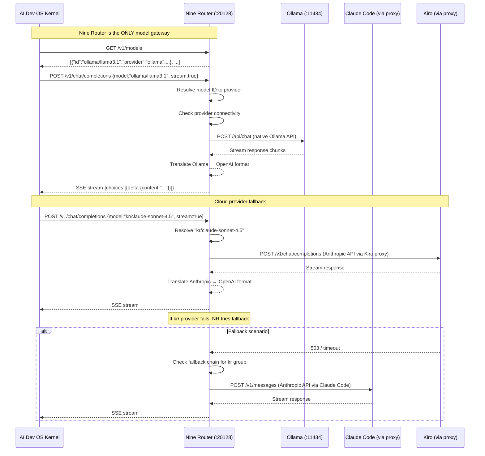

# Nine Router Integration

> Integration point: Nine Router is the mandatory model gateway for the AI Development Operating System. All model access flows through its OpenAI-compatible API at `http://localhost:20128/v1`.

## Overview

Nine Router is the single, mandatory model gateway for the AI Development Operating System. Every inference request, model list query, streaming call, and embedding computation passes through Nine Router before reaching a provider. No subsystem — Kernel, Planner, Critic, Researcher, or any agent — communicates with model providers directly.

Nine Router exposes an OpenAI-compatible API at `http://localhost:20128/v1`, which means any client written against the OpenAI Python/TypeScript/curl API can target Nine Router without code changes — only the base URL and authentication header differ. The router handles provider resolution, load balancing, fallback chains, format translation, and credential management internally.

This document defines the integration surface between AI Dev OS and Nine Router, covering the API contract, connection lifecycle, streaming semantics, embedding endpoints, fallback behavior, and provider configuration responsibilities.

## Goals

- Nine Router MUST be the only model gateway; no subsystem talks to providers directly (Invariant 1 per [LOCAL_FIRST_ARCHITECTURE](./LOCAL_FIRST_ARCHITECTURE.md))
- The integration surface MUST be OpenAI-compatible — any OpenAI SDK can target Nine Router
- Model discovery MUST come from Nine Router's `GET /v1/models`, never from direct provider queries
- Chat completions (streaming and non-streaming) MUST pass through Nine Router's `POST /v1/chat/completions`
- Embeddings MUST pass through Nine Router's `POST /v1/embeddings`
- Format translation between providers' native APIs and the OpenAI format MUST be transparent
- Fallback tiers MUST be configurable so that if a primary provider fails, the next in chain is tried
- Provider configuration (API keys, endpoints, model mappings) MUST be managed in Nine Router, not in AI Dev OS
- The default connection is localhost-only with no authentication for local providers
- Connectivity status of each provider MUST be surfaced via Nine Router's model metadata

## Non-Goals

- Bypassing Nine Router for any model access — this is an architectural invariant violation
- Implementing provider-specific logic in AI Dev OS subsystems — providers are opaque to the Kernel
- Managing provider credentials in AI Dev OS configuration — all credential configuration is in Nine Router
- Defining model routing policy — that is documented in [MODEL_ROUTING_POLICY.md](./MODEL_ROUTING_POLICY.md)
- Replacing Nine Router — it is the mandatory gateway and cannot be substituted

## Architecture

### Request Flow



### Nine Router in the System Hierarchy

```
┌──────────────────────────────┐
│      AI Dev OS Kernel        │
│     (localhost:3090)         │
└──────────┬───────────────────┘
           │ HTTP/OpenAI-compat
           ▼
┌──────────────────────────────┐
│      Nine Router             │
│     (localhost:20128)        │
│                              │
│  ┌──────────────────────┐   │
│  │  Provider Registry   │   │
│  │  • ollama (local)    │   │
│  │  • cc (Claude Code)  │   │
│  │  • kr (Kiro)         │   │
│  │  • openai             │   │
│  │  • anthropic          │   │
│  │  • custom endpoints   │   │
│  └──────────────────────┘   │
└──────────┬───────────────────┘
           │
    ┌──────┼──────────┬──────────┐
    ▼      ▼          ▼          ▼
┌──────┐ ┌────┐ ┌────────┐ ┌────────┐
│Ollama│ │LM  │ │Claude  │ │ Kiro   │
│:11434│ │Studio│ │Code   │ │(cloud) │
└──────┘ └────┘ └────────┘ └────────┘
```

## Configuration

### AI Dev OS Connection to Nine Router

```toml
# ~/.config/aidevos/config.toml — AI Dev OS side

[nine_router]
endpoint = "http://localhost:20128/v1"
# No API key required for local-only usage
# Optional: api_key for authenticated access (if Nine Router is configured to require it)
# api_key = ""

[model_access]
# AI Dev OS only knows model IDs prefixed by provider codes
# Example: "ollama/llama3.1", "cc/claude-sonnet-4.5", "kr/claude-sonnet-4.5"
# The prefix determines which provider Nine Router routes to
default_model = "ollama/llama3.1"
fallback_model = "ollama/llama3.2:1b"

# Nine Router connection settings
connection_timeout_ms = 5000
request_timeout_ms = 120000
max_retries = 2
retry_delay_ms = 1000
```

### Nine Router Side Configuration

Provider configuration is done inside Nine Router's own dashboard or config file, NOT in AI Dev OS. The user accesses Nine Router's admin interface and configures providers interactively. See [NINE_ROUTER_PROVIDER_REGISTRY.md](./NINE_ROUTER_PROVIDER_REGISTRY.md) for details.

```toml
# ~/.config/nine-router/config.toml — Nine Router side (managed separately)

[nine_router]
listen = "0.0.0.0:20128"  # binds to all interfaces but defaults to localhost

[api]
openai_compat = true
require_api_key = false  # local-only mode

[providers.ollama]
type = "ollama"
endpoint = "http://localhost:11434"
enabled = true
priority = 1

[providers.cc]
type = "anthropic"  # Claude Code uses Anthropic-compatible API
endpoint = "http://localhost:8085"  # Claude Code proxy
api_key = "${CC_API_KEY}"  # from env or Nine Router encrypted store
enabled = true
priority = 2

[providers.kr]
type = "anthropic"  # Kiro uses Anthropic-compatible API
endpoint = "https://api.kiro.dev/v1"
api_key = "${KIRO_API_KEY}"
enabled = true
priority = 3

[fallback]
enabled = true
default_strategy = "chain"  # try-primary, chain, round-robin
chain_order = ["ollama", "cc", "kr"]
```

## Interfaces

### OpenAI-Compatible API Surface

Nine Router implements the following OpenAI API endpoints:

#### `GET /v1/models`

Returns the list of available models across all configured providers.

```
GET http://localhost:20128/v1/models
Authorization: Bearer <optional-api-key>

Response 200:
{
  "object": "list",
  "data": [
    {
      "id": "ollama/llama3.1",
      "object": "model",
      "created": 1700000000,
      "owned_by": "ollama",
      "permission": [],
      "root": "ollama/llama3.1",
      "provider": {
        "name": "ollama",
        "status": "connected",
        "type": "local"
      },
      "capabilities": ["chat", "streaming", "tool_calls"],
      "context_length": 8192
    },
    {
      "id": "cc/claude-sonnet-4.5",
      "object": "model",
      "created": 1700000001,
      "owned_by": "cc",
      "permission": [],
      "root": "cc/claude-sonnet-4.5",
      "provider": {
        "name": "cc",
        "status": "connected",
        "type": "cloud"
      },
      "capabilities": ["chat", "streaming", "tool_calls", "vision"],
      "context_length": 200000
    },
    {
      "id": "kr/claude-sonnet-4.5",
      "object": "model",
      "created": 1700000002,
      "owned_by": "kr",
      "permission": [],
      "root": "kr/claude-sonnet-4.5",
      "provider": {
        "name": "kr",
        "status": "disconnected",
        "type": "cloud"
      },
      "capabilities": ["chat", "streaming", "tool_calls", "vision"],
      "context_length": 200000
    }
  ]
}
```

#### `POST /v1/chat/completions`

Standard OpenAI chat completions endpoint. Supports streaming and non-streaming.

```
POST http://localhost:20128/v1/chat/completions
Content-Type: application/json

{
  "model": "ollama/llama3.1",
  "messages": [
    {"role": "system", "content": "You are a coding assistant."},
    {"role": "user", "content": "Write a Python function to sort a list."}
  ],
  "stream": true,
  "temperature": 0.7,
  "max_tokens": 4096
}
```

**Streaming response** (when `stream: true`):

```
data: {"id":"chatcmpl-xxx","object":"chat.completion.chunk","choices":[{"index":0,"delta":{"role":"assistant","content":"Here"},"finish_reason":null}]}

data: {"id":"chatcmpl-xxx","object":"chat.completion.chunk","choices":[{"index":0,"delta":{"content":"'s a Python"},"finish_reason":null}]}

data: [DONE]
```

**Non-streaming response** (when `stream: false` or omitted):

```json
{
  "id": "chatcmpl-xxx",
  "object": "chat.completion",
  "created": 1700000003,
  "model": "ollama/llama3.1",
  "choices": [
    {
      "index": 0,
      "message": {
        "role": "assistant",
        "content": "Here's a Python function..."
      },
      "finish_reason": "stop"
    }
  ],
  "usage": {
    "prompt_tokens": 45,
    "completion_tokens": 120,
    "total_tokens": 165
  }
}
```

#### `POST /v1/embeddings`

OpenAI-compatible embeddings endpoint. Nine Router translates to the underlying provider's embedding API.

```
POST http://localhost:20128/v1/embeddings
Content-Type: application/json

{
  "model": "ollama/nomic-embed-text",
  "input": "The quick brown fox jumps over the lazy dog"
}

Response 200:
{
  "object": "list",
  "data": [
    {
      "object": "embedding",
      "index": 0,
      "embedding": [0.0123, -0.0456, ...]  # 768-dim vector
    }
  ],
  "model": "ollama/nomic-embed-text",
  "usage": {
    "prompt_tokens": 8,
    "total_tokens": 8
  }
}
```

### AI Dev OS Client Library

```python
from aidevos.nine_router import NineRouterClient

client = NineRouterClient(
    endpoint="http://localhost:20128/v1",
    api_key=None,  # local-only mode
    timeout_ms=120000,
)

# List models
models = client.list_models()
for m in models:
    print(f"{m.id} ({m.provider.name}: {m.provider.status})")

# Chat completion (non-streaming)
response = client.chat_completion(
    model="ollama/llama3.1",
    messages=[{"role": "user", "content": "Hello!"}],
)
print(response.choices[0].message.content)

# Chat completion (streaming)
for chunk in client.chat_completion_stream(
    model="ollama/llama3.1",
    messages=[{"role": "user", "content": "Write code"}],
):
    if chunk.choices[0].delta.content:
        print(chunk.choices[0].delta.content, end="")

# Embeddings
embeddings = client.embeddings(
    model="ollama/nomic-embed-text",
    input="Text to embed",
)
print(embeddings.data[0].embedding[:5])
```

### Fallback Tiers

The Kernel sends all requests to Nine Router. Nine Router manages fallback internally:

| Tier | Provider | Fallback Chain |
|------|----------|----------------|
| 1 | ollama (local) | → cc (Claude Code) → kr (Kiro) |
| 2 | cc (Claude Code) | → kr (Kiro) → ollama (local) |
| 3 | kr (Kiro) | → cc (Claude Code) → ollama (local) |
| 4 | openai | → ollama (local) → cc (Claude Code) |

The fallback chain is configured in Nine Router, not in AI Dev OS. The Kernel specifies only the model ID; Nine Router decides which provider to route to and when to fall back.

## Failure Modes

| Failure Mode | Detection | Recovery |
|-------------|-----------|----------|
| Nine Router unreachable | Connection refused on :20128 | Fall back to retry with backoff; alert user via dashboard; show recovery instructions |
| Provider disconnected | Model has `provider.status: "disconnected"` | Exclude from routing; attempt fallback chain; log provider down |
| Model not found | 404 from Nine Router | Return error to calling subsystem; suggest `aidevos models sync` |
| Request timeout | No response within request_timeout_ms | Retry up to max_retries; if all fail, try fallback chain |
| Streaming interrupt | SSE stream terminates early | Return partial response with `finish_reason: "length"`; log truncation |
| Rate limited | 429 from Nine Router or upstream | Exponential backoff; retry with different model if available |
| Authentication failure | 401 from Nine Router (if auth enabled) | Prompt user for API key; log to audit; fall back to unauthenticated local providers |
| Format translation error | Provider response cannot be translated | Return raw provider error; log translation failure |
| Embedding mismatch | Dimensions differ between providers | Normalize to Nine Router's configured default dimensions; log warning |

## Security

- Nine Router runs on localhost:20128 by default — no network exposure
- API key authentication can be enabled for Nine Router for shared-network deployments
- Provider API keys are stored in Nine Router's encrypted config, never in AI Dev OS
- The Kernel sends the model ID as-is; Nine Router resolves it — the Kernel never sees provider credentials
- TLS is not required for localhost connections; it can be enabled for remote access
- Nine Router validates all incoming requests against its provider registry before forwarding
- Streaming responses are proxied through Nine Router's memory space, never written to disk
- Fallback chain metadata is internal to Nine Router; the Kernel sees only the final response

## Related Documents

- [Nine Router Model Discovery](./NINE_ROUTER_MODEL_DISCOVERY.md)
- [Nine Router Provider Registry](./NINE_ROUTER_PROVIDER_REGISTRY.md)
- [Local-First Architecture](./LOCAL_FIRST_ARCHITECTURE.md)
- [Model Routing Policy](./MODEL_ROUTING_POLICY.md)
- [Model Discovery](./MODEL_DISCOVERY.md)
- [Local Model Providers](./LOCAL_MODEL_PROVIDERS.md)
- [API Spec](./API_SPEC.md)
- [Streaming Responses](./STREAMING_RESPONSES.md)
- [Embeddings](./EMBEDDINGS.md)
- [Cost Management](./COST_MANAGEMENT.md)
- [Secrets Management](./SECRETS_MANAGEMENT.md)
- [Nine Router Reference](./NINE_ROUTER.md)
