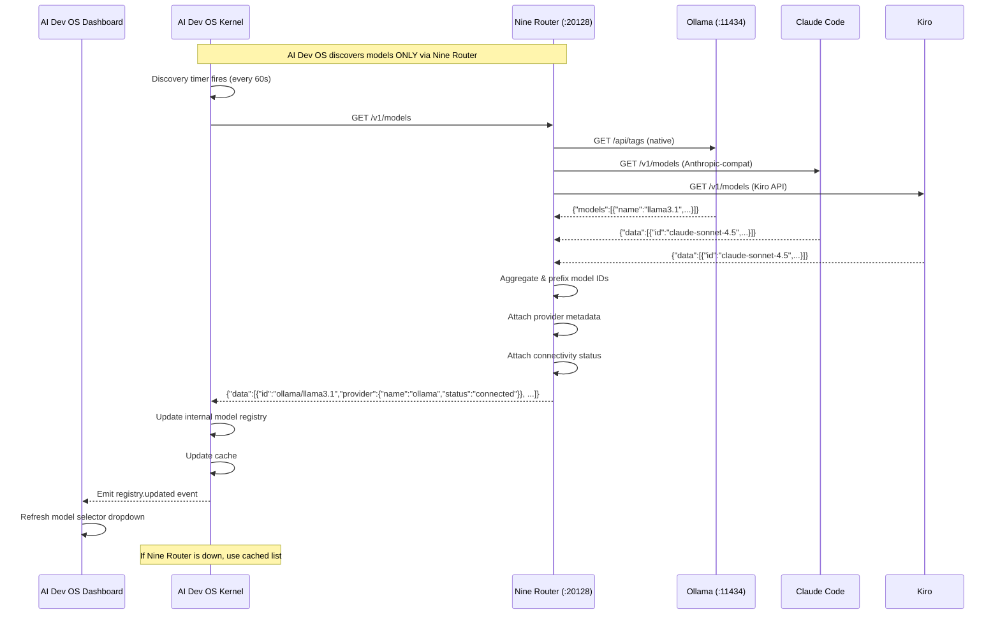

# Nine Router Model Discovery

> Integration point: model discovery in the AI Development Operating System is exclusively performed through Nine Router's `GET /v1/models` endpoint. Direct provider discovery is not used.

## Overview

The AI Development Operating System discovers available models exclusively through Nine Router's `GET /v1/models` endpoint at `http://localhost:20128/v1`. This replaces all direct provider API queries (Ollama `/api/tags`, OpenAI `/v1/models`, Anthropic `/v1/models`, etc.). The Kernel and all subsystems learn about available models by querying Nine Router, which aggregates models from all configured providers and returns them in a unified OpenAI-compatible format.

Model discovery is the primary mechanism by which AI Dev OS builds its internal model registry, populates the model selector in the dashboard, and validates model IDs before sending inference requests. This document defines the discovery protocol, response format, caching strategy, refresh intervals, and error handling.

## Goals

- All model discovery MUST go through Nine Router `GET /v1/models` — no direct provider queries
- Nine Router MUST return a unified model list with provider-prefixed IDs (e.g., `ollama/llama3.1`, `kr/claude-sonnet-4.5`)
- Each model entry MUST include provider metadata: name, connectivity status, type (local/cloud), and capabilities
- AI Dev OS MUST refresh the model list on a configurable interval (default 60 seconds)
- AI Dev OS MUST cache the model list to reduce latency and provide stale results when Nine Router is temporarily unavailable
- Provider connectivity status MUST be reflected per-model so AI Dev OS can make informed routing decisions
- Error handling MUST gracefully handle Nine Router unavailability, partial provider failures, and malformed responses
- Discovery MUST support both full list refresh and per-provider sync triggers

## Non-Goals

- Querying providers directly for model lists — Nine Router is the sole discovery point
- Model filtering or ranking — the full provider list is returned; filtering is done by the caller
- Writing to Nine Router's model registry — models are read-only from AI Dev OS perspective
- Provider-specific metadata beyond what Nine Router exposes — capabilities are limited to what Nine Router reports

## Architecture

### Discovery Flow



### Model ID Convention

Nine Router prefixes all model IDs with a provider code to ensure uniqueness and enable routing:

| Provider Code | Provider Name | Example Model ID |
|--------------|---------------|------------------|
| `ollama` | Ollama (local) | `ollama/llama3.1` |
| `lm-studio` | LM Studio (local) | `lm-studio/codestral-22b` |
| `llama-cpp` | llama.cpp (local) | `llama-cpp/phi-4` |
| `vllm` | vLLM (local) | `vllm/qwen2.5-32b` |
| `cc` | Claude Code (Anthropic proxy) | `cc/claude-sonnet-4.5` |
| `kr` | Kiro (Anthropic proxy) | `kr/claude-sonnet-4.5` |
| `openai` | OpenAI | `openai/gpt-4o` |
| `anthropic` | Anthropic | `anthropic/claude-sonnet-4.5` |
| `google` | Google | `google/gemini-2.0-pro` |
| `azure` | Azure OpenAI | `azure/gpt-4o` |
| `custom` | Custom OpenAI-compatible | `custom/my-model` |

The provider code is the first segment before the `/`. The second segment is the provider's native model name or alias. This convention ensures no collisions between providers offering the same underlying model.

### Response Format

```json
{
  "object": "list",
  "data": [
    {
      "id": "ollama/llama3.1",
      "object": "model",
      "created": 1700000000,
      "owned_by": "ollama",
      "permission": [],
      "root": "ollama/llama3.1",
      "provider": {
        "name": "ollama",
        "display_name": "Ollama (Local)",
        "code": "ollama",
        "status": "connected",
        "type": "local",
        "health": {
          "reachable": true,
          "latency_ms": 12,
          "last_checked": "2025-01-15T02:00:00Z",
          "error": null
        }
      },
      "capabilities": ["chat", "streaming", "tool_calls", "embeddings"],
      "context_length": 8192,
      "max_output_tokens": 4096,
      "pricing": {
        "input_per_1k": 0.0,
        "output_per_1k": 0.0,
        "currency": "USD"
      },
      "metadata": {
        "description": "Meta Llama 3.1 8B, local inference via Ollama",
        "tags": ["open-source", "instruct", "local"],
        "version": "3.1"
      }
    },
    {
      "id": "kr/claude-sonnet-4.5",
      "object": "model",
      "created": 1700000001,
      "owned_by": "kr",
      "permission": [],
      "root": "kr/claude-sonnet-4.5",
      "provider": {
        "name": "kr",
        "display_name": "Kiro",
        "code": "kr",
        "status": "disconnected",
        "type": "cloud",
        "health": {
          "reachable": false,
          "latency_ms": null,
          "last_checked": "2025-01-15T01:59:30Z",
          "error": "Connection refused: API key may be invalid"
        }
      },
      "capabilities": ["chat", "streaming", "tool_calls", "vision"],
      "context_length": 200000,
      "max_output_tokens": 8192,
      "pricing": {
        "input_per_1k": 0.003,
        "output_per_1k": 0.015,
        "currency": "USD"
      },
      "metadata": {
        "description": "Anthropic Claude Sonnet 4.5, routed via Kiro",
        "tags": ["frontier", "reasoning", "vision"],
        "version": "4.5"
      }
    }
  ]
}
```

## Configuration

### Discovery Settings in AI Dev OS

```toml
# ~/.config/aidevos/config.toml — discovery section

[model_discovery]
enabled = true
# Nine Router endpoint for discovery (same as nine_router.endpoint)
endpoint = "http://localhost:20128/v1"
# How often to refresh the model list (seconds)
refresh_interval_seconds = 60
# Maximum age of cached model list before considering it stale (seconds)
cache_max_age_seconds = 300
# Whether to report disconnected providers in the model list
include_disconnected = false
# Filter models by provider codes (empty = all)
allowed_providers = []
# Filter models by capability (empty = all)
required_capability = ""
# Timeout for the discovery request (milliseconds)
timeout_ms = 5000

[model_discovery.cache]
enabled = true
location = "~/.aidevos/cache/models.json"
stale_ok_on_error = true

[model_discovery.refresh_on]
startup = true
interval = true
user_request = true
provider_sync_event = true
```

### Discovery Settings in Nine Router

```toml
# ~/.config/nine-router/config.toml — Nine Router side

[nine_router.api]
models_endpoint_enabled = true
models_cache_ttl_seconds = 30
models_max_results = 500

[nine_router.discovery]
# How often Nine Router polls each provider for model list
provider_poll_interval_seconds = 60
# Timeout per provider health check
health_check_timeout_ms = 3000
# Number of consecutive failures before marking provider disconnected
failure_threshold = 3
# Whether to include disconnected providers in the response
include_disconnected = true
```

## Interfaces

### CLI Command: `aidevos models`

```
SYNOPSIS:
    aidevos models list [--provider <code>] [--capability <name>] [--include-disconnected]
    aidevos models refresh                      # Force immediate model list refresh
    aidevos models show <model-id>              # Show model details
    aidevos models cache [--clear]              # Show or clear local model cache
    aidevos models provider <code> [--sync]     # Show provider models or force sync

EXAMPLES:
    aidevos models list
    aidevos models list --capability vision
    aidevos models list --provider ollama
    aidevos models refresh
    aidevos models show ollama/llama3.1
    aidevos models cache --clear
    aidevos models provider kr --sync
```

### Programmatic Interface

```python
from aidevos.discovery import ModelDiscovery

discovery = ModelDiscovery(
    endpoint="http://localhost:20128/v1",
    refresh_interval=60,
)

# Get all models (uses cache if available)
all_models = discovery.get_models()

# Get models by provider
ollama_models = discovery.get_models(provider="ollama")

# Get models with specific capability
vision_models = discovery.get_models(capability="vision")

# Force refresh
fresh_models = discovery.refresh()

# Get model by ID
model = discovery.get_model("ollama/llama3.1")

# Check provider connectivity
status = discovery.get_provider_status("kr")
# → {"code": "kr", "connected": False, "error": "..."}

# Subscribe to discovery updates
discovery.on_update(lambda models: print(f"Discovered {len(models)} models"))

# Check if cache is stale
is_stale = discovery.is_cache_stale()
```

### Events

| Event | Payload | Description |
|-------|---------|-------------|
| `discovery.started` | `{}` | Discovery refresh began |
| `discovery.completed` | `{ model_count, provider_count, duration_ms }` | Discovery completed |
| `discovery.failed` | `{ error, cache_used }` | Discovery failed, possibly using cache |
| `registry.updated` | `{ added[], removed[], changed[] }` | Model registry diff |
| `provider.status_changed` | `{ provider, old_status, new_status }` | Provider connectivity changed |
| `cache.stale` | `{ age_seconds }` | Cache exceeded max age |

### Integration with AI Dev OS Kernel

The Kernel uses the discovery system to:

1. **Validate model IDs** before sending requests — if a model ID is not in the registry, the request is rejected early
2. **Populate the dashboard model selector** — the UI shows the model list grouped by provider
3. **Build routing tables** — the Kernel knows which models are available and their capabilities
4. **Detect provider failures** — if a provider's status changes to disconnected, the Kernel can adjust its routing strategy
5. **Measure model latency** — per-model latency data from Nine Router helps the Router agent choose the fastest model

## Caching

The discovery system maintains a two-tier cache:

```python
cache_strategy = {
    "tier_1": {
        "type": "in-memory",
        "ttl": 60,  # seconds — matches refresh_interval
        "purpose": "Fast access for the Kernel process",
    },
    "tier_2": {
        "type": "disk",
        "path": "~/.aidevos/cache/models.json",
        "ttl": 300,  # seconds — stale ok on error
        "purpose": "Survive process restarts and Nine Router downtime",
    },
}
```

**Cache behavior matrix:**

| Nine Router Status | Cache Valid | Behavior |
|-------------------|-------------|----------|
| Reachable | N/A | Return fresh data, update cache |
| Unreachable | Valid (age < 300s) | Return cached data, log warning |
| Unreachable | Stale (age > 300s) | Return cached data with stale warning, alert user |
| Unreachable | Empty (no cache) | Return empty model list, raise alert |
| Unreachable | Corrupted (invalid JSON) | Return empty model list, delete and recreate cache |

## Error Handling

| Error | Detection | Handling |
|-------|-----------|----------|
| Nine Router connection refused | `ECONNREFUSED` | Use cached list; emit `discovery.failed`; set all provider statuses to "unknown" |
| Nine Router returns 5xx | HTTP 500/502/503 | Use cached list; retry with backoff (1s, 5s, 15s) |
| Nine Router returns 4xx | HTTP 401/403/404 | Log error; do not cache; alert user about misconfiguration |
| Nine Router timeout | Request exceeds `timeout_ms` | Use cached list; emit `discovery.failed` |
| Partial provider failure | Some providers respond, some don't | Return models from responding providers; mark failed providers as "disconnected" with error details |
| Malformed response | Invalid JSON, missing required fields | Use cached list; log parse error; alert if persistent |
| Cache corruption | JSON parse error on disk cache | Delete cache file; recreate from fresh Nine Router response |
| Provider returns invalid model data | Empty model ID, missing provider field | Filter out malformed entries; log warning for each |

## Security

- Model discovery responses contain no credentials or API keys
- Provider connectivity status is read-only; discovery does not trigger authentication flows
- The discovery endpoint does not require authentication by default (local-only)
- Cached model lists are stored as JSON with OS file permissions (0600)
- Model IDs are validated against a strict pattern (`^[a-zA-Z0-9_-]+/[a-zA-Z0-9._-]+$`) to prevent injection
- Provider status checks are performed by Nine Router, not by AI Dev OS — no direct provider contact
- Discovery requests are HTTP (not HTTPS) on localhost; TLS can be enabled for remote Nine Router access

## Related Documents

- [Nine Router Integration](./NINE_ROUTER_INTEGRATION.md)
- [Nine Router Provider Registry](./NINE_ROUTER_PROVIDER_REGISTRY.md)
- [Local-First Architecture](./LOCAL_FIRST_ARCHITECTURE.md)
- [Model Discovery](./MODEL_DISCOVERY.md)
- [Model Routing Policy](./MODEL_ROUTING_POLICY.md)
- [Local Model Providers](./LOCAL_MODEL_PROVIDERS.md)
- [API Spec](./API_SPEC.md)
- [Cache Strategy](./CACHING_STRATEGY.md)
- [Error Handling](./ERROR_HANDLING.md)
- [Nine Router Reference](./NINE_ROUTER.md)
