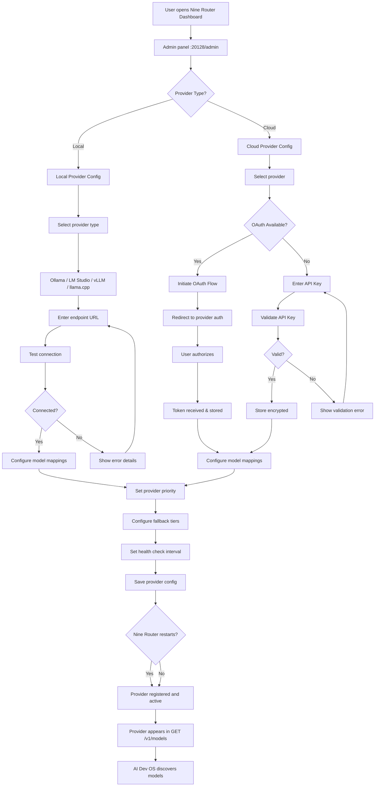
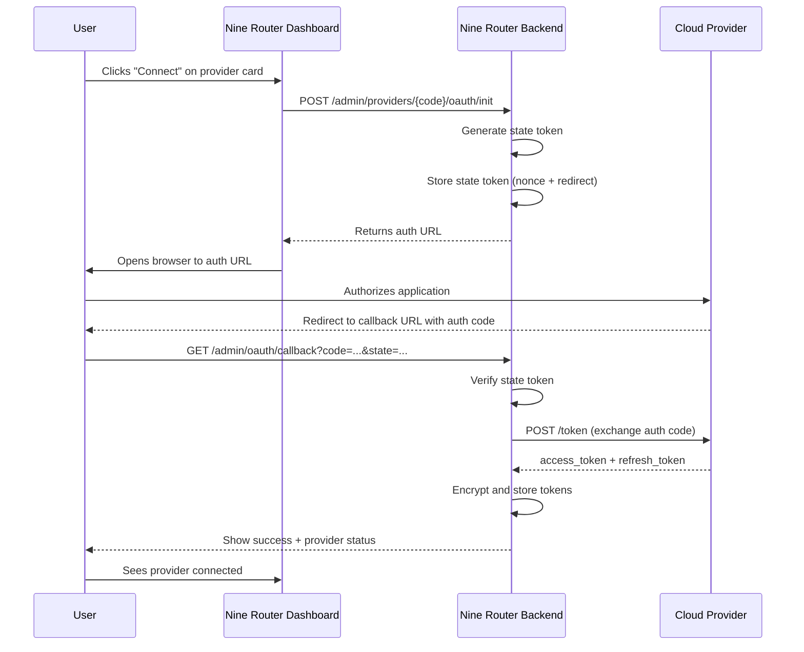

# Nine Router Provider Registry

> Integration point: all model providers are configured inside Nine Router's dashboard, not in AI Dev OS. Nine Router manages provider registration, credentials, health monitoring, and routing.

## Overview

The Nine Router provider registry is the central configuration store for all model providers accessible to the AI Development Operating System. Providers — whether local (Ollama, LM Studio, llama.cpp) or cloud (OpenAI, Anthropic, Kiro, Claude Code) — are registered, authenticated, and monitored exclusively within Nine Router. AI Dev OS does not store provider credentials, manage provider endpoints, or configure provider-specific settings.

The provider registry is managed through Nine Router's web dashboard (default: `http://localhost:20128/admin`) and persisted in Nine Router's configuration file at `~/.config/nine-router/config.toml`. Each provider entry includes endpoint URL, authentication credentials (where applicable), model mappings, health check configuration, priority, and fallback tier assignments.

This document defines the provider naming convention, registration flow, credential management, OAuth flow for cloud providers, health check system, and the process for adding custom OpenAI-compatible endpoints.

## Goals

- All provider configuration MUST happen in Nine Router, not in AI Dev OS
- Provider naming MUST follow a consistent two-letter or short code convention
- OAuth flow for cloud providers MUST be supported via Nine Router's dashboard
- API keys MUST be stored encrypted in Nine Router's configuration, never in plaintext
- Provider health checks MUST run automatically and surface status in the model registry
- Credential management MUST support rotation, validation, and secure storage
- Custom OpenAI-compatible endpoints MUST be addable without code changes to Nine Router
- Provider status monitoring MUST be reflected in real-time in the Nine Router dashboard
- Provider priority and fallback chains MUST be configurable per-provider

## Non-Goals

- Managing provider configuration in AI Dev OS — that would violate the architectural invariant
- Implementing provider-specific authentication logic in AI Dev OS — all auth is handled by Nine Router
- Storing credentials in AI Dev OS configuration files
- Replacing Nine Router's provider registry with any other system
- Auto-discovering providers without user configuration — providers must be explicitly registered

## Architecture

### Provider Registration Flow



### Provider Code Naming Convention

| Provider Code | Provider Name | Type | Default Endpoint | Auth Method |
|--------------|---------------|------|-----------------|-------------|
| `ollama` | Ollama | local | `http://localhost:11434` | None |
| `lm-studio` | LM Studio | local | `http://localhost:1234` | None |
| `llama-cpp` | llama.cpp | local | `http://localhost:8080` | None |
| `vllm` | vLLM | local | `http://localhost:8000` | None |
| `cc` | Claude Code | cloud | `http://localhost:8085` | OAuth / API Key |
| `kr` | Kiro | cloud | `https://api.kiro.dev/v1` | API Key |
| `openai` | OpenAI | cloud | `https://api.openai.com/v1` | API Key |
| `anthropic` | Anthropic | cloud | `https://api.anthropic.com/v1` | API Key |
| `google` | Google AI | cloud | `https://generativelanguage.googleapis.com/v1` | API Key |
| `deepseek` | DeepSeek | cloud | `https://api.deepseek.com/v1` | API Key |
| `mistral` | Mistral AI | cloud | `https://api.mistral.ai/v1` | API Key |
| `azure` | Azure OpenAI | cloud | `https://<resource>.openai.azure.com` | API Key |
| `aws` | AWS Bedrock | cloud | IAM-based | IAM Role / Keys |
| `custom` | Custom Endpoint | any | User-defined | User-defined |

Provider codes are:
- **Short**: 2–10 characters, lowercase, no spaces
- **Stable**: Codes do not change after initial registration
- **Unique**: No two providers can share the same code
- **Descriptive**: The code should indicate the provider identity (e.g., `kr` for Kiro, `cc` for Claude Code)

## Configuration

### Nine Router Provider Configuration Format

```toml
# ~/.config/nine-router/config.toml — Nine Router side

[nine_router]
listen = "0.0.0.0:20128"

[api]
openai_compat = true
require_api_key = false

# ─── Local Providers ───

[providers.ollama]
enabled = true
type = "ollama"
display_name = "Ollama (Local)"
endpoint = "http://localhost:11434"
priority = 1
health_check_interval_seconds = 30
timeout_ms = 60000
model_discovery.enabled = true
model_discovery.endpoint = "/api/tags"
model_mappings = []  # auto-discovered

[providers.lm-studio]
enabled = false
type = "openai_compat"
display_name = "LM Studio"
endpoint = "http://localhost:1234"
priority = 2
health_check_interval_seconds = 60
timeout_ms = 60000

# ─── Cloud Providers ───

[providers.kr]
enabled = true
type = "anthropic"
display_name = "Kiro"
endpoint = "https://api.kiro.dev/v1"
priority = 3
api_key = "encrypted:AQIC...=="  # stored encrypted
health_check_interval_seconds = 120
timeout_ms = 120000
model_discovery.enabled = true
oauth.enabled = false

[providers.cc]
enabled = true
type = "anthropic"
display_name = "Claude Code"
endpoint = "http://localhost:8085"
priority = 2
api_key = "encrypted:AQID...=="
health_check_interval_seconds = 60
timeout_ms = 120000
oauth.enabled = true
oauth.client_id = "aidevos-cc"
oauth.redirect_uri = "http://localhost:20128/admin/oauth/callback"

[providers.openai]
enabled = true
type = "openai_compat"
display_name = "OpenAI"
endpoint = "https://api.openai.com/v1"
priority = 4
api_key = "encrypted:AQIE...=="
health_check_interval_seconds = 120
timeout_ms = 120000
model_discovery.enabled = true

# ─── Custom Provider Example ───

[providers.ollama-alt]
enabled = true
type = "openai_compat"
display_name = "Ollama Alternative (via proxy)"
endpoint = "http://192.168.1.100:11434"
priority = 5
api_key = ""
health_check_interval_seconds = 60
timeout_ms = 30000

# ─── Fallback Configuration ───

[fallback]
enabled = true
default_strategy = "chain"

[fallback.chains]
default = ["ollama", "cc", "kr", "openai"]
coding = ["cc", "kr", "ollama"]
creative = ["kr", "cc", "ollama"]
fast = ["ollama"]
vision = ["kr", "cc"]
embedding = ["ollama"]
```

### Provider Status Fields

Each provider in the registry exposes a status object returned in model discovery:

```json
{
  "name": "kr",
  "display_name": "Kiro",
  "code": "kr",
  "status": "connected",
  "type": "cloud",
  "health": {
    "reachable": true,
    "latency_ms": 234,
    "last_checked": "2025-01-15T02:00:00Z",
    "error": null,
    "uptime_percentage": 99.7,
    "consecutive_failures": 0
  }
}
```

Status values: `connected`, `disconnected`, `degraded` (slow), `unknown`, `disabled`

## Interfaces

### Nine Router Dashboard (Admin Panel)

The provider registry is managed through the Nine Router admin dashboard:

```
Dashboard URL: http://localhost:20128/admin

Navigation: Settings → Providers
```

**Provider list view:**
- Table of registered providers with status indicators (green/red/yellow)
- Provider name, code, type, priority, last health check, uptime
- Action buttons: Edit, Disable, Test Connection, Delete

**Provider add/edit form:**
- Provider code (auto-generated from name, editable)
- Display name
- Provider type dropdown (ollama, openai_compat, anthropic, custom)
- Endpoint URL
- API key field (masked, with "Validate" button)
- OAuth flow trigger button (for supported providers)
- Priority slider (1 = highest)
- Health check interval (seconds)
- Timeout (milliseconds)
- Fallback chain assignment (multi-select of other providers)
- Model mappings (optional: specific model IDs to expose)
- Test Connection button

### REST API (Admin)

Nine Router exposes a REST API for programmatic provider management:

#### `GET /admin/providers`

Returns the list of all registered providers with full status.

```
GET http://localhost:20128/admin/providers
Authorization: Bearer <admin-token>
```

#### `POST /admin/providers`

Register a new provider.

```json
{
  "code": "custom-mistral",
  "display_name": "Custom Mistral Proxy",
  "type": "openai_compat",
  "endpoint": "https://mistral-custom.example.com/v1",
  "api_key": "sk-...",
  "priority": 5,
  "health_check_interval": 60,
  "timeout_ms": 30000
}
```

#### `PUT /admin/providers/{code}`

Update an existing provider's configuration. Fields are merged.

```json
{
  "priority": 3,
  "api_key": "sk-new-key..."
}
```

#### `DELETE /admin/providers/{code}`

Remove a provider. Models from this provider will disappear from `GET /v1/models`.

#### `POST /admin/providers/{code}/test`

Run a health check against the provider and return the result.

```
Response 200:
{
  "provider": "kr",
  "reachable": true,
  "latency_ms": 187,
  "models_available": 3,
  "error": null
}
```

### Programmatic Access (via API Key)

```python
import requests

NR_ADMIN = "http://localhost:20128/admin"
API_KEY = "admin-token-here"  # configured in Nine Router

headers = {"Authorization": f"Bearer {API_KEY}"}

# List all providers
resp = requests.get(f"{NR_ADMIN}/providers", headers=headers)
providers = resp.json()

# Add a custom provider
resp = requests.post(f"{NR_ADMIN}/providers", headers=headers, json={
    "code": "my-vllm",
    "display_name": "My vLLM Instance",
    "type": "openai_compat",
    "endpoint": "http://10.0.0.50:8000/v1",
    "api_key": "",
    "priority": 1,
    "health_check_interval": 30,
})
print(resp.json())

# Test connection
resp = requests.post(f"{NR_ADMIN}/providers/ollama/test", headers=headers)
print(resp.json())
# → {"reachable": true, "latency_ms": 12, ...}

# Get provider health dashboard
resp = requests.get(f"{NR_ADMIN}/providers/health", headers=headers)
for p in resp.json()["providers"]:
    print(f"{p['code']}: {p['status']} ({p['health']['latency_ms']}ms)")
```

## OAuth Flow

Cloud providers that support OAuth (e.g., Claude Code, Kiro, GitHub Models) go through an OAuth flow in the Nine Router dashboard:



OAuth flow requirements:
- Nine Router must be reachable from the browser for the callback
- For local-only setups, the redirect URI is `http://localhost:20128/admin/oauth/callback`
- Tokens are encrypted with the same AES-256-GCM mechanism as backup archives
- Refresh tokens are used to automatically re-authenticate when access tokens expire
- The user can revoke OAuth tokens from the Nine Router dashboard at any time

## Health Checks

Nine Router performs automatic health checks against every registered provider:

```python
health_check_procedure = {
    "interval": "configurable per provider (default: 60s for local, 120s for cloud)",
    "method": {
        "ollama": "GET /api/tags",
        "openai_compat": "GET /v1/models",
        "anthropic": "GET /v1/models",
        "custom": "User-configurable health check endpoint",
    },
    "criteria": {
        "reachable": "HTTP status 200-399 within timeout",
        "latency": "Response time measured in milliseconds",
        "models": "At least one model is returned",
    },
    "consecutive_failure_threshold": 3,
    "action_on_failure": {
        1: "Log warning, keep provider as connected",
        2: "Log warning, mark as degraded",
        3: "Mark as disconnected, exclude from routing",
    },
    "recovery": {
        "check_interval_after_failure": 15,  # seconds (more frequent)
        "consecutive_success_threshold": 2,
        "action_on_recovery": "Mark as connected, include in routing, log event",
    },
}
```

Health check results are visible in:
- Nine Router Dashboard: provider status indicators
- `GET /v1/models` response: per-model `provider.health` field
- Nine Router logs: `~/.config/nine-router/logs/health.log`

## Credential Management

| Aspect | Implementation |
|--------|---------------|
| Storage | Credentials are encrypted (AES-256-GCM) in the Nine Router config file |
| Key source | OS keyring (same as backup encryption) |
| Validation | API keys are validated on entry via a test request to the provider |
| Rotation | Credentials can be rotated from the dashboard; old credentials are removed after successful validation |
| Revocation | User can revoke OAuth tokens or remove API keys from the dashboard |
| Masking | API keys are masked in the dashboard UI (`sk-****...abcd`) |
| Environment | Credentials can be read from environment variables via `${VAR_NAME}` syntax |
| File injection | Credentials can be read from files via `file:///path/to/secret` syntax |

## Failure Modes

| Failure Mode | Detection | Recovery |
|-------------|-----------|----------|
| Provider unreachable | Health check fails | Mark as disconnected; exclude from routing; retry at recovery interval |
| Invalid API key | 401 response from provider | Mark as disconnected; show error in dashboard; prompt user to update key |
| OAuth token expired | 401 after successful auth | Attempt refresh token; if refresh fails, prompt re-authorization |
| Provider endpoint changed | Health check returns different format | Update endpoint in dashboard; test connection |
| Duplicate provider codes | Registration conflict | Reject with "provider code already exists" message |
| Custom endpoint misconfigured | Health check returns 404/not found | Show detailed error; suggest checking endpoint URL format |
| Certificate error (HTTPS) | TLS handshake failure | Log error; offer to disable TLS verification (not recommended) |
| Rate limit exceeded | 429 response | Reduce health check frequency; log warning; set status to degraded |
| Config file corrupt | Nine Router fails to parse | Fall back to last valid config; prompt user to fix or reset |
| Invalid provider type | Unknown type in registration | Reject with supported types list |

## Security

- Provider credentials are encrypted at rest in Nine Router's config file using AES-256-GCM
- API keys are never logged, even at debug verbosity
- The admin panel requires authentication (default: localhost-only, no auth for simplicity; can be password-protected)
- OAuth tokens are stored with the same encryption as API keys
- Health check requests do not include credentials in logs
- Custom endpoint URLs are validated against a blocklist of internal services (SSRF protection)
- Provider code is validated against a strict regex (`^[a-z0-9][a-z0-9-]{1,15}$`) to prevent injection
- The admin API can be disabled by setting `[api] admin_enabled = false` in the Nine Router config
- Credential validation uses a test request — credentials are immediately checked upon entry
- OAuth state tokens are single-use, time-limited (5 minutes), and cryptographically random
- All admin API calls over non-localhost connections require TLS and an API key

## Related Documents

- [Nine Router Integration](./NINE_ROUTER_INTEGRATION.md)
- [Nine Router Model Discovery](./NINE_ROUTER_MODEL_DISCOVERY.md)
- [Local-First Architecture](./LOCAL_FIRST_ARCHITECTURE.md)
- [Model Routing Policy](./MODEL_ROUTING_POLICY.md)
- [Local Model Providers](./LOCAL_MODEL_PROVIDERS.md)
- [Secrets Management](./SECRETS_MANAGEMENT.md)
- [Encryption](./ENCRYPTION.md)
- [Configuration](./CONFIGURATION.md)
- [Security Model](./SECURITY_MODEL.md)
- [API Spec](./API_SPEC.md)
- [Nine Router Reference](./NINE_ROUTER.md)
