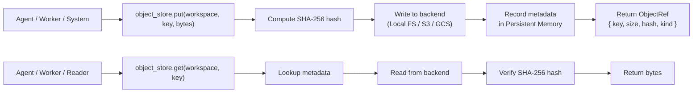

# Object Store

> Content-addressable blob storage for large artifacts, binary data, and file snapshots that do not fit inline in Knowledge System records. This document is normative — implementations MUST satisfy every MUST clause below.

## Overview

The Object Store provides a simple `(workspace, key) → bytes` abstraction for storing and retrieving large objects. It complements the [Knowledge System](./KNOWLEDGE_SYSTEM.md) and [Persistent Memory](./PERSISTENT_MEMORY.md) by offloading binary and large-text payloads that would make structured records unwieldy. Typical contents include file snapshots, diff patches, binary model outputs, image data, and large dependency trees.

Objects in the store are **immutable**: once written, an object is never modified. To "update" an object, a new object is written with a new key (or a versioned key), and the Knowledge System record points to the new key. This immutability enables caching, deduplication, and tamper-evident verification via content hashing.

## Goals

- Simple content-addressable API: `put(key, bytes)`, `get(key)`, `delete(key)`, `exists(key)`.
- Workspace-scoped: every object belongs to exactly one workspace.
- Immutable: objects are never modified after creation; writes are insert-only.
- Content-hash verification: every `put` returns the SHA-256 hash of the content.
- Streaming: large objects (up to 256 MB) are streamed without buffering entirely in memory.
- Pluggable backend: local filesystem for development; S3/GCS/R2 for production.

## Non-Goals

- Querying by metadata — the Object Store is key-value only; metadata lives in Knowledge System records.
- Object versioning beyond key convention — versioning is the caller's responsibility (e.g., `artifact-v2`).
- Access control beyond workspace scope — fine-grained access control is handled by [AuthZ/RBAC](./AUTHZ_RBAC.md).
- Implementation code — this repository is documentation-only (see [AI Coding Rules](./AI_CODING_RULES.md)).

## Architecture



## Object Ref Schema

```typescript
interface ObjectRef {
  key:        string;       // unique key within the workspace
  workspace:  string;       // workspace ID
  size:       number;       // size in bytes
  hash:       string;       // SHA-256 hex digest of content
  kind:       string;       // hint: "artifact" | "snapshot" | "patch" | "image" | "binary" | "other"
  content_type: string;     // MIME type hint (e.g., "application/octet-stream")
  created_at: rfc3339;
  expires_at: rfc3339 | null;
}
```

## Interfaces

```typescript
interface ObjectStore {
  // Store bytes. Returns an ObjectRef with the computed hash.
  put(workspace: string, key: string, bytes: ReadableStream | Buffer, opts?: PutOpts): Promise<ObjectRef>;

  // Retrieve bytes by workspace and key.
  get(workspace: string, key: string): Promise<ReadableStream | null>;

  // Check if an object exists.
  exists(workspace: string, key: string): Promise<boolean>;

  // Get object metadata without fetching content.
  stat(workspace: string, key: string): Promise<ObjectRef | null>;

  // Soft-delete an object (marks as deleted; physical cleanup on a schedule).
  delete(workspace: string, key: string): Promise<void>;

  // List objects in a workspace, with optional prefix filter.
  list(workspace: string, opts?: { prefix?: string; limit?: number }): Promise<ObjectRef[]>;
}

interface PutOpts {
  kind?: string;
  content_type?: string;
  ttl_seconds?: number;    // if set, object expires after this many seconds
}
```

## Storage Backends

| Backend | Use case | Config |
|---------|----------|--------|
| **Local filesystem** | Development, single-user | `base_path` in workspace config |
| **S3-compatible** | Production, multi-user | `bucket`, `region`, `endpoint`, credentials from Secrets Management |
| **GCS** | Production (GCP) | `bucket`, `project_id`, service account from Secrets Management |
| **R2** | Production (Cloudflare) | `bucket`, `account_id`, credentials from Secrets Management |

The default backend is the local filesystem under `<workspace_root>/.ai-dev-os/objects/`.

## Key Conventions

| Pattern | Example | Description |
|---------|---------|-------------|
| `{run_id}/{artifact_kind}` | `run-abc123/merged-output` | Kernel run artifacts |
| `snapshots/{timestamp}` | `snapshots/2026-07-22T120000Z` | Workspace snapshots |
| `patches/{change_id}` | `patches/chg-001` | Diff patches for merge |
| `research/{source_id}` | `research/cache-001` | Research cache blobs |
| `agent/{agent_id}/{kind}` | `agent/w-42/reasoning-trace` | Per-agent outputs |

## Requirements

- **MUST** support objects up to 256 MB in a single `put` call.
- **MUST** return the SHA-256 hash of the content from every `put` call.
- **MUST** verify the content hash on every `get` call and fail if hashes do not match.
- **MUST** support streaming reads and writes (do not require full in-memory buffering).
- **MUST** scope all operations by workspace: objects in workspace A are invisible to workspace B.
- **MUST** be immutable: `put` with an existing key overwrites the metadata but the old content remains accessible by its previous ObjectRef until garbage collection.
- **SHOULD** support server-side encryption for production backends (S3 SSE-S3, GCS server-side).
- **SHOULD** support a TTL mechanism (`ttl_seconds` / `expires_at`) for automatic cleanup of ephemeral objects.
- **MAY** implement garbage collection for orphaned objects (objects with no corresponding metadata in Persistent Memory).

## Failure Modes

| Mode | Detection | Response |
|------|-----------|----------|
| Backend unavailable | Connection error / timeout | Retry with exponential backoff (3 attempts); emit `object_store.unavailable` |
| Hash mismatch on read | Computed hash != stored hash | Return error; emit `object_store.corrupt_object` alert |
| Object not found | `get` returns null | Caller handles missing object (e.g., refetch from source) |
| Object exceeds size limit | `put` called with > 256 MB | Reject with `OBJECT_TOO_LARGE` error |
| Backend out of space | Write failure | Emit `object_store.capacity_exceeded`; fail the `put` |
| Garbage collection error | Scheduled job fails | Emit alert; orphaned objects remain but are inaccessible |

## Observability

| Metric | Labels | Description |
|--------|--------|-------------|
| `object_store_put_total` | `backend`, `status` | Put operations by backend and success/failure |
| `object_store_get_total` | `backend`, `status` | Get operations by backend and success/failure |
| `object_store_put_bytes` | `backend` | Bytes written by backend |
| `object_store_get_bytes` | `backend` | Bytes read by backend |
| `object_store_object_count` | `workspace` | Object count per workspace |
| `object_store_total_bytes` | `workspace` | Total storage per workspace |

## Acceptance Criteria

- Storing a 1 MB blob via `object_store.put("ws-1", "test-blob", buffer)` returns an `ObjectRef` with a non-empty SHA-256 hash.
- Retrieving the same blob via `object_store.get("ws-1", "test-blob")` returns bytes with a matching hash.
- `object_store.get("ws-1", "nonexistent-key")` returns null (not an error).
- `object_store.get("ws-2", "test-blob")` returns null — objects are workspace-scoped.
- Corrupting the stored blob on disk causes the next `get` call to fail with a hash mismatch error.
- Storing an object larger than 256 MB returns `OBJECT_TOO_LARGE`.

## Related Documents

- [Knowledge System](./KNOWLEDGE_SYSTEM.md) — primary consumer of Object Store references
- [Persistent Memory](./PERSISTENT_MEMORY.md) — metadata storage for ObjectStore records
- [Research Cache](./RESEARCH_CACHE.md) — uses Object Store for cache blob storage
- [Database](./DATABASE.md) — structured data (objects are unstructured)
- [Data Retention](./DATA_RETENTION.md) — object expiry and cleanup policy
- [Secrets Management](./SECRETS_MANAGEMENT.md) — storage backend credentials
- [System Overview](./SYSTEM_OVERVIEW.md)
