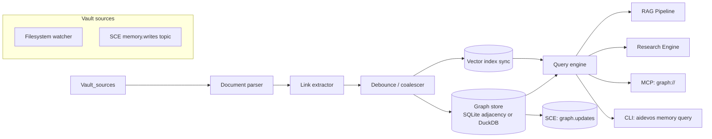

# Obsidian Graph Engine

> Real-time knowledge graph over the Markdown vault — nodes are documents, edges are links, backlinks, tags, and semantic similarity. This document is normative — implementations MUST satisfy every MUST clause below.

## Overview

The Obsidian Graph Engine (OGE) builds and maintains a live, queryable graph over every Markdown document in the workspace vault. It is inspired by Obsidian's local graph view but is designed for programmatic access by AI agents, not just human navigation.

The OGE watches the vault filesystem (or the [Shared Context Engine](./SHARED_CONTEXT_ENGINE.md) `memory.writes` topic for in-memory vaults), incrementally updates the graph on every file change, and exposes a Cypher-like query API that the [RAG Pipeline](./RAG_PIPELINE.md), [Research Engine](./RESEARCH_ENGINE.md), and [MCP server](./MCP.md) use for contextual retrieval.

The OGE is bidirectionally synchronised with the [Vector Store](./VECTOR_STORE.md): every node carries an embedding, and every graph traversal can be augmented with semantic similarity edges.

## Goals

- Real-time incremental graph updates on vault mutations (debounced, coalesced).
- Bidirectional link tracking: forward links and backlinks extracted from `[[wikilinks]]`, `[markdown](links)`, `#tags`, and `![[embeds]]`.
- Semantic edges: approximate-nearest-neighbour edges derived from embedding similarity above a configurable threshold.
- Cypher-like query API for path traversal, neighbour lookup, shortest-path, and subgraph extraction.
- Full sync with the [Vector Store](./VECTOR_STORE.md) so that graph traversal and semantic search compose naturally.

## Non-Goals

- File editing — the OGE is read-only with respect to the vault. Writes go through the [Merge Manager](./MERGE_MANAGER.md).
- Visual rendering — the UI layer renders the graph; the OGE only serves data.
- Implementation code — this repository is documentation-only (see [AI Coding Rules](./AI_CODING_RULES.md)).

## Architecture



## Node and Edge Schema

### Node

```
Node {
  id:          string          # canonical path relative to vault root, e.g. "docs/NINE_ROUTER.md"
  title:       string          # first H1 heading, or filename stem
  path:        string          # absolute filesystem path
  tags:        string[]        # #hashtags extracted from front matter and body
  aliases:     string[]        # YAML front matter aliases
  kind:        "doc"|"prompt"|"diagram"|"template"|"kb_entry"|"playbook"
  word_count:  number
  embedding:   float32[]?      # synced from Vector Store
  updated_at:  rfc3339
  created_at:  rfc3339
  front_matter: object         # parsed YAML front matter
}
```

### Edge

```
Edge {
  src:     string    # source node id
  dst:     string    # destination node id
  kind:    "wikilink"        # [[target]]
         | "md_link"         # [text](path)
         | "embed"           # ![[target]]
         | "tag"             # shared #tag
         | "backlink"        # computed reverse of wikilink/md_link
         | "semantic"        # cosine similarity > semantic_edge_threshold
         | "parent_dir"      # file is in subdirectory of another doc's directory
  weight:  number?           # for semantic edges: similarity score [0,1]
  label:   string?           # anchor text for wikilink/md_link edges
}
```

## Interfaces

```
# Node queries
graph.node(id) → Node
graph.nodes(filter?: NodeFilter) → Node[]
graph.search(q: string, opts?) → Node[]              # FTS + semantic hybrid

# Neighbourhood
graph.neighbors(id, depth?: number, edge_kinds?: EdgeKind[]) → { nodes: Node[], edges: Edge[] }
graph.backlinks(id) → Node[]
graph.forward_links(id) → Node[]
graph.tags(id) → string[]
graph.nodes_with_tag(tag) → Node[]

# Path queries
graph.path(src, dst, max_hops?: number) → Node[]     # shortest path
graph.paths(src, dst, max_hops?) → Node[][]           # all paths up to max_hops

# Subgraph queries (Cypher-like DSL)
graph.query(cypher: string) → QueryResult

# Similarity
graph.similar(id, k?: number, min_score?: number) → { node: Node, score: number }[]

# Admin
graph.rebuild() → RebuildStats
graph.stats() → GraphStats
graph.subscribe() → AsyncIterator<GraphUpdateEvent>
```

### NodeFilter

```
NodeFilter {
  kinds?:       NodeKind[]
  tags?:        string[]        # nodes that have ALL listed tags
  path_prefix?: string
  updated_after?:  rfc3339
  has_embedding?:  boolean
  min_backlinks?:  number
}
```

## Query DSL (Cypher-like)

The OGE supports a subset of Cypher-inspired syntax for graph traversal. Full specification will be formalised in a separate ADR; the initial supported patterns are:

```
# Find all nodes reachable from a source within 2 hops via wikilinks
MATCH (n:doc)-[:wikilink*1..2]->(m) WHERE n.id = "docs/MAIN_AI_KERNEL.md" RETURN m

# Find nodes sharing a tag with a given node
MATCH (n)-[:tag]->(t)<-[:tag]-(m) WHERE n.id = $id AND n <> m RETURN m

# Semantic neighbours above threshold
MATCH (n)-[e:semantic]->(m) WHERE n.id = $id AND e.weight > 0.8 RETURN m, e.weight

# Shortest path between two documents
MATCH p = shortestPath((a)-[*]-(b)) WHERE a.id = $src AND b.id = $dst RETURN p
```

## Incremental Update Protocol

The OGE processes vault mutations through a debounced pipeline to avoid thrashing during bulk writes:

```
1. Filesystem event arrives (create/modify/delete)
2. Add to coalesce buffer (dedupe by path)
3. After debounce_ms (default 200 ms) with no new events for same path:
   a. Parse changed document
   b. Extract links, tags, aliases
   c. Diff against existing graph: compute added/removed edges
   d. Write delta to graph store
   e. Queue node for embedding update in Vector Store
   f. Emit graph.update event on SCE
4. On bulk mutations (> bulk_threshold paths, default 50):
   a. Skip per-file debounce
   b. Batch all changes
   c. Emit graph.bulk_update event
   d. Rebuild full index for affected subgraph
```

## Semantic Edge Generation

Semantic edges are generated by the Vector Store sync job:

```
for each pair (A, B) where cosine_sim(A.embedding, B.embedding) > semantic_edge_threshold (default 0.75):
  if edge(A→B, kind=semantic) does not exist:
    create edge with weight = similarity_score
  elif edge exists but weight changed by > 0.05:
    update edge weight

semantic_max_edges_per_node (default 20) caps the number of semantic neighbours per node.
```

Semantic edges are recalculated when a node's embedding changes. They are stored separately from structural edges and can be disabled via `config.semantic_edges: false`.

## RAG Pipeline Integration

The OGE is a primary retrieval source for the [RAG Pipeline](./RAG_PIPELINE.md). A typical retrieval flow:

```
query: "how does the Kernel handle Guardian vetoes?"

1. Embed query → vector q
2. graph.similar(q, k=5) → top semantic neighbours
3. graph.neighbors(each result, depth=1, edge_kinds=[wikilink, backlink]) → expand context
4. Rank by: semantic_score * 0.6 + backlink_count * 0.2 + recency * 0.2
5. Return ranked Node[] with excerpt windows for context assembly
```

## Requirements

- **MUST** update the graph within `debounce_ms` + `max_parse_ms` (default 200 + 500 ms) after a vault mutation.
- **MUST** track forward links, backlinks, tag edges, and embed edges for every document.
- **MUST** support `graph.neighbors(id, depth)` up to depth 5 in ≤ 100 ms on a 10k-node graph.
- **MUST** support `graph.path(src, dst)` (shortest path) in ≤ 200 ms on a 10k-node graph.
- **MUST** sync node embeddings with the [Vector Store](./VECTOR_STORE.md) asynchronously without blocking the parse pipeline.
- **MUST** emit `graph.update` events on the SCE after every delta commit.
- **MUST** survive vault mutation storms (rapid bulk writes) by coalescing events and triggering a rebuild if the coalesce buffer exceeds `bulk_threshold`.
- **SHOULD** generate semantic edges for all node pairs above `semantic_edge_threshold` nightly or on explicit `graph.rebuild()`.
- **MAY** expose a `graph.query(cypher)` endpoint with the DSL described above.
- **MAY** cache traversal results with a short TTL (default 5 s) for high-frequency `neighbors()` calls.

## Failure Modes

| Mode | Detection | Response |
|------|-----------|----------|
| Vault mutation storm | Coalesce buffer > `bulk_threshold` | Flush, snapshot current graph, trigger full rebuild; emit `graph.rebuilding` |
| Parse failure | Malformed front matter or encoding error | Skip file for this cycle; emit `graph.parse_error`; continue with rest |
| Graph store corruption | Query returns inconsistent results | Rebuild from vault source; serve stale graph during rebuild with `provisional` flag |
| Vector Store unavailable | Embedding write fails | Queue embedding updates; serve graph without semantic edges; emit `graph.semantic_degraded` |
| Filesystem watcher missed events | Periodic consistency check diverges | Trigger incremental diff scan; emit `graph.consistency_restored` |

Every failure emits a structured event on the SCE and is recorded in the [Audit Log](./AUDIT_LOG.md).

## Security Considerations

- The OGE is read-only: it MUST NOT write to the vault filesystem; writes go through the [Merge Manager](./MERGE_MANAGER.md).
- Tenant isolation: graph queries are always scoped to a workspace; cross-workspace graph access is denied.
- Node content (text excerpts) carries the same confidentiality as the underlying documents; access is governed by [AuthZ/RBAC](./AUTHZ_RBAC.md).
- Semantic edges are derived from embeddings; the same data-classification rules as [Embeddings](./EMBEDDINGS.md) apply.

## Observability

| Metric | Labels | Description |
|--------|--------|-------------|
| `graph_node_count` | `kind` | Total nodes by kind |
| `graph_edge_count` | `edge_kind` | Total edges by kind |
| `graph_update_total` | `trigger=fs\|sce\|manual` | Graph update events |
| `graph_parse_seconds` | — | Parse duration histogram |
| `graph_query_seconds` | `op=neighbors\|path\|search\|cypher` | Query latency histogram |
| `graph_rebuild_seconds` | — | Full rebuild duration |
| `graph_semantic_edges_total` | — | Current semantic edge count |
| `graph_parse_error_total` | — | Parse failures |

Traces: one span per `graph.query` call; rebuild is a top-level trace. See [Tracing](./TRACING.md).

## Acceptance Criteria

- Adding a `[[wikilink]]` to a document causes the corresponding edge to appear in `graph.forward_links(id)` within `debounce_ms` + `max_parse_ms`.
- `graph.neighbors("docs/MAIN_AI_KERNEL.md", depth=2)` returns all documents reachable within 2 wikilink hops in ≤ 100 ms on a 10k-node vault.
- `graph.path("docs/CLI.md", "docs/NINE_ROUTER.md")` returns the shortest link path between the two documents.
- Deleting a document removes all its edges from the graph within one debounce cycle.
- A vault mutation storm of 200 files triggers a bulk rebuild rather than 200 individual updates, completing in ≤ 30 s.

## Open Questions

- Whether semantic edge thresholds should be per-kind (e.g., lower for `prompt` documents than for `doc` documents) — tracked in [templates/ADR](../templates/ADR.md).
- Storage backend: SQLite adjacency tables vs. embedded graph DB (e.g., DuckDB with recursive CTEs) for large vaults (> 100k nodes).

## Related Documents

- [Knowledge System](./KNOWLEDGE_SYSTEM.md)
- [RAG Pipeline](./RAG_PIPELINE.md)
- [Vector Store](./VECTOR_STORE.md)
- [Embeddings](./EMBEDDINGS.md)
- [Persistent Memory](./PERSISTENT_MEMORY.md)
- [Research Engine](./RESEARCH_ENGINE.md)
- [MCP](./MCP.md) — `graph://` resource
- [Merge Manager](./MERGE_MANAGER.md) — vault write authority
- [System Overview](./SYSTEM_OVERVIEW.md)
- [Main AI Kernel](./MAIN_AI_KERNEL.md)
- [Architecture Guardian](./ARCHITECTURE_GUARDIAN.md)
- [diagrams/KNOWLEDGE_GRAPH](../diagrams/KNOWLEDGE_GRAPH.md)
