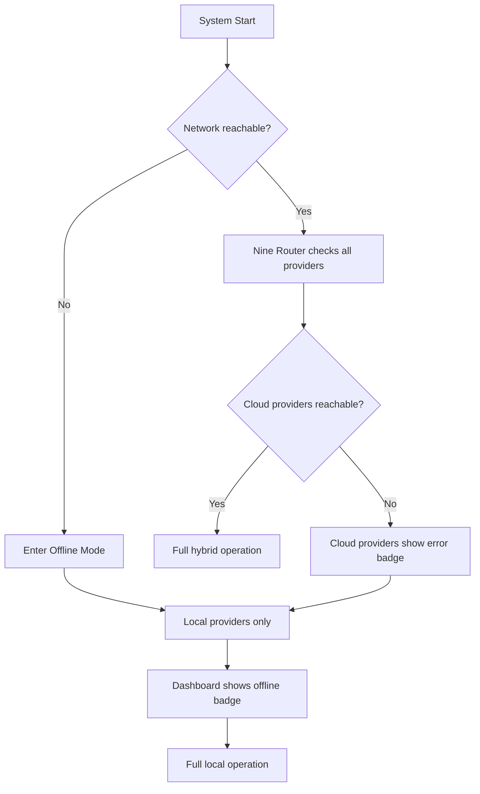

# Offline Mode

> Complete operational specification for running the AI Development Operating System without any network connectivity.

## Overview

Offline Mode is not a special configuration — it is the default runtime mode of the AI Development Operating System. The system MUST function identically whether or not network interfaces are available. Offline Mode is the baseline; network connectivity unlocks cloud provider fallbacks, but the core user experience never depends on it.

## Operational Principles

1. **Offline is not a degrade** — All core features work at full capability offline
2. **Network is a performance optimization** — Cloud providers add capacity, not capability
3. **Graceful degradation** — If a cloud provider is configured but unreachable, the system silently falls back
4. **No blocking calls** — No operation blocks on network I/O; timeouts are bounded and handled
5. **Transparency** — The dashboard indicates which providers are available/reachable

## Capability Matrix

| Feature | Offline | Online (cloud fallback available) |
|---------|---------|-----------------------------------|
| Model inference (local) | ✅ Full | ✅ Full |
| Model inference (cloud) | ❌ N/A | ✅ Optional per-model |
| Model discovery | ✅ Local providers only | ✅ All configured providers |
| Code generation | ✅ Full | ✅ Full |
| Knowledge base search | ✅ Full | ✅ Full |
| Web search | ❌ (cached only) | ✅ Full |
| Citation lookup | ✅ Cached | ✅ Full |
| Voice STT (local) | ✅ Full | ✅ Full |
| Voice TTS (local) | ✅ Full | ✅ Full |
| Dashboard UI | ✅ Full | ✅ Full |
| MCP server connections | ✅ Local MCP only | ✅ Remote MCP available |
| Plugin downloads | ❌ | ✅ |
| Model downloads | ❌ (pre-downloaded) | ✅ |
| Telemetry export | ❌ | ✅ |

## Detection

The system detects offline status via:
1. Nine Router health check on each configured provider
2. Kernel connectivity probe to Nine Router on startup
3. Periodic network reachability checks (configurable interval, default 60s)

## Behavior



### Nine Router Behavior in Offline Mode

```
GET  /v1/models              → Returns only local provider models
POST /v1/chat/completions    → Routes to local providers only
POST /v1/embeddings          → Routes to local embedding model
POST /v1/audio/speech        → Routes to local TTS
POST /v1/audio/transcriptions → Routes to local STT
GET  /v1/search              → Returns error (web search unavailable)
```

### Kernel Behavior in Offline Mode

- The Kernel polls Nine Router once at startup to verify model access
- If Nine Router is unreachable, the Kernel refuses to start and prints a diagnostic
- Role assignment with fallback chains that include cloud models still work — the cloud models simply fail fast and the chain advances
- The Kernel emits `run.offline` events on the Shared Context Engine when entering/exiting offline mode

## Configuration

```toml
[offline]
# No configuration needed — offline is the default.
# These settings tune behavior only.

mode = "auto"           # auto | force_offline | force_online
timeout_ms = 10000      # Provider timeout before marking unavailable
health_check_interval = 60  # Seconds between connectivity probes
```

- `mode = "force_offline"` intentionally disables all network access for security-sensitive environments
- `mode = "force_online"` fails startup if no network is available

## Storage During Offline Periods

Offline operation never requires special storage handling — all stores are local by default:

- Writes to SQLite, Chroma, and the filesystem succeed normally
- Reads from caches succeed even for cloud-sourced data that was cached while online
- No operation blocks on a network flush

## Cache Behavior

| Data | Online | Offline |
|------|--------|---------|
| Model catalog | Fresh from Nine Router | Last cached catalog |
| Web search results | Fresh from network | Cached results with freshness warning |
| Citation documents | Fresh fetch + cache | Cached versions |
| Provider status | Live | Stale status with warning |

## Failure Modes

| Mode | Detection | Response |
|------|-----------|----------|
| Network lost mid-session | Connectivity probe failure | Dashboard shows offline badge; in-flight inference completes on local fallback |
| Network restored mid-session | Connectivity probe success | Dashboard clears badge; next model discovery includes cloud providers |
| Nine Router unreachable | Kernel startup probe | Kernel exits with diagnostic; user fixes Nine Router |
| Partial network (DNS fails, HTTPS works) | Provider-specific failures | Individual provider badges |

## Security Considerations

- Offline Mode is the most secure operating mode — no data leaves the machine
- Cloud provider credentials remain in the local keyring; they are not probed or leaked during offline checks
- Offline Mode prevents exfiltration of sensitive data via inference APIs

## Acceptance Criteria

1. `aidevos start` on an air-gapped machine shows a fully functional dashboard
2. A task with fallback chain `local_model → cloud_model` completes using `local_model` when offline
3. The dashboard shows "Offline" indicator when network is disconnected
4. Switching from offline to online, Nine Router discovers cloud models within one refresh interval
5. `aidevos doctor` reports all subsystems healthy in offline mode

## Related Documents

- [Local-First Architecture](./LOCAL_FIRST_ARCHITECTURE.md)
- [Nine Router Integration](./NINE_ROUTER_INTEGRATION.md)
- [Installation](./INSTALLATION.md)
- [Disaster Recovery](./DISASTER_RECOVERY.md)
