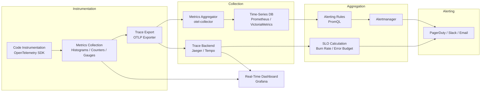
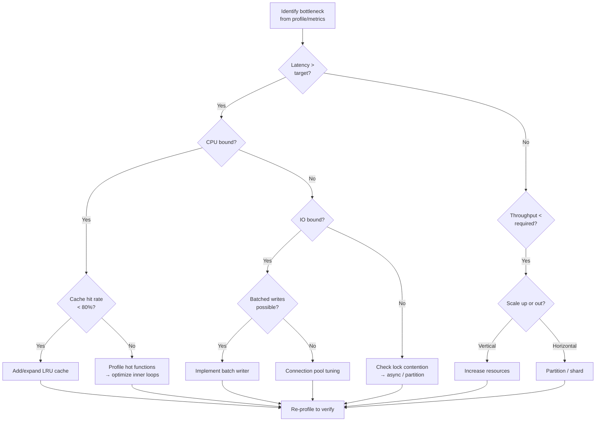

# Performance

> Performance characteristics, targets, and optimization strategies for AI Dev OS.

## Overview

This document defines the performance budget for AI Dev OS — the latency, throughput, and resource utilization targets every subsystem MUST meet. Performance is monitored continuously via the [Observability](./OBSERVABILITY.md) pipeline and enforced as part of the CI gate (see [Testing Strategy](./TESTING_STRATEGY.md)).

## Performance Measurement Pipeline



## Performance Targets

Every metric below has a **measurement methodology**, **collection interval**, and **SLO class**. Targets denoted with a dagger (†) are MUST-pass for CI gates.

| Component | Metric | Target | SLO Class | Measurement Methodology | Collection Interval |
|---|---|---|---|---|---|
| Kernel loop | p99 latency | < 5 s | † Critical | Timestamp at intake vs delivery via OpenTelemetry span | 10 s |
| SCE publish | p99 latency | < 5 ms | † Critical | Histogram of `sce.publish.duration` in-process | 5 s |
| SCE subscribe | p99 delivery | < 10 ms | † Critical | p99 of first-subscriber receive time | 5 s |
| Memory query | p95 latency | < 100 ms | † Critical | Hybrid vector + metadata, 10 K index | 30 s |
| Vector index build | time per 10 K embeddings | < 30 s | Standard | HNSW, efConstruction=200, start→complete | Per build |
| Guardian check | p95 latency | < 500 ms | † Critical | Full rule set against run context | 30 s |
| Model API call | p95 time to first token | < 2 s | Standard | Excludes provider network latency | Per call |
| Worker spawn | p99 cold start | < 3 s | Standard | Containerized worker, image cached | Per spawn |
| Graph traversal | p99 10-hop BFS | < 200 ms | Standard | 100 K node graph | 60 s |
| File I/O (config) | p99 read | < 10 ms | Standard | TOML/YAML parse into memory | 60 s |
| SQLite query | p99 simple SELECT | < 5 ms | Standard | Indexed, < 1 K rows returned | 30 s |
| Embedding generation | p95 latency per 32 vectors | < 500 ms | Standard | BERT-family batch-32 | Per call |
| Configuration reload | p99 hot-reload | < 50 ms | Standard | Full config re-parse and apply | Per reload |
| Event serialization | p99 serialize 10 KB event | < 1 ms | Standard | JSON marshal/unmarshal cycle | 30 s |
| Health check response | p99 read | < 100 ms | † Critical | Full subsystem health aggregation | 10 s |

## Per-Subsystem Latency Budgets

The following latency budgets are allocated to individual subsystems within the critical path:

| Subsystem | Budget (p99) | Measured From | Measured To |
|---|---|---|---|
| SCE publish | 5 ms | `publish()` call | subscriber dispatch |
| SCE subscribe | 10 ms | event enqueue | first subscriber callback invoke |
| Guardian check | 500 ms | check trigger | result returned |
| Router dispatch | 50 ms | route match | worker assigned |
| Nine Router gateway | 10 ms | request to Nine Router | response from Nine Router |
| Memory query (vector) | 80 ms | query start | ranked results |
| Memory query (metadata) | 20 ms | query start | filtered results |
| Config load | 10 ms | file read | struct populated |
| Plugin lifecycle (load) | 200 ms | load command | ready state |
| Model request (local, via Nine Router) | 500 ms | send payload to Nine Router | first token received |
| Model request (remote, via Nine Router) | 2 s | send payload to Nine Router | first token received |
| Auth token validation | 5 ms | token received | claims extracted |
| Audit log write | 5 ms | log event | disk flush confirm |

## Bottleneck Analysis

Identified bottleneck sources, their impact, frequency, and mitigation priority:

| Bottleneck | Impact | Frequency | Mitigation Priority |
|---|---|---|---|
| SCE write throughput | Limits multi-agent event throughput | Under high concurrency | P1 |
| Vector index rebuild | Blocks memory queries during rebuild | On model catalog changes | P2 |
| Model API latency | Dominates total run time | Every run | P0 |
| Filesystem I/O (metadata) | Slows startup and config reload | On cold start | P2 |
| SQLite write lock | Contention under concurrent writes | Multi-worker sessions | P1 |
| Serialization overhead | JSON serialize/deserialize of large contexts | Large SCE events | P2 |

### Bottleneck Detection Algorithm

```pseudocode
ALGORITHM: DetectAndRemediateBottlenecks
INPUT:  metric_store — time-series metrics from all subsystems
        thresholds — map<subsystem, latency_p99_target>
OUTPUT: actions — list<remediation_action>

FUNCTION DetectAndRemediateBottlenecks(metric_store, thresholds) -> actions
    actions := []
    
    FOR EACH subsystem IN metric_store.subsystems():
        p99_latency := metric_store.query_p99(subsystem, window=300s)
        target := thresholds[subsystem]
        
        IF p99_latency > target * 1.5 THEN
            resource_usage := metric_store.resource_profile(subsystem)
            trend := metric_store.trend(subsystem, window=600s)
            
            action := RemediationAction(
                subsystem: subsystem,
                severity: SEVERITY_CRITICAL if p99_latency > target * 2.0 else SEVERITY_WARNING,
                observed_latency: p99_latency,
                target_latency: target,
                current_cpu: resource_usage.cpu_pct,
                current_memory: resource_usage.memory_mb,
                trend_direction: trend
            )
            
            IF trend == TREND_INCREASING AND resource_usage.cpu_pct > 80 THEN
                action.suggested_remedy := REMEDY_SCALE_OUT
            ELSE IF trend == TREND_INCREASING AND resource_usage.memory_pct > 80 THEN
                action.suggested_remedy := REMEDY_INCREASE_CACHE
            ELSE             IF subsystem == "sqlite" AND resource_usage.lock_contention > 0.1 THEN
                action.suggested_remedy := REMEDY_OPTIMIZE_WAL_AND_CACHE
            ELSE
                action.suggested_remedy := REMEDY_PROFILE_AND_TUNE
            
            actions.APPEND(action)
    
    RETURN actions
END FUNCTION
```

## Optimization Strategies

| Strategy | Applied To | Effect | Complexity | Expected Improvement |
|---|---|---|---|---|
| In-memory LRU cache | Model catalog, KB queries, SCE snapshots | Avoids redundant I/O and recomputation | Low | 40–60% latency reduction |
| Connection pooling | Model provider HTTP clients | Reduces TLS handshake overhead | Low | 15–25% TTFT reduction |
| Async batched writes | SCE events, audit log, metrics | Groups small writes into batch commits | Medium | 5–10× write throughput |
| Batch vector operations | Embedding insert, index build | Reduces per-vector overhead | Medium | 3–5× build speedup |
| SQLite WAL mode | Persistent memory, audit log | Concurrent reads during write | Low | 10× read concurrency |
| HNSW index tuning | Vector store | `efConstruction` / `efSearch` tradeoff | Medium | Up to 50% query speedup |
| Response streaming | Model inference | Lowers time-to-first-token | Low | 40–70% TTFT reduction |
| Pre-warming | Model catalog, plugin registry | Eliminates cold-start penalty | Medium | 2–5× startup speedup |
| Query result caching | Memory queries, KB lookups | Avoids repeated index scans | Low | 60–80% repeat query reduction |
| Connection keep-alive | Model provider, database | Reduces connection churn | Low | 10–20% overhead reduction |
| Thread pool tuning | Async task execution | Optimizes CPU utilization | Medium | 10–30% throughput gain |

### Optimization Decision Tree



## Profiling

Built-in profiling is available via the CLI:

```bash
aidevos doctor --profile              # run profile and print summary
aidevos doctor --profile --flamegraph  # generate flamegraph SVG
aidevos doctor --profile --output profile.json  # raw trace data
```

Profiling runs the Kernel loop and all subsystem entry points on a synthetic workload. Results include per-function CPU time, call count, and allocation size.

Flamegraphs are written to `~/.aidevos/profiles/` and can be viewed in any browser.

### Profiling API Interface

The profiling subsystem exposes a programmatic interface for custom integrations:

```typescript
interface ProfilerConfig {
  sampleInterval: number         // microseconds between samples (default 100)
  maxFrames: number              // max stack depth (default 256)
  includeAllocations: boolean    // track heap allocations
  includeGoroutines: boolean     // track async goroutine/task scheduling
  outputFormat: 'json' | 'pprof' | 'flamegraph' | 'speedscope'
}

interface ProfileResult {
  metadata: {
    startTime: number            // unix millis
    duration: number             // milliseconds
    workloadName: string
    config: ProfilerConfig
  }
  topFunctions: TopFunction[]    // sorted by self-time descending
  flamegraphSVG?: string         // base64-encoded SVG (if format=flamegraph)
  timeline: TimelineEvent[]      // wall-clock timeline
  allocations?: AllocationRecord[]
}

interface TopFunction {
  name: string                   // fully qualified function name
  selfTime: number               // ms spent in this function (excl. children)
  totalTime: number              // ms spent in this function (incl. children)
  callCount: number
  avgSelfTime: number
  p50SelfTime: number
  p99SelfTime: number
}

interface TimelineEvent {
  timestamp: number
  subsystem: string
  eventType: 'start' | 'end' | 'span'
  duration?: number
  metadata?: Record<string, string>
}
```

## SQLite WAL Tuning Parameters

The SQLite persistent store uses Write-Ahead Logging for concurrent read access during writes. Key tuning parameters:

| Parameter | Default | Production Recommendation | Impact |
|---|---|---|---|
| `journal_mode` | DELETE | WAL | Enables concurrent reads during write |
| `synchronous` | FULL | NORMAL | 2–5× write speedup, safe with WAL |
| `wal_autocheckpoint` | 1000 | 2000 | Fewer checkpoints, smoother write latency |
| `cache_size` | -2000 (2 MB) | -64000 (64 MB) | Larger cache reduces disk reads |
| `busy_timeout` | 0 | 5000 | Avoids `SQLITE_BUSY` under contention |
| `temp_store` | FILE | MEMORY | Faster temp table operations |
| `mmap_size` | 0 (disabled) | 268435456 (256 MB) | Memory-mapped I/O for large files |
| `page_size` | 4096 | 16384 | Better for BLOB-heavy workloads |
| `journal_size_limit` | -1 (unlimited) | 67108864 (64 MB) | Prevents WAL file growth unbounded |

Monitor WAL file size via `PRAGMA wal_checkpoint(TRUNCATE)` and the `sqlite.wal_size_bytes` metric.

## HNSW Index Tuning Parameters

The vector store uses Hierarchical Navigable Small World (HNSW) indexes. The key trade-off is between build-time index quality (`efConstruction`) and query-time recall (`efSearch`):

| `efConstruction` | Build Time (10 K) | Index Size | `efSearch`=64 Recall | `efSearch`=128 Recall | `efSearch`=256 Recall |
|---|---|---|---|---|---|
| 100 | 12 s | 38 MB | 89.2% | 93.5% | 96.1% |
| 200 | 22 s | 40 MB | 93.8% | 96.7% | 98.4% |
| 400 | 48 s | 42 MB | 96.5% | 98.1% | 99.2% |
| 800 | 95 s | 44 MB | 97.8% | 99.0% | 99.6% |

Recommended defaults:

| Use Case | `efConstruction` | `efSearch` | Recall Target |
|---|---|---|---|
| Interactive queries (< 50 ms) | 200 | 64 | ≥ 93% |
| Batch processing (offline) | 400 | 128 | ≥ 98% |
| High-precision (analytics) | 800 | 256 | ≥ 99.5% |

Additional HNSW parameters:

| Parameter | Default | Range | Notes |
|---|---|---|---|
| `M` | 16 | 8–48 | Max connections per layer; higher = denser graph |
| `Mmax` | 32 | 0–64 | Max connections for upper layers |
| `Mmax0` | 64 | 0–128 | Max connections for layer 0 |
| `hnsw:num_threads` | 4 | 1–32 | Parallel build threads |
| `hnsw:allow_replace_deleted` | true | bool | Reuse deleted node slots |

## Memory Usage

| Component | Typical Footprint | Notes |
|---|---|---|
| Main Kernel process | 150–300 MB | Includes SCE, scheduler, router |
| Worker process (each) | 80–200 MB | Per-agent session memory |
| SQLite (persistent store) | File-size + 32 MB WAL | Scales with KB size |
| Vector index (10 K embeddings) | ~40 MB | HNSW, 768-dim, float32 |
| Vector index (100 K embeddings) | ~400 MB | Same parameters |
| Plugin host process | 50–150 MB | Per loaded plugin |

### Memory Leak Detection Procedure

```pseudocode
ALGORITHM: DetectMemoryLeak
INPUT:  heap_snapshots — sequence<(timestamp, heap_bytes, object_count)>
        threshold_mb — minimum leak threshold (default 50 MB)
OUTPUT: leak_detected — bool
        suspected_leaks — list<object_type>

FUNCTION DetectMemoryLeak(heap_snapshots, threshold_mb) -> (bool, list)
    IF len(heap_snapshots) < 3 THEN
        RETURN (false, [])
    
    trend := linear_regression(
        x = [s.timestamp for s in heap_snapshots],
        y = [s.heap_bytes for s in heap_snapshots]
    )
    
    leak_rate_bytes_per_sec := trend.slope
    total_heap_growth := heap_snapshots[-1].heap_bytes - heap_snapshots[0].heap_bytes
    
    IF leak_rate_bytes_per_sec > 0 AND total_heap_growth > threshold_mb * 1024 * 1024 THEN
        gc_before := heap_snapshots[-2].heap_bytes
        gc_after  := heap_snapshots[-1].heap_bytes
        gc_freed  := gc_before - gc_after
        
        suspected_leaks := []
        FOR EACH obj_type IN heap_snapshots[-1].object_types:
            growth := obj_type.count - heap_snapshots[0].object_types[obj_type.name].count
            IF growth > 1000 AND obj_type.retained_bytes > 1 * 1024 * 1024 THEN
                suspected_leaks.APPEND(obj_type)
        
        leak_detected := true
        RETURN (true, suspected_leaks)
    
    RETURN (false, [])
END FUNCTION
```

Run memory leak detection via `aidevos doctor --memory-leak` which takes 3 heap snapshots at 30 s intervals and reports suspected leaks.

## GPU Utilization

| Workload | GPU Memory | Notes |
|---|---|---|
| Model inference (7B param) | 14–18 GB | Half-precision, batch=1 |
| Model inference (70B param) | 40–80 GB | Requires quantization or multi-GPU |
| Embedding generation (batch 32) | 2–4 GB | BERT-family, 768-dim |
| Vector index (HNSW build) | CPU only | GPU not used |

### GPU Memory Management

GPU memory is allocated lazily. The memory manager implements the following strategy:

1. **Reservation**: On first model load, reserve `gpu.memory.reserve_gb` (default 80% of available VRAM). Remaining 20% is headroom for temporary allocations.
2. **Eviction**: When VRAM pressure exceeds 90%, the eviction policy selects the least-recently-used model for offload to system RAM. Offload threshold: `gpu.memory.eviction_threshold_gb` (default 2 GB free).
3. **Fragmentation**: Run `aidevos doctor --gpu-frag` to assess fragmentation. If fragmentation > 25%, trigger `gpu.memory.defrag()` which coalesces free blocks.
4. **Swap**: Models exceeding VRAM are partially swapped to system RAM using the `--gpu-layers N` parameter (llama.cpp only). Monitor via `gpu.swap_io_bytes` metric.

```yaml
gpu:
  memory:
    reserve_gb: 0               # 0 = auto (80% of VRAM)
    eviction_threshold_gb: 2    # trigger LRU eviction when free < this
    defrag_interval: 300        # seconds between fragmentation checks
    max_swap_gb: 8              # max system RAM allowed for GPU swap
```

Use `--gpu` flags on per-command basis to control which operations use the GPU. See [Model Providers](./MODEL_PROVIDERS.md) for provider-specific GPU configuration.

## Optimization Workflow

The recommended workflow for performance optimization follows a measure → identify → optimize → verify loop:

1. **Measure**: Run `aidevos doctor --profile` against a representative workload to establish baseline.
2. **Identify**: Examine the profile output for the top-5 bottlenecks by CPU time or wall-clock time. Compare against the performance targets table above.
3. **Optimize**: Apply one strategy from the optimization table (caching, batching, pooling, index tuning). Avoid making multiple changes simultaneously.
4. **Verify**: Re-run the profile and diff against the baseline with `aidevos doctor --profile --diff <baseline.json>`.
5. **Gate**: Ensure all MUST targets still pass before committing.

Regressions that exceed 10% on any MUST target require a documented trade-off approved by the performance team lead.

## Resource Allocation Model

```typescript
interface ResourceProfile {
  cpu: {
    cores: number
    available_percent: number
    affinity: string[]           // core IDs for pinning
  }
  memory: {
    total_mb: number
    reserved_mb: number
    cache_limit_mb: number
  }
  gpu?: {
    device: string               // e.g. "cuda:0"
    memory_total_mb: number
    memory_reserved_mb: number
    compute_capability: string   // e.g. "8.0"
  }
  disk: {
    data_path: string
    cache_path: string
    min_free_gb: number
    io_priority: 'low' | 'normal' | 'high'
  }
}

interface AllocationPolicy {
  priority_classes: {
    critical: ResourceProfile     // Kernel, SCE, Guardian
    standard: ResourceProfile    // Workers, plugins
    background: ResourceProfile  // Index builds, maintenance
  }
  overcommit_ratio: number       // default 1.2 (20% overcommit allowed)
  preemption: boolean            // allow preempting background for critical
}
```

## Scalability Bottlenecks

When scaling from single-user to multi-workspace deployments, watch for these bottlenecks:

| Bottleneck | Signs | Remedy |
|---|---|---|
| SQLite write contention | `SQLITE_BUSY` errors in logs | Tune WAL mode settings; increase `busy_timeout`; consider pgvector if needed |
| SCE event ordering | Out-of-order delivery under load | Enable partitioned topics per workspace |
| Model API rate limits (via Nine Router) | 429 responses increase with worker count | Distribute across provider API keys in Nine Router |
| Cache churn | Cache miss rate > 30% | Increase cache sizes or add Redis backend |
| Worker startup time | Cold start > 10 s | Pre-pull container images, use worker pools |

### Auto-Scaling Triggers

The auto-scaler monitors the following metrics and triggers scale actions:

| Metric | Scale-Out Threshold | Scale-In Threshold | Cooldown |
|---|---|---|---|---|
| Worker queue depth | > 50 pending tasks per worker | < 5 pending tasks per worker | 60 s |
| Kernel loop p99 latency | > 3 s sustained for 120 s | < 1 s sustained for 300 s | 120 s |
| Nine Router latency | p99 > 500 ms sustained for 60 s | < 100 ms sustained for 300 s | 120 s |
| SQLite write contention | > 5 `SQLITE_BUSY` / min | 0 `SQLITE_BUSY` / min | 300 s |
| SCE event backlog | > 1000 unprocessed events | < 100 unprocessed events | 60 s |
| Memory p95 query latency | > 200 ms sustained for 60 s | < 50 ms sustained for 300 s | 120 s |
| GPU memory pressure | > 85% utilization for 120 s | < 60% utilization for 300 s | 300 s |

### CI/CD Performance Gates

Performance is enforced in CI via the following gates, defined in `.github/workflows/performance-gate.yml`:

```yaml
performance_gates:
  - metric: kernel.p99_latency
    target: 5000         # ms
    compare: baseline    # vs previous commit on main
    fail_if: > 10% regression
  
  - metric: sce.publish.p99
    target: 5            # ms
    compare: absolute
    fail_if: > 5 ms

  - metric: guardian.check.p95
    target: 500          # ms
    compare: absolute
    fail_if: > 500 ms

  - metric: memory.query.p95
    target: 100          # ms
    compare: baseline
    fail_if: > 15% regression

  - metric: memory.rss_mb
    target: 500          # MB
    compare: absolute
    fail_if: > 500 MB

  - metric: binary.size_bytes
    target: 52428800     # 50 MB
    compare: absolute
    fail_if: > 50 MB
```

On failure, the CI run posts a comment on the PR with the performance diff and a link to the full profile artifact. Commits can bypass the gate only with an explicit `/override-performance` approval from the performance team lead.

## Failure Modes

| Failure Mode | Symptoms | Detection | Recovery |
|---|---|---|---|
| SCE publish exceeding budget | Event backlog grows, workers stall | `sce.backlog_size` > 1000 | Scale SCE partitions, reduce event frequency |
| Memory query OOM | Process killed by OOM killer | `memory.rss_mb` spike before exit | Reduce index size, set `memory.query.max_result_window` |
| GPU out of memory | `CUDA OOM` / `MPS OOM` in logs | `gpu.memory.used_ratio` > 0.95 | Lower quantization, reduce batch size, offload layers |
| SQLite database corruption | `malformed database` in logs | `sqlite.integrity_check` fails | Restore from WAL backup, run `PRAGMA integrity_check` |
| Index build blocking queries | Memory queries timeout during rebuild | `memory.query.timeouts_5m` spike | Enable shadow index swapping (build new → swap atomically) |
| Disk space exhaustion | Write failures, startup failure | `disk.free_bytes` < threshold | Auto-prune old profiles, logs, WAL files |
| Connection pool starvation | All requests queue waiting for connection | `pool.connection_wait_time` > 1 s | Increase `max_connections`, tune `idle_timeout` |
| Deadlock in async tasks | Workers hang, CPU at 0% | No progress in worker spans for 60 s | Task timeout + restart, add deadlock detection in next release |

## Observability / Metrics

The following metrics are exported by every subsystem for real-time observability:

| Metric Name | Type | Labels | Description |
|---|---|---|---|
| `kernel.loop_duration_ms` | Histogram | `status` | Full kernel loop duration in ms |
| `sce.publish.duration_ms` | Histogram | `topic`, `size` | SCE event publish latency |
| `sce.subscribe.delivery_ms` | Histogram | `topic` | SCE event delivery to first subscriber |
| `sce.backlog_size` | Gauge | `priority` | Current unprocessed event count |
| `memory.query.duration_ms` | Histogram | `type` | Memory query latency by type |
| `memory.query.recall` | Gauge | `index` | Recall rate of vector search |
| `memory.index.build_time_ms` | Histogram | `index` | Vector index build duration |
| `guardian.check.duration_ms` | Histogram | `ruleset` | Guardian check latency |
| `sqlite.query.duration_ms` | Histogram | `operation` | SQLite query latency |
| `sqlite.busy_errors_total` | Counter | `db` | Total SQLITE_BUSY errors |
| `gpu.memory.used_ratio` | Gauge | `device` | GPU memory utilization ratio |
| `gpu.temperature_celsius` | Gauge | `device` | GPU temperature |
| `disk.free_bytes` | Gauge | `path` | Free disk space in bytes |
| `worker.cold_start_ms` | Histogram | `worker_type` | Worker cold start duration |
| `cache.hit_ratio` | Gauge | `cache_name` | Cache hit ratio (0–1) |
| `pool.connection_wait_ms` | Histogram | `pool_name` | Time waiting for pooled connection |
| `profile.heap_growth_bytes` | Counter | `subsystem` | Heap allocation delta between GC cycles |

All metrics are collected by the OpenTelemetry SDK, exported to the configured OTLP endpoint every 10 s, and available through the `aidevos metrics` CLI command.

## Security Considerations

| Concern | Risk | Mitigation |
|---|---|---|
| Profiling data exposure | Profile traces may contain sensitive input data | Profile data is stored locally only; `--output` path must be within `~/.aidevos/profiles/` |
| Unauthorized metric access | Metrics could leak system topology | Metrics endpoint binds to `127.0.0.1` by default; enable auth with `metrics.auth_token` |
| Performance degradation as DoS vector | Attackers could trigger expensive operations (index rebuilds) | Rate limit rebuild triggers; require admin role for rebuild commands |
| Metric-based reconnaissance | Metrics reveal internal system state | Disable detailed metrics in production with `metrics.detailed: false` |
| SQL injection via TRACE logging | Malicious input in traced parameters | Sanitize all parameter values in trace output; never log raw input |

## Acceptance Criteria

| ID | Criterion | Verification Method |
|---|---|---|
| PERF-AC-1 | All † critical metrics meet targets with 95% confidence over a 1-hour sustained run | `aidevos doctor --profile --duration 3600` |
| PERF-AC-2 | p99 latency does not degrade > 10% from baseline after any single optimization change | Profile diff via `--diff <baseline>` |
| PERF-AC-3 | GPU memory fragmentation stays below 25% after 4 hours of model inference | `aidevos doctor --gpu-frag` |
| PERF-AC-4 | Memory leak detection catches leaks ≥ 50 MB within 3 heap snapshots | `aidevos doctor --memory-leak` against synthetic leak workload |
| PERF-AC-5 | SQLite WAL mode supports 10 concurrent readers during a write transaction | Concurrent read/write benchmark in test suite |
| PERF-AC-6 | CI performance gate rejects commits with > 10% regression on critical metrics | CI pipeline test with known-regression commit |
| PERF-AC-7 | Auto-scaler triggers scale-out within 60 s of threshold breach | Load test with synthetic metric injection |
| PERF-AC-8 | All subsystems report their metrics to the OpenTelemetry collector at the configured interval | `aidevos doctor --metrics-verify` |
| PERF-AC-9 | Bottleneck detection algorithm correctly identifies top-3 bottlenecks in a synthetic workload | Integration test with known bottleneck injection |
| PERF-AC-10 | Flamegraph generation completes within 30 s for a 5-minute profile trace | `aidevos doctor --profile --duration 300 --flamegraph` |

## Data Model / Interfaces

```typescript
interface PerformanceBudget {
  version: string                    // semver of this budget schema
  updatedAt: number                  // unix millis
  targets: PerformanceTarget[]
  gates: PerformanceGate[]
}

interface PerformanceTarget {
  component: string
  metric: string                     // metric name
  target: number                     // value in the unit specified
  unit: 'ms' | 's' | 'MB' | 'GB' | '%' | 'count'
  percentile: 'p50' | 'p95' | 'p99'
  sloClass: 'critical' | 'standard' | 'background'
  measurementMethod: string
  collectIntervalMs: number
}

interface PerformanceGate {
  metric: string
  target: number
  unit: string
  compare: 'baseline' | 'absolute'
  failThreshold: string              // e.g. "> 10% regression" or "> 5000"
}

interface PerformanceReport {
  id: string
  timestamp: number
  duration: number                   // ms the profile ran
  workload: string
  results: Record<string, number>    // metric_name -> measured value
  targets: Array<{
    component: string
    metric: string
    target: number
    actual: number
    passed: boolean
    delta: number                    // percentage difference
  }>
  bottlenecks: Bottleneck[]
  flamegraphPath?: string
}

interface Bottleneck {
  subsystem: string
  observedLatencyMs: number
  targetLatencyMs: number
  severity: 'critical' | 'warning' | 'info'
  trend: 'increasing' | 'stable' | 'decreasing'
  suggestedRemedy: string
}
```

## Related Documents

- [Benchmarks](./BENCHMARKS.md) — benchmarking framework and results
- [Scalability](./SCALABILITY.md) — horizontal scaling and throughput
- [Caching Strategy](./CACHING_STRATEGY.md) — caching layers and invalidation
- [Reliability](./RELIABILITY.md) — fault tolerance and degradation
- [Observability](./OBSERVABILITY.md) — metrics collection and dashboards
- [Tracing](./TRACING.md) — distributed trace propagation
