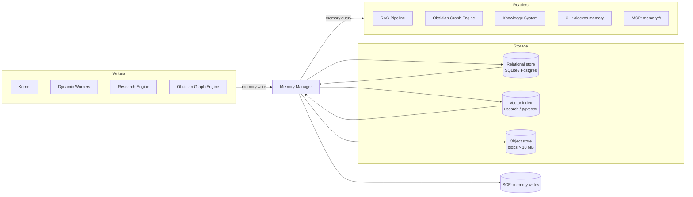

# Persistent Memory

> Durable, cross-session, cross-agent knowledge storage with two-tier architecture (relational + vector) and explicit retention policies. This document is normative — implementations MUST satisfy every MUST clause below.

## Overview

Persistent Memory is the durable knowledge store of AI Dev OS. Where the [Shared Context Engine](./SHARED_CONTEXT_ENGINE.md) is an append-only event log for real-time coordination, Persistent Memory is the structured, queryable, semantically-searchable archive that survives process restarts, session boundaries, and hardware reboots.

Every agent — from the [Main AI Kernel](./MAIN_AI_KERNEL.md) to the humblest [Dynamic Worker](./DYNAMIC_WORKERS.md) — writes facts, decisions, summaries, and checkpoints to Persistent Memory. Retrieval is dual-mode: exact-match relational queries for structured data, and approximate-nearest-neighbour vector search for semantic recall. Both modes are exposed through a single `memory.*` interface.

Persistent Memory feeds the [Obsidian Graph Engine](./OBSIDIAN_GRAPH_ENGINE.md), the [RAG Pipeline](./RAG_PIPELINE.md), the four-tier [Knowledge System](./KNOWLEDGE_SYSTEM.md), and the [Research Engine](./RESEARCH_ENGINE.md). It is the single source for any fact the OS needs to recall across time.

## Goals

- Two-tier storage: SQLite (or Postgres for remote) for metadata and relational queries; an embedded vector index (default: `usearch` or `pgvector`) for semantic recall.
- Explicit retention policies per record kind: system records (forever), task summaries (90 d), ephemeral scratchpad (session only).
- Encrypted at rest with per-workspace keys; key rotation without data loss.
- Local-first: the entire memory store MUST function on a single developer machine with zero cloud dependencies.
- Write-through to the [Shared Context Engine](./SHARED_CONTEXT_ENGINE.md) `memory.writes` topic for audit and replication.

## Non-Goals

- Real-time coordination — use the [Shared Context Engine](./SHARED_CONTEXT_ENGINE.md).
- Large blob storage (> 10 MB per record) — use an object store; Persistent Memory stores a pointer.
- Cross-tenant memory sharing — tenant isolation is strict; there is no global memory namespace.
- Implementation code — this repository is documentation-only (see [AI Coding Rules](./AI_CODING_RULES.md)).

## Architecture



## Interfaces

```
# Write
memory.write(item: MemoryInput) → MemoryRecord
memory.write_batch(items: MemoryInput[]) → MemoryRecord[]
memory.upsert(item: MemoryInput) → MemoryRecord        # idempotent by (workspace, kind, key)

# Read — relational
memory.get(id) → MemoryRecord
memory.list(filter: MemoryFilter) → MemoryRecord[]
memory.count(filter: MemoryFilter) → number

# Read — semantic
memory.query(q: string, opts?: QueryOpts) → MemoryRecord[]
# opts: { k?: number, min_score?: number, kinds?: Kind[], scopes?: Scope[] }

# Lifecycle
memory.delete(id | filter) → DeleteResult
memory.expire(filter) → number                          # force-expire matching records
memory.export(filter, format: "json"|"md") → ExportRef

# Observability
memory.stats() → MemoryStats
```

All errors follow [API Spec](./API_SPEC.md).

## Data Model

### MemoryRecord

```
MemoryRecord {
  id:          ulid
  workspace:   string           # tenant isolation key
  project:     string?
  group:       string?
  agent:       string?          # worker_id that wrote this

  kind: "fact"
      | "summary"
      | "decision"
      | "checkpoint"
      | "plan"
      | "artifact"
      | "research_result"
      | "kb_entry"
      | "playbook_step"
      | "error_trace"
      | "user_preference"

  key:         string?          # stable ID for upsert; e.g. "project.stack"
  text:        string           # human-readable content (indexed for FTS)
  embedding:   float32[]?       # model-generated embedding; null until backfill
  tags:        string[]
  source: {
    type: "kernel"|"worker"|"research"|"user"|"mcp"|"plugin"
    id:   string
    run_id?: ulid
  }
  refs:        { kind, id }[]   # cross-references to other records or SCE events

  retention: "forever"
           | "90d"
           | "30d"
           | "7d"
           | "session"

  encrypted:   boolean          # true if payload is envelope-encrypted
  ts: {
    created:   rfc3339
    updated:   rfc3339
    expires:   rfc3339?
  }
}
```

### MemoryInput (write payload)

```
MemoryInput {
  kind:        Kind            # required
  text:        string          # required
  key?:        string
  tags?:       string[]
  refs?:       Ref[]
  retention?:  Retention       # defaults from kind (see table below)
  project?:    string
  group?:      string
}
```

### Default retention by kind

| Kind | Default retention |
|------|------------------|
| `fact`, `decision`, `user_preference` | `forever` |
| `plan`, `artifact`, `kb_entry` | `90d` |
| `summary`, `research_result` | `30d` |
| `checkpoint`, `playbook_step` | `7d` |
| `error_trace` | `30d` |
| `scratchpad` (ephemeral) | `session` |

### MemoryFilter

```
MemoryFilter {
  ids?:        ulid[]
  workspace?:  string
  project?:    string
  group?:      string
  agent?:      string
  kinds?:      Kind[]
  tags?:       string[]        # AND semantics
  text_fts?:   string          # full-text search
  created_after?:  rfc3339
  created_before?: rfc3339
  has_embedding?:  boolean
}
```

## Embedding Pipeline

New records without an embedding are queued for the embedding service. The embedding service:

1. Reads pending records in batches (default 64).
2. Calls the configured embedding model (default: `nomic-embed-text` via Ollama for local, `text-embedding-3-small` for cloud).
3. Writes the `float32[]` vector back to the record.
4. Emits `memory.embedding_backfill_batch` event on the SCE.

The embedding service is decoupled from the write path. A `memory.query` for a record that has not yet been embedded falls back to full-text search and marks the result `{ semantic: false }`.

See [Embeddings](./EMBEDDINGS.md) and [Vector Store](./VECTOR_STORE.md) for the full specification.

## Four-Tier Knowledge Base Integration

Persistent Memory is the backing store for all four KB tiers. KB queries are translated into `memory.list` / `memory.query` calls with appropriate `workspace`, `project`, `group`, and `agent` scope filters:

| KB Tier | Scope filter | Doc |
|---------|-------------|-----|
| Global KB | `workspace=_global` | [GLOBAL_KB](./knowledge-bases/GLOBAL_KB.md) |
| Main KB | `workspace=W, project=P` | [MAIN_KB](./knowledge-bases/MAIN_KB.md) |
| Group KB | `workspace=W, project=P, group=G` | [GROUP_KB](./knowledge-bases/GROUP_KB.md) |
| Individual KB | `workspace=W, project=P, group=G, agent=A` | [INDIVIDUAL_KB](./knowledge-bases/INDIVIDUAL_KB.md) |

## Requirements

- **MUST** support exact-match relational queries and approximate-nearest-neighbour semantic queries via a single interface.
- **MUST** encrypt every record at rest using a per-workspace AES-256-GCM key managed by [Secrets Management](./SECRETS_MANAGEMENT.md).
- **MUST** support key rotation: re-encrypting all records for a workspace MUST be possible without downtime.
- **MUST** enforce retention: an automated expiry job MUST run at least once per day and hard-delete records past their `expires` timestamp.
- **MUST** write every `memory.write` call to the `memory.writes` SCE topic for audit.
- **MUST** publish every delete/expire to `memory.deletes` SCE topic.
- **MUST** support `memory.export` in JSON and Markdown for user data portability.
- **MUST** never store provider credentials; only store pointers to [Secrets Management](./SECRETS_MANAGEMENT.md) entries.
- **SHOULD** backfill embeddings asynchronously; the write path MUST NOT block on embedding generation.
- **SHOULD** support pluggable embedding providers via the [Plugin SDK](./PLUGIN_SDK.md).
- **MAY** offer a compaction step that summarises and replaces dense clusters of `checkpoint` records with a single `summary`.

## Failure Modes

| Mode | Detection | Response |
|------|-----------|----------|
| Embedding provider outage | Embedding service call failure | Queue writes to local WAL; backfill on recovery; serve FTS-only queries |
| Relational store unavailable | DB connection error | Buffer writes to local WAL; replay on recovery; refuse new runs after WAL threshold |
| Vector index corruption | Query returns unexpected results / index health check fails | Rebuild index from relational store; mark index `rebuilding`; fall back to FTS |
| Retention job failure | Job scheduler miss | Alert; re-run on next tick; records are never auto-deleted outside the job |
| Key rotation failure | Partial re-encryption | Roll back to previous key; alert operator; MUST NOT leave records in inconsistent state |
| Record too large | text > 1 MB | Reject with `RECORD_TOO_LARGE`; write blob to object store; store pointer |

Every failure emits a structured event on the SCE and is recorded in the [Audit Log](./AUDIT_LOG.md).

## Security Considerations

- Records are encrypted with a per-workspace key. The key is never stored alongside the data; it is fetched from [Secrets Management](./SECRETS_MANAGEMENT.md) on each open.
- Tenant isolation: `workspace` is a mandatory filter on every query; cross-workspace access is denied at the API layer.
- Embedding vectors MUST be treated with the same confidentiality as the source text — they can leak semantic information.
- The `memory.export` endpoint requires operator-level auth; user-level auth may export only their own `agent`-scoped records.
- See [Encryption](./ENCRYPTION.md), [Data Retention](./DATA_RETENTION.md), and [Privacy](./PRIVACY.md).

## Observability

| Metric | Labels | Description |
|--------|--------|-------------|
| `memory_write_total` | `kind`, `retention` | Write operations |
| `memory_query_total` | `mode=relational\|semantic\|fts` | Query operations |
| `memory_query_seconds` | `mode` | Query latency histogram |
| `memory_record_count` | `kind`, `retention` | Current record count |
| `memory_embedding_queue_depth` | — | Records awaiting embedding |
| `memory_expiry_total` | `kind` | Records expired per retention run |
| `memory_store_bytes` | `tier=relational\|vector` | Storage size |

Traces and logs conform to [Observability](./OBSERVABILITY.md), [Tracing](./TRACING.md), and [Logging](./LOGGING.md).

## Acceptance Criteria

- Writing a record of kind `fact` returns a valid `MemoryRecord` with a ULID within 10 ms (local SQLite).
- A semantic query for `"how does the Nine Router assign fallbacks"` returns the relevant records with similarity score > 0.7 within 100 ms (warmed index, 10k records).
- The retention job deletes all records with `retention: "7d"` and `expires` in the past within one run cycle.
- Key rotation completes for a 100k-record workspace without read downtime in < 60 s.
- Stopping and restarting the backend with a WAL-buffered write replays the write correctly on recovery.

## Open Questions

- Whether to support partial-record encryption (encrypt only the `text` field, leave metadata in plaintext for indexing) as a performance optimisation — tracked in [templates/ADR](../templates/ADR.md).
- Compaction heuristics: trigger by record count, by age, or by explicit operator command.

## Related Documents

- [Agent Memory](./AGENT_MEMORY.md) — per-agent working memory layered on top of Persistent Memory
- [Vector Store](./VECTOR_STORE.md) — vector index specification
- [Embeddings](./EMBEDDINGS.md) — embedding model selection and batching
- [RAG Pipeline](./RAG_PIPELINE.md) — retrieval-augmented generation over Persistent Memory
- [Obsidian Graph Engine](./OBSIDIAN_GRAPH_ENGINE.md) — graph layer over memory
- [Knowledge System](./KNOWLEDGE_SYSTEM.md) — four-tier KB backed by Persistent Memory
- [Encryption](./ENCRYPTION.md)
- [Data Retention](./DATA_RETENTION.md)
- [Shared Context Engine](./SHARED_CONTEXT_ENGINE.md)
- [Main AI Kernel](./MAIN_AI_KERNEL.md)
- [Architecture Guardian](./ARCHITECTURE_GUARDIAN.md)
