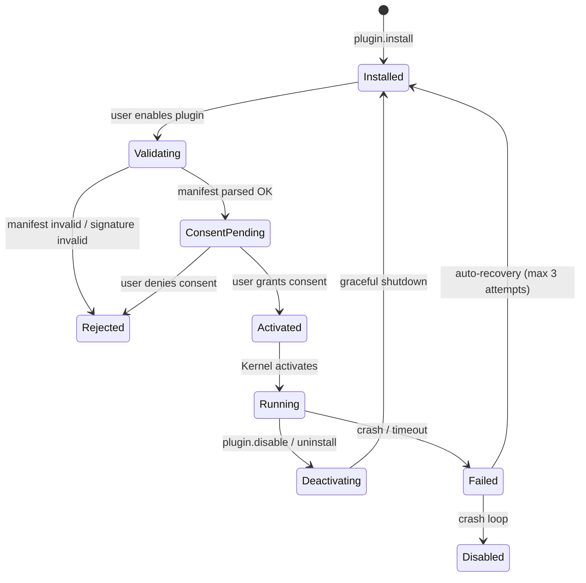

# Plugin SDK

> The extension framework that lets third-party developers add tools, providers, adapters, and UI panels to AI Dev OS without modifying the core. This document is normative — implementations MUST satisfy every MUST clause below.

## Overview

The Plugin SDK is the official extension point of AI Dev OS. It lets third-party developers (and operators of their own instances) package new capabilities — tools, model provider adapters, knowledge source adapters, UI panels, custom Guardian rules, and Research Engine source adapters — as versioned, signed plugins that the Kernel can load, sandbox, and audit without modifying core code.

Every plugin runs in a capability-restricted sandbox. The Kernel is the capability broker: a plugin only gets the tools and API surface it explicitly declares in its manifest, and only after the user grants consent. Plugin I/O is proxied through the Kernel so it appears in the [Audit Log](./AUDIT_LOG.md).

The Plugin SDK unifies three execution models: **in-process** (same process, JS/WASM module), **subprocess** (separate OS process, JSON-RPC stdio), and **MCP-backed** (delegated to an MCP server). All three expose the same manifest-declared interface to the Kernel.

## Goals

- Single manifest format, three execution models, zero bespoke glue for the plugin author.
- Least-privilege sandboxing: plugins only access what they declare and the user approves.
- Signed, versioned packages installable from a registry or local path.
- Consistent lifecycle: load → validate → consent → activate → use → deactivate → unload.
- Same interface for tools, provider adapters, source adapters, Guardian rules, and UI panels.

## Non-Goals

- A general-purpose app framework — plugins extend AI Dev OS only through declared extension points.
- Untrusted code execution outside the sandbox — all plugin code runs in a sandboxed context.
- Implementation code — this repository is documentation-only (see [AI Coding Rules](./AI_CODING_RULES.md)).

## Extension Points

| Extension point | Interface | Consumer |
|----------------|-----------|----------|
| `tool` | `Tool` — callable function with JSON Schema input/output | Dynamic Workers, MCP server |
| `provider_adapter` | `ProviderAdapter` — model provider (discovery + inference) | Nine Router, Model Providers |
| `source_adapter` | `SourceAdapter` — Research Engine source | Research Engine |
| `kb_adapter` | `KBAdapter` — custom Knowledge Base backend | Knowledge System |
| `guardian_rule` | `GuardianRule` — declarative rule for Architecture Guardian | Architecture Guardian |
| `ui_panel` | `UIPanel` — iframe-sandboxed panel in the desktop/web shell | Frontend |
| `context_middleware` | `ContextMiddleware` — SCE event transform | Shared Context Engine |

## Plugin Manifest

Every plugin is described by a `plugin.yaml` at its root:

```yaml
id: "com.example.my-plugin"          # reverse-domain, globally unique
name: "My Plugin"
version: "1.2.0"                     # semver
description: "One-line description"
author: { name: "Example Corp", url: "https://example.com" }
license: "MIT"
min_sdk_version: "0.5.0"            # minimum AI Dev OS SDK version required

execution:
  model: "subprocess"                # in_process | subprocess | mcp
  entry: "dist/index.js"            # for in_process / subprocess
  mcp_server: null                  # for mcp: { transport, endpoint }
  runtime: "node"                   # node | deno | wasm | python

capabilities:                       # what the plugin needs from the OS
  - memory.query                    # read Persistent Memory
  - memory.write                    # write Persistent Memory (elevated)
  - http.get                        # outbound GET requests
  # - http.post                     # outbound POST (requires explicit user approval)
  # - shell_exec                    # dangerous: subprocess execution
  # - file_read                     # read vault files
  # - file_write                    # write vault files

extensions:
  tools:
    - id: "my_tool"
      name: "My Tool"
      description: "Does something useful"
      input_schema:  { type: object, properties: { query: { type: string } }, required: [query] }
      output_schema: { type: object, properties: { result: { type: string } } }
      timeout_ms: 30000

  provider_adapters:
    - id: "my_provider"
      name: "My LLM Provider"
      base_url: "https://api.example.com/v1"
      models_endpoint: "/models"
      chat_endpoint: "/chat/completions"
      auth: { kind: "bearer", env: "MY_PROVIDER_API_KEY" }

  guardian_rules:
    - id: "com.example.no-pii"
      severity: "high"
      description: "Reject artifacts containing detected PII"
      scope: { kinds: ["any"] }
      expr:
        not:
          content_matches: "(\\b[A-Z][a-z]+ [A-Z][a-z]+\\b.*\\b\\d{3}-\\d{2}-\\d{4}\\b)"

signature:
  alg: "ed25519"
  key_id: "..."
  value: "..."                       # base64; signed over canonical manifest bytes
```

## Execution Models

### In-Process (JS/WASM)

The plugin module is loaded into the Kernel's JS runtime (or a WASM sandbox). It receives a restricted `SDK` object that exposes only the declared capabilities. It MUST NOT access `globalThis`, `process.env`, or any Node built-ins except those injected by the SDK.

```typescript
// Plugin entry point (in-process)
export function activate(sdk: PluginSDK): PluginInstance {
  return {
    tools: {
      my_tool: async (input) => {
        const results = await sdk.memory.query(input.query, { k: 5 });
        return { result: results.map(r => r.text).join("\n") };
      }
    }
  };
}
```

### Subprocess

The plugin runs as a separate OS process. The Kernel communicates via JSON-RPC over stdio:

```
→ { jsonrpc: "2.0", method: "plugin.activate", params: { capabilities, config }, id: 1 }
← { jsonrpc: "2.0", result: { tools: [...], status: "ready" }, id: 1 }
→ { jsonrpc: "2.0", method: "tool.call", params: { name: "my_tool", args: { query: "..." } }, id: 2 }
← { jsonrpc: "2.0", result: { result: "..." }, id: 2 }
→ { jsonrpc: "2.0", method: "plugin.deactivate", params: {}, id: 3 }
← { jsonrpc: "2.0", result: { status: "stopped" }, id: 3 }
```

### MCP-Backed

For plugins that delegate to an MCP server, the Plugin SDK acts as an MCP client adapter. The manifest declares the MCP server reference; the Kernel connects to it via the [MCP](./MCP.md) subsystem and presents its tools as plugin tools with the same capability-checking semantics.

## SDK API Surface (Capability-Gated)

The `PluginSDK` object exposed to in-process plugins:

```typescript
interface PluginSDK {
  // Always available
  readonly plugin: { id: string; version: string }
  readonly logger: { debug; info; warn; error }
  readonly config: (key: string) => string | undefined

  // Requires capability: memory.query
  readonly memory: {
    query: (q: string, opts?: QueryOpts) => Promise<MemoryRecord[]>
    get:   (id: string) => Promise<MemoryRecord>
  }

  // Requires capability: memory.write (elevated — user prompted on first use)
  readonly memory_write: {
    write:  (item: MemoryInput) => Promise<MemoryRecord>
    upsert: (item: MemoryInput) => Promise<MemoryRecord>
    delete: (id: string) => Promise<void>
  }

  // Requires capability: http.get
  readonly http: {
    get:  (url: string, opts?: RequestOpts) => Promise<HttpResponse>
    post: (url: string, body: unknown, opts?: RequestOpts) => Promise<HttpResponse>
    // post requires capability: http.post
  }

  // Requires capability: file_read
  readonly vault: {
    read:   (path: string) => Promise<string>
    list:   (dir?: string) => Promise<string[]>
    exists: (path: string) => Promise<boolean>
  }

  // Always available (read-only, filtered to plugin's own events)
  readonly events: {
    subscribe: (topic: string) => AsyncIterator<SCEEvent>
    publish:   (topic: string, payload: object) => Promise<void>
    // publish requires capability: sce.publish
  }
}
```

## Plugin Lifecycle



### Consent model

On first activation, the Kernel presents the user with a consent dialog listing the requested capabilities in plain English:

```
"My Plugin" wants permission to:
  ✓ Read your knowledge base (memory.query)
  ✓ Write to your knowledge base (memory.write) — elevated access
  ✓ Make outbound HTTP GET requests
  ✗ Execute shell commands — NOT REQUESTED
```

The user may grant, deny, or grant a subset of capabilities. Consent is persisted in `~/.aidevos/plugin-consents.yaml`. Consent is re-requested if the plugin's manifest version changes or if it requests new capabilities.

## Tool Calling from Workers

When a [Dynamic Worker](./DYNAMIC_WORKERS.md) calls a plugin tool:

```
worker → Kernel (via tool dispatch): { name: "my_tool", args: { query: "..." } }
Kernel → Plugin sandbox: { method: "tool.call", params: ... }
Plugin sandbox → runs tool handler
Plugin handler → SDK capability call (e.g., sdk.memory.query)
SDK → Kernel capability gate: checks consent + capability list
Kernel → Persistent Memory (if approved)
← returns result through the chain
```

Every step in the chain is audited with the `correlation_id`. The plugin never sees the raw capability implementation — only the SDK surface.

## Provider Adapter Interface

Plugins that declare a `provider_adapter` extension MUST implement:

```
ProviderAdapter {
  models()   → Model[]                       # called by Model Discovery
  chat(req)  → ChatResponse | AsyncStream    # called by Dynamic Workers
  embed(req) → float32[][]                  # optional; for embedding models
}
```

The adapter is registered with the [Nine Router](./NINE_ROUTER.md) as a user-registered provider and appears in the model catalog under the **User-registered** group.

## Interfaces

```
# Installation
plugins.install(ref: string | LocalPath | RegistryRef) → Plugin
plugins.uninstall(plugin_id) → Ack

# Lifecycle
plugins.enable(plugin_id) → Ack
plugins.disable(plugin_id) → Ack

# Introspection
plugins.list(filter?) → Plugin[]
plugins.get(plugin_id) → Plugin
plugins.tools(plugin_id) → Tool[]
plugins.capabilities(plugin_id) → Capability[]

# Consent
plugins.consent_status(plugin_id) → ConsentRecord
plugins.revoke_consent(plugin_id) → Ack

# Registry
plugins.search(q: string) → RegistryResult[]
```

## Requirements

- **MUST** validate every plugin manifest signature before loading; an invalid signature MUST cause `Rejected` state.
- **MUST** run in-process plugins in a JS/WASM sandbox that cannot access host globals, environment variables, or the filesystem outside declared capabilities.
- **MUST** proxy all SDK capability calls through the Kernel's capability gate.
- **MUST** record every plugin tool call in the [Audit Log](./AUDIT_LOG.md) with input/output hashes.
- **MUST** support consent re-request when a new plugin version adds new capabilities.
- **MUST** implement crash recovery: auto-restart a crashed plugin up to `max_restart_attempts` (default 3) before entering `Disabled` state.
- **MUST** cleanly deactivate a plugin (drain in-flight calls, release tool handles) within `deactivate_timeout_ms` (default 5000 ms).
- **SHOULD** enforce a per-plugin CPU and memory budget in the subprocess model.
- **SHOULD** ship a plugin scaffolding tool: `aidevos plugins scaffold --name <name> --model subprocess --lang typescript`.
- **MAY** support a local registry (`~/.aidevos/registry/`) for private plugins alongside the public registry.

## Failure Modes

| Mode | Detection | Response |
|------|-----------|----------|
| Manifest signature invalid | Signature verification failure | Reject; do not load; emit `plugin.rejected` |
| Manifest parse error | YAML/schema validation failure | Reject; surface error to operator |
| Capability denied | User denies consent | Disable capability; plugin still loads but affected tools are unavailable |
| Plugin crash | Subprocess exits / uncaught exception | Auto-restart up to `max_restart_attempts`; then `Disabled` |
| Tool timeout | Tool call exceeds `timeout_ms` | Cancel; return `TOOL_TIMEOUT` error; do not crash plugin |
| SDK capability gate denied | Undeclared capability requested | Return `CAPABILITY_DENIED`; log security event |
| Deactivation timeout | Graceful shutdown exceeds `deactivate_timeout_ms` | Force-kill; emit `plugin.forced_kill`; audit |

## Security Considerations

- Plugins are **untrusted by default**: every permission is opt-in at both the manifest level and the consent level.
- Sandboxing defence-in-depth: JS sandbox restricts globals; subprocess model uses OS-level process isolation; WASM enforces memory isolation by design.
- Plugin signatures use ed25519; the public key set is pinned in the OS distribution and updated via a transparency log.
- Capability tokens are scoped to the plugin's lifetime; they expire on deactivation.
- All plugin I/O is logged with input/output SHA-256 hashes; full payloads are logged only if `debug_mode: true`.
- See [Security Model](./SECURITY_MODEL.md) and [Privacy](./PRIVACY.md).

## Observability

| Metric | Labels | Description |
|--------|--------|-------------|
| `plugin_state_total` | `plugin_id`, `state` | Plugin state transitions |
| `plugin_tool_call_total` | `plugin_id`, `tool`, `ok` | Tool call outcomes |
| `plugin_tool_call_seconds` | `plugin_id`, `tool` | Tool call latency |
| `plugin_crash_total` | `plugin_id` | Crash events |
| `plugin_capability_denied_total` | `plugin_id`, `capability` | Capability gate denials |

Traces: one span per plugin tool call; child spans for SDK capability calls. See [Tracing](./TRACING.md).

## Acceptance Criteria

- Installing a plugin from a local path, enabling it, and granting consent makes its tools available via `aidevos mcp call` within one lifecycle cycle.
- A plugin that requests `shell_exec` (not granted by the user) cannot execute shell commands; the capability gate returns `CAPABILITY_DENIED`.
- A crashing subprocess plugin auto-restarts up to 3 times and enters `Disabled` state on the fourth crash.
- Revoking a plugin's consent immediately deactivates the plugin and returns all pending tool calls with `CONSENT_REVOKED`.
- Every plugin tool call produces a corresponding entry in the [Audit Log](./AUDIT_LOG.md).

## Open Questions

- Whether the public plugin registry should be a central hosted service or a federated model (git repos with a signed index) — tracked in [templates/ADR](../templates/ADR.md).
- WASM runtime: `wasmtime` (Rust-native, strong sandbox) vs. browser WASM (portable but more limited) for in-process model.

## Related Documents

- [Tool Calling](./TOOL_CALLING.md)
- [MCP](./MCP.md) — MCP-backed plugin model
- [Nine Router](./NINE_ROUTER.md) — provider adapter registration
- [Research Engine](./RESEARCH_ENGINE.md) — source adapter extension point
- [Architecture Guardian](./ARCHITECTURE_GUARDIAN.md) — guardian rule extension point
- [Security Model](./SECURITY_MODEL.md)
- [Audit Log](./AUDIT_LOG.md)
- [System Overview](./SYSTEM_OVERVIEW.md)
- [Main AI Kernel](./MAIN_AI_KERNEL.md)
