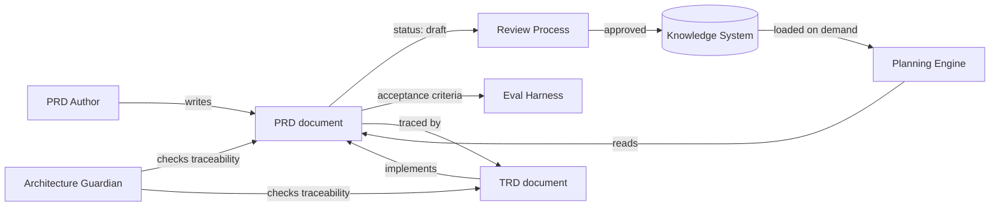

# Product Requirements Document

> The PRD subsystem defines product requirements for every AI Dev OS subsystem. This document is normative — implementations MUST satisfy every MUST clause below.

## Overview

The PRD (Product Requirements Document) subsystem is the canonical registry of product requirements across AI Dev OS. Every subsystem with substantial functionality has an associated PRD that declares **what** the subsystem must deliver. PRDs are consumed by the [Planning Engine](./PLANNING_ENGINE.md) during goal analysis and by AI agents when reasoning about subsystem purpose, scope, and acceptance criteria.

PRDs are first-class documents stored in the docs/ directory alongside their subsystem spec. Unlike a spec (which defines contracts, interfaces, and invariants), a PRD defines requirements from the user's and product's perspective: goals, user stories, acceptance criteria, metrics, and risks.

PRDs follow a standard lifecycle. A subsystem's PRD is **draft** during initial design, moves to **reviewing** for stakeholder feedback, is **approved** once stable, enters **implemented** once the subsystem ships, and is **deprecated** when the subsystem is superseded or removed.

## PRD Schema

```
PRD {
  id:                string        # "PRD-001" or subsystem name
  title:             string        # human-readable title
  status:            PRDStatus     # lifecycle status
  version:           semver
  stakeholders:      Stakeholder[] # { name, role, contact? }
  problem_statement: string        # the problem this subsystem solves
  goals:             string[]      # high-level product goals
  non_goals:         string[]      # explicitly out of scope
  user_stories[]:    UserStory[]   # "As a <persona>, I want <capability> so that <benefit>"
  acceptance_criteria: Criterion[] # testable pass/fail conditions
  metrics:           MetricDef[]   # success metrics with targets
  risks:             Risk[]        # identified risks and mitigations
  subsystem_ref:     string        # link to the subsystem spec doc
  created:           rfc3339
  updated:           rfc3339
}
```

## Status Lifecycle

```
draft ──→ reviewing ──→ approved ──→ implemented
                           │
                           └──→ deprecated
```

| Status | Meaning | Requirements |
|--------|---------|--------------|
| `draft` | Initial writing, still iterating | MAY have incomplete sections |
| `reviewing` | Submitted for stakeholder review | All sections MUST be populated |
| `approved` | Reviewed and accepted | MUST pass [Architecture Guardian](./ARCHITECTURE_GUARDIAN.md) rule checks |
| `implemented` | Subsystem ships with this behaviour | Acceptance criteria MUST be validated by [Eval Harness](./EVAL_HARNESS.md) |
| `deprecated` | Superseded or removed | MUST have a migration path documented in [Migration Guide](./MIGRATION_GUIDE.md) |

## Relationship to TRD

The PRD and [TRD](./TRD.md) form a complementary pair:

- **PRD** defines **WHAT** the subsystem must do (product requirements, goals, user stories).
- **TRD** defines **HOW** the subsystem does it (tech stack, architecture decisions, data models, interfaces).

Every approved PRD MUST have at least one corresponding TRD. A TRD references its PRD via `trd.prd_id`. Traceability is enforced by the Architecture Guardian: a change to a PRD without a corresponding TRD update receives a `warning`-severity violation.

```
PRD: "User wants to search across all knowledge bases"
  └── TRD: "Search index uses SQLite FTS5 + usearch vector search"
        ├── ADR-001: "Why SQLite FTS5 over Elasticsearch"
        └── ADR-002: "Why usearch over pgvector"
```

## Requirements

- **MUST** be consumable by both humans and AI agents.
- **MUST** publish every state change to the [Shared Context Engine](./SHARED_CONTEXT_ENGINE.md).
- **MUST** pass every rule enforced by the [Architecture Guardian](./ARCHITECTURE_GUARDIAN.md).
- **MUST** be observable through the metrics defined in [Observability](./OBSERVABILITY.md).
- **MUST** enforce that every `approved` PRD has at least one corresponding TRD.
- **MUST** reject PRD transitions from `draft` to `reviewing` if `acceptance_criteria` is empty.
- **SHOULD** provide a template that guides authors through all required sections.
- **SHOULD** support bulk export for review (e.g. `prd.list("approved")` as a single document).
- **MAY** auto-generate a PRD diff when `prd.set()` is called, showing what changed.

## Integration with Planning Engine

The [Planning Engine](./PLANNING_ENGINE.md) uses PRDs as inputs during goal decomposition. When a goal references a subsystem, the Engine loads the subsystem's PRD to:

1. Understand the subsystem's scope (in-scope vs. non-goals) so it does not plan work outside the PRD boundary.
2. Decompose user stories into concrete tasks.
3. Extract acceptance criteria to pass as task success conditions.
4. Surface risks to the operator before planning begins.

The Engine accesses PRDs through the `prd.get(subsystem)` interface.

## Example PRD

The following is a minimal example of a PRD for a hypothetical search subsystem:

```yaml
id: PRD-008
title: Unified Search
status: draft
version: 0.1.0
stakeholders:
  - name: Jane Doe
    role: Product Manager
problem_statement: >
  Users cannot search across knowledge bases, code, and documentation
  from a single interface.
goals:
  - Provide a unified search interface across all KB tiers
  - Surface results ranked by relevance with snippet previews
non_goals:
  - Full-text search of external websites (use Research Engine instead)
user_stories:
  - "As a developer, I want to search all KBs at once so that I find relevant context faster."
  - "As a platform builder, I want to filter search by KB tier so that I scope results."
acceptance_criteria:
  - "Searching 'authentication' returns results from Main KB, Group KB, and code comments."
  - "Search latency stays under 500ms for a KB with 10,000 entries."
metrics:
  - name: search_p99_latency
    target: 500ms
  - name: result_relevance
    target: "> 0.8 NDCG"
risks:
  - risk: "Vector search quality degrades with non-English queries"
    mitigation: "Support multilingual embeddings at index time"
subsystem_ref: SEARCH_ENGINE.md
```

This example illustrates the required sections. All production PRDs MUST follow the [template](../templates/PRD.md).

## Subsystem PRDs Reference

Every subsystem with thick content in this repository has an implicit PRD embedded in its specification document. The following subsystems have explicit PRD documents (or will upon implementation):

| Subsystem | PRD Status | Spec Document |
|-----------|------------|---------------|
| Main AI Kernel | `implemented` | [MAIN_AI_KERNEL.md](./MAIN_AI_KERNEL.md) |
| Nine Router | `implemented` | [NINE_ROUTER.md](./NINE_ROUTER.md) |
| Architecture Guardian | `implemented` | [ARCHITECTURE_GUARDIAN.md](./ARCHITECTURE_GUARDIAN.md) |
| Planning Engine | `approved` | [PLANNING_ENGINE.md](./PLANNING_ENGINE.md) |
| Shared Context Engine | `implemented` | [SHARED_CONTEXT_ENGINE.md](./SHARED_CONTEXT_ENGINE.md) |
| AI Groups | `approved` | [AI_GROUPS.md](./AI_GROUPS.md) |
| Knowledge System | `approved` | [KNOWLEDGE_SYSTEM.md](./KNOWLEDGE_SYSTEM.md) |
| Model Routing Policy | `approved` | [MODEL_ROUTING_POLICY.md](./MODEL_ROUTING_POLICY.md) |
| Merge Manager | `draft` | [MERGE_MANAGER.md](./MERGE_MANAGER.md) |
| Voice System | `draft` | [VOICE_SYSTEM.md](./VOICE_SYSTEM.md) |

## Templates

A blank PRD template is available at [templates/PRD.md](../templates/PRD.md). The template includes all required sections with placeholder guidance. New subsystems MUST start from this template.

## Architecture



## Interfaces

```
prd.get(subsystem: string) → PRD
prd.list(status?: PRDStatus) → PRD[]
prd.set(prd: PRD) → PRD          # create or update
prd.transition(id: string, to_status: PRDStatus) → PRD
prd.validate(prd: PRD) → ValidationResult
```

All interfaces follow [Agent Communication](./AGENT_COMMUNICATION.md) and [API Spec](./API_SPEC.md).

## Failure Modes

| Mode | Detection | Response |
|------|-----------|----------|
| PRD not found | `prd.get(subsystem)` returns empty | Return `PRDNotFound`; Planning Engine may still proceed with goal-only decomposition |
| PRD status mismatch | Planning Engine reads a `draft` PRD | Emit `prd.status_warning`; Engine MAY include draft PRDs but MUST surface the status |
| Broken PRD→TRD trace | TRD references a non-existent `prd_id` | Guardian emits `warning` violation; suggest creating the PRD or fixing the reference |
| PRD parse error | YAML/Markdown front-matter parse failure | Reject the document; surface parse error to author; keep previous version |

## Security Considerations

- PRDs are public within the workspace; they do not contain secrets. Sensitive context (e.g. customer PII requirements) belongs in the [TRD](./TRD.md) under restricted access.
- PRD transitions (`draft → reviewing → approved`) require authZ checks via [AuthZ/RBAC](./AUTHZ_RBAC.md).
- See [Security Model](./SECURITY_MODEL.md).

## Observability

| Metric | Labels | Description |
|--------|--------|-------------|
| `prd_count` | `status` | PRD document count by status |
| `prd_transition_total` | `from_status`, `to_status` | Status transitions |
| `prd_read_total` | `subsystem` | PRD read operations |
| `prd_trace_gap_total` | — | PRDs without matching TRDs |

## Open Questions

- Whether PRD review should be gated on stakeholder sign-off or can proceed with async review — tracked in [templates/ADR](../templates/ADR.md).
- Whether `metrics` should be mandatory or optional for `draft` PRDs.
- Whether the PRD template should include a "Dependencies" section listing other PRDs this one depends on.
- Whether deprecated PRDs should be deleted or preserved for historical reference (current position: preserve with `deprecated` status).
- Whether `prd.transition()` should auto-trigger a notification to listed `stakeholders`.

## Acceptance Criteria

- Every subsystem with a spec document in `docs/` has a corresponding PRD entry in `prd.list()`.
- A PRD in `draft` status is readable by the Planning Engine but emits a `prd.status_warning`.
- Transitioning a PRD from `approved` to `implemented` requires all acceptance criteria to be validated by the Eval Harness.
- `prd.validate()` returns an error if `acceptance_criteria` is empty.

## Related Documents

- [TRD](./TRD.md) — technical requirements that implement PRD decisions
- [Product Overview](./PRODUCT_OVERVIEW.md) — product-level description
- [Project Vision](./PROJECT_VISION.md) — long-term vision
- [System Overview](./SYSTEM_OVERVIEW.md) — architecture context
- [Implementation Roadmap](./IMPLEMENTATION_ROADMAP.md) — timeline for PRD delivery
- [Eval Harness](./EVAL_HARNESS.md) — validates acceptance criteria
- [Architecture Guardian](./ARCHITECTURE_GUARDIAN.md) — enforces PRD→TRD traceability
- [templates/PRD.md](../templates/PRD.md)
