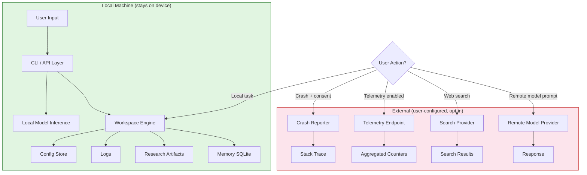

# Privacy

> What data AI Dev OS collects, stores, and transmits — and what it does
> not.

## Overview

AI Dev OS is built on a **local-first** architecture. All core
functionality — memory, research, automation — executes entirely on the
user's machine and works with zero data egress. Telemetry and crash
reporting are opt-in and disabled by default. When external services are
used (model providers, search APIs), the data sent is limited to what the
user's action requires and is always gated by explicit configuration.

## Data Collected

| Category | Collected By Default | Stored Where | Description |
|---|---|---|---|
| Configuration | Yes | Local disk (`~/.aidevos/`) | User settings, workspace definitions, provider configs |
| Memory records | Yes | Local SQLite | Encrypted workspace knowledge base |
| Research artifacts | Yes | Local disk | Files downloaded or generated during research sessions |
| Logs (debug + info) | Yes | Local disk (`~/.aidevos/logs/`) | Rota­ted, retained 7 days by default |
| Telemetry metrics | Opt-in | Remote (if configured) | Aggregated usage counters — no personal identifiers |
| Crash reports | Opt-in | Remote (if configured) | Stack trace, system info, log tail — no workspace content |
| Command autocomplete history | Yes | Local SQLite | Only stores command text, scoped to local machine |

## Data NOT Collected

AI Dev OS **does not** collect:

- Keystrokes or mouse events outside of explicit UI actions (e.g. clicking
  a button, submitting a prompt)
- Screen content or screenshots (except when the user explicitly invokes a
  screenshot-taking action, e.g. `aidevos screen`)
- Files outside the configured workspace directories
- Network traffic not directed at AI Dev OS
- Browser history, email, or calendar data (unless the user explicitly
  connects a plugin for that purpose)
- Biometric data or location data (except as exposed by the OS to the
  process, e.g. time zone)

## Local-First Guarantee

| Capability | Works Offline |
|---|---|
| Memory read/write | Yes |
| Research document processing | Yes |
| Code analysis | Yes |
| Script execution | Yes |
| Plugin runtime (local-only plugins) | Yes |
| Model inference (local models) | Yes |
| Model inference (remote models) | No — requires network |
| Web search | No — requires network |
| Telemetry export | No — opt-in, only when configured |

No data ever leaves the machine unless the user has explicitly configured a
remote model provider, search provider, or telemetry endpoint.

## Data Retention

| Category | Default Retention | Configurable |
|---|---|---|
| Configuration | Until workspace deleted | Yes |
| Memory records | Until workspace deleted | Yes (per-record TTL) |
| Research artifacts | Until workspace deleted | Yes |
| Debug logs | 7 days rolling | Yes (max_days, max_size) |
| Telemetry metrics | 90 days on server | By provider |
| Crash reports | 180 days on server | By provider |
| Command history | 30 days | Yes (history_ttl_days) |

Users can delete any data category at any time:

```
aidevos workspace flush --memory
aidevos workspace flush --logs
aidevos workspace delete
```

## User Rights

1. **Export** — `aidevos workspace export` produces a portable archive of
   all workspace data in plaintext (JSON + file copies).
2. **Delete** — `aidevos workspace delete` removes all local data for a
   workspace. Remote telemetry data can be deleted by contacting the
   administrator of the telemetry endpoint.
3. **Opt out** — telemetry is off by default. If enabled, it can be
   disabled at any time via `config set telemetry.enabled false` or by
   removing the `telemetry` block from the config file.
4. **View** — all locally stored data is accessible as plaintext files or
   via the CLI (`aidevos memory list`, `aidevos config show`).

## Third-Party Data Sharing

AI Dev OS does not sell or share personal data. Data is transmitted to
third parties only when the user explicitly configures a provider:

| Third Party | Data Sent | Trigger | User Control |
|---|---|---|---|
| Model provider (e.g. OpenAI, Anthropic) | Prompt text, optional file attachments | User submits a prompt | API key required; provider choice is configurable |
| Search provider (e.g. Bing, Google) | Query string | User runs a web search | Must be enabled in config; each provider has its own toggle |
| Telemetry endpoint | Aggregated counters | Telemetry enabled in config | Opt-in; off by default |
| Crash reporter | Stack trace, system info | Crash occurs + user approval | Opt-in prompt on first crash |

All remote API calls are documented in the audit log. Users can review
exactly what was sent and when.

## Compliance

| Regulation | AI Dev OS Readiness |
|---|---|
| **GDPR** | Local-first architecture means minimal personal data processing. See [Compliance](COMPLIANCE.md) for data export, deletion, and DPA guidance. |
| **CCPA** | No sale of personal information. Users can request deletion of any remotely stored data. |

For compliance in regulated deployments, refer to the [Compliance](COMPLIANCE.md)
document and consult your organisation's Data Protection Officer.

## Data Flow Diagram



## PII Detection Algorithm

```
function detect_pii(text: string) -> list[PIIMatch]:
    patterns = {
        "email": r'[\w\.-]+@[\w\.-]+\.\w+',
        "ip_address": r'\b\d{1,3}\.\d{1,3}\.\d{1,3}\.\d{1,3}\b',
        "api_key": r'(sk-[a-zA-Z0-9]{20,}|pk-[a-zA-Z0-9]{20,})',
        "phone": r'\b\+?\d[\d\s\-\(\)]{7,}\b',
        "credit_card": r'\b\d{4}[- ]?\d{4}[- ]?\d{4}[- ]?\d{4}\b',
        "file_path_local": r'[A-Z]?:\\[^\s]+|~/[^\s]+',
    }
    for label, regex in patterns:
        for match in regex.finditer(text):
            yield PIIMatch(
                type=label,
                start=match.start(),
                end=match.end(),
                redacted="[REDACTED_${label}]"
            )
```

## Data Classification Schema

| Classification | Definition | Examples | Storage Requirement |
|---|---|---|---|
| **Public** | No risk if disclosed | Documentation, README, sample configs | No encryption required |
| **Internal** | Low business impact | Debug logs (no user data), telemetry counters | Encrypted at rest |
| **Sensitive** | Moderate impact | Memory records, command history, workspace metadata | Encrypted at rest + in transit |
| **Restricted** | High impact | API keys, authentication tokens, PII | Encrypted at rest + in transit + in use (TEE) |

## Data Flow per Subsystem

| Subsystem | Local Data | External Data | Boundary |
|---|---|---|---|
| Workspace Engine | Memory, artifacts, config | — | Entirely local |
| CLI / API | User commands, flags | — | Parsed in-process |
| Model Adapter | Prompt text, attachments | Prompt sent to remote API | Gated by provider config |
| Search Adapter | Query string | Query sent to search API | Gated by search config |
| Telemetry | Aggregated counters | Counters uploaded | Opt-in, no PII |
| Crash Reporter | Log tail, stack trace | Report sent | User-approved per crash |
| Plugin Runtime | Plugin data, I/O | Varies per plugin | Sandboxed, declared in manifest |

## Encryption Cascade

| State | Algorithm | Key Management |
|---|---|---|
| **At rest** (disk) | AES-256-GCM | Key derived from user passphrase via Argon2id, stored in OS keychain |
| **In transit** (network) | TLS 1.3 | System CA trust store, pinning for telemetry endpoints |
| **In use** (memory) | Process-isolated heap, no swapping | mlock() on sensitive buffers, zero-on-free |

## Data Minimization Strategy

1. **Collect only what is necessary** — no speculative data gathering
2. **Aggregate before egress** — telemetry is pre-aggregated into counters; raw events never leave the device
3. **Strip identifiers** — remote calls exclude machine name, username, hostname, IP
4. **Limit retention** — every data category has a default TTL; expired data is purged within 24 hours
5. **Anonymize by default** — remote crash reports strip workspace paths and memory content
6. **Ad-hoc minimisation** — `aidevos workspace export` lets users review and redact before sharing

## Privacy by Design Principles

1. **Proactive not reactive** — privacy review is a gating step in the RFC/feature process
2. **Privacy as the default** — telemetry off, local-first, no behavioural profiling
3. **Privacy embedded into design** — data flow diagrams required for every feature RFC
4. **Full functionality** — all core features work offline with zero data egress
5. **End-to-end security** — encryption cascade covers all states
6. **Visibility and transparency** — audit log records every remote call; all data is user-accessible
7. **Respect for user privacy** — user-consent prompts before any outbound transmission

## Privacy Impact Assessment (PIA) Process

1. **Trigger** — any feature that introduces new data collection or external transmission
2. **Screening** — PIA team determines if full assessment is needed (based on data classification)
3. **Assessment** — data flow mapping, classification, risk identification, mitigation plan
4. **Review** — PIA reviewed by legal and security teams
5. **Approval** — sign-off required before feature ships
6. **Register** — PIA logged in `docs/pia/YYYY-MM-DD-feature-name.md`
7. **Re-assessment** — triggered by material changes to the feature

## Cross-Workspace Isolation Model

| Aspect | Isolation Mechanism |
|---|---|
| Storage | Each workspace has a dedicated SQLite file + directory tree |
| Memory | Workspace-scoped key prefix (`workspace_id:`) in memory store |
| Config | Per-workspace config file, merged with global config |
| Process | Workspaces share a process but maintain separate state trees |
| Network | Workspaces share provider config; outbound calls tagged with workspace ID in audit log |
| Plugins | Each workspace has an independent plugin instance scope |

## Data Export Format Specification

Archive structure (`workspace-export-{id}.tar.gz`):
```
workspace-export/
├── metadata.json           # workspace name, created date, export timestamp
├── config.toml             # workspace configuration (secrets redacted)
├── memory/
│   └── records.jsonl       # one JSON object per memory record
├── artifacts/              # raw research artifact files
│   ├── report-1.md
│   └── diagram.png
├── command-history/
│   └── history.jsonl       # timestamped command entries
└── audit-log/
    └── calls.jsonl         # timestamped outbound API call records
```

Each `.jsonl` file uses newline-delimited JSON with schema version header.

## Data Deletion Verification Procedure

1. User runs `aidevos workspace flush --all`
2. System deletes: SQLite file, artifact directory, log directory, config file
3. System writes a deletion receipt to `~/.aidevos/deletion-receipts/{workspace-id}-{timestamp}.json`
4. Receipt contains: workspace ID, deletion timestamp, SHA-256 of the empty directory
5. User can share the receipt with compliance teams for audit

## Third-Party Provider Audit Log Schema

| Field | Type | Description |
|---|---|---|
| `call_id` | `uuid` | Unique call identifier |
| `timestamp` | `datetime` | UTC timestamp |
| `provider` | `string` | Provider name (e.g. `openai`, `bing`) |
| `endpoint` | `string` | URL called |
| `input_tokens` | `integer` | Number of input tokens sent |
| `output_tokens` | `integer` | Number of output tokens received |
| `latency_ms` | `integer` | Round-trip time |
| `status_code` | `integer` | HTTP status code |
| `error` | `string` | Error message (if any) |
| `workspace_id` | `string` | Originating workspace |

Logs are append-only, stored locally, and user-readable via:
```bash
aidevos audit list
aidevos audit show <call-id> --verbose
```

## Regulatory Mapping

| GDPR Article | Requirement | AI Dev OS Implementation |
|---|---|---|
| Art. 5(1)(c) | Data minimisation | Local-first, collect-only-necessary, pre-aggregated telemetry |
| Art. 7 | Consent | Opt-in telemetry, opt-in crash reporting, per-provider configuration |
| Art. 15 | Right of access | `aidevos config show`, `aidevos memory list`, `aidevos audit list` |
| Art. 17 | Right to erasure | `aidevos workspace flush`, `aidevos workspace delete` |
| Art. 20 | Data portability | `aidevos workspace export` produces portable JSON archive |
| Art. 25 | Data protection by design | Encryption cascade, local-first, privacy-by-design principles |
| Art. 32 | Security of processing | Encryption at rest/in transit/in use, key derivation via Argon2id |
| Art. 33 | Breach notification | Audit log enables retrospective analysis; incident response in [SECURITY_RESPONSE.md] |
| Art. 35 | DPIA | PIA process required for all new features |

| CCPA Section | Requirement | AI Dev OS Implementation |
|---|---|---|
| §1798.100 | Right to know | Audit log, export, `aidevos config show` |
| §1798.105 | Right to delete | Workspace delete and flush commands |
| §1798.110 | Disclosure of collection | This document (Data Collected table) |
| §1798.115 | Purpose of collection | Explicitly documented per data category |
| §1798.120 | Right to opt out | No sale of data; telemetry off by default |

## Failure Modes

| Failure Scenario | Impact | Detection | Mitigation |
|---|---|---|---|
| **Accidental data egress** (misconfigured provider sends more data than intended) | Sensitive data reaches third party | Egress volume spike detected by telemetry counters | Audit log records exact payload boundaries; provider config validated at startup; allow-list for allowed endpoint URLs |
| **Misconfigured telemetry** (user thinks telemetry is off but it is on) | Aggregated counters sent without consent | Config read on every export; mismatch alerts | Startup banner shows telemetry status; `aidevos status` includes `telemetry: enabled/disabled`; config validated against user intent on write |
| **Crash reporter false positive** (non-crash triggers reporter) | Stack trace sent without approval | Crash reporter prompts every time; log rate analysis | Debounce window (30s); user must explicitly click "Send"; first-run consent stored |
| **Plugin data leak** (plugin sends workspace data to unauthorised endpoint) | Workspace data exfiltrated | Outbound connection monitoring (future) | Plugin sandbox restricts network access; manifest must declare all endpoints; user reviews manifest on install |
| **Log file contains PII** (user data written to debug log) | PII stored in plaintext log file | Offline PII scanner on log rotation | PII detection algorithm runs on every log write; detected PII redacted before write; logs rotated and encrypted |

## Observability Metrics

| Metric | Type | Description | Threshold |
|---|---|---|---|
| `privacy.data_egress_bytes_total` | Counter | Total bytes sent to external providers per workspace | Alert if > 10 MB / hour per workspace |
| `privacy.data_egress_requests_total` | Counter | Total outbound API calls per provider | Alert on unexpected provider |
| `privacy.pii_detections_total` | Counter | Number of PII matches found in log pipeline | Alert if > 0 (indicates leak) |
| `privacy.telemetry_export_bytes_total` | Counter | Bytes exported to telemetry endpoint | Monitor for unexpected spikes |
| `privacy.crash_reports_sent_total` | Counter | Number of crash reports sent | Alert if rate > 1 / hour |
| `privacy.audit_log_writes_total` | Counter | Audit log entries written | Monitor continuity |
| `privacy.config_validation_errors_total` | Counter | Provider config validation failures | Alert if > 0 |

## Acceptance Criteria

- [ ] All core features work offline with zero data egress
- [ ] Telemetry is off by default and gated by explicit opt-in
- [ ] Every outbound API call is logged in the audit log
- [ ] PII detection algorithm runs on all log pipeline writes
- [ ] Encryption cascade covers at rest (AES-256-GCM), in transit (TLS 1.3), and in use (isolated heap)
- [ ] Data export produces a portable, human-readable archive
- [ ] Data deletion produces a verifiable deletion receipt
- [ ] Workspace isolation prevents cross-workspace data leakage
- [ ] Privacy Impact Assessment is a gating step for new features
- [ ] `aidevos status` reports current telemetry and provider configuration status
- [ ] Third-party provider audit log is accessible via `aidevos audit list`
- [ ] Regulatory mapping covers all applicable GDPR articles and CCPA sections
