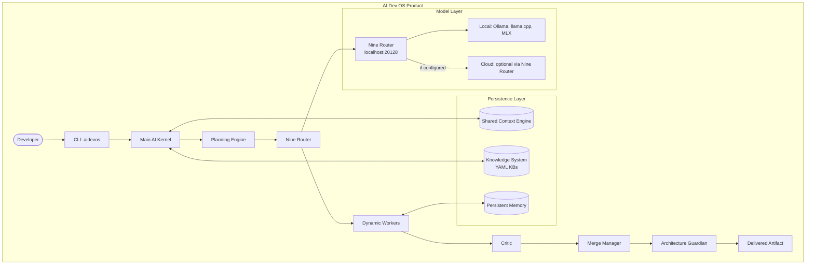

# Product Overview

> Comprehensive product description of AI Dev OS — the AI development operating system for multi-agent coding. This document is normative — implementations MUST satisfy every MUST clause below.

## Overview

AI Dev OS is an open-source development operating system that orchestrates multiple AI agents to solve complex software engineering tasks. Unlike single-model coding assistants (Cursor, Copilot) or end-to-end coding agents (Devin, SWE-agent), AI Dev OS is a **platform for running coordinated multi-agent systems** where specialised agents — the Kernel, Planner, Router, Researcher, Builder, Critic, Merger, Guardian, and Voice — collaborate through a deterministic loop to produce production-quality code.

The system is **local-first** (all state on your machine, cloud optional via Nine Router), **model-agnostic**, and **observability-built-in**. Everything flows through the [Shared Context Engine](./SHARED_CONTEXT_ENGINE.md); no hidden state exists. Every decision, every event, every artifact is recorded, traceable, and auditable.

## What AI Dev OS Solves

| Problem | How AI Dev OS Solves It |
|---------|------------------------|
| **Complex multi-step tasks** | The Planning Engine decomposes goals into a DAG of tasks executed in topological order |
| **Parallel agent coordination** | Multi-Agent Orchestration dispatches independent tasks to concurrent workers |
| **Knowledge persistence across sessions** | The Knowledge System (Main KB, Group KB, Individual KB, Global KB) preserves context |
| **Model selection complexity** | The Nine Router + Model Routing Policy pick the best model per role |
| **Quality and safety** | The Critic reviews all output; the Architecture Guardian enforces invariants before delivery |
| **Observability and debugging** | Every event is published to the SCE; traces, metrics, and logs follow OpenTelemetry |
| **Multi-provider flexibility** | Nine Router abstracts all model providers — local (Ollama, llama.cpp) and cloud (via Nine Router config) |
| **Vendor lock-in avoidance** | Model-agnostic policy means you can swap models per role without changing workflow |

## Key Features

| Feature | Description | Doc |
|---------|-------------|-----|
| **Main AI Kernel Loop** | Intake → Plan → Route → Execute → Critique → Merge → Guard → Deliver | [MAIN_AI_KERNEL.md](./MAIN_AI_KERNEL.md) |
| **Nine Router** | Model discovery, role assignment, fallback chains | [NINE_ROUTER.md](./NINE_ROUTER.md) |
| **Model Routing Policy** | Capability-first deterministic model selection | [MODEL_ROUTING_POLICY.md](./MODEL_ROUTING_POLICY.md) |
| **AI Groups** | Logical agent teams with shared context | [AI_GROUPS.md](./AI_GROUPS.md) |
| **Knowledge System** | Persistent YAML-based knowledge across runs | [KNOWLEDGE_SYSTEM.md](./KNOWLEDGE_SYSTEM.md) |
| **Research Engine** | Web search, retrieval, synthesis | [RESEARCH_ENGINE.md](./RESEARCH_ENGINE.md) |
| **Architecture Guardian** | Rule-based invariant enforcement | [ARCHITECTURE_GUARDIAN.md](./ARCHITECTURE_GUARDIAN.md) |
| **Merge Manager** | Concurrent edit reconciliation | [MERGE_MANAGER.md](./MERGE_MANAGER.md) |
| **Dynamic Workers** | On-demand agent workers per task | [DYNAMIC_WORKERS.md](./DYNAMIC_WORKERS.md) |
| **Shared Context Engine** | Central event bus and state projection | [SHARED_CONTEXT_ENGINE.md](./SHARED_CONTEXT_ENGINE.md) |
| **Cost Management** | Token and cost tracking per run | [COST_MANAGEMENT.md](./COST_MANAGEMENT.md) |
| **Observability** | OpenTelemetry metrics, traces, logs | [OBSERVABILITY.md](./OBSERVABILITY.md) |

## User Personas

| Persona | Use Case | Key Subsystems |
|---------|----------|----------------|
| **Solo developer** | Generate, refactor, review code autonomously | Kernel, Builder, Critic, Knowledge System |
| **Engineering team** | Parallel code generation, multi-file refactoring, code review | AI Groups, Merge Manager, Merger, Guardian |
| **Open source maintainer** | Automated PR triage, code review, documentation | Research Engine, Critic, Planning Engine |
| **Platform builder** | Building custom tools on top of AI Dev OS | Plugin SDK, MCP, Model Providers, Nine Router |

## Use Cases

| Use Case | Description |
|----------|-------------|
| Code generation | Translate feature specs into production code across multiple files |
| Refactoring | Structural code changes with consistent patterns across the codebase |
| Documentation | Generate, update, and maintain documentation from code analysis |
| Research | Investigate APIs, libraries, or domains; synthesise findings into plans |
| Code review | Multi-perspective review (Critic) + invariant enforcement (Guardian) |
| Debugging | Isolate root causes, propose fixes, validate with tests |
| CI automation | Automated PR review, test generation, changelog updates |

## Differentiation from Alternatives

| Dimension | AI Dev OS | Cursor / Copilot | Devin | SWE-agent |
|-----------|-----------|------------------|-------|-----------|
| Architecture | Multi-agent loop | Single-model chat | Single-agent sandbox | Single-agent CLI |
| Model flexibility | Any model per role (9 roles) | Vendor-locked (OpenAI) | Vendor-locked | OpenAI-only |
| Knowledge | YAML KB per scope (workspace, project, group, individual) | Project index only | Session-only | None |
| Observability | Full OTel traces, metrics, audit log | Minimal | Black box | Minimal |
| Multi-agent | Native (9 roles, AI Groups) | None | None | None |
| Governance | Guardian with declarative rules | None | None | None |
| Cost control | Per-role model selection, fallback chains | Single-model per session | Fixed | Single-model |
| Local-first | Yes (Ollama, llama.cpp, MLX) | No (cloud-only) | No (cloud-only) | No (cloud-only) |

## Architecture Philosophy

1. **Local-first**: The system runs entirely on your machine. Cloud models are optional and configured via Nine Router. All state is local unless explicitly synced.
2. **Nine Router as model gateway**: All model requests go through Nine Router (localhost:20128/v1). No direct provider API calls. Local providers are the default; cloud providers are configured inside Nine Router.
3. **Spec-before-code**: Every subsystem is documented before it is implemented. Documentation is normative — it defines the contracts AI agents reason about.
4. **Observability-built-in**: Metrics, traces, and logs are not retrofitted; they are emitted by every subsystem at every stage. The SCE is the single source of truth.
5. **No hidden state**: Every mutation flows through the SCE. There is no in-memory state that cannot be reconstructed from events.
6. **Replaceable subsystems**: Every subsystem has a defined interface. You can swap the Planner, change the Router, or replace the Guardian — as long as the interface contract is satisfied.
7. **Model-agnostic**: No model-specific optimisations in core code. Model-specific behaviour lives in Model Provider adapters.
8. **Versioned everything**: Policy documents, plans, graphs, and knowledge are versioned. Immutable snapshots enable reproducibility.

## Requirements

- **MUST** be consumable by both humans and AI agents.
- **MUST** publish every state change to the [Shared Context Engine](./SHARED_CONTEXT_ENGINE.md).
- **MUST** pass every rule enforced by the [Architecture Guardian](./ARCHITECTURE_GUARDIAN.md).
- **MUST** be observable through the metrics defined in [Observability](./OBSERVABILITY.md).
- **MUST** provide a Getting Started path that works without any cloud provider API key.
- **SHOULD** support the full loop with only local models (Ollama or llama.cpp).
- **SHOULD** support progressive disclosure — simple tasks should work with minimal configuration.
- **MAY** expose all functionality through both CLI and programmatic API.

## How the Loop Works End-to-End

```
User runs: aidevos run "Add input validation to the login form"

1. Intake:    Kernel receives goal, validates format, enriches with KB context
2. Plan:      Planning Engine decomposes into [Researcher→Builder→Critic→Merger]
3. Route:     Nine Router binds models to roles (local by default, cloud optional)
4. Execute:   Workers run tasks in parallel where possible
5. Critique:  Critic reviews each output; flags missing edge cases
6. Replan:    Kernel re-plans the rejected branch (max 5 attempts)
7. Merge:     Merge Manager reconciles concurrent file edits
8. Guard:     Architecture Guardian checks no secrets leaked, no hidden state
9. Deliver:   Kernel writes the validated changes to filesystem
```

## Architecture



## Deployment Options

| Mode | Description | Configuration |
|------|-------------|---------------|
| **Local only** | All models run locally via Ollama or llama.cpp | Default — no config needed |
| **Hybrid** | Cheap roles (Router, Guardian) use local; complex roles use cloud via Nine Router | Per-role policy in Nine Router |
| **Cloud only** | All models use cloud providers configured in Nine Router | Provider keys in Nine Router dashboard |
| **Team server** | Shared AI Dev OS instance on a LAN server | Multi-process deployment |
| **CI/CD** | Ephemeral runs in CI pipeline | Kubernetes / Docker |

## Security Model Highlights

- All agent communication happens through signed envelopes over the SCE.
- Credentials are never stored in agent memory; they are fetched from Secrets Management at call time.
- The Architecture Guardian enforces least-privilege tool access per worker.
- Every mutation is recorded in the immutable Audit Log.
- See [Security Model](./SECURITY_MODEL.md) and [Architecture Guardian](./ARCHITECTURE_GUARDIAN.md).

## Failure Modes

| Mode | Detection | Response |
|------|-----------|----------|
| No model available for a role | `policy.choose()` raises | Surface available models; suggest configuring a provider in Nine Router |
| Cycle in task graph | `plan.validate()` detects | Reject plan; surface cycle edges to operator |
| Critic rejection loop | Replan count > 5 | Mark run `failed`; escalate with full feedback history |
| Nine Router unavailable | Worker gets connection refused | Retry with backoff; surface setup instructions |
| Provider outage (via Nine Router) | Worker gets HTTP 503 | Nine Router falls back to next model in chain; emit alert |
| KB write conflict | Two agents write to same KB key | Last-writer-wins with audit trail; emit warning |
| Guardian storm | ≥3 vetoes in 10s | Freeze non-critical routes; alert operator |

## Roadmap

See [Implementation Roadmap](./IMPLEMENTATION_ROADMAP.md) for the detailed delivery timeline.

## Acceptance Criteria

- A fresh install with Ollama running and `aidevos run "hello world"` produces output without any cloud configuration.
- Assigning 9 different models across the 9 roles is possible through the CLI in under 5 commands.
- A run with 3 independent tasks completes in less time than the sum of the 3 individual task times (parallelism verified).
- Disconnecting the network mid-run causes a graceful degradation: tasks with cloud models fail over to local fallbacks.

## Related Documents

- [Project Vision](./PROJECT_VISION.md) — long-term vision
- [PRD](./PRD.md) — product requirements
- [System Overview](./SYSTEM_OVERVIEW.md) — architecture deep-dive
- [Getting Started](./GETTING_STARTED.md) — how to start using AI Dev OS
- [Installation](./INSTALLATION.md) — local setup
- [CLI](./CLI.md) — command-line interface reference
- [Main AI Kernel](./MAIN_AI_KERNEL.md) — the core loop
- [Implementation Roadmap](./IMPLEMENTATION_ROADMAP.md) — planned features
