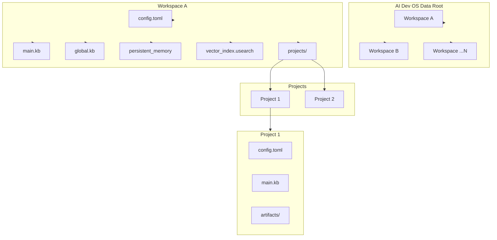
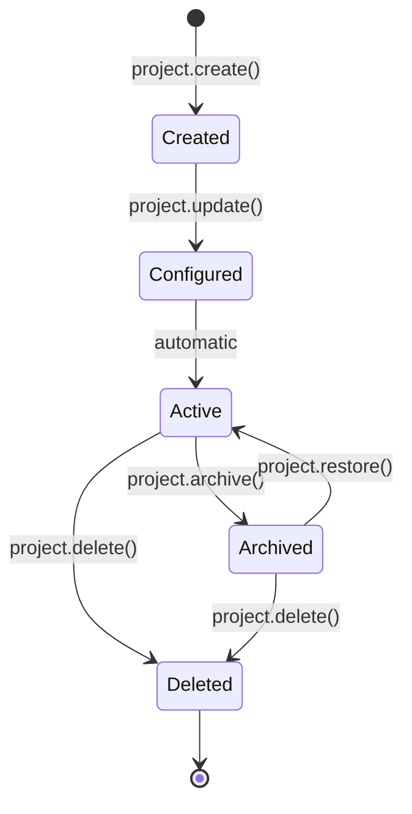

# Project OS

> **Domain:** Workspace & Project Management
> **Applies to:** Kernel, CLI, Persistent Memory
> **Last updated:** 2026-07-22

## Overview

AI Dev OS organizes all work into a two-level hierarchy: **workspaces** (isolated tenants) and **projects** (sub-units within a workspace). This model provides strong isolation between unrelated contexts while allowing controlled sharing within a workspace.

```
ai-dev-os data
  └── ~/.aidevos/data/
       ├── <workspace_id>/
       │   ├── config.toml
       │   ├── main.kb/          # Main Knowledge Base (SQLite)
       │   ├── global.kb/        # Global Knowledge Base (cross-project)
       │   ├── persistent_memory/
       │   ├── vector_index.usearch
       │   └── projects/
       │       ├── <project_id>/
       │       │   ├── config.toml
       │       │   ├── main.kb/  # Project-level Main KB
       │       │   └── artifacts/
       │       └── ...
       └── ...
```

## Workspace Model

A **workspace** is the top-level isolation boundary:

- **Filesystem:** `~/.aidevos/data/<workspace_id>/` — encrypted at rest with a workspace-specific key.
- **Process:** Each workspace runs in a dedicated backend process with its own SCE event bus, agent pool, and memory stores.
- **Identity:** Workspaces have their own Ed25519 identity key used for inter-workspace communications (opt-in).
- **Resources:** Memory limits, CPU quotas, and disk caps are configured per workspace.

A workspace cannot access another workspace's data unless cross-workspace sharing is explicitly enabled via the Global KB bridge.

## Project Model

A **project** is a sub-unit within a workspace:

- **Filesystem:** `~/.aidevos/data/<workspace_id>/projects/<project_id>/`
- **Knowledge base:** Every project has its own **Main KB** (SQLite FTS5-backed knowledge store). See [Knowledge System](KNOWLEDGE_SYSTEM.md).
- **Agent scope:** Agents spawned within a project can read/write that project's Main KB by default.
- **Artifacts:** Build outputs, logs, and generated files live under `artifacts/`.

## Workspace Lifecycle

```
Created ──► Configured ──► Active ──► Deleted
                │                        ▲
                └──► Archived ───────────┘
```

| Stage | Trigger | Effect |
|-------|---------|--------|
| **Create** | `workspace.create(name)` | Generates identity key, provisions encrypted directory, initializes Main KB and Global KB. |
| **Configure** | `workspace.update(id, config)` | Sets resource limits, model provider bindings, agent pool size. |
| **Active** | Automatic after create | Backend process starts, agents available. |
| **Archive** | `workspace.archive(id)` | Backend process stops, data remains on disk, key is sealed. |
| **Delete** | `workspace.delete(id)` | Data directory is zeroed and removed. **Irreversible.** |

## Project Lifecycle

```
Created ──► Active ──► Archived ──► Deleted
```

| Stage | Trigger | Effect |
|-------|---------|--------|
| **Create** | `project.create(workspace_id, name)` | Creates project directory, initializes project-level Main KB. |
| **Active** | Automatic | Agents can be dispatched to this project. |
| **Archive** | `project.archive(workspace_id, project_id)` | KB is compacted and frozen. No new agent work. |
| **Delete** | `project.delete(workspace_id, project_id)` | Project data is removed. Archives are preserved if they were exported. |

## Cross-Project References

Projects within the same workspace can opt in to sharing knowledge:

1. A project publishes a fact to the **Global KB** via `kb.publish(namespace, key, value)`.
2. Other projects subscribe via `kb.subscribe(namespace, key_pattern)`.
3. The Global KB is stored at the workspace level (`~/.aidevos/data/<ws_id>/global.kb/`).
4. Cross-project references are **not automatic** — agents must explicitly publish and subscribe.

## Multi-Workspace Considerations

- **Data isolation:** Workspaces are fully isolated at the filesystem and process level.
- **Cross-workspace bridging:** Must be explicitly configured via the Global KB bridge (requires workspace admin approval on both sides).
- **Resource contention:** The Kernel enforces per-workspace CPU/memory quotas to prevent noisy-neighbor issues.
- **Model provider sharing:** API keys can be shared across workspaces via the Secrets Vault with workspace-scoped access policies.

## Interfaces

### Workspace Operations

| Interface | Description |
|-----------|-------------|
| `workspace.create(name, config?)` | Creates a new workspace. Returns `WorkspaceId`. |
| `workspace.list()` | Lists all workspaces with metadata. |
| `workspace.get(id)` | Returns workspace config and status. |
| `workspace.update(id, config)` | Updates workspace configuration. |
| `workspace.archive(id)` | Archives a workspace (stops processes, seals data). |
| `workspace.delete(id)` | Permanently deletes a workspace. |
| `workspace.stats(id)` | Returns resource usage statistics. |

### Project Operations

| Interface | Description |
|-----------|-------------|
| `project.create(workspace_id, name)` | Creates a new project. Returns `ProjectId`. |
| `project.list(workspace_id)` | Lists projects in a workspace. |
| `project.get(workspace_id, project_id)` | Returns project metadata. |
| `project.archive(workspace_id, project_id)` | Archives a project (freezes KB). |
| `project.delete(workspace_id, project_id)` | Permanently deletes a project. |

## Related Documents

| Document | Description |
|----------|-------------|
| [Folder Structures](FOLDER_STRUCTURES.md) | Complete filesystem layout reference |
| [Configuration](CONFIGURATION.md) | Workspace and project configuration schema |
| [Knowledge System](KNOWLEDGE_SYSTEM.md) | Main KB, Global KB architecture |
| [Backend](BACKEND.md) | Workspace process architecture |
| [Security](SECURITY.md) | Workspace isolation and encryption |

## Project Structure Diagram



## Filesystem Organization Principles

| Principle | Description | Rationale |
|---|---|---|
| **Encapsulation** | Every workspace owns its directory tree; no cross-workspace filesystem access | Security isolation |
| **Lazy creation** | Directories created on first use, not at init | Minimizes disk usage for unused features |
| **Self-describing** | Every directory contains a `.metadata` or `config.toml` with schema version | Enables future migrations |
| **Disposable caches** | `cache/` directories are safe to delete without data loss | Operational simplicity |
| **Immutable artifacts** | `artifacts/` files are write-once; never modified in place | Audit trail, reproducibility |

## Naming Convention Catalog

| Entity | Convention | Example | Regex |
|---|---|---|---|
| Workspace ID | `ws_<uuid_short>` | `ws_a1b2c3d4` | `^ws_[a-z0-9]{8}$` |
| Project ID | `proj_<uuid_short>` | `proj_e5f6g7h8` | `^proj_[a-z0-9]{8}$` |
| KB namespace | `<module>.<submodule>` | `facts.code.review` | `^[a-z]+(\.[a-z]+)*$` |
| Config keys | `lowercase_with_underscores` | `memory.backend` | `^[a-z_]+(\.[a-z_]+)*$` |
| Artifact files | `<type>_<timestamp>.<ext>` | `build_20260722_1430.tar.gz` | `^[a-z]+_\d{8}_\d{4}\.\w+$` |
| Session IDs | `ses_<nanoid>` | `ses_V1StGXR8_Z5jdHi6B-myT` | `^ses_[A-Za-z0-9_\-]{21}$` |

## Cross-Project Dependency Management

Projects within a workspace share knowledge through the **Global KB**. Explicit dependency declaration is required:

```toml
# project/config.toml
[dependencies]
shared_libs = ["core_types", "agent_sdk"]
publish_facts = ["module.x.interface"]
subscribe_facts = ["module.y.events"]
```

| Mechanism | Description | Scope |
|---|---|---|
| Global KB | Cross-project fact/entity sharing | Workspace |
| Symlinked artifacts | Read-only access to another project's `artifacts/` | Workspace (opt-in) |
| Shared schemas | JSON Schema files in `~/.aidevos/schemas/` | Global |
| Version pins | Explicit dependency on `other_project@v1.2.0` | Per-project |

## Shared Library Strategy

Libraries shared across projects live in the **Global KB** or as published crates:

1. **Trivial reuse** (< 50 LOC) → Inline or copy.
2. **Moderate reuse** (50–500 LOC) → Extract to `shared/` within the workspace.
3. **Heavy reuse** (> 500 LOC) → Publish as standalone crate; import via `Cargo.toml`.
4. **Inter-project types** → Define in `schemas/` as JSON Schema; generate bindings.

## Version Alignment Policy

| Component | Version Source | Alignment Strategy |
|---|---|---|
| Workspace data format | Schema version in `config.toml` | Auto-migrated on first access |
| KB schema | `main.kb/.schema_version` | Must match binary's expected version |
| Shared libraries | `Cargo.toml` workspace deps | Single version per workspace |
| Plugins | `plugins/index.json` | N-2 compatibility with kernel |
| CLI binary | Release tag | Must be same version as running kernel |

## Project Lifecycle (Detailed)



| Transition | Action | Validation |
|---|---|---|
| Create → Configured | Set name, tags, resource limits | Name unique; limits within workspace quota |
| Configured → Active | KB initialized; agent pool ready | KB responds to queries |
| Active → Archived | KB compacted; processes stopped | No running agents; KB frozen |
| Archived → Active | KB thawed; processes restarted | KB integrity verified |
| Active/Archived → Deleted | Data zeroed and removed | Confirm prompt; double auth |

## Template Usage Guide

| Template | Location | When to Use |
|---|---|---|
| Project scaffold | `templates/project/` | `project.create()` with `--template` flag |
| ADR template | `templates/ADR.md` | Architecture decisions during project setup |
| Issue template | `templates/issue-template.md` | Bug/feature tracking in GitHub |
| Config template | `templates/config.toml` | New workspace initialization |
| Migration script | `templates/migration.py` | Schema or data format changes |

## Documentation Requirements Per Project Type

| Project Type | Required Docs | Optional Docs | Review Cadence |
|---|---|---|---|
| **Core library** | README, API reference, CHANGELOG | ADRs, Design doc | Per PR |
| **CLI tool** | README, CLI reference, INSTALLATION | Tutorial, Quickstart | Per minor release |
| **Plugin** | README, API reference, manifest | Example, Migration guide | Per version bump |
| **Infrastructure** | README, Runbook, Architecture diagram | ADRs, Postmortems | Per change |
| **Knowledge base** | Schema doc, Query guide | Performance tuning | Per data model change |

## CI/CD Per Project Type

| Project Type | CI Triggers | CD Target | Quality Gates |
|---|---|---|---|
| Core library | PR, push to main | Crates.io | Lint, test, coverage ≥ 80%, security audit |
| CLI tool | PR, push to main | GitHub Releases | Lint, test, smoke test, binary size check |
| Plugin | PR, push to main | Plugin registry | Lint, test, compatibility check |
| Infrastructure | PR to infra/ | Staging → Production | Terraform plan review, dry-run |
| Knowledge base | PR to kb/ | Auto-deploy | Schema validation, link check |

## Failure Modes

| Failure Mode | Description | Indicators | Mitigation | Recovery |
|---|---|---|---|---|
| **Workspace directory corruption** | Filesystem-level damage to workspace tree | IO errors; config parse failure | Regular backups; RAID/ZFS | Restore from backup; run fsck |
| **Cross-project reference deadlock** | Circular dependency between projects | Hanging KB queries; stack overflow | Detect cycles at publish time | Break cycle by removing one dep |
| **Orphaned project data** | Project deleted but artifacts remain on disk | Disk usage grows; cleanup script reports orphans | Journal deletions; GC crawler | Manual cleanup; add to GC policy |
| **KB schema drift** | Project KB schema incompatible with kernel | Migration fails; `doctor` reports mismatch | Version pins; migration tests | Rebuild KB from facts |
| **Resource quota exhaustion** | Workspace hits CPU/memory limit | Agent OOM; slow responses | Quota enforcement; monitoring | Increase quota or reduce agent count |
| **Sealed vault data loss** | Workspace key lost after archive | `workspace.restore()` fails | Key escrow for admin recovery | Re-import from backup with new key |

## Project OS Observability Metrics

| Metric | Source | Alert Threshold | Description |
|---|---|---|---|
| `projectos.workspace.count` | Workspace registry | — | Total active workspaces |
| `projectos.project.count_per_workspace` | Per-workspace index | > 100 | Projects per workspace (scaling concern) |
| `projectos.kb.query_latency_ms` | KB query timer | P99 > 500ms | Knowledge base query latency |
| `projectos.disk.usage_bytes` | Filesystem stat | > 90% of quota | Workspace data directory usage |
| `projectos.gc.orphan_count` | Garbage collector | > 10 | Orphaned project artifacts detected |
| `projectos.migration.failure_rate` | Migration tracker | > 0% | Schema migration failure rate |

## Project OS Acceptance Criteria

- [ ] Workspace create/read/update/archive/delete all functional
- [ ] Project create/read/archive/delete all functional
- [ ] Global KB publish/subscribe works across projects
- [ ] Naming convention validation enforces all patterns
- [ ] CI/CD pipeline defined for each project type
- [ ] Documentation requirements checked in CI
- [ ] Workspace isolation verified (no cross-workspace data access)
- [ ] Quota enforcement prevents resource exhaustion
- [ ] Backup/restore cycle tested end-to-end
- [ ] Schema migration runs without error on version change
- [ ] Orphan detection and cleanup verified
- [ ] Security isolation boundaries penetration-tested
