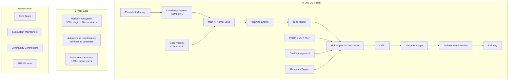

# Project Vision

> Long-term vision for AI Dev OS: "The operating system for AI-assisted software development." This document is normative — implementations MUST satisfy every MUST clause below.

## Vision Statement

**AI Dev OS will be the operating system for AI-assisted software development — the default environment where developers and AI agents collaborate to build, maintain, and evolve software.**

Just as operating systems abstract hardware and manage processes, AI Dev OS abstracts models and manages agents. It provides process isolation (AI Groups), scheduling (Planning Engine), resource allocation (Nine Router), inter-process communication (Shared Context Engine), security (Architecture Guardian), and observability — all for AI agents. Developers interact with the system through a Kernel loop, not through individual chat threads.

## Vision Pillars

| Pillar | Description |
|--------|-------------|
| **Autonomous multi-agent coordination** | Agents work in parallel, communicate through the SCE, and self-correct via the Critic and Guardian |
| **Persistent organisational memory** | Knowledge survives across sessions through versioned, scoped knowledge bases |
| **Local-first with cloud optional** | Everything runs locally by default; cloud models and storage are opt-in and pluggable |
| **Model-agnostic** | No lock-in to any provider or model family. The Policy engine picks the best model per role |
| **Extensible platform** | Plugin SDK, MCP, custom providers, and custom Guardian rules enable third-party extensions |
| **Spec-before-code** | Documentation is the source of truth. AI agents reason from normative docs, not code |
| **Observability by default** | Every event is traced, every metric is collected, every decision is auditable |

## 5-Year Vision

| Horizon | Goal | Success Indicator |
|---------|------|-------------------|
| **Year 1** | Core kernel loop operational with all 9 roles; local-first with Ollama/llama.cpp support | 500 GitHub stars; 10 active contributors |
| **Year 2** | AI Groups with cross-group communication; Knowledge System with all 4 KB tiers; MCP integration | 5,000 GitHub stars; 50 contributors; 3 production deployments |
| **Year 3** | Autonomous codebase maintenance: the system independently identifies tech debt, experiments with fixes, and proposes PRs | 20,000 GitHub stars; 200 contributors |
| **Year 4** | Self-improving documentation: AI Dev OS writes its own documentation updates as the codebase evolves | 50,000 GitHub stars; 5 reference deployments at major companies |
| **Year 5** | Default development environment for teams: AI Dev OS ships as the primary interface for software development | Mainstream adoption; ecosystem of plugins and providers |

## Target Audience

1. **Individual developers** who want to multiply their output with AI without losing control over the process.
2. **Engineering teams** who need consistent AI-assisted code generation, review, and maintenance workflows across the team.
3. **Open source maintainers** who want automated PR review, documentation, and issue triage.
4. **Platform builders** who want to build custom AI coding tools on top of an open, extensible platform.

## Success Metrics

| Metric | Year 1 Target | Year 5 Target |
|--------|---------------|---------------|
| Active users (monthly) | 500 | 100,000 |
| Runs completed | 10,000/month | 10,000,000/month |
| Average run success rate | > 80% | > 95% |
| Time to first PR | < 5 min | < 30s |
| Plugin ecosystem | 10 plugins | 500+ plugins |
| Supported model providers | 6 (OpenAI, Anthropic, Google, Mistral, Ollama, llama.cpp) | 20+ |
| Community contributors | 10 | 500+ |

## Competitive Landscape

| Competitor | Strength | AI Dev OS Advantage |
|------------|----------|---------------------|
| **Cursor** | Polished IDE integration, good single-model chat | Multi-agent orchestration, model flexibility, governance |
| **GitHub Copilot** | Deep IDE integration, large user base | Autonomous multi-step tasks, not just autocomplete |
| **Devin** | End-to-end autonomous coding agent | Transparent multi-agent process, observability, local-first |
| **SWE-agent** | Strong benchmark performance on SWE-bench | Multi-agent, knowledge persistence, extensibility |
| **OpenHands (OpenDevin)** | Open-source agent framework | Full OS for agents (routing, memory, governance, observability) |
| **Cline / Claude Code** | Great CLI experience, simple agent loop | Multi-agent parallel execution, deterministic planning, Guardian safety |

## Risks and Mitigations

| Risk | Likelihood | Impact | Mitigation |
|------|-----------|--------|------------|
| LLM provider API changes break workflows | High | High | Model-agnostic architecture; Policy selects alternatives automatically via fallback chains |
| Agent reliability (hallucination, inconsistency) | Medium | High | Critic reviews all output; Guardian enforces invariants; both catch failures before delivery |
| User adoption (complexity of multi-agent setup) | Medium | Medium | CLI-first onboarding; progressive disclosure — single-agent mode for beginners |
| Competition from well-funded startups | Medium | Medium | Open-source community; focus on local-first and privacy as differentiators |
| Cost of running multiple agents | Medium | Medium | Cost Management budgets; local models for cheap roles (Router, Guardian); fallback chains with cost ordering |
| Security (agent escapes, prompt injection) | Low | Critical | Guardian rules, least-privilege tools, signed envelopes, audit log |

## Vision-Guided Requirements

The following requirements derive directly from the vision statement. Every subsystem MUST align with these principles.

- **MUST** preserve local-first operation: no mandatory cloud dependency at any layer.
- **MUST** support hot-swapping any model provider without changing subsystem code.
- **MUST** publish every state change to the SCE — no hidden state is acceptable.
- **MUST** provide a complete observability story: metrics, traces, and logs from every subsystem.
- **MUST** document every subsystem with the same normative style before implementation.
- **SHOULD** support third-party extensions through the Plugin SDK without requiring core changes.
- **SHOULD** degrade gracefully under provider outages rather than failing hard.
- **MAY** offer cloud sync as an optional add-on for team deployments.

## Key Initiatives by Year

### Year 1: Foundation
- Complete the 8-stage Kernel loop with all 9 roles
- Local model support: Ollama, llama.cpp, MLX
- Cloud model support: OpenAI, Anthropic, Google, Mistral
- CLI with full command suite (`aidevos run`, `aidevos models`, `aidevos router`, `aidevos kb`)
- Knowledge System with Main KB and Group KB
- Shared Context Engine with event persistence
- Architecture Guardian with 14 built-in rules

### Year 2: Teams
- AI Groups with cross-group communication and shared context
- All 4 KB tiers (Main, Group, Individual, Global)
- MCP integration for external tools
- Multi-process deployment mode
- Merge Manager with concurrent edit reconciliation
- Cost Management with per-run budgets and alerts
- Obsidian Graph Engine for knowledge visualisation

### Year 3: Autonomy
- Autonomous tech debt identification and fix proposal
- Self-healing codebase: the system detects regressions and reverts
- Research Engine with multi-source synthesis
- Plugin SDK first stable release
- Custom Guardian rules without core changes
- Local model fine-tuning based on project patterns

### Year 4: Self-Improvement
- Self-improving documentation: AI Dev OS writes its own doc updates
- Proactive refactoring suggestions based on codebase analysis
- Cross-project knowledge sharing through Global KB
- Voice interface for hands-free interaction
- Performance optimisation: sub-second routing decisions

### Year 5: Mainstream
- Default development environment for teams
- 500+ plugin ecosystem
- 20+ supported model providers
- Autonomous PR review and merge for routine changes
- Enterprise features: SSO, audit compliance, RBAC

## Governance Model

AI Dev OS follows an open governance model:

- **Core team**: Maintains the Kernel loop, SCE, Nine Router, and Architecture Guardian.
- **Subsystem maintainers**: Responsible for individual subsystem docs and interfaces.
- **Community contributors**: Submit plugins, adapters, and documentation via PR.
- **Decision-making**: Architecture decisions are recorded as ADRs and ratified by the core team.

All governance policies are documented in [CONTRIBUTING.md](./CONTRIBUTING.md).

## Interfaces

```
vision.get_statement() → string                         // returns vision statement
vision.get_pillars() → Pillar[]                          // returns vision pillars
vision.get_initiatives(year: int) → Initiative[]         // returns initiatives by year
vision.get_metrics() → Metric[]                          // returns success metrics
vision.validate_alignment(subsystem: string) → AlignmentResult  // checks alignment
```

`AlignmentResult` indicates whether a subsystem's requirements align with the vision pillars:

```
AlignmentResult {
  subsystem:    string
  aligned:      boolean
  violations:   AlignmentViolation[]  // pillars the subsystem conflicts with
  suggestions:  string[]               // how to resolve
}
```

## Failure Modes

| Mode | Detection | Response |
|------|-----------|----------|
| Vision drift (subsystem violates a pillar) | `vision.validate_alignment()` returns violations | Surface violations to operator; require ADR to justify departure |
| Community fragmentation | Multiple incompatible forks | Core team publishes reference implementation; promote standard interfaces |
| Vendor capture (single provider dominance) | > 80% of runs use one provider | Policy should prefer alternatives; surface vendor concentration metric |
| Feature bloat | Subsystems accumulate non-goal features | PRD/TRD governance; Guardian rejects out-of-scope changes |
| Obsolescence (new paradigm makes loop obsolete) | Industry shifts away from agent-loop architecture | Architecture is replaceable by design; pivot loop without rewriting subsystems |

## Security Considerations

- The vision document itself is public; implementation details that could aid attackers belong in subsystem docs.
- Alignment validation is advisory, not enforced — forcing alignment could stifle innovation.
- Vendor lock-in is both a business risk and a security risk; the model-agnostic pillar addresses both.
- See [Security Model](./SECURITY_MODEL.md) and [AI Safety](./AI_SAFETY.md).

## Observability

| Metric | Labels | Description |
|--------|--------|-------------|
| `vision_alignment_violations` | `pillar` | Subsystems misaligned with vision pillars |
| `vision_initiative_progress` | `year`, `initiative` | Progress toward yearly initiatives |
| `vision_vendor_concentration` | `provider` | Percentage of runs per provider |
| `vision_adoption_total` | — | Active users (anonymised count) |

## Acceptance Criteria

- `vision.validate_alignment("Architecture Guardian")` returns `aligned: true` (it enforces specs, which aligns with spec-before-code).
- A new subsystem that depends on a specific cloud provider triggers an alignment violation on the local-first pillar.
- The Year 1 initiatives are achievable with only local models and one cloud provider.
- All 7 vision pillars are referenced by at least one requirement in the subsystem that implements them.

## Open Questions

- Whether AI Dev OS should eventually provide its own IDE plugin (like Cursor) or remain CLI-first — tracked in [templates/ADR](../templates/ADR.md).
- Whether the 5-year goal of "default development environment" implies packaging as a desktop application.
- How to measure "codebase health" for the autonomous maintenance initiative.

## Architecture



## Related Documents

- [Product Overview](./PRODUCT_OVERVIEW.md) — current product description
- [PRD](./PRD.md) — product requirements that implement the vision
- [Implementation Roadmap](./IMPLEMENTATION_ROADMAP.md) — phased delivery plan
- [System Overview](./SYSTEM_OVERVIEW.md) — architecture context
- [AI Coding Rules](./AI_CODING_RULES.md) — rules that govern AI contributions
- [Roadmap](./ROADMAP.md) — detailed milestone timeline
