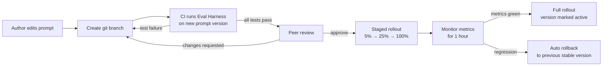

# Prompt Governance

> Version-controlled review, approval, and rollout process for every prompt in AI Dev OS — ensuring prompt changes are auditable, reversible, and measurable. This document is normative — implementations MUST satisfy every MUST clause below.

## Overview

Prompt Governance is the quality-control layer for prompt engineering in AI Dev OS. Every prompt — Master, Kernel, Planner, Router, Critic, Researcher, Agent — is a versioned, diffable, reviewable document. Changes follow a defined workflow: propose → review → approve → rollout → monitor → rollback-on-regression.

The governance process applies to all prompts under `prompts/` and any prompt template referenced by a subsystem spec. It does **not** apply to user-supplied prompts in the goal text or to dynamic prompt fragments generated at runtime by the Planning Engine.

## Goals

- Every prompt change is reviewed and diffed like code (PR + approval + CI).
- A/B testing hooks allow operators to compare prompt versions against acceptance criteria before full rollout.
- Automatic rollback on regression: if a key metric degrades after a prompt change, the previous prompt version is re-applied within one evaluation interval.
- Complete audit trail: who changed what prompt, when, why, and what the effect was.
- Prompt changes are decoupled from code releases — prompts can be updated without restarting the server.

## Non-Goals

- Prompt generation or optimisation — use the Research Engine and Eval Harness for that.
- User goal content — user goals are not subject to this governance.
- Dynamic runtime prompt assembly — that is the responsibility of the Agent Lifecycle and Context Window Management.
- Implementation code — this repo is documentation-only ([AI Coding Rules](./AI_CODING_RULES.md)).

## Prompt Registry

All prompts under governance are registered in a PromptRegistry with the following schema:

```yaml
prompt_id: "master/v0"
path: "prompts/MASTER_PROMPT.md"
version: "0.1.0"
status: "active"          # draft | active | deprecated | rolled_back
checksum: "sha256:abc123"
approved_by: "reviewer@"
approved_at: "2026-07-22T12:00:00Z"
rollout_percentage: 100   # 0-100; used for staged rollout
```

The registry is stored in `~/.aidevos/prompt-registry.yaml` and is loaded at Kernel startup. Prompts are read from disk at every evaluation (not cached in memory beyond the current TTL) so that a file-save takes effect without a restart.

## Versioning Scheme

Prompts follow semantic versioning:

```
MAJOR.MINOR.PATCH
```

- **MAJOR**: Breaking change to the prompt's output contract (different response format, removed section, changed role definition). Resets A/B test history.
- **MINOR**: Non-breaking addition (new section, new example, clarified instruction). Compatible with existing evaluations.
- **PATCH**: Typo fix, formatting, minor rewording. No behavioural change expected.

Version numbers are stored in the YAML front matter of each prompt file:

```yaml
---
prompt_id: master/v0
version: 0.1.0
description: "Master system prompt v0"
author: "kernel-team"
last_reviewed: "2026-07-22"
---
```

## Change Workflow



### Stage Gates

| Gate | Check | Who |
|------|-------|-----|
| **Format** | YAML front matter valid? Version bumped? Required sections present? | CI (automated) |
| **Eval** | Does the new prompt pass the Eval Harness on the default prompt suite? | CI (automated) |
| **Diff** | Is the diff human-reviewable (no massive rewrites)? | Reviewer |
| **Impact** | Does the change affect the prompt contract (MAJOR version)? | Reviewer |
| **Rollout** | Is the rollout plan documented in the PR description? | Author |

## A/B Testing

Prompt changes can be rolled out incrementally using a percentage-based routing:

```
prompt.resolve("master") → {
  version: "0.2.0-rc.1"   # 5% of requests
  version: "0.1.0"        # 95% of requests
}
```

The A/B split is deterministic per `correlation_id` so that a single run always sees a consistent prompt version across all its agent invocations.

### Metrics Compared

| Metric | Degradation threshold | Action |
|--------|----------------------|--------|
| Eval Harness pass rate | +5% fail rate | Rollback |
| Run success rate | +2% fail rate | Rollback |
| Average tokens per completion | +20% | Warn (cost impact) |
| Guardian veto rate | +1% | Rollback |
| User feedback score (thumbs down) | +5% | Rollback |

## Rollback Procedure

When a regression is detected during staged rollout:

1. The Governance subsystem publishes `prompt.rollback` on the SCE.
2. The PromptRegistry switches to the previous stable version for all new requests.
3. The previous version's checksum is verified.
4. In-flight runs using the RC version continue to completion; new runs use the stable version.
5. A notification is sent to the prompt author and the Kernel team.

Automatic rollback is the default. Operators can override by setting `rollout.auto_rollback = false` in the A/B test config and handling rollback manually.

## Architecture

```mermaid
flowchart TB
  subgraph Authoring
    EDIT[Author edits prompt file]
    PR[Creates PR + prompt change doc]
  end

  EDIT --> PR
  PR --> CI[CI: lint, eval, diff]
  CI --> APPROVE[Approval gate]

  APPROVE --> REG[PromptRegistry updated]
  REG --> ROUTER[Prompt Router\nresolves(role, version?)]
  ROUTER --> KERNEL[Main AI Kernel\ninjects prompt into context]

  subgraph Runtime
    AGENT[Agent receives prompt]
    AGENT --> RESULT[Result + metrics]
    RESULT --> EVAL_MON[Eval Harness + Metrics Monitor]
  end

  EVAL_MON -->|regression| ROLLBACK[Auto-rollback]
  ROLLBACK --> REG
```

## Interfaces

```
governance.prompts() → PromptMeta[]                    # all registered prompts
governance.get(prompt_id, version?) → string           # resolve prompt text
governance.diff(prompt_id, from_ver, to_ver) → Diff    # structured diff
governance.rollout(prompt_id, version, percentage)     # staged rollout
governance.rollback(prompt_id, reason?)                 # manual rollback
governance.status(prompt_id) → RolloutStatus           # current rollout state
governance.history(prompt_id) → ChangeEvent[]          # audit trail
```

## Configuration

```
[AIDEVOS_PROMPT_GOVERNANCE]
registry_path = "~/.aidevos/prompt-registry.yaml"
auto_rollback = true
rollout_steps = [5, 25, 50, 100]            # percentages for staged rollout
monitor_duration_min = 60                     # how long to monitor before progressing
rollback_alert_channel = "slack:#prompts"     # notification channel
```

## Failure Modes

| Mode | Detection | Response |
|------|-----------|----------|
| Registry file corrupt | YAML parse error | Rebuild from last known-good git state; log CRITICAL |
| Prompt file missing | File not found at resolve time | Use last cached version; log ERROR; escalate |
| Eval Harness timeout | > 30s per evaluation | Skip eval gate; require manual approval with justification |
| Staged rollout stuck | Percentage unchanged > 24h | Notify owner: "Rollout stalled at <percentage>%" |
| Rollback loop | ≥ 3 rollbacks within 1 hour | Lock prompt to stable version; require core-team manual override |
| In-flight run uses wrong version | Resolved version changes mid-run | Snapshot semantics: version is pinned at run start; mid-run change does not affect in-flight agents |

## Security Considerations

- The PromptRegistry is a local file. In multi-tenant deployments, it SHOULD be readable only by the Kernel process.
- Prompt text can contain injection-surface. All prompt content is validated by the Eval Harness to reject prompt-injection vectors before approval.
- The rollback mechanism cannot be triggered by a non-admin agent. Only the Governance subsystem or an operator can initiate a rollback.
- ACK from the Governance subsystem is required before the Kernel switches to a new prompt version for new runs.

## Acceptance Criteria

- Changing a single word in `prompts/SYSTEM_PROMPT.md`, committing, and pushing triggers a CI evaluation that runs the full default prompt suite before the change can be deployed.
- Setting `rollout_percentage = 5` for a new prompt version results in exactly 5% of new runs using the new version (measurable over 200 runs).
- Introducing a intentional regression in a prompt (e.g. remove a safety instruction) causes the Eval Harness to fail and the auto-rollback to trigger within 1 hour.
- The SCE receives a `prompt.rollback` event with `{prompt_id, from_version, to_version, reason}` when a rollback occurs.
- `governance.history("master")` returns a chronologically ordered list of every change with version, author, and timestamp.

## Related Documents

- [Master Prompt](./MASTER_PROMPT.md) — the canonical prompt spec
- [Eval Harness](./EVAL_HARNESS.md) — prompt testing framework
- [Metrics](./METRICS.md) — metrics compared during A/B testing
- [Implementation Roadmap](./IMPLEMENTATION_ROADMAP.md) — prompt governance phased rollout
- [System Overview](./SYSTEM_OVERVIEW.md)
- [AI Coding Rules](./AI_CODING_RULES.md)
