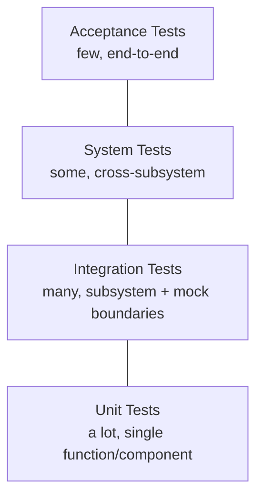

# QA Plan

> Quality assurance plan for AI Dev OS — test strategy, environment matrix, release gates, and quality metrics that ensure every release is reliable, secure, and performant. This document is normative — implementations MUST satisfy every MUST clause below.

## Overview

The QA plan defines the quality gates and testing activities that every AI Dev OS release must pass. Quality is integrated into the CI/CD pipeline (see [CI/CD](./CICD.md)) and enforced by the [Architecture Guardian](./ARCHITECTURE_GUARDIAN.md) as a release gate. Every change—documentation, prompt, configuration, or code—MUST pass the appropriate QA gates before merging.

QA activities span five levels: **unit**, **integration**, **system**, **acceptance**, and **release**.

## Goals

- Every commit passes automated unit + integration + acceptance tests before merging.
- Every release candidate passes the full QA suite (system tests, benchmarks, security scan, compliance check).
- QA gates are documented, automated, and measured — no manual sign-off is required for standard changes.
- Regression are caught before they reach a release — the benchmark suite detects performance degradation automatically.

## Non-Goals

- Model output quality evaluation — that is the domain of the [Eval Harness](./EVAL_HARNESS.md).
- Performance benchmarking methodology — covered in [Benchmarks](./BENCHMARKS.md).
- Implementation code — this repo is documentation-only ([AI Coding Rules](./AI_CODING_RULES.md)).

## Test Pyramid

### Unit Tests

| Aspect | Detail |
|--------|--------|
| Scope | Single function, component, or subsystem boundary |
| Dependencies | Mocked / stubbed |
| Location | `tests/unit/<subsystem>/` |
| Coverage target | ≥ 80% line coverage for all subsystems |
| CI trigger | Every commit to any branch |
| Runner | `aidevos test --unit` or language-native runner (Vitest, pytest) |
| Timeout | 30 seconds total |

### Integration Tests

| Aspect | Detail |
|--------|--------|
| Scope | Two or more subsystems interacting through their documented interfaces |
| Dependencies | Real implementations (SQLite, in-memory SCE), but no external network |
| Location | `tests/integration/<scenario>/` |
| CI trigger | Every commit to `main` or release branch |
| Runner | `aidevos test --integration` |
| Timeout | 5 minutes total |

### System Tests

| Aspect | Detail |
|--------|--------|
| Scope | End-to-end workflows: full Kernel loop, model discovery, memory persistence |
| Dependencies | Real SQLite, Ollama (local model), mock model provider |
| Location | `tests/system/<scenario>/` |
| CI trigger | Every PR to `main` + nightly |
| Runner | `aidevos test --system` |
| Timeout | 15 minutes total |

### Acceptance Tests

| Aspect | Detail |
|--------|--------|
| Scope | Business-critical scenarios from the [PRD](./PRD.md) and subsystem acceptance criteria |
| Dependencies | Full local deployment (no cloud) |
| Location | `tests/acceptance/<scenario>/` |
| CI trigger | Release candidate builds |
| Runner | `aidevos test --acceptance` (or `aidevos eval` via [Eval Harness](./EVAL_HARNESS.md)) |
| Timeout | 30 minutes total |

## Environment Matrix

| Environment | OS | Runtime | Database | Model Provider | Purpose |
|------------|-----|---------|----------|----------------|---------|
| **dev** | macOS | Node.js 22 | SQLite | Ollama | Developer laptop |
| **ci-unit** | Ubuntu 22.04 | Node.js 22 LTS | SQLite (:memory:) | mock | Fast CI feedback |
| **ci-integration** | Ubuntu 22.04 | Node.js 22 LTS | SQLite (file) | mock | Interface contract tests |
| **ci-system** | Ubuntu 22.04 | Node.js 22 LTS | SQLite (file) | Ollama + mock | Cross-subsystem workflows |
| **staging** | Ubuntu 22.04 | Node.js 22 LTS | Postgres 16 | Ollama + cloud | Pre-release validation |
| **production** | Ubuntu 22.04 | Node.js 22 LTS | Postgres 16 | All configured providers | Live |

## Release Gates

Every release candidate must pass these gates in order:

| Gate | Check | Tool | Blocking? |
|------|-------|------|-----------|
| **G1: Lint** | No lint errors (ESLint, Rust Clippy, Markdown lint) | `aidevos lint` | Yes |
| **G2: Unit tests** | All unit tests pass, ≥ 80% coverage | `aidevos test --unit` | Yes |
| **G3: Integration tests** | All integration tests pass | `aidevos test --integration` | Yes |
| **G4: System tests** | All system tests pass | `aidevos test --system` | Yes |
| **G5: Benchmark regression** | No benchmark degraded > 10% from baseline | `aidevos benchmark --compare HEAD~1` | Yes |
| **G6: Security scan** | No critical/high vulnerabilities in dependencies | `npm audit`, `cargo audit`, Trivy | Yes |
| **G7: Eval Harness** | Pass rate ≥ 90% on default prompt suite | `aidevos eval --suite default` | Yes |
| **G8: Changelog** | `[Unreleased]` section populated | Manual review | Yes |
| **G9: Migration guide** | Migration steps documented (if breaking) | Manual review | Changes only |
| **G10: Sign-off** | QA lead approves the release artifact | Manual | Yes |

## Quality Metrics

| Metric | Target | Measurement | Alert if |
|--------|--------|-------------|----------|
| Unit test coverage | ≥ 80% | Code coverage tool | < 75% |
| Integration test pass rate | 100% | CI | Any failure |
| System test pass rate | 100% | CI | Any failure |
| Eval Harness pass rate | ≥ 90% | `aidevos eval` | < 85% |
| Benchmark regression | ≤ 10% degradation | `aidevos benchmark` | > 10% |
| Critical security vulns | 0 | Dependency scanner | > 0 |
| High security vulns | 0 | Dependency scanner | > 2 |
| CI pipeline duration | < 15 min | CI dashboard | > 30 min |
| Time to fix regression | < 24 hours | Incident tracker | > 48 hours |

## Test Data Management

- Unit tests use factories/fixtures defined alongside the test file.
- Integration tests use a shared SQLite test database that is reset between test suites.
- System tests use a dedicated `~/.aidevos-test/` config directory to avoid polluting the developer's real config.
- No test accesses production APIs, production data, or external network resources.
- Mock model providers return deterministic, configurable responses.

## Failure Modes

| Mode | Detection | Response |
|------|-----------|----------|
| Flaky test | > 10% failure rate across CI runs | Mark test as `flaky`; suppress CI failure; require investigation within 48 hours |
| Coverage regression | Coverage drops > 5% | Block PR; require new tests to restore coverage |
| CI timeout | Pipeline exceeds 30 min | Split CI into parallel jobs; optimize slow tests |
| Environment mismatch | Test passes locally, fails in CI | Pin CI environment to a reproducible container image |
| Security vulnerability | Dependency scanner finds CVE | Block PR if critical; schedule fix within SLA based on severity |

## Acceptance Criteria

- A PR that adds a new feature without unit tests is blocked at G2.
- A PR that introduces a > 10% benchmark regression on any microbenchmark is blocked at G5.
- Running `aidevos test` with no arguments runs all unit + integration tests and exits with 0.
- The CI pipeline for a trivial documentation change (e.g. fixing a typo) completes in under 2 minutes (only lint + unit tests).
- The full CI pipeline for a release candidate completes in under 30 minutes.

## Related Documents

- [Testing Strategy](./TESTING_STRATEGY.md) — detailed testing approach, test doubles, coverage targets
- [Eval Harness](./EVAL_HARNESS.md) — functional agent output evaluation
- [Benchmarks](./BENCHMARKS.md) — performance benchmarking
- [CI/CD](./CICD.md) — pipeline definition
- [Release Process](./RELEASE_PROCESS.md) — release workflow
- [Security](./SECURITY.md) — security testing (SAST, DAST, dependency scanning)
- [System Overview](./SYSTEM_OVERVIEW.md)
