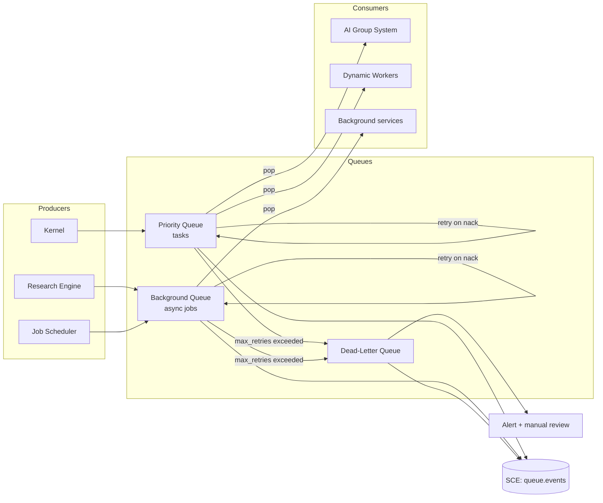

# Queueing

> The durable task queue and backpressure system that buffers work between the Kernel, AI Group System, Dynamic Workers, and asynchronous services. This document is normative — implementations MUST satisfy every MUST clause below.

## Overview

The Queueing subsystem provides ordered, durable, at-least-once task delivery between producers (the Kernel, the Research Engine, the Job Scheduler) and consumers (the AI Group System, Dynamic Workers, background services). It decouples production rate from consumption rate, provides backpressure signals, and ensures tasks survive process restarts.

AI Dev OS uses a tiered queue architecture:
- **Priority queue** for Kernel tasks: preemptable, FIFO-within-priority.
- **Background queue** for Research Engine jobs, Model Discovery, and other async work: fair-share, non-preemptable.
- **Dead-letter queue (DLQ)** for tasks that have exhausted retries.

The default backend is SQLite-based (zero external dependencies). A Redis backend is optional for multi-process deployments.

## Goals

- Durable: tasks survive process restarts without loss.
- Backpressure: workers publish `queue.slow` when queue depth grows beyond `soft_cap`; the Kernel reduces dispatch rate.
- Priority: Kernel tasks with higher priority preempt lower-priority tasks at the Group System level.
- Visibility: every task in the queue is observable via `queue.stats()` and the metrics endpoint.
- Local-first: SQLite backend works with zero external dependencies.

## Non-Goals

- Cross-machine distributed queuing (Redis backend covers the multi-process case; full distributed MQ is post-v1.0).
- Message routing — that is the Kernel and Group System.
- Implementation code — this repository is documentation-only (see [AI Coding Rules](./AI_CODING_RULES.md)).

## Architecture



## Queue Types

### Priority Queue (`tasks`)

Used for Kernel-submitted tasks that need to reach the AI Group System and Dynamic Workers.

| Property | Value |
|----------|-------|
| Ordering | Priority DESC, then enqueued_at ASC (FIFO within same priority) |
| Delivery | At-least-once |
| Visibility timeout | `30s` (configurable per task) |
| Max retries | `5` (configurable) |
| Retry delay | Exponential backoff: `2^attempt * base_delay_ms` |
| Base delay | `1000ms` |
| Max delay | `60000ms` |
| Soft cap | `500` tasks (triggers backpressure signal) |
| Hard cap | `10000` tasks (rejects new enqueues) |

Priority levels:

| Level | Value | Use case |
|-------|-------|----------|
| `critical` | 100 | Guardian-vetoed replans; cancellation propagation |
| `high` | 75 | User-initiated goals; SLO-breaching retries |
| `normal` | 50 | Default Kernel tasks |
| `low` | 25 | Background enrichment; non-critical retries |
| `idle` | 0 | Maintenance tasks; scheduled jobs |

### Background Queue (`background`)

Used for async services (Research Engine, Model Discovery, Embedding backfill, Retention jobs).

| Property | Value |
|----------|-------|
| Ordering | FIFO |
| Delivery | At-least-once |
| Visibility timeout | `5m` (longer for slow jobs) |
| Max retries | `3` |
| Retry delay | Exponential backoff |
| Soft cap | `1000` jobs |

### Dead-Letter Queue (`dlq`)

Tasks/jobs that have exhausted their retry budget are moved here. The DLQ:
- Does NOT automatically retry.
- Emits `queue.dlq_entry` on the SCE.
- Is inspectable via `queue.dlq_list()` and `aidevos context tail queue.dlq`.
- Supports manual re-enqueue: `queue.dlq_retry(item_id)`.

## Task Schema

```
QueueItem {
  id:              ulid
  queue:           "tasks" | "background" | "dlq"
  payload:         object            # task-specific data
  priority:        number            # 0–100
  state:           "pending"
                 | "visible"         # claimed by a consumer
                 | "processing"
                 | "completed"
                 | "failed"
                 | "dlq"
  attempt:         number            # starts at 0
  max_retries:     number
  visibility_timeout_ms: number
  enqueued_at:     rfc3339
  visible_at:      rfc3339           # when item becomes available again after nack
  claimed_at:      rfc3339?
  claimed_by:      string?           # consumer ID
  completed_at:    rfc3339?
  correlation_id:  uuid
  metadata:        object?           # arbitrary consumer hints
}
```

## Interfaces

```
# Enqueue
queue.enqueue(queue, payload, opts?) → QueueItem
queue.enqueue_batch(items: EnqueueInput[]) → QueueItem[]

# Consume
queue.pop(queue, consumer_id, n?) → QueueItem[]     # claim up to n items (default 1)
queue.ack(item_id) → Ack                             # mark completed
queue.nack(item_id, delay_ms?) → Ack                 # release for retry
queue.extend_visibility(item_id, ms) → Ack           # heartbeat for long tasks

# Inspection
queue.stats(queue?) → QueueStats
queue.list(queue, filter?) → QueueItem[]
queue.get(item_id) → QueueItem

# Dead-letter
queue.dlq_list(filter?) → QueueItem[]
queue.dlq_retry(item_id) → QueueItem               # re-enqueue from DLQ
queue.dlq_delete(item_id) → Ack

# Subscribe (real-time)
queue.subscribe(queue) → AsyncIterator<QueueEvent>
```

### QueueStats

```
QueueStats {
  queue:          string
  depth:          number    # pending + visible items
  pending:        number
  in_flight:      number    # claimed, not yet acked/nacked
  dlq_depth:      number
  throughput_per_min: number  # acks in last 60s
  oldest_item_age_s:  number
  backpressure:   boolean   # depth > soft_cap
}
```

## Backpressure

When `depth > soft_cap`:
1. The queue emits `queue.backpressure_on` event on the SCE.
2. The Kernel's dispatcher reduces task submission rate by 50%.
3. The Queue publishes a `queue.slow` metric with `ratio = depth / soft_cap`.

When `depth < soft_cap * 0.5` (recovery threshold):
1. The queue emits `queue.backpressure_off`.
2. The Kernel resumes normal dispatch rate.

When `depth >= hard_cap`:
1. `queue.enqueue` returns `QUEUE_FULL` error.
2. The Kernel parks new goals with `state: planning_queued`.
3. Alert is triggered.

## Visibility Timeout and Heartbeating

When a consumer claims an item (`queue.pop`), a visibility timer starts. If the item is not acked or nacked within `visibility_timeout_ms`:
- The item becomes visible again (as if nacked) and is available for re-claim.
- `attempt` is incremented.

For long-running tasks, the consumer MUST call `queue.extend_visibility(item_id, ms)` at regular intervals (every `visibility_timeout / 2` at most). This is the queue heartbeat.

Workers use `extend_visibility` during `Checkpointing` state transitions (see [Dynamic Workers](./DYNAMIC_WORKERS.md)).

## Retry Policy

```
delay_ms = min(base_delay_ms * 2^attempt + jitter, max_delay_ms)
jitter = random_uniform(0, base_delay_ms * 0.1)

if attempt >= max_retries:
  move to DLQ
  emit queue.dlq_entry
  do NOT re-enqueue
```

Callers can override `max_retries` per item. Critical-priority items use `max_retries: 10` by default.

## SQLite Backend

The SQLite queue backend uses a single `queue_items` table:

```sql
CREATE TABLE queue_items (
  id                   TEXT PRIMARY KEY,
  queue                TEXT NOT NULL,
  payload              BLOB NOT NULL,          -- JSON
  priority             INTEGER NOT NULL DEFAULT 50,
  state                TEXT NOT NULL DEFAULT 'pending',
  attempt              INTEGER NOT NULL DEFAULT 0,
  max_retries          INTEGER NOT NULL DEFAULT 5,
  visibility_timeout_ms INTEGER NOT NULL DEFAULT 30000,
  enqueued_at          TEXT NOT NULL,
  visible_at           TEXT NOT NULL,          -- allows delayed/scheduled items
  claimed_at           TEXT,
  claimed_by           TEXT,
  completed_at         TEXT,
  correlation_id       TEXT,
  metadata             TEXT                    -- JSON
);

CREATE INDEX idx_queue_pop ON queue_items(queue, state, priority DESC, visible_at ASC)
  WHERE state IN ('pending', 'visible');

CREATE INDEX idx_queue_dlq ON queue_items(queue, state, enqueued_at)
  WHERE state = 'dlq';
```

`queue.pop` is implemented as a single `UPDATE ... WHERE state='pending' AND visible_at <= now() ... RETURNING *` with `LIMIT n`, using SQLite's `BEGIN IMMEDIATE` to prevent double-claiming.

## Requirements

- **MUST** guarantee at-least-once delivery: a task MUST NOT be permanently lost unless it reaches the DLQ.
- **MUST** re-enqueue tasks that exceed their visibility timeout without being acked.
- **MUST** move tasks to the DLQ after `max_retries` attempts and emit `queue.dlq_entry` on the SCE.
- **MUST** emit backpressure signals when `depth > soft_cap` and recovery signals when depth drops below recovery threshold.
- **MUST** persist queue state to SQLite atomically; a crash during `queue.pop` MUST NOT result in double-claiming.
- **MUST** support `queue.extend_visibility` for long-running tasks (worker heartbeat).
- **SHOULD** provide per-queue metrics: depth, in-flight count, throughput, DLQ depth.
- **MAY** support a Redis backend for multi-process deployments; the API is identical.

## Failure Modes

| Mode | Detection | Response |
|------|-----------|----------|
| Consumer crash mid-task | Visibility timeout expires | Item re-enqueued automatically; attempt incremented |
| Queue saturated (hard cap) | `depth >= hard_cap` | Return `QUEUE_FULL`; Kernel parks goals; alert |
| DLQ growing | `dlq_depth > dlq_alert_threshold` | Alert operator; do not auto-retry |
| SQLite I/O error | Write failure | Buffer in-memory WAL; retry; emit `queue.write_error` |
| Double-claim (race condition) | Duplicate item_id in claim | SQLite `BEGIN IMMEDIATE` prevents this; log if it occurs |

Every failure emits a structured event on the SCE and is recorded in the [Audit Log](./AUDIT_LOG.md).

## Observability

| Metric | Labels | Description |
|--------|--------|-------------|
| `queue_depth` | `queue` | Current item count |
| `queue_in_flight` | `queue` | Claimed items |
| `queue_dlq_depth` | `queue` | DLQ item count |
| `queue_enqueue_total` | `queue`, `priority` | Items enqueued |
| `queue_ack_total` | `queue` | Successful completions |
| `queue_nack_total` | `queue`, `attempt` | Retries |
| `queue_dlq_total` | `queue` | Items moved to DLQ |
| `queue_throughput_per_min` | `queue` | Processing rate |
| `queue_backpressure` | `queue` | 1 when backpressure is active |

## Acceptance Criteria

- Crashing the server with 50 in-flight tasks and restarting causes all 50 tasks to become visible again after `visibility_timeout_ms` without manual intervention.
- An item that fails `max_retries` times appears in `queue.dlq_list()` and does not re-appear in `queue.pop`.
- `queue.enqueue` returns `QUEUE_FULL` when `depth >= hard_cap` without blocking.
- Backpressure signal fires within one metrics evaluation interval when `depth` crosses `soft_cap`.
- `queue.pop(queue, consumer, 10)` with 1000 pending items returns 10 items atomically (no double-claims) under concurrent consumer pressure.

## Open Questions

- Whether to support delayed/scheduled queue items (visible_at in the future) or always route through the [Job Scheduler](./JOB_SCHEDULER.md) — some overlap exists; tracked in [templates/ADR](../templates/ADR.md).

## Related Documents

- [Job Scheduler](./JOB_SCHEDULER.md)
- [AI Group System](./AI_GROUP_SYSTEM.md)
- [Dynamic Workers](./DYNAMIC_WORKERS.md)
- [Research Engine](./RESEARCH_ENGINE.md)
- [Backend](./BACKEND.md)
- [Database](./DATABASE.md)
- [System Overview](./SYSTEM_OVERVIEW.md)
- [Main AI Kernel](./MAIN_AI_KERNEL.md)
- [Architecture Guardian](./ARCHITECTURE_GUARDIAN.md)
