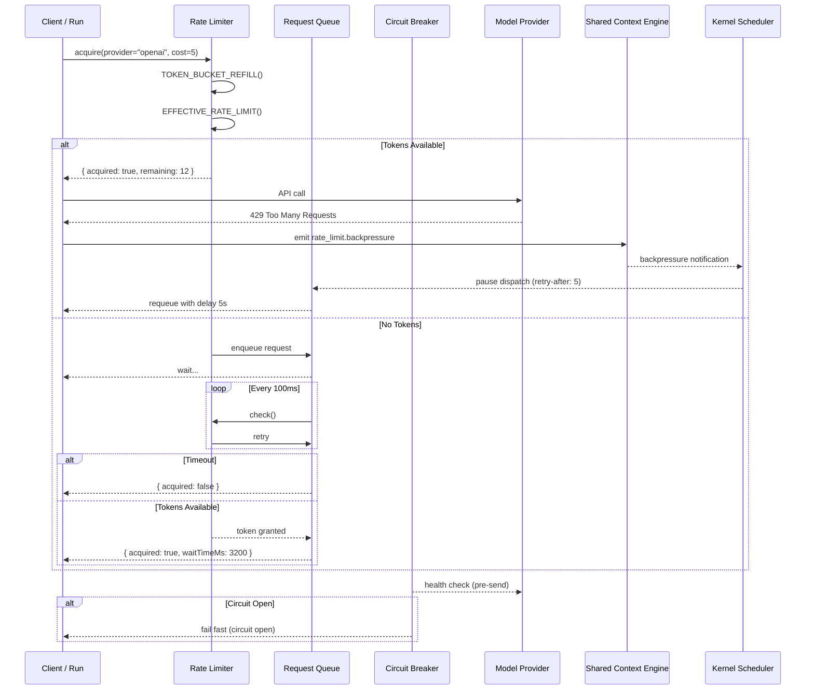

# Rate Limiting

> Rate limiting strategy across AI Dev OS, covering model providers, SCE topics, API endpoints, and tool calls. This document is normative — implementations MUST satisfy every MUST clause below.

## Overview

Rate limiting protects AI Dev OS from resource exhaustion, ensures fair sharing across concurrent runs, and enforces contractual limits with external [Model Providers](./MODEL_PROVIDERS.md). The system applies token-bucket rate limits at multiple tiers and communicates backpressure through HTTP headers, SCE events, and queue signals.

The Rate Limiting subsystem integrates with the [Shared Context Engine](./SHARED_CONTEXT_ENGINE.md) for distributed rate limit state propagation, the [Cost Management](./COST_MANAGEMENT.md) subsystem for weighted cost-based token consumption, the [Caching Strategy](./CACHING_STRATEGY.md) for upstream request coalescing, and the [Queueing](./QUEUEING.md) subsystem for backpressure buffering.

## Requirements

- **MUST** implement a `RateLimiter` interface with `check`, `acquire`, `release`, and `reset` operations.
- **MUST** support token-bucket rate limiting with configurable burst capacity and sustained refill rate.
- **MUST** compute the effective rate as the minimum of all applicable tiers (provider, workspace, user, run, global).
- **MUST** support weighted cost per request to charge different token amounts for different operations.
- **MUST** backpressure propagation through SCE `rate_limit.backpressure` events.
- **SHOULD** integrate with the circuit breaker pattern to stop sending requests to providers that are returning 429s.
- **SHOULD** expose queue depth metrics for each tier to enable proactive scaling.
- **MAY** distribute rate limit state across processes via Redis-backed token buckets.
- **MUST** emit standard `X-RateLimit-*` HTTP headers on all API responses.
- **SHOULD** validate rate limit configuration on load and reject invalid values (negative burst, zero sustained).
- **MUST** prevent coordinated omission by recording queued time in latency metrics.

## Where Rate Limits Apply

| Layer | What Is Limited | Limiting Factor |
|---|---|---|
| Model providers | API calls per model per minute | Provider contract + cost budget |
| SCE topics | Publish events per topic per second | SCE throughput capacity |
| API endpoints | REST/gRPC requests per route | Server capacity |
| Tool calls | Tool invocations per run per second | Worker execution capacity |
| Worker spawns | Concurrent workers per workspace | Resource pool size |
| File operations | Disk writes per second | I/O bandwidth |

## Rate Limit Tiers

Each tier is independently configurable. The effective rate is the minimum of all applicable tiers.

| Tier | Scope | Default | Configured In |
|---|---|---|---|
| Per-provider | Per model provider API key | Provider-defined | `config.toml` → `[rate_limits.providers]` |
| Per-workspace | All runs in a workspace | 100 req/s burst | `config.toml` → `[rate_limits.workspace]` |
| Per-user | All runs by a user identity | 50 req/s sustained | `config.toml` → `[rate_limits.user]` |
| Per-run | Single run execution | 20 req/s sustained | `config.toml` → `[rate_limits.run]` |
| Global | System-wide aggregate | 500 req/s burst | `config.toml` → `[rate_limits.global]` |

## Interfaces

### RateLimiter

```typescript
interface RateLimiter {
  /** Check if a request can proceed without consuming tokens. Non-blocking. */
  check(key: string, cost?: number): Promise<RateLimitResult>;

  /** Acquire tokens. Blocks until tokens are available or timeout expires. */
  acquire(key: string, cost?: number, options?: AcquireOptions): Promise<AcquireResult>;

  /** Release previously acquired tokens (e.g., on error). */
  release(key: string, cost: number): Promise<void>;

  /** Reset the rate limiter state for a key (e.g., on config change). */
  reset(key?: string): Promise<void>;

  /** Return current rate limit state for a key. */
  state(key: string): Promise<RateLimitState>;
}

interface RateLimitResult {
  allowed: boolean;
  remaining: number;             // tokens remaining in bucket
  resetAt: string;               // ISO-8601 timestamp when bucket fully refills
  retryAfterMs?: number;         // ms to wait before retry (if not allowed)
  tier: string;                  // which tier was the limiting factor
}

interface AcquireOptions {
  timeoutMs?: number;            // default 30_000 (30 s)
  queuePriority?: number;        // 0–9, lower = higher priority, default 5
}

interface AcquireResult {
  acquired: boolean;
  waitTimeMs: number;            // time spent waiting for tokens
  remaining: number;
  resetAt: string;
  tier: string;
}

interface RateLimitState {
  key: string;
  tier: string;
  capacity: number;              // burst limit
  refillRate: number;            // tokens per second
  current: number;               // current token count
  lastRefillAt: string;          // ISO-8601
}
```

### Configuration Schema

```typescript
interface RateLimitConfig {
  mode: 'queue' | 'reject' | 'degrade';
  global: { burst: number; sustained: number };
  providers: Record<string, { burst: number; sustained: number }>;
  workspaces: Record<string, { burst: number; sustained: number }>;
  users: Record<string, { burst: number; sustained: number }>;
  run: { burst: number; sustained: number };
  topics: Record<string, { burst: number; sustained: number }>;
}
```

## Per-Provider Rate Limit Presets

Default presets for common providers. These are overridden by `config.toml` values when present.

| Provider | Tier | RPM (req/min) | TPM (tokens/min) | Burst | Sustained (req/s) |
|---|---|---|---|---|---|
| OpenAI | gpt-4o | 500 | 200,000 | 60 | 30 |
| OpenAI | gpt-4o-mini | 500 | 200,000 | 60 | 30 |
| OpenAI | o3 | 400 | 100,000 | 40 | 20 |
| OpenAI | o4-mini | 500 | 200,000 | 60 | 30 |
| OpenAI | embedding (text-embedding-3) | 1,000 | 1,000,000 | 100 | 50 |
| Anthropic | claude-4 | 200 | 80,000 | 40 | 20 |
| Anthropic | claude-4-sonnet | 200 | 80,000 | 40 | 20 |
| Anthropic | claude-3.5-sonnet | 200 | 80,000 | 40 | 20 |
| Anthropic | claude-3.5-haiku | 300 | 100,000 | 50 | 25 |
| Google | gemini-2.5-pro | 300 | 100,000 | 50 | 25 |
| Google | gemini-2.5-flash | 2,000 | 1,000,000 | 200 | 100 |
| Mistral | mistral-large-2 | 200 | 80,000 | 40 | 20 |
| Mistral | mistral-small-2 | 500 | 200,000 | 60 | 30 |
| Ollama | (any local) | — | — | 1,000 | 500 |

RPM and TPM values are sourced from each provider's published rate limit documentation. Values are subject to change; the system refreshes provider rate limits via the [Model Providers](./MODEL_PROVIDERS.md) API on startup and every hour thereafter.

## Algorithm

### Token Bucket (Refill Calculation)

Every rate limit uses a **token bucket** with configurable capacity (burst) and refill rate (sustained). Tokens are consumed per request. If the bucket is empty, the request is either queued or rejected based on the policy.

```
Algorithm: TOKEN_BUCKET_REFILL
Input:  state (tokens, last_refill, capacity, refill_rate)
Output: state (tokens, last_refill)

1.  now ← CURRENT_TIME()
2.  elapsed ← now - last_refill                 // seconds (float)
3.  new_tokens ← elapsed * refill_rate
4.  if new_tokens > 0:
5.      tokens ← MIN(capacity, tokens + new_tokens)
6.      last_refill ← now
7.  return (tokens, last_refill)
```

### Effective Rate Calculation (Min-of-All-Tiers)

```
Algorithm: EFFECTIVE_RATE_LIMIT
Input:  provider (str), model (str), workspace_id (str), user_id (str), run_id (str)
Output: effective_burst (int), effective_sustained (int)

1.  provider_burst,   provider_sustained   ← PROVIDER_LIMITS[provider][model]
2.  workspace_burst,  workspace_sustained  ← WORKSPACE_LIMITS[workspace_id]
3.  user_burst,       user_sustained       ← USER_LIMITS[user_id]
4.  run_burst,        run_sustained        ← RUN_LIMITS
5.  global_burst,     global_sustained     ← GLOBAL_LIMITS

6.  effective_burst     ← MIN(provider_burst,   workspace_burst,
7.                             user_burst,       run_burst,
8.                             global_burst)

9.  effective_sustained ← MIN(provider_sustained, workspace_sustained,
10.                            user_sustained,     run_sustained,
11.                            global_sustained)

12. return (effective_burst, effective_sustained)
```

### Weighted Cost Model

Each operation type maps to a token cost that reflects its resource consumption relative to a baseline "cheap" request:

| Operation | Token Cost | Rationale |
|---|---|---|
| Config read | 1 | Minimal — file read from cache |
| Tool invocation (simple) | 2 | Schema validation + dispatch |
| LLM chat completion (short) | 5 | 1 K tokens out, 2 K tokens in |
| LLM chat completion (long) | 20 | > 8 K tokens out, > 16 K tokens in |
| Embedding generation | 3 | Vector model inference |
| File write (disk) | 4 | I/O + content scanning |
| SCE publish (large batch) | 10 | Serialization + fan-out |
| Graph traversal (deep) | 15 | Multi-hop resolution |

```
Algorithm: WEIGHTED_COST
Input:  operation_type (str), payload_size_bytes (int), estimated_tokens (int)
Output: token_cost (int)

1.  base_cost ← OPERATION_COSTS[operation_type]
2.  if payload_size_bytes > 1_000_000:
3.      base_cost += ceil(payload_size_bytes / 1_000_000) * 2
4.  if estimated_tokens > 8_000:
5.      base_cost += ceil(estimated_tokens / 8_000) * 3
6.  return MAX(1, base_cost)
```

### Distributed Rate Limiting via SCE

In a multi-process deployment, rate limit state is stored in Redis using a sorted set per bucket key. The SCE distributes rate limit configuration changes:

1. Operator changes rate limits in `config.toml`.
2. Configuration subsystem emits `rate_limit.config.changed` on the SCE.
3. All process-local `RateLimiter` instances subscribe and reload their token bucket parameters.
4. The Redis-backed token buckets are reset (key deleted) so that the new limits take effect immediately.

For processes without Redis, local in-memory buckets are used, and rate limit coordination between processes uses SCE events with best-effort propagation — each process independently enforces its local rate, with global coordination accuracy of ±1 second.

## Backpressure Propagation Flow



## Backpressure Signals

| Signal | Source | Consumer Action |
|---|---|---|
| `429 Too Many Requests` | Model provider HTTP response | Queue or fail with retry-After |
| `X-RateLimit-*` headers | AI Dev OS API | Client-side backoff |
| SCE `rate_limit.backpressure` event | Kernel rate limiter | Workers pause or throttle |
| Worker queue depth notification | Job scheduler | Kernel delays new work dispatch |
| Provider `retry-after` header | Model provider | Respect before retry |
| Circuit breaker half-open probe | Circuit Breaker | Single test request allowed |

## Circuit Breaker Integration

Each provider client wraps the `RateLimiter.acquire()` call with a circuit breaker. The circuit breaker tracks provider 429 and 5xx responses:

| State | Behavior | Transition |
|---|---|---|
| **CLOSED** | Normal operation. Rate limiter decides. | → OPEN after N consecutive 429/5xx (default: 5) |
| **OPEN** | Rate limiter returns `{ allowed: false }` immediately without consuming tokens. | → HALF_OPEN after cooldown (default: 30 s) |
| **HALF_OPEN** | One probe request is allowed through the rate limiter. | → CLOSED if probe succeeds; → OPEN if probe fails |

The circuit breaker state is emitted as an SCE event (`rate_limit.circuit_breaker.state_changed`) and recorded as a metric.

## Configuration

Rate limits are defined in `config.toml`:

```toml
[rate_limits]
mode = "queue"  # "queue" | "reject" | "degrade"

[rate_limits.global]
burst = 500
sustained = 200

[rate_limits.providers.openai]
burst = 60
sustained = 30

[rate_limits.providers.anthropic]
burst = 40
sustained = 20

[rate_limits.circuit_breaker]
consecutive_failures = 5
cooldown_seconds = 30

[rate_limits.topics]
"system.events" = { burst = 200, sustained = 100 }
"agent.messages" = { burst = 100, sustained = 50 }
```

## Rate Limit Headers

All HTTP API responses include standard rate limit headers:

| Header | Description |
|---|---|
| `X-RateLimit-Limit` | Maximum requests per window |
| `X-RateLimit-Remaining` | Requests remaining in current window |
| `X-RateLimit-Reset` | Unix timestamp when the window resets |
| `Retry-After` | Seconds to wait before retry (on 429 only) |
| `X-RateLimit-Tier` | Which tier is the limiting factor |

## Queueing When Rate Limited

When `mode = "queue"`, rate-limited requests are placed in a per-tier FIFO queue (see [Queueing](./QUEUEING.md)). Queue capacity defaults to 1000 items per tier. When the queue is full, new requests receive a 429 response.

### Queue Depth Monitoring

Each tier's queue exposes a gauge metric `rate_limit.queue_depth` with labels `tier`, `provider`. Alert thresholds:

| Severity | Condition | Action |
|---|---|---|
| INFO | queue_depth > 500 | Log; no escalation |
| WARNING | queue_depth > 800 | Emit SCE `rate_limit.queue_depth_warning` |
| CRITICAL | queue_depth == 1000 (full) | Reject new requests with 429; alert operator |

Queue wait time is recorded in the metric `rate_limit.queue_wait_ms` as a histogram. This metric includes queued time to prevent coordinated omission — a client that spent 3 s in the queue before a 429 is not counted as a "fast" request.

## Failure Modes

| Failure | Cause | Effect | Mitigation | SCE Event |
|---|---|---|---|---|
| Rate limit exceeded | Transient burst exceeds capacity | Request queued or 429 | Client retries with exponential backoff | `rate_limit.exceeded` |
| Backpressure cascade | Upstream provider throttles heavily | All dependent operations slow across tiers | Circuit breaker on provider; reduce concurrency | `rate_limit.backpressure` |
| Token bucket starvation | Sustained max throughput for extended period | Latency increases linearly; queue fills | Scale out workers; increase burst capacity | `rate_limit.starvation` |
| Misconfigured limit | Limit set too low in config | False positive rate limiting | Validate on config load; reject burst < 1 or sustained < 0 | `rate_limit.config_invalid` |
| Queue overflow | Sustained overload exceeds queue capacity | Requests dropped with 429 | Alert on queue depth; auto-scale workers | `rate_limit.queue_overflow` |
| Circuit breaker flapping | Provider returns intermittent 429s | Circuit opens and closes repeatedly | Add minimum open-time (cooldown); increase consecutive_failures | `rate_limit.circuit_flapping` |
| Coordinated omission | Request queuing time not counted in latency | Latency measurements are artificially low | Always record queue_wait_ms in request latency histogram | (mitigated silently) |
| Distributed clock skew | Redis server and app server clocks differ | Token bucket refill calculation off by drift amount | Use Redis TIME command for refill timestamps; tolerate ±100 ms | `rate_limit.clock_skew` |

## Security Considerations

- **Rate limit bypass**: An attacker could craft requests that avoid rate-limited paths (e.g., direct DB access instead of API). Mitigations: (a) all entry points — API, SCE publish, tool calls — MUST go through the same `RateLimiter` instance, (b) the Architecture Guardian enforces that no subsystem bypasses the rate limiter for external calls, (c) any unauthenticated request is rate-limited at the most restrictive tier by default.
- **Coordinated omission**: When rate limiting queues requests before rejecting them, the queued time MUST be included in latency metrics. The `rate_limit.queue_wait_ms` histogram records this. Without this, an attacker could send bursts and have the rejection latency hidden, making the system appear faster than it is.
- **Token bucket timing side-channel**: The `check()` operation runs in constant time O(1) regardless of the current token count. No conditional branches depend on the secret (token count) after the initial guard.
- **Config tampering**: Rate limit configuration is owned by the operator. An agent MUST NOT be able to modify its own rate limit. The `RateLimiter.reset()` call requires operator-level credentials.
- **Shared bucket starvation (DoS)**: A malicious workspace could consume all global tokens, starving other workspaces. The per-workspace and per-user tiers prevent this — the global tier is only the outermost cap, not the only bucket.
- **Audit trail**: Every rate limit configuration change, circuit breaker state transition, and queue overflow event is recorded in the [Audit Log](./AUDIT_LOG.md).
- All external calls go through [Model Providers](./MODEL_PROVIDERS.md) or the [Plugin SDK](./PLUGIN_SDK.md) — no ad-hoc network access.

## Observability

All metrics, traces, and logs conform to [Observability](./OBSERVABILITY.md), [Tracing](./TRACING.md), and [Logging](./LOGGING.md). Every rate-limited request carries a `correlation_id` propagated from the caller.

### Metrics

| Metric Name | Type | Labels | Description |
|---|---|---|---|
| `rate_limit.acquired_total` | Counter | `tier`, `provider`, `result` | Count of acquired tokens (result = allowed / denied) |
| `rate_limit.remaining` | Gauge | `tier`, `provider` | Current token count in bucket |
| `rate_limit.queue_depth` | Gauge | `tier`, `provider` | Current number of queued requests |
| `rate_limit.queue_wait_ms` | Histogram | `tier`, `provider` | Time spent waiting in queue |
| `rate_limit.circuit_breaker_state` | Gauge | `provider` | 0 = CLOSED, 1 = HALF_OPEN, 2 = OPEN |
| `rate_limit.circuit_breaker_trips_total` | Counter | `provider` | Count of circuit breaker open transitions |
| `rate_limit.backpressure_events_total` | Counter | `tier`, `provider` | Count of backpressure events emitted |
| `rate_limit.config_reloads_total` | Counter | — | Count of configuration reloads |
| `rate_limit.clock_skew_ms` | Gauge | — | Measured clock skew between app and Redis |

Alerting thresholds:

| Metric | Condition | Severity |
|---|---|---|
| `rate_limit.queue_depth{tier="global"}` | > 800 | WARNING |
| `rate_limit.queue_depth{tier="global"}` | == 1000 | CRITICAL |
| `rate_limit.circuit_breaker_state{provider}` | == 2 (OPEN) | WARNING |
| `rate_limit.remaining{tier="global"}` | < 10 | INFO |
| `rate_limit.clock_skew_ms` | > 500 | WARNING |

## Acceptance Criteria

1. **Token bucket accuracy**: A rate limit configured with burst=10, sustained=5 allows exactly 10 requests in the first second, then 5 per second thereafter (within ±1 token tolerance).
2. **Effective rate (min-of-tiers)**: With provider=50/s, workspace=30/s, global=100/s, the effective rate is 30/s (the minimum). Exceeding 30/s results in rate limiting.
3. **Weighted cost**: A request with `operation_type = "long_llm"` and `estimated_tokens = 16_000` consumes `20 + ceil(16000 / 8000) * 3 = 26` tokens.
4. **Backpressure propagation**: A provider returning 429 results in an SCE `rate_limit.backpressure` event and queue pause within 100 ms.
5. **Circuit breaker**: 5 consecutive 429 responses from a provider transition the circuit breaker to OPEN within 1 second of the fifth response. A 30-second cooldown later, it transitions to HALF_OPEN.
6. **Queue timeout**: A request that waits longer than `timeoutMs` (default 30 s) in the queue receives `{ acquired: false }`.
7. **Distributed coordination**: In a 2-process deployment with Redis, a request limited to 10/s results in ≤ 12 total requests per second across both processes (10 + 20% tolerance for clock skew).
8. **Security — config isolation**: A run-scoped agent calling `rateLimiter.reset("global")` receives a permission-denied error.
9. **Coordinated omission prevention**: The 95th percentile of `rate_limit.queue_wait_ms` is always less than or equal to the 95th percentile of the request latency — i.e., queued time is included in measurements.
10. **Validation on load**: Config with `burst = 0` or `sustained = -1` is rejected at startup; the subsystem falls back to the previous valid config.

All acceptance criteria are testable via the [Eval Harness](./EVAL_HARNESS.md). A change to this document requires a matching update to any dependent doc listed in *Related Documents*.

## Related Documents

- [Queueing](./QUEUEING.md) — queue architecture and backpressure propagation
- [Model Providers](./MODEL_PROVIDERS.md) — provider-specific rate limit contracts
- [Cost Management](./COST_MANAGEMENT.md) — cost-aware rate limiting
- [Caching Strategy](./CACHING_STRATEGY.md) — upstream request coalescing
- [Scalability](./SCALABILITY.md) — horizontal scaling to handle increased load
- [Observability](./OBSERVABILITY.md) — rate limit metrics and dashboards
- [Security Model](./SECURITY_MODEL.md) — rate limit bypass threat model
- [Circuit Breaker](./CIRCUIT_BREAKER.md) — integration with circuit breaker pattern
