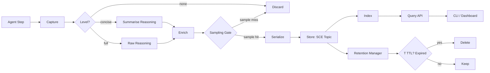

# Reasoning Traces

## Overview

Reasoning traces capture the internal chain-of-thought of AI agents during task execution. Each trace records the input, intermediate reasoning, and output for every step an agent takes, enabling debugging, audit, and transparency.

Traces are distinct from logs — they capture model-level reasoning rather than system events. They are the primary mechanism for understanding *why* an agent made a particular decision.

---

## Trace Schema

| Field | Type | Description |
|---|---|---|
| `trace_id` | `uuid` | Unique trace identifier |
| `run_id` | `uuid` | Associated run ID |
| `worker_id` | `string` | Agent or worker that generated the trace |
| `step` | `integer` | Step number within the run |
| `input` | `string` | Input prompt or context at this step |
| `reasoning` | `string` | Raw chain-of-thought text from the model |
| `output` | `string` | Agent output (action, tool call, or response) |
| `confidence` | `float` | Model-reported confidence (0.0–1.0), if available |
| `tokens_used` | `integer` | Token count for this step |
| `timestamp` | `datetime` | UTC timestamp of the step |

---

## Trace Levels

| Level | Description |
|---|---|
| `none` | No tracing. Zero overhead, no insight. |
| `concise` | Stores only final reasoning summary and output for each step. Low overhead. |
| `full` | Stores complete input, raw reasoning, and output. Maximum insight, higher overhead. |

Configure via `aidevos.toml`:

```toml
[traces]
level = "concise"  # none | concise | full
```

---

## Storage

Traces are written to a dedicated SCE (System Communication Event) topic under `aidevos.traces.*`. This enables real-time streaming and integration with observability pipelines.

For long-lived debugging, traces may also be persisted to Persistent Memory with session-based retention (default: 7 days). Retention policy is configurable:

```toml
[traces.storage]
backend = "sce"          # sce | memory
retention_days = 7       # 0 = indefinite
```

---

## Viewing Traces

### CLI

```bash
aidevos run show --traces <run-id>
aidevos run show --traces --level full <run-id>
```

### API

```
GET /v1/runs/:id/traces
```

Query parameters: `?level=concise&step_gt=5&limit=50`

---

## Privacy Considerations

Traces may contain sensitive reasoning — including user data, API keys, or internal business logic encountered during agent execution. Access to traces MUST be access-controlled:

- Only run owners and admins can view traces by default.
- Traces are encrypted at rest.
- Trace export should strip sensitive fields (configurable filter).

---

## Performance Impact

Full tracing adds per-step overhead for serialization and I/O. Sampling reduces cost:

```toml
[traces.sampling]
rate = 0.1  # record 10% of all steps
```

Production systems should use `concise` level or sampling unless actively debugging.

---

## Integration with Eval Harness

When an evaluation fails, the corresponding trace is automatically captured and linked to the eval result. This allows developers to replay the agent's reasoning at the point of failure:

```bash
aidevos eval show <eval-id> --trace
```

Failed eval traces are retained even if the retention policy would otherwise expire them.

---

## Trace Pipeline



## Trace Recording Algorithm (Pseudocode)

```
function record_trace(run: Run, step: Step, level: Level) -> Trace:
    trace = Trace(run_id=run.id, worker_id=run.worker_id, step=step.number)

    if level == Level.FULL:
        trace.input = step.input
        trace.reasoning = model.chain_of_thought(step.input)
        trace.output = step.output
        trace.confidence = model.confidence(step.input)
        trace.tokens_used = step.tokens_used
    elif level == Level.CONCISE:
        trace.input = nil  # not stored
        trace.reasoning = summarise(model.chain_of_thought(step.input))
        trace.output = step.output
        trace.confidence = nil  # not available for summaries
        trace.tokens_used = step.tokens_used
    else:  # none
        return nil

    if sampling_gate(run.id, trace.step):
        return nil

    trace.timestamp = now_utc()

    redacted = redact_pii(trace)
    serialized = serialize_to_json(redacted)

    if storage.backend == Backend.SCE:
        sce_topic["aidevos.traces.*"].publish(serialized)
    elif storage.backend == Backend.MEMORY:
        persistent_memory.store(f"trace:{run.id}:{trace.step}", serialized)

    return trace
```

## Sampling Algorithm (Pseudocode with Rate Calculation)

```
function sampling_gate(run_id: str, step: int) -> bool:
    # rate = configured sampling rate (0.0 to 1.0)
    # Step-based deterministic: same step always sampled or not
    # This prevents bursts and keeps partial traces consistent

    if config.traces.sampling.rate >= 1.0:
        return true  # always record
    if config.traces.sampling.rate <= 0.0:
        return false  # never record

    # Hash run_id + step to get deterministic bucket
    hash_input = f"{run_id}:{step}"
    hash_val = sha256(hash_input.encode())
    bucket = int.from_bytes(hash_val[:4], "big") / 2**32

    return bucket < config.traces.sampling.rate
```

Rate example: if `rate = 0.1`, roughly 10% of steps are recorded. Because the hash is deterministic, a given step in a given run is either always sampled or never sampled.

## Trace Query API

```
GET /v1/runs/:id/traces

Query Parameters:
  level      string    Filter by level (concise | full)
  step_gt    int       Return traces with step > this value
  step_lt    int       Return traces with step < this value
  step_gte   int       Return traces with step >= this value
  step_lte   int       Return traces with step <= this value
  limit      int       Max results to return (default: 50, max: 500)
  offset     int       Pagination offset
  sort       string    Sort order (asc | desc, default: asc)
  worker_id  string    Filter by worker/agent ID
  confidence float     Only return traces with confidence >= this value

Response:
{
  "data": [ TraceSchema, ... ],
  "pagination": {
    "total": int,
    "limit": int,
    "offset": int,
    "next_offset": int | null
  }
}
```

## Trace Redaction Algorithm (PII)

```
function redact_pii(trace: Trace) -> Trace:
    redacted = deep_copy(trace)
    sensitive_fields = ["input", "reasoning", "output"]

    for field in sensitive_fields:
        text = getattr(redacted, field)
        if text is None:
            continue
        for pii in detect_pii(text):
            text = text[:pii.start] + pii.redacted + text[pii.end:]
        setattr(redacted, field, text)

    return redacted
```

Redaction runs before serialization. The original trace is never written to disk.

## Trace Comparison / Diff Tool

```bash
aidevos trace diff <run-id-a> <run-id-b>
aidevos trace diff --side-by-side <run-id-a> <run-id-b>
```

Output:
- Per-step comparison: which steps differ, which match, which are extra/missing
- Token usage comparison: total tokens, per-step delta
- Reasoning divergence: highlight sections where reasoning path diverges (cosine similarity < 0.7 on embedding)
- Confidence delta: per-step confidence change
- Exportable as JSON diff patch

## Trace Export Format

```json
{
  "schema_version": "1.0",
  "exported_at": "2026-07-22T12:00:00Z",
  "run_id": "uuid",
  "traces": [
    {
      "trace_id": "uuid",
      "step": 1,
      "level": "full",
      "input": "...",
      "reasoning": "[REDACTED_EMAIL] ...",
      "output": "...",
      "confidence": 0.92,
      "tokens_used": 512,
      "timestamp": "2026-07-22T11:59:50Z"
    }
  ]
}
```

Export via:
```bash
aidevos run export --traces <run-id> --format json --output traces-export.json
aidevos run export --traces <run-id> --format jsonl --output traces-export.jsonl
```

## Integration with Eval Harness Correlation

When a trace is linked to a failed evaluation, the following correlation data is captured:

| Field | Type | Description |
|---|---|---|
| `eval_id` | `uuid` | Linked eval result ID |
| `eval_name` | `string` | Name of the eval that failed |
| `assertion` | `string` | The assertion that failed (e.g. `output.contains("expected")`) |
| `expected` | `string` | Expected value |
| `actual` | `string` | Actual value |
| `trace_id` | `uuid` | Trace captured at point of failure |
| `step` | `integer` | Step number at which the eval failed |

Correlation enables replay debugging:
```bash
aidevos eval debug <eval-id>
```
This replays the agent in interactive mode, pausing at the failure step with full trace context.

## Retention Management

| Policy | Trigger | Action | Config |
|---|---|---|---|
| Time-based expiry | Trace timestamp + retention_days exceeded | Trace deleted | `traces.storage.retention_days` (default: 7) |
| Eval-linked preservation | Eval result linked to trace | Retention overridden to indefinite | Automatic; cleared when eval result deleted |
| Max traces per run | Trace count exceeds threshold | Oldest traces pruned first | `traces.storage.max_traces_per_run` (default: 10000) |
| Storage quota | Storage backend usage exceeds limit | Traces older than 24h purged | `traces.storage.quota_mb` (default: 512) |
| Manual purge | User command | Selective or full trace deletion | `aidevos traces purge --run <run-id>` |

## Storage Backend Comparison

| Feature | SCE | SQLite | Object Store (S3/MinIO) |
|---|---|---|---|
| Latency (p99 write) | < 5 ms | < 1 ms | < 50 ms |
| Latency (p99 query) | < 20 ms | < 5 ms | < 100 ms |
| Throughput | 100k+ events/s | 50k writes/s | Unlimited (scales with storage) |
| Retention enforcement | Built-in topic retention | Custom TTL sweep | Lifecycle policies |
| Query capability | Simple topic subscribe | Full SQL (joins, filters) | Prefix scan |
| Persistence | Ephemeral (configurable) | Persistent | Persistent |
| Disk usage | Configurable (log-based) | Compact (SQLite page) | Full object storage |
| Use case | Real-time streaming | Short-term debugging | Long-term audit archive |
| HA/Replication | Via SCE cluster | WAL-mode replication | S3-native replication |

## Trace Compression Strategy

| Strategy | Ratio | Speed | Use Case |
|---|---|---|---|
| gzip (level 6) | ~10:1 | Fast | Default for export files |
| zstd (level 3) | ~12:1 | Very fast | Real-time SCE topics |
| Token dedup (repeated reasoning removed) | ~2:1 on top of gzip | Moderate | Concise-only archive |
| Delta compression (store only diffs between consecutive steps) | ~5:1 on reasoning | Slow | Long-term storage |

Compression is applied at the storage backend level and transparent to the query API.

## Performance Overhead Measurement

| Level | Overhead (per step) | Notes |
|---|---|---|
| none | 0 ms | No tracing code runs |
| concise | ~1-2 ms | Summarisation call + serialisation |
| full | ~5-15 ms | Raw reasoning capture + serialisation; depends on reasoning length |
| full + redaction | +2-5 ms | PII scan on all sensitive fields |
| full + compression | +1-3 ms | zstd compression on serialised payload |

Overhead is measured on a reference system (4-core, 16 GB RAM, NVMe SSD). Actual overhead may vary.

## Failure Modes

| Failure Scenario | Impact | Detection | Mitigation |
|---|---|---|---|
| **Trace buffer overflow** (high-throughput agent produces more traces than can be written) | Traces silently dropped | `traces.buffer_dropped_total` counter increments | Configurable buffer size; backpressure to agent runtime; fallback to sampling |
| **Corrupt trace** (malformed reasoning text or serialization error) | Partial trace stored with missing fields | JSON validation failure on write; `traces.corrupt_total` counter | Graceful degradation: store valid fields, log error, increment metric |
| **Sampling bias** (sampling algorithm over-represents certain step types) | Traces not representative of true distribution | Statistical test on sampled vs full distribution (comparison run) | Deterministic hash-based sampling (not random); periodic cross-check with full tracing on debug builds |
| **PII redaction miss** (new PII pattern not in detection list) | PII stored in trace | Manual audit; user report; `traces.pii_miss_total` if pattern flagged post-hoc | Extensible pattern registry; community-contributed PII patterns; post-hoc scan job |
| **Retention policy bypass** (trace linked to eval but eval deleted without trace) | Orphan trace retained indefinitely | Stale trace detection sweep | Cascade delete: eval deletion triggers trace unlink; trace falls under normal TTL |
| **Storage backend unavailable** (SCE topic down / SQLite locked / S3 timeout) | Trace write fails | `traces.write_failures_total` counter; health check endpoint | Retry with exponential backoff (3 attempts); fallback to local JSONL file; alert on persistent failure |

## Observability Metrics

| Metric | Type | Description | Threshold |
|---|---|---|---|
| `traces.captured_total` | Counter | Total traces captured (by level) | Baseline per run |
| `traces.sampled_out_total` | Counter | Traces discarded by sampling gate | Monitor ratio vs captured |
| `traces.written_total` | Counter | Traces successfully written to storage | Track throughput |
| `traces.write_failures_total` | Counter | Traces that failed to write | Alert if > 0 |
| `traces.buffer_dropped_total` | Counter | Traces dropped due to buffer overflow | Alert if > 0 |
| `traces.corrupt_total` | Counter | Malformed / corrupt trace records | Alert if > 0 |
| `traces.pii_redactions_total` | Counter | PII redactions applied | Monitor for increases |
| `traces.exported_total` | Counter | Trace export operations | Usage tracking |
| `traces.queried_total` | Counter | Trace query API calls | Monitor query load |
| `traces.compression_ratio` | Gauge | Observed compression ratio | Target > 5:1 |
| `traces.storage_bytes` | Gauge | Current storage utilisation | Alert if > 80% of quota |
| `traces.overhead_ms` | Histogram | Per-step tracing overhead | p99 < 20 ms |

## Acceptance Criteria

- [ ] Traces can be captured at `none`, `concise`, and `full` levels
- [ ] Sampling algorithm deterministically includes/excludes steps based on configured rate
- [ ] PII redaction is applied before any trace is persisted
- [ ] Query API supports filtering by level, step range, worker ID, and confidence
- [ ] Trace export produces valid JSON / JSONL archives with schema version
- [ ] Comparison/diff tool highlights step-level divergence between two runs
- [ ] Retention manager enforces TTL, max-traces, and storage quota policies
- [ ] Eval-linked traces are preserved until the eval result is deleted
- [ ] Storage backends (SCE, SQLite, object store) are interchangeable via config
- [ ] Compression achieves at least 5:1 ratio on full traces
- [ ] Performance overhead does not exceed 20 ms per step at `full` level
- [ ] Failure modes are detected and exposed via observability metrics
- [ ] CLI commands (`aidevos run show --traces`, `aidevos trace diff`, `aidevos traces purge`) work as documented
