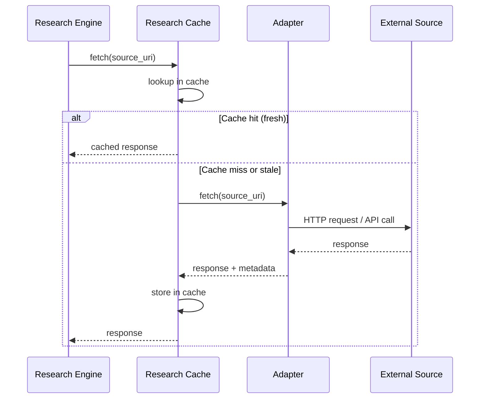

# Research Cache

> Caching layer for the Research Engine — deduplication, rate-limit avoidance, and freshness-aware cache invalidation for crawled and fetched content. This document is normative — implementations MUST satisfy every MUST clause below.

## Overview

The Research Cache is a transparent caching layer between the [Research Engine](./RESEARCH_ENGINE.md) adapters and their external sources. It stores the raw fetched content (HTML, API responses, file contents), their parsed derivatives (Markdown, structured data), and the [Citation](./CITATION_ENGINE.md) metadata. It serves two purposes:

1. **Deduplication**: if two research jobs request the same URL within the cache TTL, the second request is served from cache — no network call.
2. **Rate-limit avoidance**: caching respects the `Cache-Control` headers from HTTP sources and enforces minimum re-fetch intervals per domain to avoid aggressive crawling.

## Goals

- The cache serves the majority of repeat requests: cache hit rate ≥ 80% for the same source within TTL.
- Cache TTLs are per-source-type and respect upstream `Cache-Control` headers.
- Cache entries are invalidated when the [Citation Engine](./CITATION_ENGINE.md) detects staleness.
- The cache is persistent across Research Engine restarts (backed by SQLite or local files).
- Cache size is bounded (configurable, default 500 MB). LRU eviction for overflow.

## Non-Goals

- Caching model responses — belongs in [Caching Strategy](./CACHING_STRATEGY.md).
- Distributed cache (Redis) — the cache is local to each node by default; cluster-level caching is post-v1.0.
- Implementation code — this repo is documentation-only ([AI Coding Rules](./AI_CODING_RULES.md)).

## Cache Schema

```json
CacheEntry {
  id:          ulid
  source_uri:  string          # normalised URI (lowercase, sorted query params)
  source_type: "url" | "github" | "npm" | "arxiv" | "file"
  status_code: int
  headers:     { key: string }  # from HTTP response (cached for revalidation)
  body:        bytes            # raw response body (compressed)
  parsed:      object | null    # parsed derivative (Markdown, JSON) — optional
  checksum:    sha256
  size_bytes:  int
  ttl_sec:     int              # computed from Cache-Control or default
  fetched_at:  rfc3339
  expires_at:  rfc3339
  last_access: rfc3339          # for LRU eviction
  access_count: int
}
```

## Cache Bounds

| Parameter | Default | Description |
|-----------|---------|-------------|
| `max_size_mb` | 500 | Maximum cache disk usage |
| `max_entries` | 10000 | Maximum cache entries |
| `default_ttl_sec` | 3600 (1 hour) | Default TTL when no Cache-Control header |
| `domain_min_interval_sec` | 30 | Minimum time between fetches to the same domain |
| `domain_max_concurrent` | 4 | Max concurrent fetches per domain |

### Per-Source Default TTLs

| Source Type | Default TTL | Rationale |
|-------------|-------------|-----------|
| Web page (HTML) | 1 hour | Most pages change rarely |
| API response (JSON) | 5 minutes | API data may be more dynamic |
| GitHub repository | 6 hours | Repo content changes infrequently |
| npm package info | 1 day | Package metadata is stable |
| arXiv paper | 7 days | Papers do not change after publication |
| Local file | Until file modification time changes | Filesystem watcher or manual invalidation |

## Architecture



## Interfaces

```
cache.fetch(source_uri, adapter_fn, options?) → Response
cache.get(source_uri) → CacheEntry | null
cache.set(source_uri, response, options) → Ack
cache.invalidate(source_uri) → Ack
cache.invalidate_pattern(glob: string) → int  # number of invalidated entries
cache.stats() → { hit_count, miss_count, hit_rate, size_mb, entry_count }
cache.clear() → Ack  # clear all entries
```

## Cache Invalidation

| Trigger | Action |
|---------|--------|
| Citation Engine marks source stale | Invalidate matching cache entry; trigger recrawl |
| Explicit `cache.invalidate(uri)` | Remove entry immediately |
| TTL expiry | Entry is skipped on lookup; removed lazily by eviction job |
| Manual (operator request) | `aidevos research cache clear` or `aidevos research cache invalidate <uri>` |
| File modification (local sources) | Filesystem watcher triggers invalidate on file change |

## Stale-While-Revalidate

When a cache entry is expired but not yet purged, the cache supports stale-while-revalidate:

1. Return stale entry immediately (within `stale_serving_window_sec`, default 60s).
2. Kick off async re-fetch.
3. When re-fetch completes, replace entry in cache.
4. If re-fetch fails (network error), serve stale entry and extend stale window by `stale_retry_window_sec` (default 300s).

This ensures that a brief network outage does not cause all research jobs to fail.

## Failure Modes

| Mode | Detection | Response |
|------|-----------|----------|
| Cache disk full | Write error | Evict LRU entries in batches of 100 until write succeeds |
| Cache corruption | Checksum mismatch on read | Discard corrupted entry; log WARN; fetch fresh |
| Domain rate limit hit | HTTP 429 | Cache the rate-limit response as a `rate_limited` entry with `Retry-After` expiry; block further fetches to that domain |
| Stale entry served too long | Stale window > `stale_serving_window_sec` × 2 | Log ERROR; invalidate entry; force fresh fetch for next request |
| Concurrent fetch storm | Same URI requested 10+ times | First request fetches; subsequent requests wait on the same in-flight promise (dedup) |

## Performance Budget

| Operation | p99 Target |
|-----------|------------|
| Cache hit (read from SQLite, 1 KB entry) | < 5 ms |
| Cache miss (fetch + store, 10 KB response) | < original fetch time + 10 ms |
| Cache invalidation (single entry) | < 5 ms |
| LRU eviction (100 entries) | < 10 ms |
| Stats query (hit rate, size) | < 2 ms |

## Acceptance Criteria

- Requesting the same URL twice within the default TTL returns the cached response on the second call (no network request — verifiable via `cache.stats().hit_count`).
- A URL with `Cache-Control: max-age=300` is re-fetched after 300 seconds, not after the default TTL.
- `cache.invalidate("https://example.com/doc")` causes the next `fetch` for that URL to hit the network.
- The cache does not exceed `max_size_mb` (verifiable by filling with large entries and checking that the eviction job removes the oldest entries).
- A network error during re-fetch after TTL expiry serves the stale entry (stale-while-revalidate) and logs a warning.

## Related Documents

- [Research Engine](./RESEARCH_ENGINE.md) — the primary consumer of this cache
- [Citation Engine](./CITATION_ENGINE.md) — staleness detection triggers cache invalidation
- [Caching Strategy](./CACHING_STRATEGY.md) — general caching architecture (model responses, SCE events, etc.)
- [Source Ranking](./SOURCE_RANKING.md) — uses cache statistics for authority scoring
- [System Overview](./SYSTEM_OVERVIEW.md)
