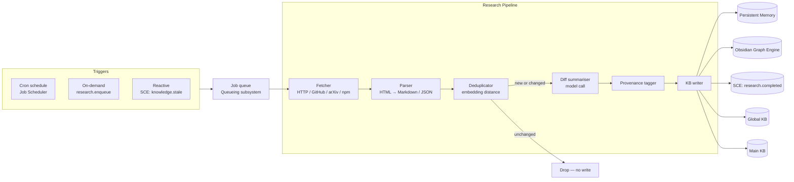

# Research Engine

> Scheduled and on-demand background research that keeps knowledge bases fresh: crawling, diffing, summarising, and provenance-tracking external knowledge. This document is normative — implementations MUST satisfy every MUST clause below.

## Overview

The Research Engine is the autonomous knowledge-acquisition subsystem of AI Dev OS. It runs scheduled crawls against configured sources (documentation sites, GitHub repos, arXiv, package registries, API changelogs), deduplicates new content against existing [Persistent Memory](./PERSISTENT_MEMORY.md) entries, produces diff summaries for changed content, and writes provenance-tracked results into the appropriate [Knowledge System](./KNOWLEDGE_SYSTEM.md) tier.

Research can be triggered three ways: **scheduled** (cron-style jobs via the [Job Scheduler](./JOB_SCHEDULER.md)), **on-demand** (user or agent calls `research.enqueue(source, query)`), and **reactive** (the [Shared Context Engine](./SHARED_CONTEXT_ENGINE.md) emits a `knowledge.stale` event that auto-triggers a targeted research job).

Every fact written by the Research Engine carries a `provenance` record: the source URL, the timestamp it was fetched, the model that summarised it, and the diff from the previous version. This allows agents to reason about how fresh and trustworthy any piece of knowledge is.

## Goals

- Scheduled crawls for language runtime docs, framework docs, provider API changelogs, and user-configured sources.
- Deduplication: only write new or changed content; compute a semantic diff summary when existing content changes.
- Provenance tracking for every ingested fact: source, fetch timestamp, summariser model, confidence score.
- Reactive freshness: when an agent flags a KB entry as stale, the Research Engine schedules an immediate targeted re-crawl.
- Web Intelligence integration: for queries that require live internet access, delegate to [Web Intelligence](./WEB_INTELLIGENCE.md) and [Internet Search](./INTERNET_SEARCH.md).

## Non-Goals

- Real-time web scraping for every agent query — that is [Web Intelligence](./WEB_INTELLIGENCE.md).
- Storing raw HTML blobs — the Engine stores parsed, structured summaries with source pointers.
- Implementation code — this repository is documentation-only (see [AI Coding Rules](./AI_CODING_RULES.md)).

## Architecture



## Source Types

The Research Engine ships built-in adapters for the following source types:

| Source type | Description | Adapter |
|-------------|-------------|---------|
| `http_docs` | HTTP/HTTPS site with a sitemap or crawlable link structure | `HttpDocsAdapter` |
| `github_repo` | GitHub repository: README, docs/, CHANGELOG, releases | `GitHubAdapter` |
| `github_issues` | GitHub Issues and PRs matching a query | `GitHubIssuesAdapter` |
| `npm_package` | npm package changelog and README | `NpmAdapter` |
| `pypi_package` | PyPI package changelog and docs | `PyPiAdapter` |
| `arxiv` | arXiv paper by ID or search query | `ArXivAdapter` |
| `rss_feed` | RSS/Atom feed | `RssAdapter` |
| `mcp_tool` | Any MCP server tool that returns structured content | `McpToolAdapter` |
| `custom` | User-defined adapter via [Plugin SDK](./PLUGIN_SDK.md) | `PluginAdapter` |

## ResearchJob Schema

```
ResearchJob {
  id:           ulid
  source: {
    type:       SourceType
    url?:       string
    repo?:      string        # for github_*
    query?:     string        # for arxiv, github_issues, search
    depth?:     number        # crawl depth for http_docs (default 2)
    selectors?: string[]      # CSS selectors to extract from HTML
  }
  cadence:      CronExpr?     # null → one-shot
  kb_target:    "global"|"main"|"group"
  kb_scope:     { workspace, project?, group? }
  tags:         string[]      # applied to every written KB entry
  last_run:     rfc3339?
  next_run:     rfc3339?
  state:        "scheduled"|"running"|"completed"|"failed"|"paused"
  artifacts:    ResearchArtifact[]
  created_by:   { id, kind }  # user | agent | cron
}

ResearchArtifact {
  id:           ulid
  job_id:       ulid
  source_url:   string
  fetched_at:   rfc3339
  content_hash: sha256        # of raw parsed content
  summary:      string        # model-generated summary
  diff_summary: string?       # summary of changes from previous version
  model_used:   string        # model that generated summary
  confidence:   number        # 0–1, estimated by critic
  kb_entry_id:  ulid?         # written to Persistent Memory
  changed:      boolean       # true if content changed from last run
}
```

## Pipeline Detail

### 1. Fetch

The Fetcher calls the appropriate adapter. Adapters MUST:
- Respect `robots.txt` for `http_docs`.
- Use the Kernel-proxied HTTP client (so all requests appear in the [Audit Log](./AUDIT_LOG.md)).
- Respect `source.depth` for recursive crawls.
- Honour per-source rate limits (configurable; see `~/.aidevos/research.toml`).
- Return `FetchResult { url, raw_content, content_type, fetched_at, status }`.

### 2. Parse

The Parser converts raw content to structured Markdown:
- HTML → Markdown via a readability-style extractor (preserving headings, code blocks, tables).
- GitHub API JSON → structured Markdown.
- arXiv XML → title + abstract + sections Markdown.
- RSS/Atom → per-item title + link + description.

### 3. Deduplicate

The Deduplicator checks whether the parsed content meaningfully differs from the most recent KB entry for the same source URL:

```
existing = memory.list({ tags: ["research_source:<url>"] }).latest()
if not existing:
  → NEW: proceed to Diff + Write
else:
  similarity = cosine_sim(embed(parsed), existing.embedding)
  if similarity > dedup_threshold (default 0.95):
    → UNCHANGED: update last_checked_at only, no KB write
  else:
    → CHANGED: proceed to Diff + Write
```

### 4. Diff Summariser

When content changes, the Diff Summariser calls a model to produce a human-readable `diff_summary`:

```
prompt: |
  Previous version (summary): {existing.summary}
  New version (parsed content): {parsed[:4000]}

  Describe what changed in 2–5 sentences. Focus on breaking changes,
  new APIs, deprecations, and important fixes. Be specific.
```

The model used is the Group's default `researcher` role binding (or the workspace default).

### 5. Provenance Tagger

Adds provenance metadata to the KB entry:

```
tags = [
  "research_source:<url>",
  "research_job:<job_id>",
  "research_adapter:<adapter_type>",
  f"confidence:{round(confidence * 10) * 10}",   # bucketed: 70, 80, 90, 100
]
refs = [{ kind: "research_artifact", id: artifact_id }]
```

### 6. KB Writer

Writes to [Persistent Memory](./PERSISTENT_MEMORY.md) via `memory.upsert`:

```
memory.upsert({
  kind:      "research_result",
  key:       f"research:{sha256(url)}",
  text:      summary,
  tags:      provenance_tags,
  refs:      provenance_refs,
  retention: "30d",
  project:   scope.project,
  group:     scope.group,
})
```

Then emits `research.completed` on the SCE with the `ResearchArtifact` as payload.

## Interfaces

```
# Job management
research.enqueue(source, opts?) → ResearchJob
research.schedule(source, cadence, opts?) → ResearchJob
research.cancel(job_id) → Ack
research.pause(job_id) → Ack
research.resume(job_id) → Ack
research.status(job_id) → ResearchJob
research.list(filter?) → ResearchJob[]

# Query (read-only)
research.artifacts(job_id) → ResearchArtifact[]
research.sources() → Source[]              # configured sources

# Events
research.subscribe() → AsyncIterator<ResearchEvent>
```

All interfaces follow the envelope from [Agent Communication](./AGENT_COMMUNICATION.md) and errors from [API Spec](./API_SPEC.md).

## Freshness Signals and Reactive Research

Agents can mark KB entries as stale by publishing a `knowledge.stale` event:

```
knowledge.stale {
  kb_entry_id:  ulid
  reason:       string        # why agent thinks it is stale
  urgency:      "low"|"normal"|"high"
  requester:    { id, role }
}
```

The Research Engine subscribes to `knowledge.stale` events and schedules an immediate targeted re-crawl if:
- The KB entry has a `research_source:<url>` tag (so the Engine knows where to re-fetch).
- The entry's `last_checked_at` is older than `min_recheck_interval` (default 1 h).

High-urgency requests skip the `min_recheck_interval` gate.

## Requirements

- **MUST** publish every state change (`job.queued`, `job.started`, `job.completed`, `job.failed`) to the SCE `group.researcher` topic.
- **MUST** write provenance metadata (`research_source:<url>`, `research_job:<id>`, model used, confidence) to every KB entry produced.
- **MUST** deduplicate against existing KB entries using semantic similarity; MUST NOT write unchanged content as a new entry.
- **MUST** respect `robots.txt` for all `http_docs` sources.
- **MUST** use the Kernel-proxied HTTP client for all outbound requests.
- **MUST** support pausing and resuming scheduled jobs without losing the cadence.
- **SHOULD** compute a `diff_summary` when content changes; diff summaries are stored separately from the full summary.
- **SHOULD** surface a confidence score (0–1) for every `ResearchArtifact`, estimated by the Critic role.
- **MAY** support pluggable adapters via the [Plugin SDK](./PLUGIN_SDK.md).
- **MAY** allow per-source proxy and rate-limit configuration in `~/.aidevos/research.toml`.

## Failure Modes

| Mode | Detection | Response |
|------|-----------|----------|
| Source unreachable | HTTP error / DNS failure | Mark job `failed`; retry with exponential backoff (max 3 attempts); emit `job.failed` |
| Parser produces empty output | Empty Markdown after parsing | Skip write; emit `research.parse_empty` warning |
| Embedding service unavailable | Vector Store write error | Write KB entry without embedding; queue for backfill; mark as `unembedded` |
| Model call fails for diff summary | Provider error | Write raw summary without diff; mark `diff_summary: null` |
| Source layout change | Parser heuristics return garbage | Alert operator; mark source `degraded`; keep previous KB entry |
| Rate limit from source | HTTP 429 | Back off exponentially; respect `Retry-After` header; surface in job status |
| Scheduler miss | Job Scheduler fails to trigger | Compensating job on next tick; emit `scheduler.miss` metric |

Every failure emits a structured event on the SCE and is recorded in the [Audit Log](./AUDIT_LOG.md).

## Security Considerations

- All outbound HTTP calls go through the Kernel-proxied client with full audit logging; no ad-hoc network access.
- Credentials for authenticated sources (GitHub tokens, API keys) are read from [Secrets Management](./SECRETS_MANAGEMENT.md) at job-start time; never stored in `ResearchJob`.
- Parsed content from untrusted sources is treated as untrusted text; it is summarised by a model before being written to the KB, preventing injection of raw HTML/JS.
- The [Architecture Guardian](./ARCHITECTURE_GUARDIAN.md) MAY veto KB writes that contain content matching security-sensitive patterns.
- See [Security Model](./SECURITY_MODEL.md) and [Privacy](./PRIVACY.md).

## Observability

| Metric | Labels | Description |
|--------|--------|-------------|
| `research_job_total` | `state=completed\|failed` | Job outcomes |
| `research_job_seconds` | `source_type` | Job duration histogram |
| `research_artifact_total` | `changed=true\|false` | Artifacts produced; changed ratio |
| `research_kb_write_total` | `kb_target` | KB entries written |
| `research_source_error_total` | `source_type`, `error` | Fetch/parse errors |
| `research_confidence_p50` | — | Median confidence score |
| `research_dedup_skip_total` | — | Entries skipped as unchanged |

Traces: one span per job run, with child spans for fetch, parse, dedup, diff, and write stages.

## Acceptance Criteria

- Scheduling a job against the TanStack Router docs produces at least one KB entry with a `research_source:https://...` tag within the first run.
- Running the same job twice on unchanged content writes zero new KB entries on the second run.
- Changing a source page produces a `diff_summary` string in the `ResearchArtifact` within the next scheduled run.
- A `knowledge.stale` event with `urgency: "high"` triggers a re-crawl within 30 s regardless of `min_recheck_interval`.
- Pausing and resuming a scheduled job preserves the cadence — the next run fires at the expected next slot after resumption.

## Examples

### Example 1: Scheduled documentation crawl

```typescript
// Schedule a weekly crawl of FastAPI documentation
const job = await research.schedule(
  {
    type: "http_docs",
    url: "https://fastapi.tiangolo.com/",
    depth: 2,
    selectors: ["article", "main"],
  },
  { cadence: "0 6 * * 1", kb_target: "main", tags: ["docs", "python", "fastapi"] }
);

// On each run:
// 1. Fetcher crawls https://fastapi.tiangolo.com/ depth 2
// 2. Parser converts HTML → structured Markdown
// 3. Deduplicator compares against existing `research_source:https://fastapi.tiangolo.com/` entry
// 4. If changed: Diff summariser produces "What's new" summary via the `researcher` model
// 5. KB Writer upserts with tags ["research_source:https://fastapi.tiangolo.com/", "research_job:<job_id>"]
// 6. SCE emits `research.completed` with the new ResearchArtifact
```

### Example 2: On-demand GitHub release monitoring

```typescript
// User requests research on latest LangChain releases
const job = await research.enqueue(
  {
    type: "github_repo",
    repo: "langchain-ai/langchain",
    depth: 1,
  },
  { kb_target: "global", tags: ["langchain", "releases"] }
);

// research.status(job.id) streams the pipeline stages:
//   enqueued → fetching → parsing → deduplicating → writing
// When status returns "completed", the artifact contains:
//   - summary: "LangChain v0.3.0 released with new tool-calling API..."
//   - diff_summary: "Breaking change: tool calling now requires explicit `tool_choice`..."
//   - model_used: "claude-sonnet-4"
//   - confidence: 0.92
```

### Example 3: Reactive freshness triggered by an agent

```typescript
// Agent detects stale KB entry about Anthropic API
await sce.publish("knowledge.stale", {
  kb_entry_id: "01J3XYZ...",
  reason: "Anthropic docs reference 'max_tokens' which was renamed to 'max_output_tokens'",
  urgency: "high",
  requester: { id: "agent-alpha", role: "developer" }
});

// Research Engine subscribes to `knowledge.stale`
// High urgency bypasses min_recheck_interval gate
// Immediate targeted re-crawl of the source URL from the KB entry's `research_source:<url>` tag
// Diff summariser detects the `max_tokens` → `max_output_tokens` rename
// KB entry updated with new summary and changed: true
```

## Open Questions

- Whether diff summaries should be stored as separate KB entries (with `kind: "research_diff"`) or as a field on the existing entry — tracked in [templates/ADR](../templates/ADR.md).
- Confidence score methodology: rule-based (recency + source authority) vs. model-evaluated (critic prompt).

## Related Documents

- [Internet Search](./INTERNET_SEARCH.md)
- [Web Intelligence](./WEB_INTELLIGENCE.md)
- [GitHub Analysis](./GITHUB_ANALYSIS.md)
- [Knowledge System](./KNOWLEDGE_SYSTEM.md)
- [Persistent Memory](./PERSISTENT_MEMORY.md)
- [RAG Pipeline](./RAG_PIPELINE.md)
- [Obsidian Graph Engine](./OBSIDIAN_GRAPH_ENGINE.md)
- [Job Scheduler](./JOB_SCHEDULER.md)
- [Queueing](./QUEUEING.md)
- [System Overview](./SYSTEM_OVERVIEW.md)
- [Main AI Kernel](./MAIN_AI_KERNEL.md)
- [Architecture Guardian](./ARCHITECTURE_GUARDIAN.md)
- [diagrams/RESEARCH_ENGINE](../diagrams/RESEARCH_ENGINE.md)
