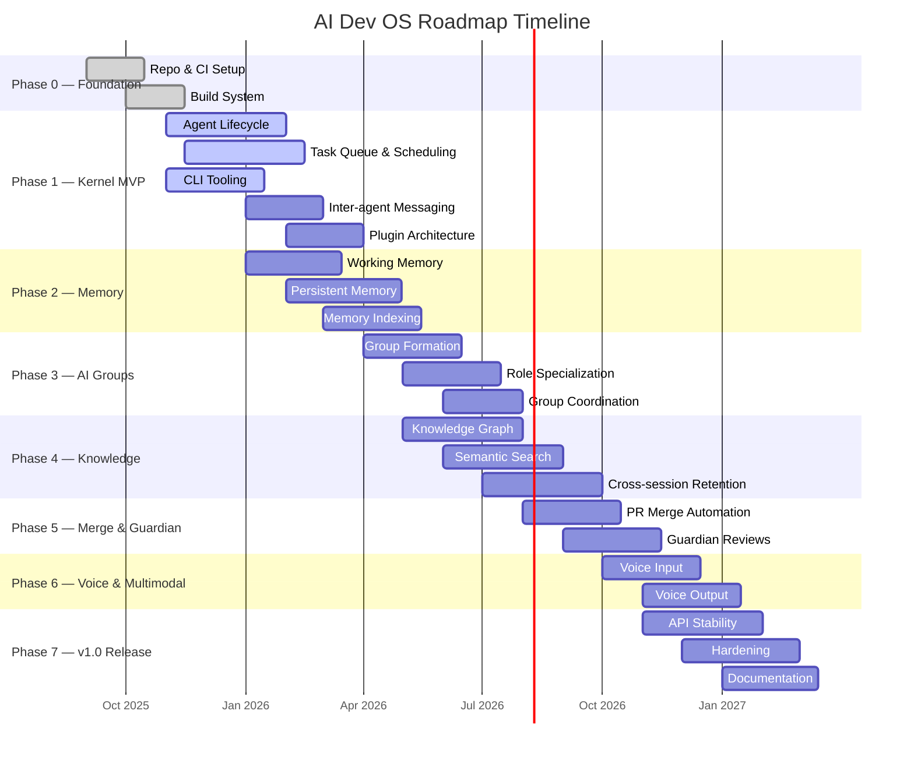
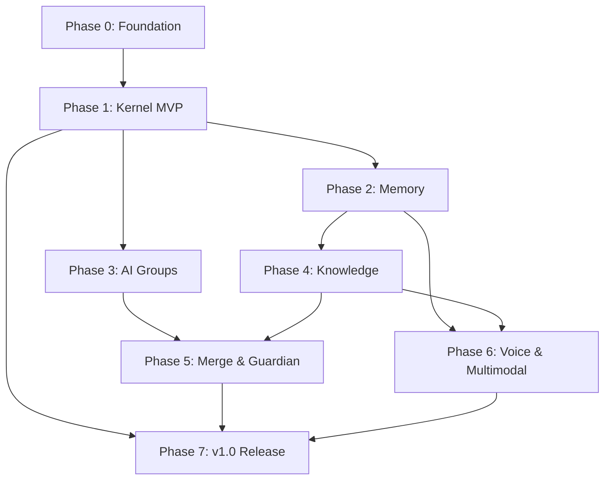

# Product Roadmap

## Overview

This document outlines the high-level strategic roadmap for AI Dev OS — a multi-agent AI operating system for software development. The roadmap covers three horizons: near-term (0–3 months), mid-term (3–6 months), and long-term (6–12 months), culminating in a v1.0 release.

---

## Current Status

| Phase | Status |
|---|---|
| Phase 0: Foundation | Complete |
| Phase 1: Kernel MVP | In development |

---

## Near-Term (Next 3 Months)

### Phase 1 — Kernel MVP

| Item | Status | Priority | Dependencies |
|---|---|---|---|
| Agent lifecycle management | In progress | P0 | Runtime |
| Task queue and scheduling | In progress | P0 | Agent lifecycle |
| Inter-agent messaging bus | Planned | P1 | Task queue |
| CLI tooling (run, logs, config) | In progress | P0 | — |
| Plugin architecture | Planned | P1 | Kernel core |

### Phase 2 — Memory & Persistence

| Item | Status | Priority | Dependencies |
|---|---|---|---|
| Working memory (short-term) | In progress | P0 | Phase 1 |
| Persistent memory (long-term) | Planned | P0 | Phase 1 |
| Memory indexing and retrieval | Planned | P1 | Persistent memory |

---

## Mid-Term (3–6 Months)

### Phase 3 — AI Groups

| Item | Status | Priority | Dependencies |
|---|---|---|---|
| Group formation protocols | Planned | P1 | Agent lifecycle |
| Role-based agent specialization | Planned | P1 | Group protocols |
| Group-level coordination | Planned | P1 | Phase 2 |

### Phase 4 — Knowledge System

| Item | Status | Priority | Dependencies |
|---|---|---|---|
| Knowledge graph ingestion | Planned | P1 | Phase 2 |
| Semantic search and retrieval | Planned | P1 | Knowledge graph |
| Cross-session knowledge retention | Planned | P1 | Phase 2 |

---

## Long-Term (6–12 Months)

### Phase 5 — Merge & Guardian

| Item | Status | Priority | Dependencies |
|---|---|---|---|
| PR merge automation | Planned | P1 | Phase 3 |
| Guardian (automated review) | Planned | P1 | Phase 3 |
| Conflict resolution | Planned | P2 | Merge |

### Phase 6 — Voice & Multimodal

| Item | Status | Priority | Dependencies |
|---|---|---|---|
| Voice input (speech-to-text) | Planned | P2 | Phase 1 |
| Voice output (text-to-speech) | Planned | P2 | Voice input |
| Image/video understanding | Planned | P2 | Phase 4 |

### Phase 7 — v1.0 Release

| Item | Status | Priority | Dependencies |
|---|---|---|---|
| API stability guarantee | Planned | P0 | All phases |
| Production hardening | Planned | P0 | All phases |
| Documentation and onboarding | Planned | P1 | v1.0 features |

---

## Vision Items

| Item | Status | Priority | Dependencies |
|---|---|---|---|
| Multi-tenant cloud | Backlog | P2 | Phase 7 |
| Agent marketplace | Backlog | P2 | Phase 7, Plugin arch |
| Fine-tuning pipeline | Backlog | P2 | Phase 4 |
| Federated knowledge base | Backlog | P2 | Phase 4 |
| Video input | Backlog | P3 | Phase 6 |

---

## Notes

- **Phase 0** completed all infrastructure scaffolding (repo, CI, build system).
- **Phase 1** is the primary focus; nothing ships before the kernel is stable.
- Strategic priority is **correctness over velocity** — we invest in eval harness, tracing, and observability early.
- Memory (Phase 2) is the highest-risk dependency for all later phases. We plan to prototype working memory alongside Phase 1 to de-risk.
- Vision items are not committed — they will be re-evaluated at each phase boundary.

---

## Roadmap Timeline Visualization

## Dependency Graph Between Phases

**Critical path:** P0 → P1 → P2 → P4 → P5 → P7. Any delay on this path directly pushes the v1.0 release date.

## Detailed Phase Breakdown with MVP Definitions

### Phase 0 — Foundation (MVP: CI green, builds passing)
- **Must-have:** Repository setup, CI pipeline, build scripts, linting, test framework
- **Acceptance:** `cargo build`, `cargo test`, `cargo clippy` all pass on every PR

### Phase 1 — Kernel MVP (MVP: single agent runs end-to-end)
- **Must-have:** Agent lifecycle (spawn, run, destroy), task queue with at-least-once delivery, CLI with `run` and `logs`
- **Acceptance:** `echo "task" | aidevos run --stdin` completes and logs are queryable

### Phase 2 — Memory (MVP: short-term recall within a session)
- **Must-have:** Working memory buffer, SQLite-backed persistent memory, basic HNSW vector index
- **Acceptance:** Agent recalls facts from earlier in the same session and from prior sessions

### Phase 3 — AI Groups (MVP: two agents collaborate on one task)
- **Must-have:** Group formation API, role assignment, inter-agent message routing
- **Acceptance:** A reviewer agent and a coder agent complete a PR review workflow

### Phase 4 — Knowledge System (MVP: queryable knowledge graph)
- **Must-have:** Entity extraction pipeline, fact store with FTS5, semantic search endpoint
- **Acceptance:** "Find all facts about module X" returns relevant results from ingested docs

### Phase 5 — Merge & Guardian (MVP: auto-merge trivial PRs)
- **Must-have:** PR analysis, auto-merge for green CI + approved, conflict detection
- **Acceptance:** A PR with 100% test coverage and approval is merged without human intervention

### Phase 6 — Voice & Multimodal (MVP: STT on audio input)
- **Must-have:** Whisper-based STT, TTS output, image attachment support in agent context
- **Acceptance:** Agent processes "describe this image" from a voice command

### Phase 7 — v1.0 Release (MVP: production-ready API stability)
- **Must-have:** API freeze, deprecation policy active, 99.9% uptime SLA, full documentation
- **Acceptance:** All previous phases stable; no breaking changes allowed post-release

## Risk Register Per Phase

| Phase | Risk | Likelihood | Impact | Mitigation |
|---|---|---|---|---|
| P1 | Agent lifecycle race conditions | Medium | High | Formal verification of state machine; extensive fuzzing |
| P2 | Vector index accuracy below threshold | Medium | High | Multiple index backends; fallback to keyword search |
| P3 | Group coordination overhead exceeds benefit | Medium | Medium | Benchmark before/after; kill switch for group mode |
| P4 | Knowledge graph query latency > 500ms | Low | High | Pre-compute embeddings; caching layer |
| P5 | False-positive auto-merge introduces bug | Low | Critical | Guardian must have human-in-the-loop for risky changes |
| P6 | Voice latency > 2s user-visible | Medium | Medium | Streaming STT; local model fallback |
| P7 | API surface scope creep delays release | High | High | Strict change control board for v1.0 |

## Milestone Definitions with Acceptance Criteria

| Milestone | Phase | Due | Acceptance Criteria |
|---|---|---|---|
| M0 — Toolchain Ready | P0 | 2025-11-15 | CI green, builds on 3 platforms, test suite runs |
| M1 — Single Agent Works | P1 | 2026-02-15 | Agent runs, logs, basic memory |
| M2 — Agents Collaborate | P3 | 2026-08-01 | Two-agent task completes end-to-end |
| M3 — Knowledge Persists | P4 | 2026-10-01 | Facts survive restart; semantic search works |
| M4 — Autonomous PRs | P5 | 2026-11-15 | PR with green CI + approval merges automatically |
| M5 — Voice Enabled | P6 | 2027-01-15 | Voice input triggers agent workflow |
| M6 — v1.0 Ships | P7 | 2027-03-15 | API stable, docs published, SLA active |

## Resource Estimation

| Phase | Eng-Months | Key Skills | Infra Cost/Month | External Dependencies |
|---|---|---|---|---|
| P0 | 2 | DevOps, Build | $200 | GitHub, CI runners |
| P1 | 8 | Rust, Distributed Systems | $500 | — |
| P2 | 6 | Databases, Embeddings | $800 | SQLite, HNSW lib |
| P3 | 4 | Protocol Design | $400 | — |
| P4 | 6 | NLP, Search | $600 | Embedding API, FTS5 |
| P5 | 4 | Git internals, CI/CD | $300 | GitHub API |
| P6 | 3 | Audio, ML inference | $1,000 | Whisper, TTS API |
| P7 | 4 | Docs, QA, SRE | $200 | — |

## Capacity Planning Notes

- **Phase 1–2**: 2 full-time Rust engineers, 1 part-time SRE.
- **Phase 3–4**: Add 1 ML engineer (NLP/search), 1 full-stack engineer.
- **Phase 5–6**: Add 1 ML engineer (audio), 1 security engineer (part-time).
- **Phase 7**: All engineers contribute to hardening; no new feature work.
- Test infrastructure scales with data volume. Plan for 3x test data growth through Phase 4.

## Market / Technology Assumption Tracking

| Assumption | Validation | Trigger for Re-evaluation | Fallback |
|---|---|---|---|
| LLM inference latency continues to decrease | Monthly benchmark | P99 > 5s for 3 months | Add speculative decoding |
| Embedding model quality improves | Quarterly eval | Recall < 80% on curated test set | Hybrid BM25 + embedding |
| Open-source voice models match cloud | Semi-annual test | WER > 10% vs cloud alternative | Use cloud API with local fallback |
| Rust ecosystem matures for AI workloads | Continuous | Missing crate causes > 2 week delay | FFI bindings to Python/C++ |

## Decision Points / Gates Per Phase

| Gate | Phase | Decision | Criteria | Decider |
|---|---|---|---|---|
| G0 — Build Review | P0 | Continue / Pivot | CI stable, team hired | Eng Lead |
| G1 — Kernel Review | P1 | Continue / Rearchitect | Single agent runs; latency budget met | Tech Lead + Architect |
| G2 — Memory Review | P2 | Continue / Replace backend | Recall ≥ 85%; latency ≤ 200ms | Eng Lead + ML Lead |
| G3 — Groups Review | P3 | Continue / Simplify | Group overhead < 20% vs single agent | Tech Lead |
| G4 — Knowledge Review | P4 | Continue / Cut scope | Query P99 ≤ 500ms; accuracy ≥ 90% | Product Manager |
| G5 — Merge Review | P5 | Ship / Hold | False-positive rate < 0.1% | QA Lead |
| G6 — Release Review | P7 | Ship / Delay | All acceptance criteria met; security audit passed | All leads |

## Success Metrics Per Phase

| Phase | Primary Metric | Target | Secondary Metric | Target |
|---|---|---|---|---|
| P1 | Agent task success rate | ≥ 95% | Latency P99 | ≤ 10s |
| P2 | Fact recall accuracy | ≥ 85% | Vector index query latency P99 | ≤ 200ms |
| P3 | Group task completion speedup | ≥ 1.5x | Coordination overhead | ≤ 20% |
| P4 | Knowledge query accuracy | ≥ 90% | Ingestion throughput | ≥ 100 docs/min |
| P5 | PR merge automation rate | ≥ 30% | False-positive merge rate | < 0.1% |
| P6 | Voice recognition accuracy | ≥ 95% WER | End-to-end voice latency | ≤ 3s |
| P7 | API stability | No breaking changes | Documentation coverage | ≥ 95% |

## Stakeholder Communication Plan

| Audience | Frequency | Channel | Content |
|---|---|---|---|
| Engineering team | Weekly | Stand-up + Slack | Phase progress, blockers, risks |
| Product management | Bi-weekly | Status report | Milestone tracking, timeline updates |
| Executive team | Monthly | Dashboard + Review | KPIs, resource needs, strategic decisions |
| Users / Community | Per release | Blog + Changelog | What's new, breaking changes, upgrade guide |
| Investors | Quarterly | Board deck | Roadmap progress, market traction |

## Quarterly Objectives Breakdown

| Quarter | Focus | Key Deliverables | Success Metric |
|---|---|---|---|
| Q4 2025 | Foundation | Phase 0 complete, Phase 1 50% | CI green; agent lifecycle implemented |
| Q1 2026 | Kernel & Memory | Phase 1 complete, Phase 2 60% | Single agent runs end-to-end; memory working |
| Q2 2026 | Memory & Groups | Phase 2 complete, Phase 3 50% | Cross-session recall; group prototype |
| Q3 2026 | Knowledge | Phase 3–4 complete | Knowledge graph operational; semantic search |
| Q4 2026 | Automation | Phase 5–6 complete | PR automation live; voice MVP |
| Q1 2027 | Release | Phase 7 complete | v1.0 shipped |

## Roadmap Failure Modes

| Failure Mode | Description | Indicators | Mitigation | Recovery |
|---|---|---|---|---|
| **Schedule slip** | Phase delivers > 30% late | Milestone dates missed; velocity drop | Buffer in critical path; cut scope | Reset expectations; re-phase remaining work |
| **Dependency failure** | External dependency breaks or delays | CI failures from upstream; API deprecation | Pin versions; maintain fallback | Swap to alternative dependency |
| **Market shift** | Competitor releases similar capability | User feedback; market analysis | Quarterly assumption validation | Pivot to differentiated features |
| **Tech risk materializes** | Key assumption proven wrong | Benchmark regression; prototype fails | Validate risky assumptions early | Fallback to simpler approach |
| **Team attrition** | Critical engineer leaves | Velocity drop; knowledge gap | Cross-training; documentation | Hire; extend timeline |
| **Scope creep** | Requirements expand beyond MVP | Feature requests per sprint > capacity | Strict gate reviews; MVP definition | Defer to post-v1.0 |

## Roadmap Observability Metrics

| Metric | Source | Alert Threshold | Description |
|---|---|---|---|
| `roadmap.phase_completion_pct` | Milestone tracker | < 80% of quarterly target | % of phase deliverables complete |
| `roadmap.schedule_variance_days` | Timeline | > 14 days variance | Days ahead/behind schedule |
| `roadmap.blocker_count` | Issue tracker | > 3 blockers | Count of P0/P1 blocker issues |
| `roadmap.risk_count` | Risk register | > 5 high-likelihood risks | Active risks requiring mitigation |
| `roadmap.burn_rate` | Finance | > 10% over budget | Monthly spend vs plan |

## Roadmap Acceptance Criteria

- [ ] All phase MVP definitions documented and approved
- [ ] Dependency graph validated and critical path identified
- [ ] Risk register populated with mitigations for each phase
- [ ] Milestones have clear, testable acceptance criteria
- [ ] Resource estimates reviewed and capacity confirmed
- [ ] Market assumptions documented with re-evaluation triggers
- [ ] Decision gates defined with deciders named
- [ ] Success metrics defined with measurable targets
- [ ] Stakeholder communication plan agreed
- [ ] Quarterly objectives align with overall roadmap
- [ ] Failure modes reviewed and recovery plans documented
- [ ] Observability metrics deployed and dashboarded

---

## Related Documents

- [Implementation Roadmap](./IMPLEMENTATION_ROADMAP.md)
- [Project Vision](./PROJECT_VISION.md)
- [Product Overview](./PRODUCT_OVERVIEW.md)
- [PRD](./PRD.md)
