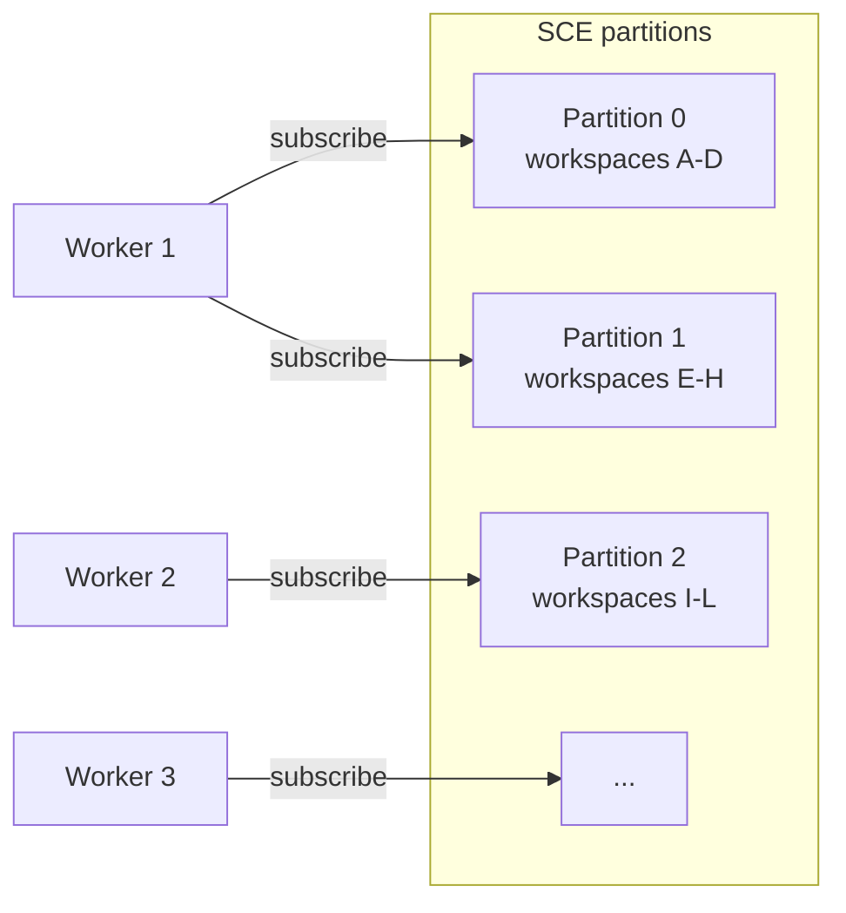

# Scalability

> How AI Dev OS scales across workers, models, storage, and users. This document is normative — implementations MUST satisfy every MUST clause below.

## Overview

AI Dev OS scales along four independent dimensions:

| Dimension | Unit | Local limit | Single-server limit | Multi-server target |
|-----------|------|-------------|---------------------|---------------------|
| Workers | Concurrent agents | 10 | 200 | 10,000 |
| Models | Discoverable providers | 5 | 50 | 500 |
| Storage | Memory records | 100K | 5M | 100M |
| Users | Concurrent sessions | 1 | 50 | 5,000 |

Each dimension can be scaled independently. A local installation with SQLite can still service 100K memory records. A multi-server deployment with 5,000 users can run on a single Postgres primary with read replicas.

## Vertical Scaling

### SQLite WAL

SQLite in WAL mode supports concurrent readers without blocking writers. Key tuning parameters:

```sql
PRAGMA journal_mode = WAL;
PRAGMA synchronous = NORMAL;          -- 10% write perf vs FULL
PRAGMA cache_size = -64000;           -- 64 MB page cache
PRAGMA mmap_size = 268435456;         -- 256 MB memory-mapped I/O
PRAGMA busy_timeout = 5000;           -- 5 s wait before SQLITE_BUSY
```

Limits:
- Single-writer throughput: ~5,000 tps (INSERT-heavy workload on NVMe)
- Concurrent readers: unlimited (WAL readers don't block)
- Total database size: practical limit ~100 GB (larger with performance degradation)
- SCE event table: ~10M rows before partition or archival needed

### Embedded vector index (usearch)

usearch runs in-process with HNSW indexing. Memory usage scales with `M` (HNSW neighbors) and vector dimensions:

```
memory_bytes ≈ num_vectors * (dimensions * 4 + M * 4 + overhead)
```

Example: 100K vectors, 768 dims, M=16 → ~320 MB. At 1M vectors: ~3.2 GB.

When memory pressure exceeds `vector_max_memory_mb` (configurable, default 2048), the vector index falls back to FTS-based semantic search and emits a `vector.memory_pressure` event.

### Context window sizing

The context window manager (see [Context Window Management](./CONTEXT_WINDOW_MANAGEMENT.md)) caches recent context in memory. Per-workspace context grows until:
- `max_context_tokens` is reached (default 128K tokens, configurable per workspace).
- The workspace's `context_memory_mb` budget is consumed (default 512 MB).

When either limit is hit, the oldest context segments are evicted to the Persistent Memory store.

## Horizontal Scaling

### Worker pool sizing

Workers are drawn from a shared pool scoped to the server instance. In multi-server mode, the pool spans all pods:

```
total_workers = min(
  max_workers_per_pod * pod_count,
  max_workers_per_group
)
```

| Config | Default | Max |
|--------|---------|-----|
| `max_workers_per_pod` | 10 | 100 |
| `max_workers_per_group` | 100 | 10,000 |
| `worker_concurrent_runs` | 3 | 20 |

Workers claim tasks from the [Priority Queue](./QUEUEING.md). When all workers in a group are saturated, new tasks remain in the queue until a worker becomes available.

### SCE partitioning

The Shared Context Engine uses topic-based partitioning:

```
topic = workspace_id / partition_count
```

Partition count is fixed at cluster creation time (default 64 for NATS, 1 for SQLite). Within a partition, events are strictly ordered. Cross-partition ordering is not guaranteed.



Each partition is assigned to a single consumer group member. Rebalancing happens when a member joins or leaves (NATS JetStream consumer group rebalance).

### Memory sharding by workspace

Persistent Memory is sharded by `workspace_id`:

```
shard_key = hash(workspace_id) % shard_count
```

Each shard maps to a Postgres schema or a separate database. Queries within a workspace hit exactly one shard. Cross-workspace queries (e.g., admin search) fan out across all shards.

### Read replicas

Postgres read replicas serve `/v1/memory` queries and SCE event tailing. Writes always go to the primary. The server uses a connection pool with read/write splitting:

```
read_conn_string  → pool for GET /v1/memory, GET /v1/context
write_conn_string → pool for POST, PUT, DELETE endpoints
```

Replica lag MUST be < 1 s for SCE events and < 5 s for memory queries. If lag exceeds `max_replica_lag_ms` (default 2000), the read pool falls back to the primary for that query.

## Key Scalability Limits

| Resource | Default limit | Maximum tested | Exceeding limit |
|----------|--------------|----------------|-----------------|
| Workers per group | 100 | 10,000 | Tasks queue; no worker available signal emitted |
| Concurrent runs per workspace | 10 | 100 | New goals enter `planning_queued`; existing runs unaffected |
| Topics per SCE | 1,000 (SQLite) / 10,000 (NATS) | 100,000 (NATS) | SCE publish latency increases; topic table grows |
| Memory records per workspace | 100,000 | 10,000,000 | Query performance degrades; index maintenance cost rises |
| Graph nodes (Knowledge System) | 10,000 | 100,000 | Graph traversal latency increases; pagination required |
| Queue items in flight | 500 | 10,000 | Backpressure activates at `soft_cap`; rejects at `hard_cap` |
| Event log retention | 1M events | 100M events | Archival to object store required; truncate oldest |
| Concurrent WebSocket connections | 100 (local) / 1,000 (server) | 10,000 | Memory per connection ~50 KB; scale horizontally |
| MCP server connections | 10 (local) / 100 (server) | 1,000 | Per-connection goroutine/thread overhead |

## Autoscaling

### Worker count based on queue depth

```
target_workers = ceil(queue_depth / tasks_per_worker)
max_workers    = min(target_workers, max_workers_per_group)
```

The HPA in Kubernetes uses the `queue_depth` external metric (see [Deployment](./DEPLOYMENT.md#hpa)). Scaling cooldown: 30 s scale-up, 5 min scale-down.

### Model provider rate limits

The Model Router maintains a rate-limit state per provider. When a provider returns HTTP 429 or `rate_limit_exceeded`:

1. The router backs off for `retry-after` seconds (or 10 s default).
2. New requests to that provider are queued in the background queue.
3. Alternative providers with available capacity are tried.
4. If all providers for a role are rate-limited, the Kernel pauses dispatch and emits `model.rate_limited`.

### Memory pressure

The memory service publishes `memory.memory_pressure` when `process_rss > memory_high_watermark_mb` (default 70% of limit). The Kernel responds by:

1. Reducing `max_workers_per_pod` by 20%.
2. Forcing a context segment eviction cycle.
3. Enabling FTS fallback for vector queries.

When RSS drops below `memory_low_watermark_mb` (default 50% of limit), the Kernel restores the original worker limit.

## Bottleneck Analysis

| Bottleneck | Symptom | Mitigation |
|------------|---------|------------|
| SCE write throughput | SCE event latency > 100 ms | Increase partition count; batch events; use NATS backend |
| Vector index rebuild | /readyz shows degraded; semantic queries fail | Schedule rebuilds during low-activity windows; use pgvector with concurrent index builds |
| Graph update latency | Knowledge System writes > 500 ms | Batch graph mutations; use async graph update queue |
| Model provider API rate limits | Tasks stuck in `executing` waiting for model response | Configure multiple providers per role; use fallback chain |
| Postgres connection pool exhaustion | `db.connection_wait` metric increases | Increase `max_connections`; add PgBouncer; tune `pool_size` per pod |
| Disk I/O on SCE events | WAL growth on SQLite; slow checkpoints | Tune checkpoint interval; switch to NATS backend; move WAL to dedicated SSD |
| Network throughput on NATS | NATS publish latency spikes under load | Use NATS leaf nodes per AZ; tune `max_payload` and `max_memory_store` |
| Object store PUT latency | Artifact uploads slow | Use S3 multipart upload; increase `object_upload_concurrency` |

## Load Testing Targets

The system MUST sustain the following loads without violating SLOs (see [Reliability](./RELIABILITY.md)):

| Target | Metric | Conditions |
|--------|--------|------------|
| 10,000 events/s on SCE | P99 publish latency < 50 ms | NATS JetStream, 3 nodes, 64 partitions |
| 100 concurrent workers | Worker claim latency < 100 ms | Priority queue, Postgres backend, 10 consumer group members |
| 1,000,000 memory records | Memory query P95 < 200 ms | pgvector, HNSW, 768-d vectors, 16 shards |
| 100,000 graph nodes | Graph traversal P95 < 500 ms | Knowledge System, 10-hop query |
| 500 concurrent WebSocket connections | Event delivery P99 < 200 ms | NATS SCE, 16 partitions |
| 10 concurrent model requests per provider | Model response end-to-end P95 < 30 s | OpenAI-compatible API, no rate limiting |

Load testing scripts are maintained in the `test/load/` directory. Results are published to [Benchmarks](./BENCHMARKS.md).

## Related Documents

- [Performance](./PERFORMANCE.md) — latency and throughput benchmarks
- [Reliability](./RELIABILITY.md) — SLOs, degradation modes, failure analysis
- [Deployment](./DEPLOYMENT.md) — topology, configuration, Kubernetes
- [Queueing](./QUEUEING.md) — queue depth, backpressure, worker scaling
- [Shared Context Engine](./SHARED_CONTEXT_ENGINE.md) — SCE partitioning
- [Persistent Memory](./PERSISTENT_MEMORY.md) — memory sharding, vector limits
- [Context Window Management](./CONTEXT_WINDOW_MANAGEMENT.md) — memory budgets
- [Model Routing Policy](./MODEL_ROUTING_POLICY.md) — fallback chains
- [Dynamic Workers](./DYNAMIC_WORKERS.md) — worker pool, checkpointing
- [Backend](./BACKEND.md) — process architecture
- [Database](./DATABASE.md) — Postgres scaling, connection pooling
- [System Overview](./SYSTEM_OVERVIEW.md)
- [Main AI Kernel](./MAIN_AI_KERNEL.md)
