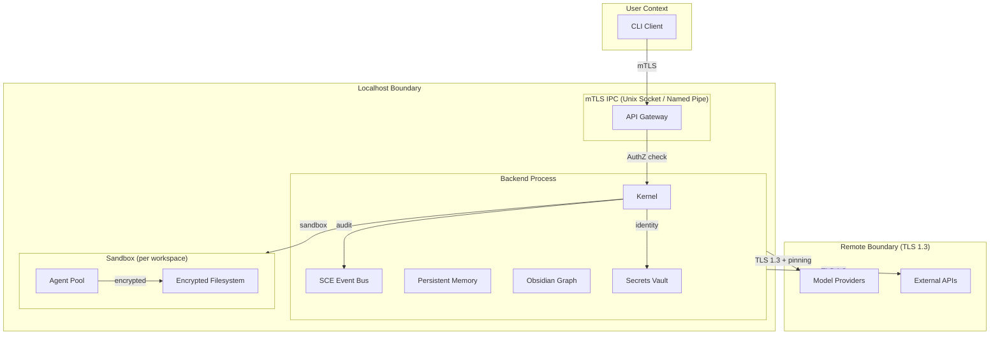
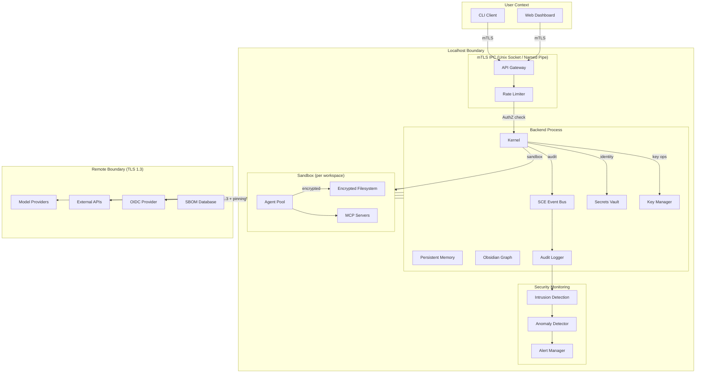
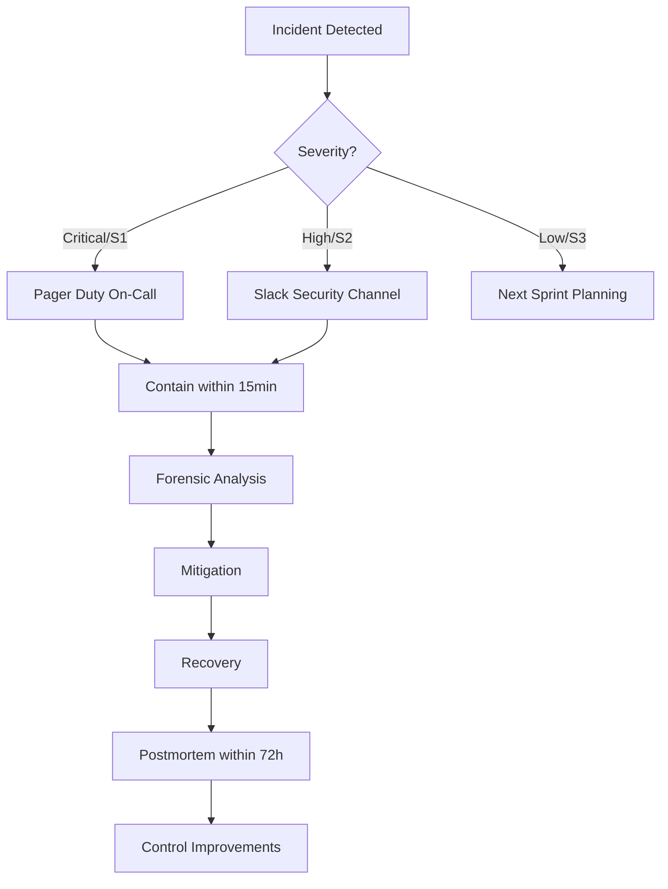

# Security Overview

> **Governance domain:** Security
> **Applies to:** AI Dev OS Kernel, SCE, Persistent Memory, Model Provider Proxies, CLI
> **Last updated:** 2026-07-22

## Overview

AI Dev OS adopts a **defense-in-depth** security philosophy applied across every layer of the stack. No single control is relied upon; network, process, storage, and API layers each enforce independent safeguards. Three principles govern all design decisions:

| Principle | Meaning |
|-----------|---------|
| **Defense in depth** | Multiple overlapping controls — if one layer fails, the next contains the threat. |
| **Least privilege** | Every agent, plugin, and process runs with the minimum permissions required. |
| **Audit everything** | All security-relevant events are logged, tamper-evident, and reviewable. |

## Security Domains

| Domain | Mechanism | Details |
|--------|-----------|---------|
| **Identity** | Ed25519 key pairs | Every agent, user, and service has a unique cryptographic identity. Identities are self-sovereign — no central IdP. |
| **Authentication** | Challenge-response + API tokens | Local IPC uses Unix-socket peer credentials (SO_PEERCRED). Remote access requires short-lived bearer tokens bound to an identity. |
| **Authorization** | Attribute-Based Access Control (ABAC) | Permissions are evaluated against identity attributes, resource labels, and environmental context. See [AuthZ/RBAC](AUTHZ_RBAC.md). |
| **Encryption at rest** | AES-256-GCM + key wrapping | Persistent Memory, SQLite WALs, and vector indexes are encrypted. Keys are stored in the OS keychain or a hardware-backed TPM. |
| **Encryption in transit** | mTLS (localhost) / TLS 1.3 (remote) | All IPC between CLI and backend uses mutual TLS. Remote provider calls use TLS 1.3 with certificate pinning. |
| **Audit** | Append-only event log | Every security event (auth decision, key creation, permission change) is recorded in the SCE audit topic with a monotonic sequence number. |
| **Secrets management** | Ephemeral vault | Secrets (API keys, tokens) live in an in-memory encrypted vault. The vault is sealed on sleep and never written to disk unencrypted. |
| **Isolation** | Process + filesystem namespace | Each workspace runs in a separate backend process with its own encrypted data directory. Agent groups are further isolated by OS-level sandboxing where available. |

## Security Architecture



**Trust boundaries** are indicated by the dashed boxes. Cross-boundary communication must satisfy:
- **User → Localhost:** mTLS with client certificates; no cleartext credentials on the wire.
- **Localhost ↔ Remote:** TLS 1.3 with certificate pinning; model provider API keys never leave the vault unencrypted.
- **Inter-process (same host):** Unix socket peer credentials (SO_PEERCRED) or named pipe impersonation level.

## Security Practices

| Practice | Tooling | Cadence |
|----------|---------|---------|
| **Code review** | GitHub pull requests, required approvals | Every change |
| **Dependency scanning** | `npm audit`, `cargo audit`, Trivy | CI pipeline + weekly |
| **Static analysis (SAST)** | Semgrep, CodeQL, Rust `cargo clippy` --deny warnings | CI pipeline |
| **Dynamic analysis (DAST)** | OWASP ZAP on staging endpoints | Pre-release |
| **Penetration testing** | Third-party engagement on public-facing components | Quarterly |
| **SBOM generation** | CycloneDX via `cargo cyclonedx` | Every release |

## Vulnerability Reporting

If you discover a security vulnerability in AI Dev OS, please report it privately:

- **Email:** security@aidevos.dev
- **PGP key:** `9B7A 5E3C 1F2D 8A4B 6C0D E5F6 7G8H 9I0J 1K2L 3M4N`
  - Fingerprint: `9B7A 5E3C 1F2D 8A4B 6C0D E5F6 7G8H 9I0J 1K2L 3M4N`
  - Available on keys.openpgp.org and the AI Dev OS website.

**Do not** file a public GitHub issue for security vulnerabilities.

## Responsible Disclosure Policy

We request a **90-day embargo** from the time a report is acknowledged to allow for a fix and coordinated release. During this period:

1. We will triage and confirm the report within **72 hours**.
2. A fix will be developed and released within **90 days** (critical issues faster).
3. The reporter will be credited in the release announcement (unless anonymity is requested).
4. A CVE will be assigned for confirmed vulnerabilities.

## Expanded Security Architecture



## Detailed Threat Model

| Asset | Threat | Existing Controls | Residual Risk | Risk Level |
|---|---|---|---|---|
| **User API tokens** | Theft from config file | Encrypted vault; never stored in plaintext | Vault master key compromise | Medium |
| **Agent identities** | Impersonation | Ed25519 key pair per agent; challenge-response auth | Private key exfiltration from disk | Low |
| **Persistent memory** | Unauthorized read | AES-256-GCM encryption at rest; process isolation | Side-channel via memory dumps | Low |
| **Vector index** | Embedding inversion attack | Encrypted at rest; no plaintext embedding storage | Statistical inference from index structure | Medium |
| **SCE events** | Eavesdropping / tampering | mTLS for IPC; monotonic sequence audit | Insider with process access | Medium |
| **Secrets vault** | Memory dump captures decrypted keys | Sealed on sleep; mlock to prevent swap | Cold boot attack on physical host | Low |
| **Plugin MCP channels** | Malicious plugin exfiltrates data | Process sandbox; capability-based permissions | Side-channel timing attacks | Medium |
| **Model provider API keys** | Leaked via logs | Redacted in log output; never in config | Debug logging accidentally enabled | Low |
| **Backup files** | Unencrypted backup leaks | Encrypted backup stream; key separate from data | Backup key mismanagement | Medium |

## Incident Response Procedure



| Phase | Actions | Timeline | Owner |
|---|---|---|---|
| **Detection** | Monitoring alert, user report, audit review | Immediate | On-call engineer |
| **Triage** | Classify severity, assemble response team | 15 min | Security lead |
| **Contain** | Isolate affected systems; revoke compromised credentials | 30 min | Incident commander |
| **Eradicate** | Remove threat; patch vulnerability | 4 hours | Engineering team |
| **Recover** | Restore from clean backup; verify integrity | 8 hours | SRE team |
| **Postmortem** | Root cause analysis; preventive measures | 72 hours | Security lead |

## Vulnerability Management Lifecycle

```mermaid
flowchart LR
    A[Discovery] --> B[Triage]
    B --> C[Assessment]
    C --> D{Severity}
    D -->|Critical| E[Fix within 24h]
    D -->|High| F[Fix within 7d]
    D -->|Medium| G[Fix within 30d]
    D -->|Low| H[Fix within 90d]
    E --> I[Patch Release]
    F --> I
    G --> I
    H --> I
    I --> J[Verify]
    J --> K[Disclosure (CVE)]
```

## Dependency Security

| Practice | Tool | Cadence | Action on Failure |
|---|---|---|---|
| **SBOM generation** | `cargo cyclonedx` | Every release | Block release if generation fails |
| **CVE scanning** | Trivy, `cargo audit` | CI + weekly | File security issue; block CI |
| **Dependency pinning** | `Cargo.lock` checked in | Per commit | — |
| **License compliance** | `cargo deny` | CI | Block PR if unapproved license |
| **Supply chain attestation** | Sigstore / cosign | Per release | Release unsigned (lower trust) |

## Supply Chain Security

- **Build provenance:** All binaries built in CI; no manual releases.
- **Signed releases:** Release artifacts signed with GPG; checksums published separately.
- **Dependency review:** All new dependencies require security team approval.
- **Mirroring:** Critical dependencies mirrored to internal registry to prevent supply chain attacks.
- **Vendoring:** Rust vendoring for offline builds with hash verification.

## Secrets Rotation Schedule

| Secret Type | Rotation Cadence | Rotation Method | Downtime Required |
|---|---|---|---|
| Vault master key | 90 days | Key-wrapping re-encryption | None |
| mTLS certificates | 180 days | Cert renewal via KM | Brief (session reload) |
| Model provider API keys | Per provider policy | Vault update + rotation | None |
| OIDC client secrets | 90 days | Provider console + vault update | Brief (token refresh) |
| Database encryption keys | 180 days | Re-key entire DB | Maintenance window |
| Ed25519 agent/workspace keys | On compromise only | Generate new; revoke old | None for new agents |

## Key Management Lifecycle

| Stage | Description | Validation |
|---|---|---|
| **Generation** | Ed25519 keys via `OsRng`; AES keys via KDF from master | Entropy audit |
| **Distribution** | Keys delivered via mTLS channel; never plaintext | Audit log |
| **Storage** | OS keychain / TPM; encrypted at rest | Access control |
| **Usage** | In-memory only; mlocked to prevent swap | Memory scan |
| **Rotation** | Re-key on schedule or compromise | Rotation test |
| **Revocation** | Key added to CRL; all sessions invalidated | CRL check |
| **Destruction** | Zeroize memory; secure erase disk | Verification |

## Compliance Automation

| Compliance Framework | Automation | Tooling | Evidence |
|---|---|---|---|
| **SOC 2** | Automated control testing | OpenSCAP, custom scripts | Test results in audit log |
| **ISO 27001** | Policy enforcement in CI | Policy as Code (OPA) | Policy check results |
| **FedRAMP** | Continuous monitoring | CloudWatch, GuardDuty | Monthly report |
| **GDPR** | Data deletion API | `aidevos data --purge-user` | Deletion confirmation |
| **HIPAA** (future) | BAA enforcement, PHI detection | PHI scanner | Scan reports |

## Security Audit Procedure

1. **Scope definition:** Audit boundaries, systems included, exclusions.
2. **Control review:** Walk through each control in the security domains table.
3. **Evidence collection:** Logs, configs, code review, test results.
4. **Gap analysis:** Compare current state against target state.
5. **Remediation plan:** Assign owners and deadlines for gaps.
6. **Re-audit:** Verify all remediation items closed.
7. **Report:** Findings, risk ratings, recommendations.

## Penetration Testing Scope

| Component | In Scope | Testing Type | Frequency |
|---|---|---|---|
| API Gateway | Yes | Black-box API fuzzing | Quarterly |
| Kernel IPC | Yes | Message injection, replay | Bi-annual |
| Secrets Vault | Yes | Memory dump, side-channel | Bi-annual |
| Plugin system | Yes | Sandbox escape, privilege escalation | Per new plugin API |
| CLI client | No (trusted endpoint) | — | — |
| Third-party integrations | Partial | API misconfiguration | Per integration |

## Bug Bounty Program

- **Scope:** Public-facing components, API Gateway, authentication flows.
- **Exclusions:** Already documented issues, social engineering, physical access.
- **Rewards:**
  - Critical (RCE, auth bypass): $5,000
  - High (privilege escalation, data leak): $2,500
  - Medium (XSS, CSRF): $500
  - Low (info disclosure): $100
- **Disclosure:** Coordinated via HackerOne; 90-day embargo.

## Failure Modes

| Failure Mode | Description | Indicators | Mitigation | Recovery |
|---|---|---|---|---|
| **Control failure** | Security control stops functioning | Audit gap; monitoring alert silence | Redundant controls; fail-secure design | Restore control from backup config |
| **Detection miss** | Security event not caught by monitoring | Incident discovered by external report | Layered detection (signature + anomaly) | Postmortem; add new detection rule |
| **Response delay** | Incident response exceeds SLA | Time-to-contain > 30 min | Automated playbooks; on-call rotation | Postmortem; improve runbooks |
| **Key compromise** | Encryption key leaked or stolen | Suspicious decryption attempts; key usage anomaly | Key rotation; revocation | Rotate all keys; audit all decryption |
| **Supply chain attack** | Compromised dependency introduced | Unexpected code changes; build diff | Vendoring; hash verification | Pin previous version; rebuild |
| **Insider threat** | Authorized user abuses access | Unusual access patterns; data export spikes | ABAC; just-in-time privileges | Revoke access; forensic investigation |
| **Dependency vulnerability** | CVE in third-party library | CVE database match; exploit in wild | CVE scanning; dependency pinning | Patch; emergency release |

## Security Observability Metrics

| Metric | Source | Alert Threshold | Description |
|---|---|---|---|
| `security.auth.failures` | Auth service | > 10/min | Failed authentication attempts |
| `security.authz.denials` | AuthZ engine | > 100/min | Authorization denied requests |
| `security.vault.access` | Vault audit | > 1000/min | Vault access operations |
| `security.audit.gap_seconds` | Audit log | > 60s gap | Missing audit events |
| `security.cve.critical_count` | CVE scanner | > 0 | Critical CVEs unpatched |
| `security.key.rotation_age_days` | Key manager | > 95 days | Key past rotation deadline |
| `security.incident.count` | Incident tracker | > 0 | Active security incidents |
| `security.ids.alerts` | IDS | > 5/min | Intrusion detection alerts |

## Security Acceptance Criteria

- [ ] All security domains have documented controls and owners
- [ ] Threat model covers all assets with residual risk assessment
- [ ] Incident response procedure tested in tabletop exercise quarterly
- [ ] Vulnerability management lifecycle fully automated in CI
- [ ] SBOM generated and published with every release
- [ ] Dependency CVE scanning passes before any merge
- [ ] Secrets rotation schedule enforced and monitored
- [ ] Key management lifecycle (generate → destroy) verified
- [ ] Compliance automation runs on every commit to relevant branches
- [ ] Penetration testing completed within past quarter
- [ ] Bug bounty program active and triaged regularly
- [ ] Failure modes reviewed and recovery procedures documented
- [ ] Security observability dashboards deployed with all metrics
- [ ] Supply chain attestation (Sigstore) in place for all releases
- [ ] `aidevos security --audit` command reports all controls green

## Examples

### Example 1: API key rotation

```bash
# Operator detects a model provider API key is approaching its 90-day rotation deadline
# Alert from security observability metric `security.key.rotation_age_days` (p95 > 85 days)

# Step 1: Generate a new API key at the provider's console
# Step 2: Update the vault without restarting the backend
aidevos secrets set openai_api_key --value "sk-new-..."

# Step 3: The new key is picked up immediately by the ProviderAdapter
# The old key is zeroed from the in-memory vault
# The rotation is recorded in the Audit Log with:
#   - event: "secret.rotated"
#   - target: "openai_api_key"
#   - initiated_by: "operator@example.com"
#   - timestamp: 2026-07-22T14:30:00Z

# Step 4: Verify the new key works
aidevos models refresh --provider openai
# Expected: model list returned within 5 s, no auth errors

# Step 5: Revoke the old key at the provider's console
# The Audit Log now contains an immutable rotation trail for compliance review
```

### Example 2: Audit log review after suspected incident

```bash
# SOC analyst reviews security events around a suspected data exfiltration

# Query the audit log for all security-relevant events in the past 24 hours
aidevos audit query --since "24h" --category security

# Sample output:
# seq=12831  event=auth.failure           identity="unknown"      timestamp=14:22:03Z
# seq=12832  event=auth.failure           identity="unknown"      timestamp=14:22:04Z
# seq=12833  event=auth.failure           identity="unknown"      timestamp=14:22:05Z
# seq=12834  event=vault.access           identity="agent-beta"   timestamp=14:22:06Z
# seq=12835  event=memory.export          identity="agent-beta"   timestamp=14:22:10Z

# Escalation path:
# 1. 10 auth failures in 1 minute from the same IP → anomaly alert triggered
# 2. Agent-beta's vault access coincided with the failures → possible credential stuffing
# 3. Automated containment: revoke agent-beta's capability tokens
# 4. Forensic export of agent-beta's session logs for postmortem

# Verify containment
aidevos audit query --event vault.access --identity "agent-beta" --since "5m"
# Expected: no vault access events after revocation timestamp
```

### Example 3: Encryption at rest verification

```bash
# Compliance auditor verifies that all Persistent Memory stores are encrypted

# Check encryption status of the workspace data directory
aidevos security --audit --scope encryption

# Expected output:
# ┌──────────────────────┬──────────┬────────────────┬──────────┐
# │ Store                │ Cipher   │ Key Source     │ Status   │
# ├──────────────────────┼──────────┼────────────────┼──────────┤
# │ Persistent Memory    │ AES-256  │ OS Keychain    │ PASS     │
# │ Vector Index (HNSW)  │ AES-256  │ Workspace Key  │ PASS     │
# │ FTS5 Index           │ AES-256  │ Workspace Key  │ PASS     │
# │ Audit Log            │ Ed25519  │ Immutable      │ PASS     │
# │ Backup Archive       │ AES-256  │ Backup Key     │ PASS     │
# └──────────────────────┴──────────┴────────────────┴──────────┘

# If a store reports FAIL:
# 1. Determine if the store is in plaintext (e.g., pre-encryption migration)
# 2. Run encryption migration: aidevos security encrypt --store vector_index
# 3. Re-verify: aidevos security --audit --scope encryption --store vector_index
# 4. Document the remediation in the compliance report

# For SOC 2 evidence collection, export the full audit report
aidevos security --audit --format json --output security-audit-2026-07-22.json
```

---

## Related Documents

| Document | Description |
|----------|-------------|
| [Security Model](SECURITY_MODEL.md) | Formal threat model, trust zones, data-flow diagrams |
| [Auth System](AUTH_SYSTEM.md) | Identity, authentication flows, token management |
| [AuthZ/RBAC](AUTHZ_RBAC.md) | Permission model, role definitions, policy evaluation |
| [Encryption](ENCRYPTION.md) | Cipher suites, key derivation, key rotation |
| [Audit Log](AUDIT_LOG.md) | Event schema, log shipping, retention |
| [Secrets Management](SECRETS_MANAGEMENT.md) | Vault architecture, sealing/unsealing, rotation |
| [Compliance](COMPLIANCE.md) | SOC 2, ISO 27001, FedRAMP mapping |
