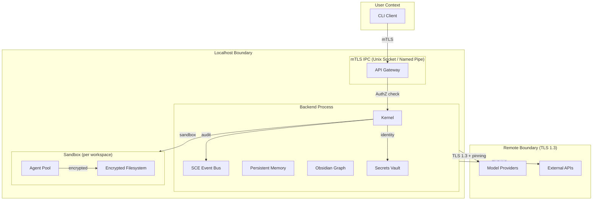

# Security Overview

> **Governance domain:** Security
> **Applies to:** AI Dev OS Kernel, SCE, Persistent Memory, Model Provider Proxies, CLI
> **Last updated:** 2026-07-22

## Overview

AI Dev OS adopts a **defense-in-depth** security philosophy applied across every layer of the stack. No single control is relied upon; network, process, storage, and API layers each enforce independent safeguards. Three principles govern all design decisions:

| Principle | Meaning |
|-----------|---------|
| **Defense in depth** | Multiple overlapping controls — if one layer fails, the next contains the threat. |
| **Least privilege** | Every agent, plugin, and process runs with the minimum permissions required. |
| **Audit everything** | All security-relevant events are logged, tamper-evident, and reviewable. |

## Security Domains

| Domain | Mechanism | Details |
|--------|-----------|---------|
| **Identity** | Ed25519 key pairs | Every agent, user, and service has a unique cryptographic identity. Identities are self-sovereign — no central IdP. |
| **Authentication** | Challenge-response + API tokens | Local IPC uses Unix-socket peer credentials (SO_PEERCRED). Remote access requires short-lived bearer tokens bound to an identity. |
| **Authorization** | Attribute-Based Access Control (ABAC) | Permissions are evaluated against identity attributes, resource labels, and environmental context. See [AuthZ/RBAC](AUTHZ_RBAC.md). |
| **Encryption at rest** | AES-256-GCM + key wrapping | Persistent Memory, SQLite WALs, and vector indexes are encrypted. Keys are stored in the OS keychain or a hardware-backed TPM. |
| **Encryption in transit** | mTLS (localhost) / TLS 1.3 (remote) | All IPC between CLI and backend uses mutual TLS. Remote provider calls use TLS 1.3 with certificate pinning. |
| **Audit** | Append-only event log | Every security event (auth decision, key creation, permission change) is recorded in the SCE audit topic with a monotonic sequence number. |
| **Secrets management** | Ephemeral vault | Secrets (API keys, tokens) live in an in-memory encrypted vault. The vault is sealed on sleep and never written to disk unencrypted. |
| **Isolation** | Process + filesystem namespace | Each workspace runs in a separate backend process with its own encrypted data directory. Agent groups are further isolated by OS-level sandboxing where available. |

## Security Architecture

**Trust boundaries** are indicated by the dashed boxes. Cross-boundary communication must satisfy:
- **User → Localhost:** mTLS with client certificates; no cleartext credentials on the wire.
- **Localhost ↔ Remote:** TLS 1.3 with certificate pinning; model provider API keys never leave the vault unencrypted.
- **Inter-process (same host):** Unix socket peer credentials (SO_PEERCRED) or named pipe impersonation level.

## Security Practices

| Practice | Tooling | Cadence |
|----------|---------|---------|
| **Code review** | GitHub pull requests, required approvals | Every change |
| **Dependency scanning** | `npm audit`, `cargo audit`, Trivy | CI pipeline + weekly |
| **Static analysis (SAST)** | Semgrep, CodeQL, Rust `cargo clippy` --deny warnings | CI pipeline |
| **Dynamic analysis (DAST)** | OWASP ZAP on staging endpoints | Pre-release |
| **Penetration testing** | Third-party engagement on public-facing components | Quarterly |
| **SBOM generation** | CycloneDX via `cargo cyclonedx` | Every release |

## Vulnerability Reporting

If you discover a security vulnerability in AI Dev OS, please report it privately:

- **Email:** security@aidevos.dev
- **PGP key:** `9B7A 5E3C 1F2D 8A4B 6C0D E5F6 7G8H 9I0J 1K2L 3M4N`
  - Fingerprint: `9B7A 5E3C 1F2D 8A4B 6C0D E5F6 7G8H 9I0J 1K2L 3M4N`
  - Available on keys.openpgp.org and the AI Dev OS website.

**Do not** file a public GitHub issue for security vulnerabilities.

## Responsible Disclosure Policy

We request a **90-day embargo** from the time a report is acknowledged to allow for a fix and coordinated release. During this period:

1. We will triage and confirm the report within **72 hours**.
2. A fix will be developed and released within **90 days** (critical issues faster).
3. The reporter will be credited in the release announcement (unless anonymity is requested).
4. A CVE will be assigned for confirmed vulnerabilities.

## Related Documents

| Document | Description |
|----------|-------------|
| [Security Model](SECURITY_MODEL.md) | Formal threat model, trust zones, data-flow diagrams |
| [Auth System](AUTH_SYSTEM.md) | Identity, authentication flows, token management |
| [AuthZ/RBAC](AUTHZ_RBAC.md) | Permission model, role definitions, policy evaluation |
| [Encryption](ENCRYPTION.md) | Cipher suites, key derivation, key rotation |
| [Audit Log](AUDIT_LOG.md) | Event schema, log shipping, retention |
| [Secrets Management](SECRETS_MANAGEMENT.md) | Vault architecture, sealing/unsealing, rotation |
| [Compliance](COMPLIANCE.md) | SOC 2, ISO 27001, FedRAMP mapping |
