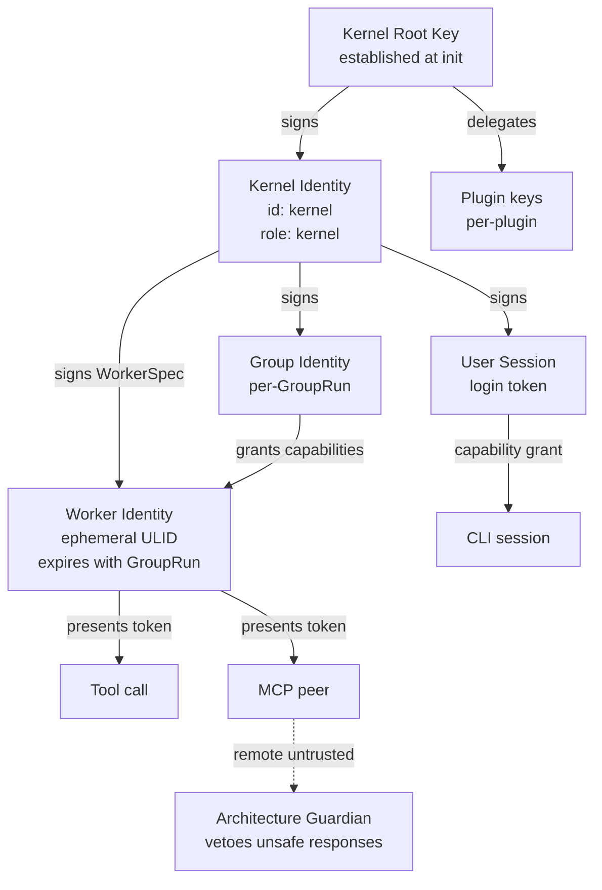

# Security Model

> The trust architecture, identity model, capability-based access control, and cryptographic guarantees that govern every interaction in AI Dev OS. This document is normative — implementations MUST satisfy every MUST clause below.

## Overview

The Security Model defines how AI Dev OS authenticates actors (human users, AI agents, Kernel subsystems, MCP peers), authorises every action through capability tokens, maintains tamper-evident audit trails, and isolates tenant data at rest and in transit. The model follows three principles:

1. **Least privilege**: every actor receives the minimum capabilities needed for its role, for the minimum duration.
2. **Defence in depth**: enforcement happens at every boundary — Kernel → Group → Worker → Tool — not just at the perimeter.
3. **Audit everything**: every authentication decision, capability grant, and access denial is recorded in the append-only Audit Log.

The trust root is the **Kernel's signing key**, established at `aidevos init`. Every subsystem validates signatures against the Kernel's public key (or a chain of delegated keys) before processing any command.

## Goals

- Identity: every actor (human, agent, subsystem) has a cryptographic identity verifiable by any other actor.
- Capability-based authorisation: actors carry signed capability tokens, not ambient authority.
- Tamper-evident audit: all security-relevant events are written to an append-only, hash-chained audit log.
- Tenant isolation: data and execution contexts for different workspaces are cryptographically separated.
- Zero secrets in transit or at rest: all secrets are fetched on-demand from Secrets Management; never inlined.

## Non-Goals

- Network-level security (TLS/mTLS) — assumed at the transport layer; see [Deployment](./DEPLOYMENT.md).
- User authentication for the cloud dashboard — owned by [Auth System](./AUTH_SYSTEM.md).
- Implementation code — this repository is documentation-only (see [AI Coding Rules](./AI_CODING_RULES.md)).

## Trust Architecture



### Key Hierarchy

| Key type | Generation | Storage | Rotation |
|----------|-----------|---------|----------|
| Kernel root (Ed25519) | `aidevos init` | `~/.aidevos/keys/kernel.secret` (encrypted) | Manual, requires re-signing all delegated keys |
| Agent ephemeral (Ed25519) | On spawn by AGS | In-memory only | Every GroupRun |
| Plugin (Ed25519) | On plugin install | `~/.aidevos/keys/plugins/<id>.secret` | On plugin reinstall |
| User session (Ed25519) | On login | OS keychain | Per session |
| Workspace encryption (AES-256-GCM) | On workspace create | Secrets Management | On-demand via re-key |

### Identity Format

```
Identity {
  id:        string        # "kernel" | "system" | ULID for agents | user_id for humans
  kind:      "kernel" | "agent" | "plugin" | "user" | "mcp_peer"
  role:      NineRole | "system" | "operator" | "user"
  group_id?: string        # set for agents
  run_id?:   string        # set for agents
}
```

Identities are serialised into signed capability tokens (JWT-like but using Ed25519):

```
CapabilityToken {
  id:          ulid
  issuer:      Identity
  subject:     Identity            # who this token is issued to
  capabilities: string[]           # e.g. ["memory:read", "tool:file_write"]
  scope:       { workspace, project?, group? }
  issued_at:   rfc3339
  expires_at:  rfc3339             # tokens always have an expiry
  not_before?: rfc3339
  signature:   string              # Ed25519 signed by issuer
}
```

## Authentication

### Human Users

Authentication is handled by the [Auth System](./AUTH_SYSTEM.md). AI Dev OS authenticates humans via:

1. **Local mode**: `~/.aidevos/config.toml` identity; no remote auth needed.
2. **Cloud mode**: OAuth 2.0 / OpenID Connect with configurable providers.
3. **CLI tokens**: `aidevos auth login` obtains a session token stored in the OS keychain.

### AI Agents

Agents are authenticated by their capability token, issued by the Kernel at spawn time:

```
verify(token):
  1. Load issuer's public key from Key Registry
  2. Verify Ed25519 signature on token
  3. Check expiry: token.expires_at > now
  4. Check scope: token.scope matches requested operation
  5. Check capability: requested_operation in token.capabilities
  → if any check fails: deny with AUTH_DENIED
```

### MCP Peers

Remote MCP peers are treated as untrusted. Authentication happens at connection time:

1. Peer presents its certificate or pre-shared key.
2. Kernel issues a scoped `CapabilityToken` for the session.
3. Every tool call re-verifies the token's capabilities.

See [MCP](./MCP.md) for the consent flow.

## Authorisation (Capability-Based)

AI Dev OS uses **capability-based access control**, not role-based access control (RBAC alone). RBAC defines role-to-permission mappings (see [AuthZ/RBAC](./AUTHZ_RBAC.md)); capabilities are the runtime instantiation of those permissions for a specific actor and scope.

### Capability Types

| Category | Capability | Description |
|----------|-----------|-------------|
| Kernel | `kernel.submit` | Submit a goal |
| Kernel | `kernel.cancel` | Cancel a run |
| Kernel | `kernel.replay` | Replay a run |
| Run | `run.read` | Read run state and events |
| Run | `run.write` | Modify run state |
| Memory | `memory.read` | Query persistent memory |
| Memory | `memory.write` | Write to persistent memory |
| Memory | `memory.delete` | Delete memory records |
| KB | `kb.read.global` | Read Global KB |
| KB | `kb.write.main` | Write to Main KB (requires elevated role) |
| Tool | `tool.<name>` | Call a specific native tool |
| Tool | `tool.mcp.<server>.<tool>` | Call an MCP tool |
| Plugin | `plugin.<id>.call` | Call a plugin |
| Config | `config.read` | Read configuration |
| Config | `config.write` | Modify configuration |
| Admin | `admin.groups` | Manage Groups |
| Admin | `admin.providers` | Manage provider configuration |

### Capability Resolution

```
resolve_capabilities(actor, task, group_spec):
  base = group_spec.tools                          # from GroupSpec
  role_caps = role_defaults[task.role]             # system-defined per role
  actor_caps = intersect(base, role_caps)          # least privilege
  token = CapabilityToken {
    subject: actor.identity,
    capabilities: actor_caps,
    scope: { workspace, project, group: group_spec.id },
    expires_at: now + task.budget.wall_ms_max
  }
  return sign(token, kernel_private_key)
```

## Audit Trail

Every security-relevant event is written to the Audit Log:

```
SecurityEvent {
  id:          ulid
  ts:          rfc3339
  kind:        "auth_success" | "auth_denied" | "capability_granted"
             | "capability_denied" | "signature_failure" | "key_rotation"
             | "consent_granted" | "consent_revoked" | "tenant_isolation_violation"
  actor:       Identity
  target?:     Identity
  detail:      string
  correlation_id: uuid
  prev_hash:   string    # SHA-256 of previous SecurityEvent (hash chain)
  signature:   string    # signed by Kernel
}
```

The Audit Log is hash-chained: each event includes `prev_hash`, making it tamper-evident. See [Audit Log](./AUDIT_LOG.md) for the full schema and query API.

## Tenant Isolation

| Resource | Isolation mechanism |
|----------|---------------------|
| Persistent Memory | `workspace` column on every record; mandatory filter on every query |
| SCE topics | Namespace prefix per workspace (`ws.<id>.<topic>`) |
| Filesystem | `~/.aidevos/data/<workspace_id>/` directory tree |
| Processes | Worker processes run in OS-level process isolation (container-ready) |
| Encryption keys | Per-workspace AES-256-GCM keys in Secrets Management |

Cross-workspace access is denied at the API layer. No query, subscribe, or command can span workspaces.

## Encryption

| Layer | Algorithm | Key management |
|-------|-----------|----------------|
| At rest (memory records) | AES-256-GCM | Per-workspace key from Secrets Management |
| At rest (config files) | age (X25519 + ChaCha20-Poly1305) | Kernel keypair |
| In transit (local IPC) | Unix socket permissions (0700) | Operating system |
| In transit (remote) | TLS 1.3 | Let's Encrypt or self-signed |
| Envelope signatures | Ed25519 | Per-actor keypair from Key Registry |
| Audit log | SHA-256 hash chain + Ed25519 | Kernel keypair |

## Secret Handling

Secrets NEVER appear in:
- Configuration files
- SCE event payloads
- Memory records
- Log output
- Error messages
- Capability tokens

Secrets are fetched from [Secrets Management](./SECRETS_MANAGEMENT.md) at the point of use, scoped to the requesting actor's lifetime, and released on task completion.

## Requirements

- **MUST** use capability tokens for all inter-subsystem authorisation; ambient authority is not permitted.
- **MUST** sign every inter-subsystem envelope with Ed25519; recipients MUST verify before processing.
- **MUST** maintain a hash-chained audit log of all security-relevant events.
- **MUST** enforce tenant isolation at the query and storage layers; cross-tenant access MUST be denied.
- **MUST** encrypt all persistent memory records at rest with per-workspace keys.
- **MUST** expire all capability tokens; tokens MUST NOT be long-lived (max `task.budget.wall_ms_max`).
- **MUST** fetch secrets on-demand from Secrets Management; MUST NOT cache or inline them.
- **SHOULD** support key rotation for workspace encryption keys without data loss.
- **SHOULD** emit `security.signature_failure` events on the SCE when signature verification fails.
- **MAY** support hardware-backed key storage (TPM, YubiKey) for the Kernel root key.

## Failure Modes

| Mode | Detection | Response |
|------|-----------|----------|
| Signature verification failure | `ed25519.verify` returns false | Reject envelope; emit `security.signature_failure`; record in audit log |
| Token expired | `expires_at < now` | Return `AUTH_DENIED` with `reason: "token_expired"` |
| Capability insufficient | Requested op not in token.capabilities | Return `CAPABILITY_DENIED` with detail; audit |
| Key compromise (suspected) | Operator reports or anomaly detection | Revoke key; rotate all dependent tokens; force re-auth |
| Tenant isolation breach | Cross-workspace query returns data | Quarantine workspace; alert operator; forensic audit |
| Secrets Management unavailable | Fetch returns error | Fail open for read-only ops with degraded warning; fail closed for write ops |

## Observability

| Metric | Labels | Description |
|--------|--------|-------------|
| `security_auth_total` | `kind=auth_success\|auth_denied` | Authentication decisions |
| `security_capability_total` | `kind=granted\|denied` | Capability checks |
| `security_signature_failure_total` | `sender` | Failed signature verifications |
| `security_token_expiry_total` | — | Token expiry events |
| `security_key_rotation_total` | `key_type` | Key rotations |

Traces: one span per capability resolution; one span per signature verification. See [Tracing](./TRACING.md).

## Acceptance Criteria

- An agent presenting an expired capability token receives `AUTH_DENIED` with `reason: "token_expired"` and the event appears in the audit log.
- A worker that attempts to call a tool not in its `capabilities[]` list receives `CAPABILITY_DENIED` and continues executing.
- Tampering with an audit log entry (modifying past events) is detectable by hash-chain verification.
- A query from workspace A that requests workspace B's memory records returns empty results (not an error leak).
- Key rotation completes for a 10k-record workspace without data loss and without downtime.

## Open Questions

- Whether to support mutual TLS (mTLS) for remote MCP server connections in addition to the capability token model — tracked in [templates/ADR](../templates/ADR.md).
- Whether audit log hash chains should be published periodically to a transparency log (CT-like) for third-party verification.

## Related Documents

- [Auth System](./AUTH_SYSTEM.md) — human user authentication
- [AuthZ/RBAC](./AUTHZ_RBAC.md) — role-to-permission mappings
- [Audit Log](./AUDIT_LOG.md) — append-only event store
- [Secrets Management](./SECRETS_MANAGEMENT.md) — credential storage and retrieval
- [Encryption](./ENCRYPTION.md) — at-rest and in-transit encryption details
- [Agent Communication](./AGENT_COMMUNICATION.md) — envelope signing and verification
- [Key Registry](./SYMBOL_REGISTRY.md) — public key lookup
- [System Overview](./SYSTEM_OVERVIEW.md)
- [Main AI Kernel](./MAIN_AI_KERNEL.md)
- [Architecture Guardian](./ARCHITECTURE_GUARDIAN.md)
