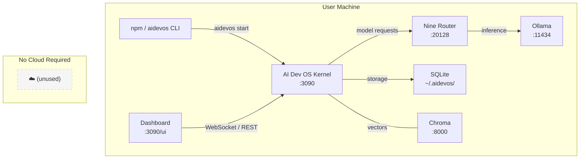

# Self-Hosting

> Operational guide: the AI Development Operating System is designed to run entirely on your own hardware. No cloud account, no telemetry sink, no external control plane required.

## Overview

Self-hosting the AI Dev OS means running every component on infrastructure you control — your laptop, a workstation, a home server, or an air-gapped machine. The entire system is packaged as a single npm package (`aidevos`) that installs, configures, and manages all subsystems via a CLI.

There is no SaaS tier, no mandatory registration, and no phone-home endpoint. The system is fully operational from the moment `npm install -g aidevos` completes. All model inference, storage, routing, and orchestration happens locally.

Self-hosting covers: installation via npm, Nine Router setup, dashboard access, Docker deployment, upgrades, health checks, logging, monitoring with local tools, and operational procedures for keeping the system running.

## Goals

- Single-command installation from npm with zero external dependencies
- All subsystems start and communicate on localhost with no cloud handshake
- Dashboard accessible at `http://localhost:3090` immediately after install
- Graceful upgrade path via `npm update -g aidevos` with zero-data-loss guarantees
- Health checks produce machine-parseable output for local monitoring (Nagios, monit, systemd healthchecks)
- Logs are local files under `~/.aidevos/logs/` — never shipped to external aggregators
- Docker image provides an alternative deployment path for users who prefer containers
- Offline installation supported via tarball for air-gapped environments

## Non-Goals

- Providing a managed cloud hosting platform — that is a separate product
- Multi-tenant isolation — self-hosting is single-user by design
- Automatic scalability — the system is optimized for single-machine workloads
- Replacing Kubernetes or Docker Compose for production orchestration — those are user's choice

## Architecture



The self-hosted architecture has no external callouts. Every arrow in the diagram resolves to `127.0.0.1` or a Unix socket. The only process that touches the network is the Dashboard HTTP server, and it binds to localhost by default.

## Configuration

### Minimal Configuration

No configuration file is required to start. The default values produce a fully functional system:

```toml
# ~/.config/aidevos/config.toml (auto-generated on first start)
[general]
data_dir = "~/.aidevos"
log_level = "info"

[nine_router]
endpoint = "http://localhost:20128"
api_key = ""  # generated on first start

[dashboard]
host = "127.0.0.1"
port = 3090
tls = false  # not needed for localhost

[providers]
default = "ollama"
```

### Override via Environment

```bash
export AIDEVOS_DATA_DIR=/mnt/ssd/aidevos
export AIDEVOS_CONFIG_DIR=/etc/aidevos
export AIDEVOS_LOG_LEVEL=debug
export AIDEVOS_NINE_ROUTER_PORT=20128
export AIDEVOS_DASHBOARD_PORT=3090
export AIDEVOS_NO_COLOR=1
```

### Port Allocation

| Port | Service | Override Env Var |
|------|---------|------------------|
| 20128 | Nine Router | `AIDEVOS_NINE_ROUTER_PORT` |
| 3090 | Dashboard / Kernel | `AIDEVOS_DASHBOARD_PORT` |
| 11434 | Ollama (default) | N/A (config in Nine Router) |
| 8000 | Chroma (optional) | N/A (config in Nine Router) |

## Interfaces

### CLI

```
aidevos init         # Generate default config, install deps
aidevos start        # Start all subsystems (Nine Router, Kernel, Dashboard)
aidevos stop         # Graceful shutdown
aidevos restart      # Stop + start
aidevos status       # Print health of all services
aidevos logs         # Tail logs
aidevos doctor       # Diagnostic check
aidevos update       # npm update + migration
aidevos config       # Print current config
```

### Health Check Endpoint

`GET http://localhost:3090/health` returns:

```json
{
  "status": "ok",
  "uptime_seconds": 84321,
  "services": {
    "nine_router": { "status": "ok", "latency_ms": 2 },
    "ollama": { "status": "ok", "latency_ms": 45 },
    "chroma": { "status": "ok", "latency_ms": 3 },
    "sqlite": { "status": "ok", "size_mb": 128 }
  },
  "version": "0.12.4"
}
```

### Programmatic API

All CLI operations are available via the Node.js API:

```js
import { start, stop, health } from '@aidevos/sdk';

const server = await start({ nineRouterPort: 20128 });
const status = await health();
await stop(server);
```

## Failure Modes

| Failure | Symptom | Recovery |
|---------|---------|----------|
| Port conflict (20128 in use) | `aidevos start` exits with EADDRINUSE | Change port via env var or kill existing process |
| Ollama not installed | Nine Router returns 502 on model requests | Install Ollama or configure alternative provider |
| SQLite disk full | Writes fail with SQLITE_FULL | Free disk space under `~/.aidevos/` |
| Corrupt SQLite DB | Kernel crashes on startup | Restore from `~/.aidevos/backups/` or run `aidevos doctor --repair` |
| npm package broken | `aidevos` command not found | Reinstall: `npm uninstall -g aidevos && npm install -g aidevos` |
| Node.js version mismatch | CLI fails silently or throws on import | Check `node --version` >= 18.x |
| Permission denied | Can't write to `~/.aidevos/` | Ensure home directory is writable; check `DATA_DIR` |
| Docker port mapping conflict | Container exits immediately | Change host port mapping (`-p 3091:3090`) |
| Config file parse error | `aidevos start` shows TOML parse error | Run `aidevos doctor` to validate config |
| Chroma not running | Vector queries fail | Start Chroma or switch to LanceDB |
| Memory pressure | Kernel OOM-killed | Reduce model context window or add swap |

## Observability

| Metric | Labels | Description |
|--------|--------|-------------|
| `self_hosting_uptime_seconds` | — | Gauge: time since last aidevos start |
| `self_hosting_service_status` | `service` | Gauge: 1 if service is healthy, 0 if degraded/down |
| `self_hosting_service_latency_ms` | `service` | Health check latency per service |
| `self_hosting_memory_usage_bytes` | — | RSS memory of the Kernel process |
| `self_hosting_disk_usage_bytes` | `path` | Disk usage of data directories |
| `self_hosting_active_sessions` | — | Current number of active CLI/Kernel sessions |
| `self_hosting_startup_duration_seconds` | — | Time from aidevos start to all services healthy |

Events: `self_hosting.service_status_changed { service: "nine_router", from: "ok", to: "down" }` published on SCE.

Health check endpoint (`GET /health`) provides machine-parseable JSON output for integration with local monitoring tools (Nagios, monit, systemd healthchecks, Datadog agent).

Recommended local monitoring setup:
```
# systemd service healthcheck (every 30s)
curl -sf http://localhost:3090/health || systemctl restart aidevos

# Prometheus node_exporter + textfile collector
aidevos status --format=prometheus > /var/lib/node_exporter/textfile/aidevos.prom
```

## Security

- All services bind to `127.0.0.1` by default — no network exposure
- Nine Router generates a random API key on first start, stored in `~/.config/aidevos/secrets.json`
- The Dashboard does not serve TLS on localhost; port-forwarding users should add a reverse proxy
- SQLite databases are encrypted at rest using the OS keyring binding
- Audit logs capture every CLI invocation and Kernel API call
- No telemetry, crash reports, or usage data leave the machine
- The Docker container runs as non-root user `aidevos` (UID 1001)
- npm install verifies package integrity via `--registry` and checksum

## Related Documents

- [Local Deployment](./LOCAL_DEPLOYMENT.md)
- [Local Model Providers](./LOCAL_MODEL_PROVIDERS.md)
- [Local-First Architecture](./LOCAL_FIRST_ARCHITECTURE.md)
- [Local Storage](./LOCAL_STORAGE.md)
- [Local Security](./LOCAL_SECURITY.md)
- [Nine Router Integration](./NINE_ROUTER_INTEGRATION.md)
- [Project Vision](./PROJECT_VISION.md)
- [Installation](./INSTALLATION.md)
