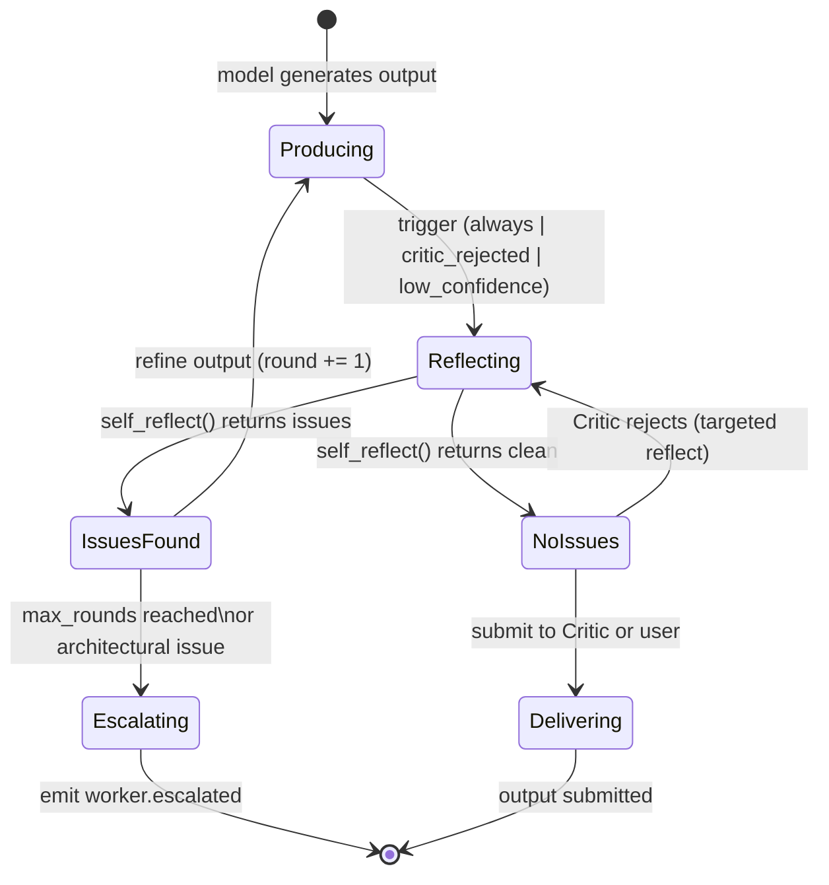

# Self Reflection

> How AI agents in AI Dev OS evaluate, critique, and improve their own outputs before delivery — including the reflection loop, confidence scoring, and escalation triggers. This document is normative — implementations MUST satisfy every MUST clause below.

## Overview

Self-reflection is the mechanism by which an agent evaluates the quality of its own output before submitting it to the critic or delivering it to the user. It is a lightweight, fast self-check that runs inside the [Dynamic Worker](./DYNAMIC_WORKERS.md) process, using the same model that produced the output (or a configured fallback model for the reflection call).

Reflection is not the same as the external Critic role. The Critic is a separate agent with a broader context and stricter standards, designed to catch issues the producer agent cannot see. Self-reflection is the producer's own quality check — it catches obvious errors (syntax mistakes, omissions, contradictions) before the output leaves the worker.

The reflection cycle follows four steps: **output → self-review → identify issues → refine → re-submit**. The cycle runs at most `max_reflection_rounds` times (default 3) before the agent either delivers or escalates.

## Goals

- Catch obvious errors (broken code, missing sections, hallucinated APIs) before the Critic sees the output, reducing critic workload and iteration time.
- Provide a structured confidence score that the Critic and Kernel can use to decide whether deep review is needed.
- Escalate quickly when reflection detects a problem the agent cannot fix alone (architectural decisions, missing context), avoiding wasted rounds.

## Non-Goals

- Replacing the Critic — self-reflection is a producer-side quality gate, not an independent review.
- Fixing architectural problems — reflection refines the output, not the plan. If the plan is wrong, the agent escalates.
- Implementation code — this repository is documentation-only (see [AI Coding Rules](./AI_CODING_RULES.md)).

## Reflection Triggers

Self-reflection is triggered in three scenarios:

### 1. Before Delivery (default)

Every output passes through self-reflection before being submitted to the Critic or delivered to the user. The agent composes the output, then calls `self_reflect(output)` to generate a reflection assessment. If the assessment identifies issues, the agent enters the reflection loop.

This trigger is configurable in `WorkerSpec.reflection_policy`:
- `always` (default): reflect every output.
- `skip_if_minor`: skip reflection for outputs estimated under 50 tokens (simple acknowledgements, status updates).
- `never`: bypass self-reflection entirely (used for high-speed, low-risk tasks like simple lookups).

### 2. After Critic Rejection

When the Critic returns a `critique.rejected` verdict with specific issues, the worker enters a targeted reflection cycle focused on those issues. The worker does not re-reflect the entire output — it only reflects on the items the Critic flagged.

```
on critic_rejected(verdict):
  1. Extract issue list from verdict.issues[]
  2. For each issue, call self_reflect_fix(output, issue)
  3. Apply all fixes
  4. Submit to Critic again (up to max_critic_rounds)
```

### 3. On Low Confidence

When a model call returns with an unusually low probability or the agent's internal confidence (based on token logprobs where available) falls below `confidence_threshold` (default 0.6), reflection is automatically triggered even if the output appears syntactically valid. This catches cases where the model is uncertain about its output despite producing plausible-looking text.

## Reflection Loop



### Reflection Assessment Schema

The reflection call produces a structured assessment:

```
ReflectionAssessment {
  confidence:      number        # 0.0–1.0
  issues:          Issue[]
  risk_level:      "low" | "medium" | "high"
  requires_escalation: boolean
  summary:         string
}

Issue {
  severity:        "minor" | "major" | "critical"
  category:        "syntax" | "correctness" | "completeness"
                 | "safety" | "style" | "architecture"
  description:     string
  suggestion:      string?       # how to fix
  affected_lines:  number[]?     # line numbers in output
}
```

### Refinement

When issues are found, the agent refines the output and re-runs reflection:

```
refine_output(original_output, issues):
  return model.generate(
    system_prompt + "\nRefine the following output based on these issues:\n"
    + issues.map(i => `- [${i.severity}] ${i.description}: ${i.suggestion}`).join("\n")
    + "\n\nOriginal output:\n" + original_output
    + "\n\nRefined output:"
  )
```

Each refinement round is clearly labelled in the context so the model knows it is in a correction loop. The round number is injected into the system prompt as `reflection_round: N`.

## Confidence Scoring

Confidence is a composite score from three signals:

| Signal | Weight | Source |
|--------|--------|--------|
| Token logprobs | 40% | Mean of top-1 token logprobs across output (normalised 0–1). Available from OpenAI, Anthropic (beta), and local models. |
| Self-consistency | 35% | The model generates the same output twice with different temperature (0.0 and 0.3). Score is semantic similarity between the two outputs. |
| Reflection score | 25% | The model's own assessment of whether the output is correct (from `ReflectionAssessment.confidence`). |

```
confidence = 0.4 * normalize(logprob_mean)
           + 0.35 * semantic_similarity(output_t0, output_t03)
           + 0.25 * reflection_assessment.confidence
```

When provider logprobs are unavailable (e.g., Gemini, Mistral), the weight is redistributed: self-consistency becomes 55%, reflection score becomes 45%.

**Confidence thresholds:**

| Range | Meaning | Action |
|-------|---------|--------|
| 0.9–1.0 | High confidence | Deliver directly, skip Critic if `min_critic_confidence` ≤ 0.9 |
| 0.7–0.89 | Moderate confidence | Submit to Critic for review |
| 0.5–0.69 | Low confidence | Force reflection loop; shorten output if possible |
| < 0.5 | Very low confidence | Escalate immediately; do not deliver |

## When to Escalate Instead of Self-Reflect

Self-reflection is designed for refinable issues — syntax errors, missing detail, stylistic improvements. It is NOT designed for fundamental problems. The agent MUST escalate (not reflect) in these situations:

| Condition | Escalation reason | Escalation target |
|-----------|-------------------|-------------------|
| `reflection_round > max_reflection_rounds` (default 3) | Reflection loop is not converging | Kernel: emit `worker.escalated { reason: "reflection_limit" }` |
| Issue category is `"architecture"` | The plan itself is wrong; refining the output cannot fix it | Kernel: emit `worker.escalated { reason: "architectural_change_needed", issues }` |
| Issue category is `"safety"` with severity `"critical"` | Potential safety violation; needs human review | Guardian + Human: emit `safety.refusal` |
| Confidence < 0.5 after 1 reflection round | The model is fundamentally uncertain | Kernel: reassign to different model or escalate to human |
| Required context is missing | Agent cannot access the information needed to produce correct output | Kernel: request additional context via memory recall or RAG re-query |

Escalation emits a `worker.escalated` event on the SCE with the full reflection history, model output, and issue list. The Kernel then decides whether to replan, reassign, or request human input.

## Integration with Critic Role and Eval Harness

### Critic Role

Self-reflection and the [Critic role](./AI_GROUPS.md) are complementary:

- Self-reflection is an **internal** quality gate inside the producer worker. It is fast (one extra model call), cheap, and catches surface-level issues.
- The Critic is an **external** quality gate — a separate agent with a different role, system prompt, and perspective. The Critic has access to the full task context and can reject an output that the producer's self-reflection missed.

The integration flow:
```
Producer → self_reflect → clean? → Critic → approved? → deliver
                              ↓                    ↓
                          refine             producer.reflect(critic_issues)
```

When the Critic rejects an output, the producer enters a targeted reflection loop on the Critic's issues only (not a full re-reflection of all output). This prevents the producer from over-correcting parts the Critic did not flag.

### Eval Harness

Self-reflection quality is itself evaluated by the [Eval Harness](./EVAL_HARNESS.md). Every major release runs:

1. **Reflection accuracy eval**: a suite of outputs with known errors (syntax, correctness, completeness). The eval measures what fraction the agent's self-reflection correctly identifies (`reflection_recall`) and what fraction of its flagged issues are true positives (`reflection_precision`).
2. **False positive rate**: how often self-reflection flags a correct output as having issues. High false positive rates waste rounds and increase latency.
3. **Escalation appropriateness**: given outputs with architectural problems, how often the agent escalates vs. attempting to reflect.

Target metrics for v1.0: reflection_recall ≥ 0.85, reflection_precision ≥ 0.80, escalation_appropriateness ≥ 0.95.

## Acceptance Criteria

- An output with a syntax error (missing closing brace, invalid import) MUST be caught by self-reflection before leaving the worker.
- A model that produces 3 consecutive reflections without resolving all issues MUST escalate with `reason: "reflection_limit"`.
- When the Critic rejects with `["missing_error_handling"]`, the producer's targeted reflection MUST only address error handling, not re-reflect the entire output.
- An architectural issue in the output MUST trigger escalation, not refinement.
- The confidence score MUST be reproducible: given the same output and model, two reflection calls produce the same confidence score within ±0.05.

## Open Questions

- Whether to support a "reflection-only" agent role that other workers can delegate their reflection to, parallelising the quality check — tracked in [templates/ADR](../templates/ADR.md).
- Whether reflection should use a different model than the producer (e.g., use a stronger model for reflection on a weaker producer's output).

## Related Documents

- [Agent Lifecycle](./AGENT_LIFECYCLE.md) — full state machine including reflection and escalation
- [Critic Prompt](./MASTER_PROMPT.md) — the Critic role's review criteria and prompt
- [Dynamic Workers](./DYNAMIC_WORKERS.md) — worker execution loop with reflection hook
- [Eval Harness](./EVAL_HARNESS.md) — automated evaluation of reflection quality metrics
- [AI Groups](./AI_GROUPS.md) — how the Critic role is assigned in a group specification
- [System Overview](./SYSTEM_OVERVIEW.md)
- [Main AI Kernel](./MAIN_AI_KERNEL.md)
