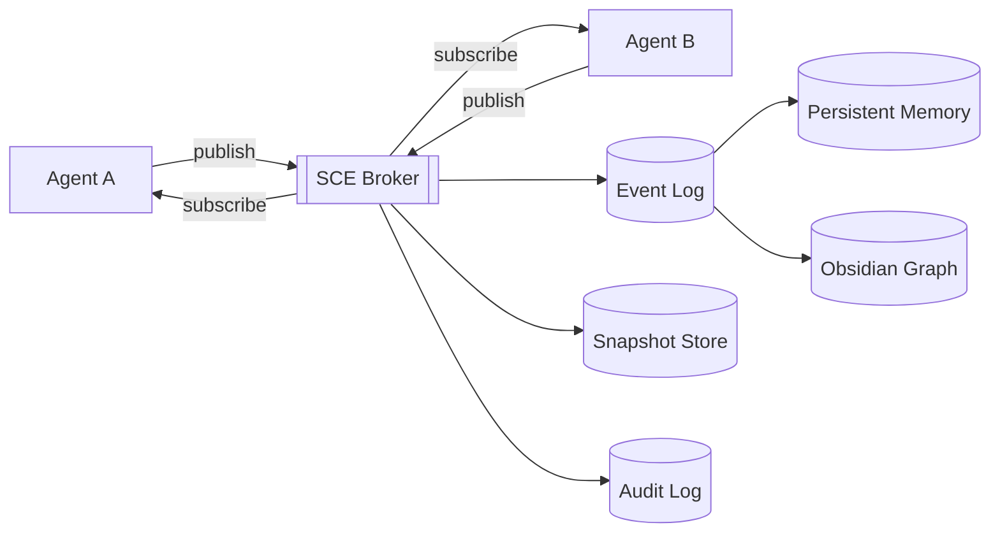
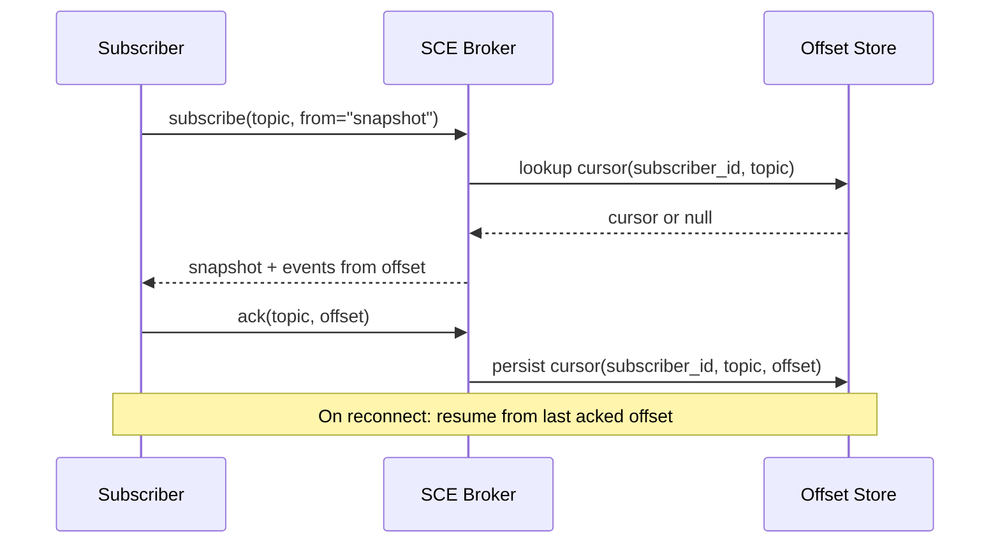

# Shared Context Engine

> The durable, subscribable **source of truth** shared by every agent, subsystem, and UI. If it isn't on the Context Engine, it didn't happen.

## Overview

The Shared Context Engine (SCE) is the append-only event log plus snapshot store that carries every meaningful state transition in AI Dev OS. It replaces ad-hoc shared memory, per-agent scratchpads, and cross-service RPC state. Every subsystem in this repo publishes to and reads from the SCE — the [Main AI Kernel](./MAIN_AI_KERNEL.md) enforces this as an invariant.

## Goals

- One log, strong per-topic ordering, at-least-once delivery.
- Snapshots for fast recovery and cheap catch-up subscribers.
- Pluggable backends behind a stable interface: SQLite (local, default), Postgres (remote), NATS/JetStream (streaming), Kafka (large deployments).
- Fully local-first — SCE works with zero network dependencies.
- Deterministic replay for any single topic or correlation id.

## Non-Goals

- Free-form key/value storage — use [Persistent Memory](./PERSISTENT_MEMORY.md) for durable knowledge.
- Large-blob transport — publish a pointer to [Vector Store](./VECTOR_STORE.md) or object storage instead.
- Cross-tenant fan-out — tenants get isolated topic namespaces; there is no global bus.

## Requirements

- **MUST** guarantee per-topic FIFO ordering.
- **MUST** deliver every accepted event at least once to every live subscriber.
- **MUST** support snapshot + tail: a new subscriber gets `(snapshot, offset)` and then a live stream from `offset`.
- **MUST** attach `correlation_id` and `causation_id` to every event.
- **MUST** authenticate publishers and enforce topic ACLs.
- **SHOULD** dedupe by `event.id` on the read path.
- **MAY** offer topic compaction for last-writer-wins projections.

## Architecture



See also [diagrams/CONTEXT_ENGINE](../diagrams/CONTEXT_ENGINE.md).

## Interfaces

```
ctx.publish(topic, event) → { id, offset }
ctx.subscribe(topic, from?: offset|"snapshot") → AsyncIterator<Event>
ctx.snapshot(topic) → { offset, state }
ctx.query(topic, filter) → Event[]        // bounded, indexed
ctx.ack(topic, offset)                    // durable cursor for a subscriber
ctx.compact(topic, keyFn)                 // last-writer-wins projection
```

Envelope and error rules come from [Agent Communication](./AGENT_COMMUNICATION.md) and [API Spec](./API_SPEC.md).

## Data Model

```
Event {
  id:             ulid            # monotonic per broker
  topic:          string          # e.g. "run.<ulid>", "router.assignments"
  ts:             rfc3339
  actor:          { id, role }
  correlation_id: uuid            # groups events for one user goal
  causation_id:   ulid|null       # id of the event that caused this one
  schema:         { name, version } # JSON Schema handle
  payload:        object
  sig:            base64          # Kernel or agent signature
}
```

### Topic conventions

| Topic pattern          | Purpose                                    | Retention             |
| ---------------------- | ------------------------------------------ | --------------------- |
| `run.<run_id>`         | Kernel loop events for a single run        | 90d, then compacted   |
| `router.assignments`   | Model role assignments and changes         | forever, compacted    |
| `models.discovery`     | Model discovery reports                    | 30d                   |
| `guardian.verdicts`    | Architecture Guardian outputs              | forever               |
| `group.<group_id>`     | AI Group coordination events               | 90d                   |
| `memory.writes`        | Persistent memory write log                | forever               |

Retention is governed by [Data Retention](./DATA_RETENTION.md).

## Delivery & Ordering

- Per-topic FIFO. Cross-topic order is not guaranteed.
- At-least-once; consumers MUST be idempotent by `event.id`.
- Subscriber cursors are durable via `ctx.ack`; unacked events replay on reconnect.
- Backpressure: publishers see `429 Slow` when a topic exceeds its soft cap; the Kernel converts this into worker throttling.

## Failure Modes

| Mode                     | Response                                                                 |
| ------------------------ | ------------------------------------------------------------------------ |
| Backend unavailable      | Publishers write to local WAL; broker replays on recovery                |
| Slow subscriber          | Cursor lags; broker warns after `slow_subscriber_seconds` threshold      |
| Corrupt event            | Quarantine to `deadletter.<topic>`; alert; do not block topic            |
| Snapshot drift           | Rebuild snapshot from log; mark snapshot `provisional` during rebuild    |
| Clock skew across nodes  | Broker rewrites `ts` with broker-side monotonic clock; original preserved |

Every failure is mirrored to the [Audit Log](./AUDIT_LOG.md).

## Security

- Publishers authenticate via [Auth System](./AUTH_SYSTEM.md); topic ACLs via [AuthZ/RBAC](./AUTHZ_RBAC.md).
- Payloads are encrypted at rest per [Encryption](./ENCRYPTION.md); sensitive fields MAY be tokenized.
- Signatures on every event enable end-to-end verification even across pluggable backends.
- Tenants are isolated at the topic-namespace level; no cross-tenant subscribe.

## Observability

Metrics: `sce_publish_total{topic}`, `sce_deliver_lag_seconds{topic,subscriber}`, `sce_deadletter_total{topic}`, `sce_snapshot_build_seconds{topic}`. Full guidance in [Observability](./OBSERVABILITY.md) and [Metrics](./METRICS.md).

## Acceptance Criteria

- 10k events/s on SQLite backend on commodity laptop, p99 publish < 5 ms.
- Cold subscriber attaches to a 1 M-event topic via `snapshot + tail` in < 2 s.
- Killing the broker mid-publish loses no acknowledged event on restart.
- Replay of a `correlation_id` reproduces the exact ordered sequence.

## Topic Management API

The SCE exposes a topic management interface for administrative operations:

```
ctx.topics.list() → TopicInfo[]
ctx.topics.create(name, opts?: { retention, compact }) → Ack
ctx.topics.delete(name) → Ack
ctx.topics.info(name) → TopicInfo
ctx.topics.stats(name) → TopicStats
```

```
TopicInfo {
  name:         string
  event_count:  u64
  oldest_offset: u64
  latest_offset: u64
  retention:    string    # e.g. "90d"
  compacted:    boolean
  created_at:   rfc3339
}
```

Topics are created implicitly on first publish if they do not exist. Explicit creation allows configuring retention and compaction policies upfront.

## Cursor Management

Subscribers track their position via durable cursors:

```
cursor = { subscriber_id, topic, offset, last_acked, created_at, status }
```



## Snapshot Creation Algorithm

```
function createSnapshot(topic):
    lock = acquireReadLock(topic)
    try:
        state = {}
        for each event in topic from oldest to latest:
            state = applyEvent(state, event)
        snapshot = {
            topic: topic,
            offset: topic.latest_offset,
            state: state,
            ts: now(),
            checksum: hash(state)
        }
        persistToStore(snapshot)
        markSnapshotProvisional(topic, false)
        return snapshot
    finally:
        releaseReadLock(topic)
```

Snapshots are built asynchronously on first request and cached. A background compaction task rebuilds snapshots periodically (configurable, default 1 hour) for topics with active subscribers.

## Consistency Model

| Guarantee | Scope | Details |
|-----------|-------|---------|
| Strong consistency | Per-topic read-your-writes | A publisher reads its own writes within the same connection |
| Eventual consistency | Cross-topic | No ordering guarantees across different topics |
| Monotonic read | Per-subscriber | A subscriber never sees an older offset after seeing a newer one |
| Read-after-fork | Snapshot + tail | A new subscriber sees a consistent snapshot and then all subsequent events |

## Partitioning Strategy

For backends that support partitioning (NATS/JetStream, Kafka):

- Topics are partitioned by `topic` name.
- Within a partition, FIFO ordering is guaranteed.
- Partitions are assigned to broker nodes using consistent hashing.
- The SQLite backend uses a single partition (no distribution).
- The partitioning key is always the topic name; cross-topic transactions are not supported.

## Delivery Guarantees

| Guarantee | Implementation |
|-----------|---------------|
| At-least-once | Events are re-delivered on reconnect if not acknowledged |
| Per-topic FIFO | Single-writer principle per topic partition |
| Bounded lag | `max_lag_events` (default 10,000) before backpressure |
| No global order | Cross-topic ordering is not guaranteed |
| Idempotent delivery | `event.id` deduplication on the read path |

## Failure Modes (Expanded)

| Mode | Detection | Response |
|------|-----------|----------|
| Backend unavailable | Connection refused | Publishers write to local WAL; broker replays on recovery |
| Slow subscriber | Cursor lags > `slow_subscriber_seconds` (default 30s) | Broker warns; may disconnect subscriber after grace period |
| Corrupt event | Schema validation fails | Quarantine to `deadletter.<topic>`; alert; do not block topic |
| Snapshot drift | Checksum mismatch on rebuild | Rebuild snapshot from log; mark snapshot `provisional` during rebuild |
| Clock skew across nodes | Broker <-> publisher time delta > 1s | Broker rewrites `ts` with broker-side monotonic clock; original preserved |
| Partition leader loss | JetStream leader election timeout | Automatic failover; pending publishes are retried |
| WAL corruption | SQLite integrity check fails | Recover from last good checkpoint; replay from backup |
| Subscriber starvation | No events for > `starvation_threshold` | Emit `subscriber.starved` event; log warning |

## Observability / Metrics

| Metric | Type | Labels | Description |
|--------|------|--------|-------------|
| `sce_publish_total` | Counter | topic | Events published |
| `sce_deliver_lag_seconds` | Gauge | topic, subscriber | Current subscriber lag |
| `sce_deadletter_total` | Counter | topic | Events sent to dead letter |
| `sce_snapshot_build_seconds` | Histogram | topic | Time to build snapshot |
| `sce_active_subscribers` | Gauge | topic | Current subscriber count |
| `sce_topic_depth` | Gauge | topic | Events per topic |
| `sce_wal_bytes` | Gauge | backend | WAL file size |
| `sce_backend_errors_total` | Counter | backend, error | Backend operation errors |

## Acceptance Criteria (Expanded)

- 10k events/s on SQLite backend on commodity laptop, p99 publish < 5 ms.
- Cold subscriber attaches to a 1 M-event topic via `snapshot + tail` in < 2 s.
- Killing the broker mid-publish loses no acknowledged event on restart.
- Replay of a `correlation_id` reproduces the exact ordered sequence.
- A slow subscriber lagging > 30 s is disconnected and can reconnect to resume from last ack.
- A corrupt event on topic `foo` is quarantined to `deadletter.foo` and does not block other topics.
- Snapshot rebuild on a 100k-event topic completes in < 1 s.
- Publishing 100 events to topic `bar` and then subscribing from `snapshot` returns all 100 events in order.

## Related Documents

- [Event Bus](./EVENT_BUS.md) · [Persistent Memory](./PERSISTENT_MEMORY.md) · [Audit Log](./AUDIT_LOG.md) · [Agent Communication](./AGENT_COMMUNICATION.md) · [Main AI Kernel](./MAIN_AI_KERNEL.md) · [Architecture Guardian](./ARCHITECTURE_GUARDIAN.md) · [diagrams/CONTEXT_ENGINE](../diagrams/CONTEXT_ENGINE.md)
