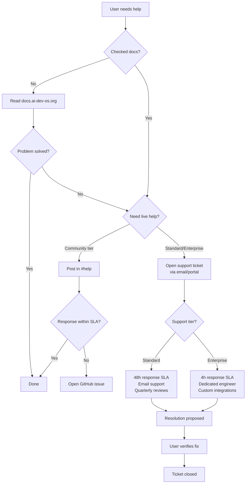

# Support

## How to Get Help

### GitHub Issues

Report bugs and request features at
[github.com/ai-dev-os/ai-dev-os/issues](https://github.com/ai-dev-os/ai-dev-os/issues).

Before opening a new issue:
- Search existing issues (both open and closed) to avoid duplicates.
- Use the provided issue templates — they are enforced by GitHub
  Forms and ensure we have all information needed to help you.
- Include the output of `ai-dev-os doctor` and relevant log excerpts
  from `~/.ai-dev-os/runs/`.
- Remove or redact sensitive information such as API keys, tokens,
  and personal data before posting.
- Issues that do not follow the template may be closed without review.

### Discord Community

Join the AI Dev OS Discord server for community support, discussions,
and announcements. This is the fastest way to get help from
maintainers and other users in real time.

The server is organized into several channels:
- `#help` — general assistance and troubleshooting
- `#showcase` — share what you have built with AI Dev OS
- `#development` — contributor discussions and technical deep dives
- `#announcements` — release notes and project updates

Please review the channel descriptions and use the appropriate
channel for your message. [Invite link](https://discord.gg/ai-dev-os)

### Documentation

The full documentation is available at
[docs.ai-dev-os.org](https://docs.ai-dev-os.org) and is organized
into the following sections. Start here before opening an issue or
posting in Discord:

- [Getting Started](GETTING_STARTED.md) — installation, initial
  configuration, and running your first task
- [FAQ](FAQ.md) — answers to common questions by category
- [Troubleshooting](TROUBLESHOOTING.md) — solutions to common
  problems organized by symptom
- [CLI Reference](CLI.md) — complete command reference for the
  `ai-dev-os` CLI including all subcommands and flags
- [API Reference](API_SPEC.md) — REST and gRPC API documentation for
  programmatic access and integration
- [Architecture Overview](../diagrams/ARCHITECTURE.md) — high-level system
  design and component descriptions

### Stack Overflow

Tag questions with `[ai-dev-os]` on Stack Overflow for community
answers. This is useful for integration questions — CI/CD pipeline
configuration, IDE integration, Docker setup, and deployment
patterns — that benefit from broad visibility and searchability.

## Bug Reports

When filing a bug report, include the following information to help
us diagnose and fix the issue quickly. Incomplete reports may be
delayed or closed:

1. **Environment**: OS version, AI Dev OS version (`ai-dev-os
   version`), model provider(s) and model names, Docker version
   (if used), and hardware specs (CPU, RAM, GPU).
2. **Expected behavior**: A clear, concise description of what you
   expected to happen.
3. **Actual behavior**: A clear, concise description of what
   actually happened, including full error messages, stack traces,
   and unexpected output.
4. **Reproduction steps**: A minimal, complete, and verifiable
   sequence of commands or actions. Include exact task descriptions
   if applicable. Assume a fresh installation with defaults.
5. **Logs and diagnostics**: Full output of `ai-dev-os doctor` and
   relevant run logs (`ai-dev-os logs <run-id> --all`). For crashes
   include the daemon log at `~/.ai-dev-os/daemon.log`.
6. **Configuration**: A sanitized copy of `~/.ai-dev-os/config.yaml`
   with all API keys, tokens, and secrets removed.

## Feature Requests

Feature requests are reviewed by the core team every sprint cycle.
When submitting one:

- Describe the problem you are solving, not just a proposed
  solution. This helps evaluate alternative approaches.
- Explain how the feature benefits the broader community, not just
  your specific use case.
- Include examples, wireframes, or mockups if applicable.
- Tag the issue with the `enhancement` label.

Large or controversial features should be discussed in a GitHub
Discussion before filing a formal issue.

## Security Disclosures

For security vulnerabilities, **do not** open a public issue. Send
details to `security@ai-dev-os.org`. We follow a 90-day coordinated
disclosure timeline:

- Acknowledgment within 48 hours.
- Initial assessment and patch timeline within 5 business days.
- Credit in release notes and security advisory (unless you request
  anonymity).
- No legal action against researchers acting in good faith.

## Commercial Support

Commercial support, SLAs, on-premises deployments, and custom
integrations are available through the AI Dev OS Foundation.
Contact `enterprise@ai-dev-os.org` for pricing and availability.

Available support tiers:

- **Community**: Best-effort via Discord and GitHub. No SLA. Free.
- **Standard**: 48-hour response SLA, email support, quarterly
  update reviews.
- **Enterprise**: 4-hour response SLA, dedicated support engineer,
  priority feature requests, custom integrations, on-premises
  deployment support.

## Support Flow



## Support Ticket Lifecycle

```
1. TICKET CREATED — User submits via email (support@ai-dev-os.org) or portal
2. TRIAGE — Support team categorizes (bug / feature / config / question) and assigns priority
3. INVESTIGATION — Engineer assigned; reproduces issue; identifies root cause
4. RESOLUTION — Fix provided as patch, config change, or documentation update
5. VERIFICATION — User confirms the fix works in their environment
6. CLOSURE — Ticket closed; resolution recorded in knowledge base
7. FOLLOW-UP — For Standard/Enterprise: post-resolution review within 5 business days
```

### Priority Matrix

| Priority | Definition | Examples | Target Response |
|----------|-----------|----------|-----------------|
| **P0 — Critical** | System down, data loss, security breach | Kernel crash loop, SCE data corruption | 1 hour (Enterprise) / 4 hours (Standard) |
| **P1 — High** | Major feature broken, no workaround | Router fails on all providers, memory persistence lost | 4 hours (Enterprise) / 24 hours (Standard) |
| **P2 — Medium** | Feature broken, workaround exists | One provider adapter fails, CLI flag ignored | 24 hours (Enterprise) / 48 hours (Standard) |
| **P3 — Low** | Minor issue, cosmetic, documentation | Typo in docs, UI alignment off | Next release (Enterprise) / Best effort (Standard) |

## Escalation Matrix

| Level | Role | Authority | Trigger |
|-------|------|-----------|---------|
| **L1** | Support Engineer | Triage, known issues, config fixes | Ticket created |
| **L2** | Senior Engineer | Code-level debugging, workarounds | L1 cannot resolve in SLA time |
| **L3** | Core Maintainer | Architecture changes, design decisions | L2 identifies a fundamental system issue |
| **L4** | Human Operator (Enterprise) | Escalation for procedural conflicts | Only for on-premises deployments |

## SLI / SLO Definitions

| SLI | Definition | SLO Target | Measurement |
|-----|-----------|------------|-------------|
| **Ticket acknowledgment** | Time from ticket creation to first human response | ≤ 30 min (Enterprise) / ≤ 2h (Standard) | 90th percentile |
| **Ticket resolution (P0)** | Time to deploy a fix for critical issues | ≤ 4h (Enterprise) / ≤ 12h (Standard) | 95th percentile |
| **Ticket resolution (P1)** | Time to deploy a fix for high-priority issues | ≤ 24h (Enterprise) / ≤ 72h (Standard) | 90th percentile |
| **Ticket resolution (P2)** | Time to deploy a fix for medium-priority issues | ≤ 5 business days (Enterprise) / ≤ 10 business days (Standard) | 90th percentile |
| **Community response** | Time to first response on Discord #help | ≤ 4h during business hours | Best effort, no SLO |
| **Security disclosure acknowledgment** | Time to acknowledge a security report | ≤ 48h | 100th percentile |

## Support Hours

| Tier | Hours | Coverage |
|------|-------|----------|
| **Community** | Best effort, no guaranteed hours | Discord + GitHub Issues |
| **Standard** | 09:00–18:00 UTC, Mon–Fri | Email support, 48h max response |
| **Enterprise** | 24/7/365 | Dedicated engineer on-call rotation, 4h max response for P0 |

## Failure Modes

| Mode | Detection | Response |
|------|-----------|----------|
| Ticket queue overflow | > 50 open tickets | Auto-respond with FAQ links; recruit additional L1 engineers |
| SLA breach | Missed response time for P0 ticket | Page on-call engineering manager; escalate to L3 directly |
| Discord channel spam | > 100 messages/hour in #help | Enable slow mode; deploy moderation bot |
| Knowledge base stale | Support answer contradicted by current docs | Flag doc for update; notify documentation team |
| Email delivery failure | Bounce notification from support inbox | Switch to portal-based ticketing; notify user via Discord DM |

## Observability

| Metric | Labels | Description |
|--------|--------|-------------|
| `support_tickets_total` | `priority`, `tier` | Tickets created by priority and support tier |
| `support_resolution_seconds` | `priority` | Time to resolution by priority |
| `support_sla_breach_total` | `priority` | SLA breaches by priority level |
| `support_first_response_seconds` | `tier` | Time to first human response |
| `support_csat_score` | — | Customer satisfaction score (1-5) from post-closure survey |

## Acceptance Criteria

- Submitting a ticket via email generates an auto-acknowledgment within 5 minutes.
- A P0 ticket from an Enterprise customer pages the on-call engineer within 1 hour.
- Community-tier users posting in Discord #help receive a response from a maintainer or community member within 4 hours during business hours.
- The support knowledge base is searchable from the portal and returns relevant previous resolutions for similar ticket topics.
- Post-resolution, a CSAT survey is sent automatically and results are aggregated in the support dashboard.

## Related Documents

- [FAQ](FAQ.md) — frequently asked questions
- [Troubleshooting](TROUBLESHOOTING.md) — common problems and solutions
- [Code of Conduct](CODE_OF_CONDUCT.md) — community guidelines
- [Contributing](CONTRIBUTING.md) — how to contribute
