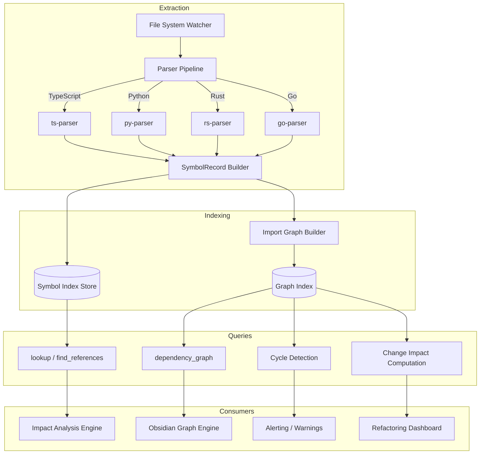
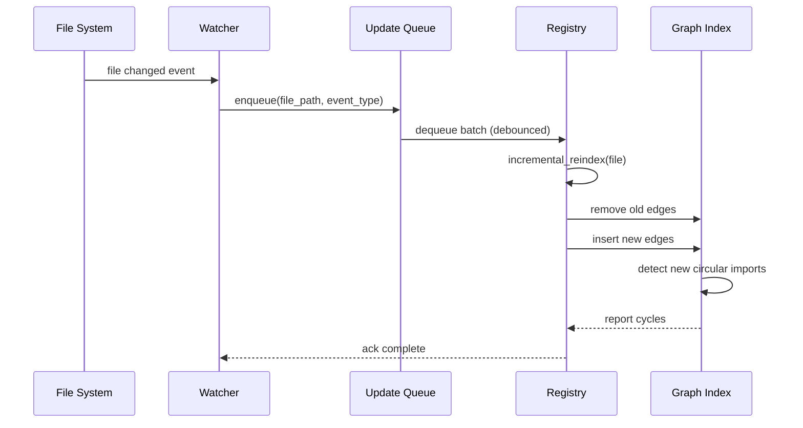

# Symbol Registry

**Component ID:** core.symbol-registry  
**Status:** Active  
**Version:** 1.0.0  
**Last Updated:** 2026-07-22

---

## Overview

The Symbol Registry provides a centralized index of all named symbols (functions, classes, variables, types, interfaces) declared across the codebase. It is the foundation for impact analysis, dependency resolution, and cross-module navigation.

Without a symbol registry, the system has no way to answer questions like "which files depend on this function?" or "if I change this class, what breaks?" — making refactoring, deletion, and renaming dangerous operations. The registry solves this by maintaining an always-up-to-date, queryable map of every symbol and its relationships.

The registry is decoupled from any single parser or language. Language-specific extractors (Python, TypeScript, Rust, Go) push symbol records into the same schema, enabling unified analysis across polyglot projects.

---

## Symbol Schema

Each registered symbol is stored as a `SymbolRecord`:

| Field       | Type               | Description                                        |
|-------------|--------------------|----------------------------------------------------|
| `name`      | `string`           | Fully qualified symbol name (e.g. `auth.login`)    |
| `kind`      | `SymbolKind`       | Enum: `function`, `class`, `variable`, `type`, `interface`, `enum`, `method`, `property`, `parameter` |
| `file`      | `string`           | Absolute path to the declaring file                |
| `line`      | `number`           | 1-indexed line number of declaration               |
| `column`    | `number`           | 0-indexed column number                            |
| `exports`   | `boolean`          | Whether the symbol is exported from its module     |
| `imports`   | `Array<ImportRef>` | Symbols this file imports, with source paths       |
| `docstring` | `string?`          | Optional doc comment extracted from source         |
| `tags`      | `Array<string>`    | Optional classification tags (e.g. `deprecated`, `internal`) |

An `ImportRef` is defined as:

```typescript
interface ImportRef {
  source: string;       // Module path or package name
  importedName: string; // Name as used locally
  exportedName: string; // Name in the source module
}
```

---

## Interfaces

### `registry.register(symbol: SymbolRecord): void`

Inserts or updates a symbol. If a symbol with the same `name` and `file` already exists, it is overwritten. The registry re-indexes all import edges after registration.

```typescript
registry.register({
  name: "auth.verify_token",
  kind: "function",
  file: "/src/auth/tokens.ts",
  line: 42,
  column: 0,
  exports: true,
  imports: [
    { source: "jsonwebtoken", importedName: "verify", exportedName: "verify" }
  ]
});
```

### `registry.lookup(name: string, scope?: string): SymbolRecord | null`

Looks up a symbol by fully qualified name. An optional `scope` parameter scopes the search to a specific module. Returns `null` if not found.

### `registry.find_references(name: string, options?: FindReferencesOptions): Array<SymbolReference>`

Returns every location where a symbol is referenced (not declared). Each result includes the referencing file, line, column, and the kind of reference (direct import, dynamic import, type reference, string reference).

```typescript
interface SymbolReference {
  file: string;
  line: number;
  column: number;
  kind: "import" | "call" | "type" | "property" | "string";
}
```

### `registry.dependency_graph(file?: string, depth?: number): DependencyGraph`

Returns a full or scoped dependency graph. When `file` is omitted, returns the graph for the entire codebase. The `depth` parameter limits transitive resolution.

```typescript
interface DependencyGraph {
  nodes: Array<{ name: string; file: string; kind: SymbolKind }>;
  edges: Array<{ from: string; to: string; kind: "imports" | "calls" | "extends" | "implements" }>;
}
```

---

## Integration with Impact Analysis

The Symbol Registry is the primary data source for the Impact Analysis engine. When a file changes, impact analysis:

1. Calls `registry.lookup()` for each symbol in the changed file.
2. Calls `registry.find_references()` to discover all dependents.
3. Calls `registry.dependency_graph()` to compute the transitive closure of affected files.
4. Renders the result as a ranked list of affected symbols and files.

---

## Integration with Obsidian Graph Engine

The Obsidian Graph Engine consumes `dependency_graph()` output to render interactive dependency visualizations. Nodes are symbols (color-coded by `kind`), and edges represent import, call, or inheritance relationships. The graph supports drill-down: clicking a node fetches `find_references()` for that symbol.

---

## Architecture



---

## Complete Interface Specifications

```typescript
interface SymbolRegistry {
  // Registration
  register(symbol: SymbolRecord): void;
  registerBatch(symbols: Array<SymbolRecord>): Array<RegistrationResult>;
  remove(name: string, file: string): void;
  reindex(file?: string): void;

  // Lookup
  lookup(name: string, scope?: string): SymbolRecord | null;
  lookupByFile(file: string): Array<SymbolRecord>;
  search(query: string, options?: SearchOptions): Array<SymbolRecord>;

  // References
  find_references(name: string, options?: FindReferencesOptions): Array<SymbolReference>;
  find_dependents(file: string): Array<string>;

  // Graph
  dependency_graph(file?: string, depth?: number): DependencyGraph;
  reverse_dependencies(name: string, depth?: number): Array<SymbolDependency>;
  detect_circular_imports(): Array<CircularImport>;

  // Impact
  compute_impact(files: Array<string>): ImpactReport;

  // Maintenance
  get_stats(): RegistryStats;
  get_watcher_status(): WatcherStatus;
}

interface RegistrationResult {
  success: boolean;
  warnings: Array<string>;
  errors: Array<string>;
}

interface SearchOptions {
  kind?: SymbolKind;
  file?: string;
  exported?: boolean;
  tags?: Array<string>;
}

interface SymbolDependency {
  symbol: string;
  file: string;
  depth: number;
  path: Array<string>;
}

interface CircularImport {
  cycle: Array<{ file: string; symbol: string }>;
  length: number;
}

interface ImpactReport {
  directly_changed: Array<string>;
  transitively_affected: Array<{ file: string; symbols: Array<string>; distance: number }>;
  summary: { total_files: number; total_symbols: number; max_distance: number };
}

interface RegistryStats {
  total_symbols: number;
  total_files: number;
  languages: Record<string, number>;
  last_reindex: string;
  index_age_ms: number;
}

interface WatcherStatus {
  watching: boolean;
  watched_dirs: Array<string>;
  pending_updates: number;
  last_event: string;
}
```

---

## Import Graph Building Algorithm

```text
FUNCTION build_import_graph(registry)
    graph ← new Graph()

    FOR EACH symbol IN registry.list_all()
        graph.add_node(symbol.name, { file: symbol.file, kind: symbol.kind })

        FOR EACH imp IN symbol.imports
            resolved_target ← resolve_module_path(imp.source, symbol.file)

            IF resolved_target IS NOT null THEN
                exported_symbols ← registry.find_by_file(resolved_target)

                FOR EACH target IN exported_symbols
                    IF target.exports THEN
                        graph.add_edge(
                            from: symbol.name,
                            to: target.name,
                            kind: "imports"
                        )
                    END IF
                END FOR
            END IF
        END FOR
    END FOR

    RETURN graph
END FUNCTION
```

---

## Transitive Dependency Resolution

```text
FUNCTION resolve_transitive_deps(graph, seed_file, max_depth)
    visited ← empty_set()
    result ← []
    queue ← new_queue([{ file: seed_file, depth: 0, path: [seed_file] }])

    WHILE queue IS NOT empty
        current ← queue.dequeue()

        IF current.file IN visited THEN CONTINUE
        IF current.depth > max_depth THEN CONTINUE
        visited.add(current.file)

        result.add({
            file: current.file,
            depth: current.depth,
            path: current.path
        })

        dependents ← graph.get_dependents(current.file)
        FOR EACH dep IN dependents
            new_path ← current.path + [dep.file]
            queue.enqueue({
                file: dep.file,
                depth: current.depth + 1,
                path: new_path
            })
        END FOR
    END WHILE

    RETURN result
END FUNCTION
```

---

## Change Impact Computation

```text
FUNCTION compute_impact(changed_files, registry, max_depth)
    report ← {
        directly_changed: changed_files,
        transitively_affected: [],
        summary: { total_files: 0, total_symbols: 0, max_distance: 0 }
    }

    visited ← empty_set()
    queue ← new_queue()

    FOR EACH file IN changed_files
        symbols ← registry.lookupByFile(file)
        FOR EACH sym IN symbols
            refs ← registry.find_references(sym.name)
            FOR EACH ref IN refs
                IF ref.file NOT IN visited AND ref.file NOT IN changed_files THEN
                    queue.enqueue({ file: ref.file, distance: 1 })
                    visited.add(ref.file)
                END IF
            END FOR
        END FOR
    END FOR

    WHILE queue IS NOT empty
        current ← queue.dequeue()
        affected_symbols ← registry.lookupByFile(current.file)
        report.transitively_affected.add({
            file: current.file,
            symbols: affected_symbols.map(s → s.name),
            distance: current.distance
        })
        report.summary.max_distance = max(report.summary.max_distance, current.distance)

        IF current.distance < max_depth THEN
            FOR EACH sym IN affected_symbols
                refs ← registry.find_references(sym.name)
                FOR EACH ref IN refs
                    IF ref.file NOT IN visited THEN
                        queue.enqueue({ file: ref.file, distance: current.distance + 1 })
                        visited.add(ref.file)
                    END IF
                END FOR
            END FOR
        END IF
    END WHILE

    report.summary.total_files = len(report.directly_changed) + len(report.transitively_affected)
    report.summary.total_symbols = sum(len(a.symbols) for a in report.transitively_affected)

    RETURN report
END FUNCTION
```

---

## Reverse Dependency Query Algorithm

```text
FUNCTION find_reverse_dependencies(registry, target_symbol, max_depth)
    result ← []
    visited ← empty_set()
    queue ← new_queue([{ name: target_symbol, depth: 0, path: [target_symbol] }])

    WHILE queue IS NOT empty
        current ← queue.dequeue()
        IF current.name IN visited THEN CONTINUE
        IF current.depth > max_depth THEN CONTINUE
        visited.add(current.name)

        references ← registry.find_references(current.name)
        FOR EACH ref IN references
            ref_symbols ← registry.lookupByFile(ref.file)
            FOR EEach sym IN ref_symbols
                IF sym.name NOT IN visited THEN
                    result.add({
                        symbol: sym.name,
                        file: sym.file,
                        depth: current.depth + 1,
                        path: current.path + [sym.name]
                    })
                    queue.enqueue({
                        name: sym.name,
                        depth: current.depth + 1,
                        path: current.path + [sym.name]
                    })
                END IF
            END FOR
        END FOR
    END WHILE

    RETURN result
END FUNCTION
```

---

## Circular Dependency Detection

```text
FUNCTION detect_circular_imports(graph)
    WHITE ← 0; GRAY ← 1; BLACK ← 2
    color ← map(node → WHITE for node in graph.nodes)
    cycles ← []

    FUNCTION dfs(node_name, path)
        color[node_name] ← GRAY
        path.push(node_name)

        FOR EACH edge IN graph.get_outgoing(node_name)
            IF color[edge.to] = GRAY THEN
                cycle_start ← path.indexOf(edge.to)
                cycle_nodes ← path[cycle_start..]
                if cycles DOES NOT CONTAIN cycle_nodes THEN
                    cycles.push({
                        cycle: cycle_nodes,
                        length: len(cycle_nodes) - 1
                    })
                END IF
            ELSE IF color[edge.to] = WHITE THEN
                dfs(edge.to, path)
            END IF
        END FOR

        path.pop()
        color[node_name] ← BLACK
    END FUNCTION

    FOR EACH node IN graph.nodes
        IF color[node.name] = WHITE THEN
            dfs(node.name, [])
        END IF
    END FOR

    RETURN cycles
END FUNCTION
```

Imports are classified as:
- **Direct** — `import { X } from './module'`
- **Transitive** — A imports B imports C
- **Circular** — A imports B imports A (any length)

Circular dependencies are not automatically rejected; they are reported for developer awareness. The dependency graph uses a depth limit (default 50) to prevent infinite traversal.

---

## Incremental Re-Indexing Strategy

On file change events, the registry does not rebuild the full index. Instead it performs a targeted update:

1. **Detect** — Watcher identifies the changed file path and event type (create, update, delete).
2. **Unregister** — Remove all symbols previously associated with the file from the index and graph.
3. **Parse** — Run the language-specific parser on the changed file only.
4. **Register** — Insert new SymbolRecords into the index.
5. **Patch graph** — Remove old import edges for the file, compute new imports, and insert new edges.
6. **Propagate** — Recompute reverse-reference entries for all affected symbols.

```text
FUNCTION incremental_reindex(file_path, event_type)
    old_symbols ← registry.lookupByFile(file_path)

    // Remove old data
    FOR EACH sym IN old_symbols
        registry.index.remove(sym.name, file_path)
        graph.remove_node(sym.name)
    END FOR

    // Re-parse
    parser ← select_parser(file_path)
    IF parser IS null THEN
        log_warning("No parser for: " + file_path)
        RETURN
    END IF

    new_symbols ← parser.extract(file_path)

    // Register new data
    FOR EACH sym IN new_symbols
        registry.index.insert(sym)
        graph.add_node(sym.name, { file: sym.file, kind: sym.kind })
    END FOR

    // Rebuild edges
    FOR EACH sym IN new_symbols
        FOR EACH imp IN sym.imports
            target ← resolve_module_path(imp.source, file_path)
            IF target IS NOT null THEN
                graph.add_edge(sym.name, target, "imports")
            END IF
        END FOR
    END FOR

    log("Re-indexed: " + file_path + " (" + len(new_symbols) + " symbols)")
END FUNCTION
```

---

## Watcher-Based Update Flow



The watcher debounces rapid file changes (default 300 ms window) and processes updates in order. Pending updates are visible via `get_watcher_status().pending_updates`.

---

## Failure Modes

| Mode                | Cause                                  | Effect                                        | Mitigation                              |
|---------------------|----------------------------------------|-----------------------------------------------|-----------------------------------------|
| Stale index         | File updated outside the watcher       | References point to outdated declarations     | FS watcher reconciliation, manual trigger|
| Ambiguous symbol    | Two modules export the same name       | `lookup()` returns arbitrary match            | Require fully-qualified names           |
| Circular import     | A imports B imports A                  | `dependency_graph()` infinite loop            | Depth limit + cycle detection           |
| Missing parser      | File in unsupported language           | Symbol silently omitted                       | Warning log for unhandled extensions    |
| Large codebase      | >100K symbols                          | Slow query times                              | Lazy-loading, paginated find_references |
| Watcher overflow    | Too many rapid file changes            | Queue backlog, delayed index freshness        | Debouncing, batch processing            |
| Symbol deletion     | File deleted without watcher event     | Orphan symbols in index                       | Periodic full re-index (daily)          |
| Import resolution   | Dynamic import path cannot be resolved | Missing edges in dependency graph             | Fallback to file-name pattern matching  |
| Memory pressure     | Monorepo with >1M symbols              | High heap usage, GC pauses                    | Offload graph to disk, LRU cache        |

---

## Observability Metrics

| Metric Name                          | Type      | Labels                        | Description                                |
|--------------------------------------|-----------|-------------------------------|--------------------------------------------|
| `symbol_registry_total`              | gauge     | kind, lang                    | Total registered symbols                   |
| `symbol_registration_total`          | counter   | result (success/error)        | Symbol registration operations             |
| `symbol_lookup_total`                | counter   | result (hit/miss)             | Lookup operations                          |
| `symbol_lookup_duration_seconds`     | histogram |                               | Lookup execution time                      |
| `symbol_find_references_total`       | counter   |                               | Reference search operations                |
| `symbol_dependency_graph_total`      | counter   |                               | Dependency graph queries                   |
| `symbol_impact_computation_total`    | counter   | result (complete/partial)     | Impact analysis runs                       |
| `symbol_impact_duration_seconds`     | histogram | depth, files                  | Time to compute impact                     |
| `symbol_cycles_detected_total`       | counter   | severity (warning/error)      | Circular import detection events           |
| `symbol_reindex_total`               | counter   | reason (watcher/manual)       | Re-index operations                        |
| `symbol_reindex_duration_seconds`    | histogram |                               | Time to re-index a file                    |
| `symbol_watcher_queue_depth`         | gauge     |                               | Pending file updates in watcher queue      |
| `symbol_index_age_seconds`           | gauge     |                               | Time since last full re-index              |

---

## Acceptance Criteria

| ID     | Criterion                                           | Verification Method       |
|--------|------------------------------------------------------|---------------------------|
| SR-01  | Every exported symbol in source is indexed           | CI integration test       |
| SR-02  | lookup returns correct symbol by fully qualified name| Unit test                 |
| SR-03  | find_references returns all usage locations          | Integration test          |
| SR-04  | dependency_graph contains correct edges              | Unit test                 |
| SR-05  | compute_impact covers transitive dependencies        | Integration test          |
| SR-06  | Circular imports are detected and reported           | Unit test                 |
| SR-07  | Incremental re-index updates without full rebuild    | Integration test         |
| SR-08  | Watcher processes file changes within 1 second       | Performance test          |
| SR-09  | Ambiguous symbols fall back to fully-qualified lookup| Unit test                 |
| SR-10  | Missing parser logs warning, skips gracefully        | Unit test                 |
| SR-11  | Reverse dependency query returns correct depth       | Unit test                 |
| SR-12  | Metrics emitted for every registry operation         | Integration test          |

---

## Security Considerations

1. **Path traversal** — All file paths in SymbolRecords must be validated against allowed source directories. Reject paths containing `..` or symlinks outside the project root.
2. **Parser sandboxing** — Language parsers receive only file paths or sanitized source text. They must never execute untrusted code embedded in source files.
3. **Denial of service** — Enforce a maximum symbol count per file (10,000), a maximum import depth (50), and a maximum re-index batch size (100 files) to prevent resource exhaustion.
4. **Information disclosure** — The registry index does not expose source content, only metadata (names, files, lines). Source text from docstrings is truncated to 1,000 characters.
5. **Watcher security** — The file watcher monitors only explicitly configured source directories. Symbolic links outside these directories are not followed.
6. **Access control** — Registry write operations require privileged caller context. Read operations are unrestricted for internal consumers.
7. **Audit trail** — All write operations (register, remove, reindex) and cycle detection events are logged with caller identity and timestamp.

---

## Related Documents

- FUNCTION_REGISTRY.md — Function-specific registry layer
- CLASS_REGISTRY.md — Class/type-specific registry layer
- VARIABLE_REGISTRY.md — Environment variable and config tracking
- ARCHITECTURE_GUARDIAN.md — System-wide architectural enforcement
