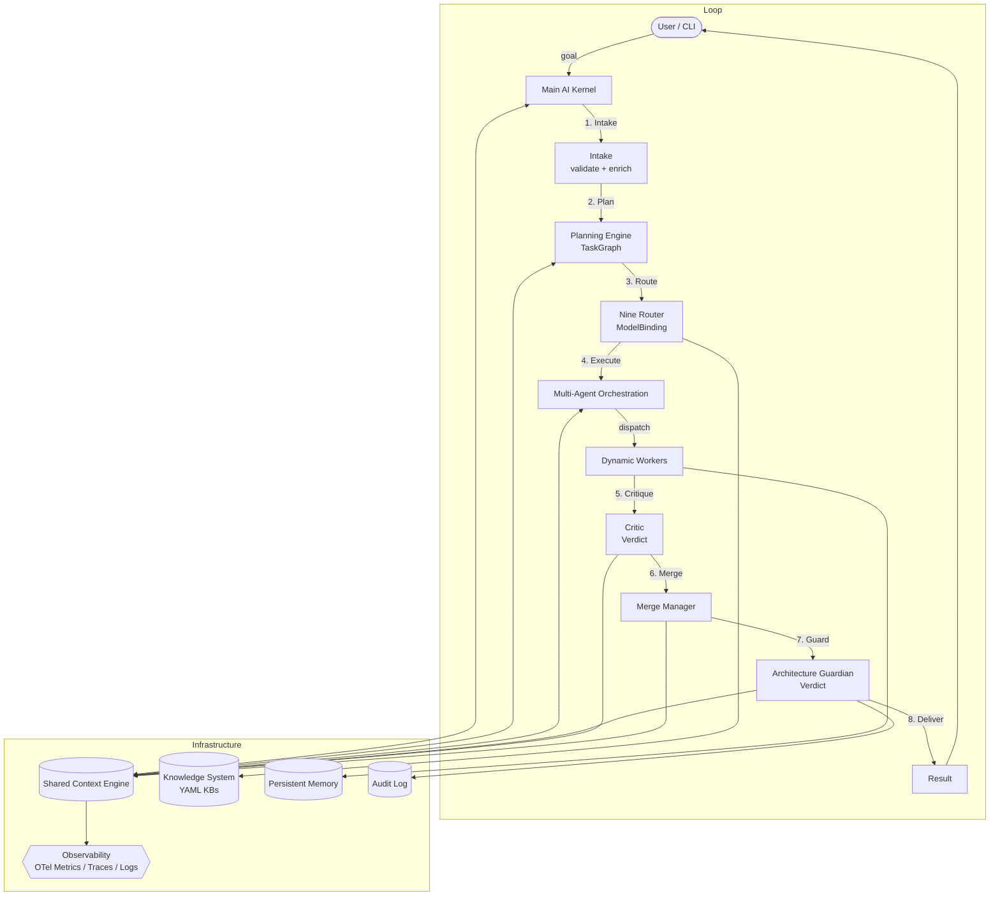

# System Overview

> Top-level architecture overview of AI Dev OS. All subsystems, their relationships, and the Kernel loop that drives them. This document is normative — implementations MUST satisfy every MUST clause below.

## Overview

AI Dev OS is organised as a collection of **subsystems** (120+ documented in `docs/`) that interact through the **Kernel loop**. The Kernel is not a monolithic engine; it is a coordinator that delegates to specialised subsystems at each stage. Every subsystem is documented independently with its own schema, interfaces, failure modes, and security considerations. This document provides the map.

The system is built on five architectural invariants:

1. **Everything flows through the SCE** — no subsystem communicates via private channels.
2. **No hidden state** — all durable state lives in the Knowledge System or Persistent Memory.
3. **All subsystems are replaceable** — as long as the interface contract is satisfied.
4. **Local-first** — the entire system runs without any external dependency.
5. **Spec-before-code** — documentation defines the contract; code implements it.

## Kernel Loop

The Kernel loop is the heart of AI Dev OS. Every run — from a single code generation request to a multi-hour refactoring task — follows this pipeline:

```
Intake → Plan → Route → Execute → Critique → Merge → Guard → Deliver
```

| Stage | Subsystem | Responsibility |
|-------|-----------|----------------|
| **Intake** | [Main AI Kernel](./MAIN_AI_KERNEL.md) | Accept goal, validate, enrich with context from KB |
| **Plan** | [Planning Engine](./PLANNING_ENGINE.md) | Decompose goal into `TaskGraph` DAG |
| **Route** | [Nine Router](./NINE_ROUTER.md) + [Model Routing Policy](./MODEL_ROUTING_POLICY.md) | Assign models to roles per capability policy |
| **Execute** | [Multi-Agent Orchestration](./MULTI_AGENT_ORCHESTRATION.md) + [Dynamic Workers](./DYNAMIC_WORKERS.md) | Dispatch tasks to workers; parallel execution |
| **Critique** | [Critic](./CRITIC.md) | Review all output; issue accept/reject verdict |
| **Merge** | [Merge Manager](./MERGE_MANAGER.md) + [Merger](./MERGE_MANAGER.md) | Reconcile concurrent edits into a unified artifact |
| **Guard** | [Architecture Guardian](./ARCHITECTURE_GUARDIAN.md) | Enforce invariants; issue ok/veto verdict |
| **Deliver** | [Main AI Kernel](./MAIN_AI_KERNEL.md) | Present result to user or write to filesystem |

## Subsystem Catalog

Subsystems are organised into nine categories. Each category has a lead subsystem that provides coordination.

### Orchestration

| Subsystem | Role |
|-----------|------|
| [Main AI Kernel](./MAIN_AI_KERNEL.md) | Loop coordinator; run lifecycle |
| [Planning Engine](./PLANNING_ENGINE.md) | Goal decomposition into task graphs |
| [Task Graph](./TASK_GRAPH.md) | DAG structure that organises work |
| [Multi-Agent Orchestration](./MULTI_AGENT_ORCHESTRATION.md) | Task dispatch and worker management |
| [Dynamic Workers](./DYNAMIC_WORKERS.md) | On-demand agent workers |
| [Agent Lifecycle](./AGENT_LIFECYCLE.md) | Worker lifecycle management |
| [Agent Communication](./AGENT_COMMUNICATION.md) | Agent-to-agent message protocol |
| [Job Scheduler](./JOB_SCHEDULER.md) | Scheduled and recurring runs |

### Agents

| Subsystem | Role |
|-----------|------|
| [AI Groups](./AI_GROUPS.md) | Logical agent teams |
| [AI Group System](./AI_GROUP_SYSTEM.md) | Group configuration and management |
| [Class Registry](./CLASS_REGISTRY.md) | Agent class definitions |
| [Function Registry](./FUNCTION_REGISTRY.md) | Tool function registry |

### Models

| Subsystem | Role |
|-----------|------|
| [Nine Router](./NINE_ROUTER.md) | Model discovery and role assignment |
| [Model Routing Policy](./MODEL_ROUTING_POLICY.md) | Deterministic model selection |
| [Model Providers](./MODEL_PROVIDERS.md) | Provider adapter interface |
| [Model Discovery](./MODEL_DISCOVERY.md) | Model catalog and capability matrix |
| [Local Models](./LOCAL_MODELS.md) | Local model configuration (Ollama, llama.cpp, MLX) |
| [Context Window Management](./CONTEXT_WINDOW_MANAGEMENT.md) | Context window optimisation |

### Knowledge

| Subsystem | Role |
|-----------|------|
| [Knowledge System](./KNOWLEDGE_SYSTEM.md) | Scoped YAML knowledge bases |
| [Knowledge Bases](./knowledge-bases/) | Main KB, Group KB, Individual KB, Global KB |
| [Persistent Memory](./PERSISTENT_MEMORY.md) | Durable state storage |
| [Agent Memory](./AGENT_MEMORY.md) | Per-agent session context |
| [Research Engine](./RESEARCH_ENGINE.md) | Web search and synthesis |
| [RAG Pipeline](./RAG_PIPELINE.md) | Retrieval-augmented generation |
| [Embeddings](./EMBEDDINGS.md) | Vector embedding and similarity search |

### Runtime

| Subsystem | Role |
|-----------|------|
| [Shared Context Engine](./SHARED_CONTEXT_ENGINE.md) | Event bus and state projection |
| [Event Bus](./EVENT_BUS.md) | Async event dispatch |
| [IPC](./IPC.md) | Inter-process communication |
| [Plugin SDK](./PLUGIN_SDK.md) | Extension API |
| [MCP](./MCP.md) | Model Context Protocol integration |
| [Configuration](./CONFIGURATION.md) | Workspace and project configuration |
| [Environment Variables](./ENVIRONMENT_VARIABLES.md) | Runtime environment configuration |

### Security

| Subsystem | Role |
|-----------|------|
| [Architecture Guardian](./ARCHITECTURE_GUARDIAN.md) | Invariant enforcement |
| [Auth System](./AUTH_SYSTEM.md) | Authentication |
| [AuthZ/RBAC](./AUTHZ_RBAC.md) | Authorisation and role-based access control |
| [Secrets Management](./SECRETS_MANAGEMENT.md) | Credential storage |
| [Encryption](./ENCRYPTION.md) | Data encryption |
| [AI Safety](./AI_SAFETY.md) | AI safety guardrails |
| [Prompt Governance](./PROMPT_GOVERNANCE.md) | Prompt validation and constraint |

### Observability

| Subsystem | Role |
|-----------|------|
| [Observability](./OBSERVABILITY.md) | Metrics, traces, logs |
| [Tracing](./TRACING.md) | Distributed tracing |
| [Logging](./LOGGING.md) | Structured logging |
| [Audit Log](./AUDIT_LOG.md) | Immutable audit trail |
| [Metrics](./METRICS.md) | Performance metrics collection |
| [Reasoning Traces](./REASONING_TRACES.md) | Agent reasoning transparency |

### Governance

| Subsystem | Role |
|-----------|------|
| [AI Coding Rules](./AI_CODING_RULES.md) | Coding standards for AI agents |
| [PRD](./PRD.md) | Product requirements |
| [TRD](./TRD.md) | Technical requirements |
| [QA Plan](./QA_PLAN.md) | Quality assurance |
| [Eval Harness](./EVAL_HARNESS.md) | Evaluation and benchmarking |
| [Impact Analysis](./IMPACT_ANALYSIS.md) | Change impact assessment |

### Supporting

| Subsystem | Role |
|-----------|------|
| [CLI](./CLI.md) | Command-line interface |
| [API Spec](./API_SPEC.md) | API contract specification |
| [Database](./DATABASE.md) | Database schema |
| [Deployment](./DEPLOYMENT.md) | Deployment configuration |
| [Backend](./BACKEND.md) | Backend services |
| [Frontend](./FRONTEND.md) | User interface |

## High-Level Architecture



## Data Flow

```
User Goal
  │
  ▼
┌─────────────────────────────────────────────────────┐
│ Kernel: intake                                      │
│   • validate goal                                   │
│   • enrich with KB context                          │
│   • assign correlation_id                           │
├─────────────────────────────────────────────────────┤
│ Kernel: plan                                        │
│   • PlanningEngine.plan(goal, ctx) → TaskGraph      │
├─────────────────────────────────────────────────────┤
│ Kernel: route                                       │
│   • Policy.choose(role, ctx) → ModelBinding         │
├─────────────────────────────────────────────────────┤
│ Kernel: execute                                     │
│   • Orchestrator.dispatch(graph, bindings)          │
│   • Workers execute tasks                           │
│   • Results flow back through SCE                   │
├─────────────────────────────────────────────────────┤
│ Kernel: critique                                     │
│   • Critic.review(artifact) → Verdict               │
│   • On reject → replan                              │
├─────────────────────────────────────────────────────┤
│ Kernel: merge                                       │
│   • MergeManager.merge(artifacts) → MergedArtifact  │
├─────────────────────────────────────────────────────┤
│ Kernel: guard                                       │
│   • Guardian.check(merged) → Verdict                │
│   • On veto → replan                                │
├─────────────────────────────────────────────────────┤
│ Kernel: deliver                                     │
│   • Write files / print result / emit event         │
└─────────────────────────────────────────────────────┘
```

## Deployment Modes

| Mode | Description | When to Use |
|------|-------------|-------------|
| **Local single-process** | Everything runs in one Node.js process | Development, personal use |
| **Multi-process** | Kernel, workers, and SCE run as separate processes | Team use, parallel workloads |
| **Kubernetes** | Full distributed deployment with scaling | Production, CI/CD, large teams |

## Extension Points

- [Plugin SDK](./PLUGIN_SDK.md) — write custom subsystems or replace existing ones
- [MCP](./MCP.md) — connect external tools and data sources via Model Context Protocol
- [Custom providers](./MODEL_PROVIDERS.md) — add new AI model providers
- [Custom Guardian rules](./ARCHITECTURE_GUARDIAN.md) — add organisation-specific invariants
- [Custom Knowledge Bases](./KNOWLEDGE_SYSTEM.md) — plug in external knowledge sources

## Related Documents

- [Main AI Kernel](./MAIN_AI_KERNEL.md) — loop coordinator
- [Shared Context Engine](./SHARED_CONTEXT_ENGINE.md) — event bus and state projection
- [Architecture Guardian](./ARCHITECTURE_GUARDIAN.md) — invariant enforcement
- [Product Overview](./PRODUCT_OVERVIEW.md) — product-level description
- [Project Vision](./PROJECT_VISION.md) — long-term vision
- [All subsystem docs](./) — every `.md` file in `docs/` is a subsystem spec
