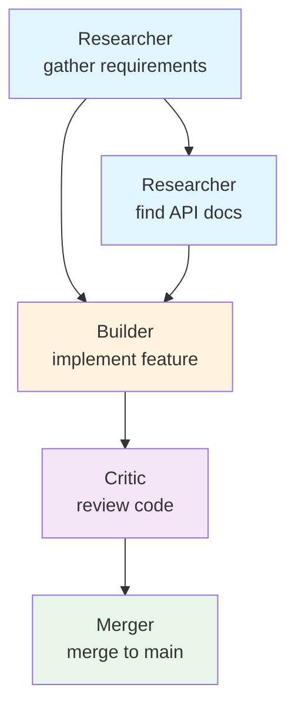

# Task Graph

> The directed acyclic graph (DAG) that organises all work in a run. Produced by the [Planning Engine](./PLANNING_ENGINE.md), consumed by [Multi-Agent Orchestration](./MULTI_AGENT_ORCHESTRATION.md). This document is normative — implementations MUST satisfy every MUST clause below.

## Overview

The Task Graph is the central data structure of every AI Dev OS run. It encodes a plan as a directed acyclic graph where each node is a `Task` and each edge is a `Dependency`. The graph is built by the Planning Engine during the **plan** stage, validated for cycles and completeness, and then traversed by the Orchestrator during the **execute** stage.

The Task Graph is immutable after validation: no subsystem may add, remove, or reorder tasks once the plan is accepted. The only way to change the graph is through a `replan()` call, which produces a new version.

## TaskGraph Schema

```
TaskGraph {
  nodes:       Task[]           // all tasks in the run
  edges:       Dependency[]     // all dependency edges
  metadata: {
    run_id:         ulid
    goal_id:        ulid
    created_at:     rfc3339
    version:        int          // 0 = initial plan, 1+ = replans
    plan_explanation: string?    // human-readable summary from the planner
  }
}
```

## Task Schema

```
Task {
  id:           ulid
  description:  string           // what to do
  group_id:     GroupId          // AI Group that executes this task
  role:         NineRole         // agent role for execution
  inputs:       DataSlot[]       // { name, schema, source_task_id?, value? }
  outputs:      DataSlot[]       // { name, schema, value? }
  budget: {
    max_tokens:      int
    max_wall_time:   duration
    max_cost:        decimal
  }
  state:        TaskState        // see state machine below
  depends_on:   TaskId[]         // task IDs that must complete first
  artifacts:    ArtifactRef[]    // outputs produced during execution
  created_at:   rfc3339
  started_at?:  rfc3339
  completed_at?: rfc3339
}
```

## Dependency Types

Edges between tasks carry a type that determines how the orchestrator treats the relationship:

| Type | Description | Example |
|------|-------------|---------|
| `data_dependency` | Task B consumes an output produced by Task A. B cannot start until A's output is available. | Researcher produces findings → Builder implements them |
| `control_dependency` | Task B must execute after Task A for ordering reasons, but does not consume A's data. | Code generation → Code review |
| `resource_dependency` | Task B requires a resource (file lock, API rate slot, GPU) held by Task A. | Builder writes to file → Merger reconciles the same file |

`data_dependency` edges MAY carry a `data_schema` that describes the shape of the transmitted data:

```
Dependency {
  from:         TaskId
  to:           TaskId
  type:         "data_dependency" | "control_dependency" | "resource_dependency"
  data_schema?: {           // required for data_dependency
    name:       string
    schema_ref: string       // e.g. "FileDiff" or "ResearchReport"
    required:   boolean
  }
}
```

## Task States

```
                     +--→ completed
                    /
pending → queued → running → failed
                    \
                     +--→ skipped
```

| State | Meaning |
|-------|---------|
| `pending` | Not yet ready to execute; one or more dependencies not satisfied |
| `queued` | All dependencies satisfied; waiting for a worker |
| `running` | Assigned to a worker and actively executing |
| `completed` | Execution finished successfully; outputs published |
| `failed` | Execution terminated with an error; not retryable |
| `skipped` | Not executed because a transitive dependency failed |

Transitions are published to the SCE on `taskgraph.state_changed` topic. Workers subscribe to this topic to learn when a task they depend on completes.

## Parallel Execution

Sibling tasks with no dependency chain between them run concurrently. The Orchestrator identifies parallel groups at runtime:

```
// A and B are siblings with no transitive dependency → parallel
// C depends on B → serialised after B

TaskGraph:
  A ──┐
      ├──→ D
  B ──┘
  C → E

Parallel groups:
  Group 1: A, B     // concurrent
  Group 2: C        // after B completes
  Group 3: D, E     // concurrent (D waits for A+B, E waits for C)
```

## Graph Traversal

### Topological Sort

The canonical execution order is a topological sort over the DAG. The sort MUST produce a valid ordering where every task appears after all its dependencies:

```
function topological_sort(graph) -> Task[]:
  in_degree = { t.id: t.depends_on.length for t in graph.nodes }
  queue = tasks with in_degree == 0
  result = []
  while queue not empty:
    task = queue.dequeue()
    result.append(task)
    for edge in graph.edges where edge.from == task.id:
      in_degree[edge.to] -= 1
      if in_degree[edge.to] == 0:
        queue.enqueue(find_task(edge.to))
  if result.length != graph.nodes.length:
    raise CycleDetected
  return result
```

### Critical Path Analysis

The critical path is the longest chain of serial dependencies by wall-time budget. It determines the minimum possible run duration. The Orchestrator computes:

```
function critical_path(graph) -> Task[]:
  // Forward pass: compute earliest start
  for task in topological_sort(graph):
    task.earliest_start = max(task.depends_on.map(d => d.earliest_completion))
    task.earliest_completion = task.earliest_start + task.budget.max_wall_time

  // Backward pass: compute latest start
  for task in reverse(topological_sort(graph)):
    task.latest_completion = min(task.dependents.map(d => d.latest_start))
    task.latest_start = task.latest_completion - task.budget.max_wall_time

  // Tasks with zero float (earliest == latest) are on the critical path
  return tasks.where(t => t.earliest_start == t.latest_start)
```

## Graph Visualization



The [UI](./FRONTEND.md) renders the graph using Mermaid or an interactive DAG view with colour-coded nodes by group and state. [Reasoning Traces](./REASONING_TRACES.md) are overlaid on hover.

## Graph Operations

```
graph.tasks(filter?: TaskFilter) → Task[]
graph.dependencies(task_id: ulid) → Dependency[]
graph.critical_path() → Task[]
graph.parallel_groups() → Task[][]     // groups of concurrent tasks
graph.subgraph(task_ids: ulid[]) → TaskGraph
graph.ancestors(task_id: ulid) → Task[]
graph.descendants(task_id: ulid) → Task[]
graph.roots() → Task[]                 // tasks with no dependencies
graph.leaves() → Task[]                // tasks with no dependents
graph.depth(task_id: ulid) → int       // distance from nearest root
```

## Interfaces

```
graph.tasks(filter?: TaskFilter) → Task[]
graph.dependencies(task_id: ulid) → Dependency[]
graph.critical_path() → Task[]
graph.parallel_groups() → Task[][]
graph.subgraph(task_ids: ulid[]) → TaskGraph
graph.validate() → ValidationResult
graph.to_mermaid() → string             // Mermaid flowchart markup
```

All interfaces follow [Agent Communication](./AGENT_COMMUNICATION.md) and [API Spec](./API_SPEC.md).

## Failure Modes

| Mode | Detection | Response |
|------|-----------|----------|
| Cycle detected | Topological sort fails to consume all nodes | Reject graph; emit `taskgraph.cycle_detected` with cycle edges |
| Unreachable task | Task has `depends_on` referencing a non-existent ID | Remove dangling reference; emit `taskgraph.dangling_dependency` |
| Orphaned output | Task completes but no consumer reads its outputs | Warning only; output is garbage-collected by [Data Retention](./DATA_RETENTION.md) |
| Budget overflow | Total critical path exceeds `max_run_wall_time` | Reject graph; suggest parallelisation or scope reduction |
| State machine violation | Task transitions from `completed` to `running` | Reject transition; emit `taskgraph.illegal_state_transition` |

## Security Considerations

- Task inputs and outputs carry data that may include secrets; all access is authorised through [AuthZ/RBAC](./AUTHZ_RBAC.md).
- The graph is read-only after validation; mutation attempts are rejected at the API layer.
- Graph metadata (`run_id`, `goal_id`) are signed by the Kernel to prevent tampering.
- See [Security Model](./SECURITY_MODEL.md).

## Observability

| Metric | Labels | Description |
|--------|--------|-------------|
| `taskgraph_task_count` | — | Task count per graph |
| `taskgraph_edge_count` | — | Dependency count per graph |
| `taskgraph_critical_path_seconds` | — | Critical path duration |
| `taskgraph_parallel_width` | — | Max parallel tasks per group |
| `taskgraph_state_changed_total` | `from_state`, `to_state` | Task state transitions |
| `taskgraph_cycle_total` | — | Cycle detection events |

Traces: one span per graph operation (`topological_sort`, `critical_path`, etc.). See [Tracing](./TRACING.md).

## Acceptance Criteria

- A `TaskGraph` with 5 independent tasks all roots produces 5 parallel groups of size 1 each.
- Adding an edge from task C to task A where A already has an edge to B and B has an edge to C creates a cycle that is detected by `graph.validate()`.
- `graph.critical_path()` returns the longest chain of tasks by summed `budget.max_wall_time`.
- `graph.to_mermaid()` produces valid Mermaid syntax that renders in a Markdown viewer.
- Removing the only inbound dependency of a leaf task makes it a root.

## Related Documents

- [Planning Engine](./PLANNING_ENGINE.md) — produces the Task Graph
- [Main AI Kernel](./MAIN_AI_KERNEL.md) — owns the run lifecycle
- [Multi-Agent Orchestration](./MULTI_AGENT_ORCHESTRATION.md) — executes tasks from the graph
- [Dynamic Workers](./DYNAMIC_WORKERS.md) — run individual tasks
- [Reasoning Traces](./REASONING_TRACES.md) — overlaid on graph visualization
- [System Overview](./SYSTEM_OVERVIEW.md)
