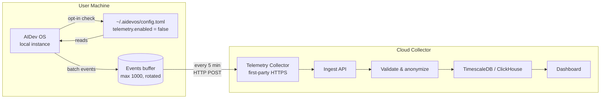

# Telemetry

> Privacy-preserving, opt-in usage telemetry that helps the AI Dev OS team understand feature adoption, performance characteristics, and failure patterns — without collecting PII, code content, or model inputs/outputs. This document is normative — implementations MUST satisfy every MUST clause below.

## Overview

Telemetry is the collection of anonymised, aggregated usage data that the AI Dev OS team uses to prioritise features, identify performance regressions, and fix the most common failure modes. Telemetry is **strictly opt-in** — no data is collected without explicit user consent, and the user can disable it at any time with zero loss of functionality.

Telemetry is distinct from [Observability](./OBSERVABILITY.md). Observability serves the operator of the local instance. Telemetry serves the product team. Observability is always on; telemetry is off by default.

## Goals

- Collect only what is necessary to improve the product: feature adoption counts, error rates, runtime environment, and performance distributions.
- Never collect: code content, model prompts/responses, file names, project names, agent conversation logs, or any PII.
- All telemetry is anonymised before transmission. No user account, IP address, or machine fingerprint is persisted server-side.
- The user must explicitly opt in (first-run wizard or `aidevos telemetry enable`). Opt-out must be honoured immediately and permanently.
- Telemetry is transmitted over HTTPS to a first-party collector. No third-party analytics SDK is embedded.

## Non-Goals

- User tracking or attribution — telemetry is anonymous by design.
- Feature gate decisions — telemetry informs but does not control feature availability.
- Error monitoring for the local operator — use [Observability](./OBSERVABILITY.md) for that.
- Implementation code — this repo is documentation-only ([AI Coding Rules](./AI_CODING_RULES.md)).

## Collected Data

### Environment (collected once per installation)

| Field | Example | PII? | Purpose |
|-------|---------|------|---------|
| `os` | `linux`, `darwin`, `windows` | No | Platform adoption tracking |
| `os_version` | `22.04`, `14.5`, `10.0.19045` | No | Compatibility analysis |
| `architecture` | `x86_64`, `arm64` | No | Architecture adoption |
| `aidevos_version` | `0.1.0` | No | Version distribution |
| `runtime` | `node v20.11.0`, `python 3.12` | No | Runtime version tracking |
| `install_method` | `binary`, `npm`, `docker`, `homebrew` | No | Distribution channel effectiveness |
| `locale` | `en-US` (language + region only) | No | Regional adoption |
| `process_id` | Opaque UUID, generated at first run, stored in config | No | Deduplication without tracking |

### Usage Events (submitted on each occurrence)

| Event | Fields | Frequency |
|-------|--------|-----------|
| `run.completed` | `{success: bool, duration_ms: int, stage_count: int, model_count: int}` | Per run |
| `run.failed` | `{failure_reason: string, stage: string}` | Per failure |
| `model.discovery` | `{provider_count: int, models_found: int, duration_ms: int}` | Per refresh |
| `feature.used` | `{feature: string}` | Per unique feature per session |
| `error.occurred` | `{error_code: string, subsystem: string}` | Per 5-minute bucket (deduplicated) |
| `guardian.veto` | `{rule_id: string, severity: string}` | Per veto |
| `plugin.loaded` | `{plugin_count: int}` | Per session |
| `telemetry.status` | `{enabled: bool}` | On change |

### NOT Collected (explicitly excluded)

- Code content, file contents, project names, repository URLs
- Model prompts, responses, or any agent conversation data
- File paths, environment variable values, secrets, credentials
- IP addresses (beyond country-level geo from the collector's side)
- Machine hostname, MAC address, hardware serials, exact CPU/GPU model (beyond "arm64" / "x86_64")
- Browser cookies, local storage contents
- Any PII (name, email, username, organisation name)

## Architecture



## Opt-In Flow

```
1. First run: "Help improve AI Dev OS? Send anonymous usage data? [Y/n]"
2. User answers Y → telemetry.enabled = true
                   → environment event sent immediately
3. User answers n → telemetry.enabled = false
                   → nothing sent, no further prompts
4. User runs: aidevos telemetry enable
                   → telemetry.enabled = true
                   → environment event sent
5. User runs: aidevos telemetry disable
                   → telemetry.enabled = false
                   → pending buffer cleared, no further sends
6. User runs: aidevos telemetry status
                   → prints "Telemetry: enabled" or "Telemetry: disabled"
```

## Data Flow

```
1. Every 5 minutes (configurable), the telemetry background job:
   a. Reads telemetry.enabled from config
   b. If disabled: discards buffer, sleeps
   c. If enabled: serialises buffer as JSON, sends POST to collector
2. On success: clear buffer
3. On failure: keep buffer, retry at next interval (exponential backoff: 5m, 10m, 20m, max 1h)
4. Buffer is capped at 1000 events. Oldest events are dropped when full.
```

## Interfaces

```
telemetry.enable()
telemetry.disable()
telemetry.status() → { enabled: bool, events_queued: int, last_send: timestamp? }
telemetry.event(name: string, fields?: { string: value })
telemetry.flush()  // force immediate send (blocking)
```

## Configuration

```
[AIDEVOS_TELEMETRY]
enabled = false                           # opt-in
collector_url = "https://telemetry.aidevos.dev/v1/events"
buffer_size = 1000                        # max queued events
send_interval_sec = 300                   # 5 minutes
```

## Failure Modes

| Mode | Detection | Response |
|------|-----------|----------|
| Collector unreachable | HTTP timeout | Buffer events; retry next interval; no user-visible effect |
| Opt-in config corrupted | Parse error | Treat as disabled; log WARN; reset to default on next config write |
| Buffer overflow | >1000 events | Drop oldest; increment `aidevos_telemetry_dropped_total` counter |
| Network proxy required | HTTP 407 | Log WARN with proxy config hint; do not bypass proxy automatically |
| GDPR consent withdrawal | User calls disable | Clear buffer immediately; stop all sends; persist config change |

## Security Considerations

### PII Handling

Telemetry MUST NOT collect any personally identifiable information. The following controls are in place:

1. **Field-level allowlist**: Only fields explicitly listed in the [Collected Data](#collected-data) section may be transmitted. Any new field requires a spec change and maintainer review.
2. **Pre-transmission filter**: Before serialization, every event is run through a schema validator that drops any field not in the allowlist. Unknown fields are logged and discarded.
3. **Process ID isolation**: The `process_id` is a random UUID generated at install time. It is NOT derived from any hardware identifier, MAC address, hostname, or user credential. It cannot be used to correlate events across different installations.
4. **Locale truncation**: Only language and region (e.g., `en-US`) are collected. Never full locale strings that might contain user-configured custom formats.

### Opt-Out Enforcement

1. **Immediate effect**: When the user runs `aidevos telemetry disable`, the telemetry subsystem MUST stop all outbound network requests within 1 second. The in-memory buffer is cleared immediately.
2. **Persistence**: The disabled state is written to `~/.config/aidevos/config.toml` synchronously. On restart, the subsystem reads this value before initializing the network client.
3. **No silent re-enable**: No update, upgrade, or config migration may re-enable telemetry without explicit user consent. The `enabled` field is preserved across upgrades.
4. **Audit trail**: Every enable/disable transition is logged to the local [Audit Log](./AUDIT_LOG.md) with timestamp and actor (CLI or API caller).

### Data in Transit

1. **TLS required**: All telemetry data is transmitted over HTTPS (TLS 1.2+). The collector endpoint URL is hard-coded to `https://telemetry.aidevos.dev/v1/events`. HTTP is never used.
2. **Certificate pinning** (optional): The binary MAY include a pinned certificate for the collector endpoint to prevent MITM interception. This is configured at build time.
3. **No PII in URLs**: Event data is sent as POST body, never in URL query parameters (which may be logged by proxies).

### Data at Rest

1. **No local storage**: Telemetry events are held in an in-memory buffer. They are never written to disk except as transient buffer files in encrypted temp storage on low-memory systems.
2. **Collector retention**: Raw events are retained for 90 days, then purged. Aggregated statistics are retained for 24 months. Both retention periods are enforced by automated jobs.

## Performance Budget

| Operation | p99 Target |
|-----------|------------|
| `event()` call (enabled) | < 50 µs |
| `event()` call (disabled) | < 1 µs (early return after config check) |
| Batch send (100 events, good network) | < 2 s |
| Buffer write (disk) | < 1 ms |

## Privacy Guarantees

1. **No PII**: The collector never receives names, emails, code, or model content.
2. **No tracking**: The `process_id` is a random UUID generated at install time. It is not linked to any account, email, or machine identity. The collector cannot correlate events across different installations.
3. **No third party**: The collector is first-party infrastructure. No Google Analytics, Sentry, or other third-party SDK is embedded.
4. **Transparency**: Every field collected is documented in this spec. The user can inspect the full pending buffer via `aidevos telemetry status --verbose`.
5. **Data retention**: Aggregated telemetry is retained for 24 months. Raw events are purged after 90 days.

## Compliance

- **GDPR**: Telemetry is based on legitimate interest (product improvement) with explicit opt-in. The user can withdraw consent at any time.
- **CCPA**: No personal information is collected. The `process_id` is not a personal identifier.
- **SOC 2**: Telemetry is not part of the production data path. It is an outbound-only, best-effort data stream with no impact on system reliability.

## Acceptance Criteria

- Fresh install: first-run prompt appears exactly once. Whether the user accepts or declines, the prompt does not reappear.
- `aidevos telemetry disable` stops all data transmission within 1 second and clears the buffer.
- A network capture (Wireshark / tcpdump) during telemetry-enabled operation shows HTTPS POSTs only to the configured collector URL. No other network destinations are contacted.
- The collector receives a `run.completed` event with `{success: true, duration_ms: 1234, stage_count: 8, model_count: 1}` format. No file paths, no model prompts.
- Setting `enabled = false` in config and restarting the process produces zero outbound HTTPS connections from the telemetry subsystem.

## Related Documents

- [Privacy](./PRIVACY.md) — privacy policy and data handling
- [Compliance](./COMPLIANCE.md) — regulatory compliance framework
- [Security Model](./SECURITY_MODEL.md) — data protection guarantees
- [Observability](./OBSERVABILITY.md) — operational observability (distinct from product telemetry)
- [System Overview](./SYSTEM_OVERVIEW.md)
