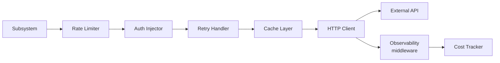
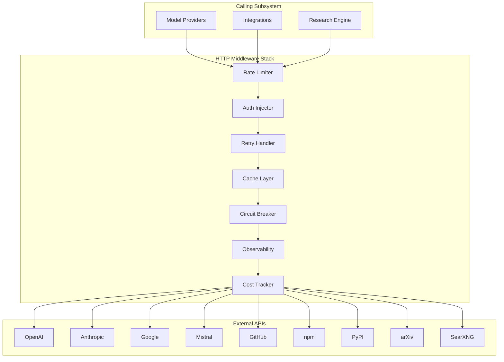

# Third-Party APIs — External API Usage Policy

> Policy and reference for every third-party HTTP API. **Model inference APIs are accessed exclusively through Nine Router** (`http://localhost:20128/v1`). Non-model third-party APIs (web search, package registries, etc.) may be called directly. This document is normative — implementations MUST satisfy every MUST clause below.

## Overview

Third-party APIs fall into two categories:

1. **Model inference APIs** (OpenAI, Anthropic, Google, Mistral, etc.) — These are NEVER called directly by AI Dev OS. All model access flows through [Nine Router](./NINE_ROUTER.md) at `http://localhost:20128/v1`. See [Nine Router Integration](./NINE_ROUTER_INTEGRATION.md).

2. **Non-model APIs** (web search, package registries, citation lookups, etc.) — These are called directly by the [Research Engine](./RESEARCH_ENGINE.md), [Integrations](./INTEGRATIONS.md), and related subsystems, passing through the HTTP client middleware stack defined here.

Each API call passes through the HTTP client middleware stack (rate limiting, retry, metrics, tracing) defined here. This document covers the **what and how** of API consumption for the second category; model inference API configuration lives in Nine Router.

## Architecture

Every third-party API call flows through a middleware pipeline:



The pipeline is implemented as a composable middleware stack. Each layer can short-circuit (e.g., cache hit returns immediately, rate limiter delays or rejects). All layers emit metrics and traces. See [Tracing](./TRACING.md) for span propagation details.

## Requirements

- **MUST** enforce per-API rate limits defined in the dependency table below.
- **MUST** inject auth credentials from [Secrets Management](./SECRETS_MANAGEMENT.md); never inline keys.
- **MUST** apply a timeout per call; the timeout is specific to the API category.
- **MUST** retry on 5xx and network errors with exponential backoff (1 s base, 30 s max, 3 max attempts).
- **MUST** NOT retry on 4xx errors except 429 (rate-limited) and 408 (request timeout).
- **MUST** reject calls to APIs that are not in the dependency table unless explicitly enabled via [Feature Flags](./FEATURE_FLAGS.md).
- **SHOULD** cache GET responses according to [Caching Strategy](./CACHING_STRATEGY.md).
- **SHOULD** circuit-break after 10 consecutive 5xx errors within a 60-second window for a given endpoint.
- **MAY** batch concurrent identical requests within a 50 ms window to reduce API call volume.

## Failure Modes

| Mode | Detection | Response |
|------|-----------|----------|
| Rate limited (429) | HTTP 429 + Retry-After | Wait Retry-After seconds; if no Retry-After, wait 1 s; max 3 retries then escalate |
| Quota exhausted (403) | HTTP 403 with quota message | Fail immediately; route to fallback API; alert operator |
| Service unavailable (503) | HTTP 503 | Retry with backoff (3 attempts); then fallback |
| Timeout | No response within deadline | Retry once; if timeout persists, fail and alert |
| Circuit open | Consecutive errors > threshold | Fail fast (no call attempted) for 30 s; then half-open probe |
| DNS / TLS failure | Connection error | Retry once; if persistent, mark provider degraded and fallback |
| Unexpected payload | JSON parse error | Return `API_PARSE_ERROR`; log full response at debug level |

## API Usage Principles

1. **Cache aggressively** — GET responses SHOULD be cached with a TTL matching the API's `Cache-Control` headers or the staleness tolerance of the data. See [Caching Strategy](./CACHING_STRATEGY.md).
2. **Handle 429s** — every client MUST respect `Retry-After` headers and MUST NOT retry more than once per rate-limit window without backoff. Repeated 429s escalate to the operator via [Observability](./OBSERVABILITY.md).
3. **Respect `robots.txt`** — web-scraping APIs (SearXNG, Brave) MUST obey the target site's `robots.txt` and `Crawl-Delay` directives.
4. **Queue writes** — all mutating API calls (POST, PUT, PATCH, DELETE) from agent orchestration MUST go through the [Job Scheduler](./JOB_SCHEDULER.md) or [Event Bus](./EVENT_BUS.md) flush path — never from an agent's hot path.
5. **Timeout every call** — no unbounded waits. Default timeout is 30 s for LLM APIs, 10 s for search and registry APIs, 5 s for metadata and health checks.
6. **No secrets in URLs** — API keys in query parameters are forbidden. Use the `Authorization` header exclusively. See [Secrets Management](./SECRETS_MANAGEMENT.md).

## API Dependency Table

| API | Purpose | Rate Limits | Auth Method | Fallback | Config Doc |
|-----|---------|-------------|-------------|----------|------------|
| **OpenAI** | Chat completions, embeddings, STT | 5,000 RPM (tier 5) | `Authorization: Bearer <key>` | Route to Anthropic / Google | [OpenAI](./OPENAI_INTEGRATION.md) |
| **Anthropic** | Chat, extended thinking | 1,000 RPM | `x-api-key: <key>` | Route to OpenAI / Google | [Anthropic](./ANTHROPIC_INTEGRATION.md) |
| **Google Gemini** | Chat, embeddings | 1,500 RPM | `Authorization: Bearer <key>` | Route to OpenAI / Mistral | [Google](./GOOGLE_INTEGRATION.md) |
| **Mistral** | Chat, embeddings | 500 RPM | `Authorization: Bearer <key>` | Route to OpenAI | [Mistral](./MISTRAL_INTEGRATION.md) |
| **GitHub REST / GraphQL** | Code search, PR metadata, issues | 5,000 req/h (authenticated) | `Authorization: Bearer <pat>` | Return cached data | [GitHub](./GITHUB_ANALYSIS.md) |
| **npm registry** | Package metadata, dependencies | 400 req/min (unauthenticated) | None (public) | Return cached index | — |
| **PyPI JSON API** | Package metadata, dependencies | 100 req/min (unauthenticated) | None (public) | Return cached index | — |
| **arXiv API** | Paper search, abstracts | 1 req/3 s (no bulk) | None (public) | Return cached results | — |
| **SearXNG** | Federated web search | Configurable (instance limit) | None (self-hosted) | Route to Brave Search | — |

## Cost Tracking

Every third-party API call is cost-tracked at the middleware layer:

```
ApiCostRecord {
  provider:    string
  model?:      string       # for LLM APIs
  endpoint:    string       # path only, no query params
  tokens_in?:  u32
  tokens_out?: u32
  cost_usd:    f64          # computed from rate card
  timestamp:   rfc3339
  run_id:      string
}
```

Cost records are written to the [Audit Log](./AUDIT_LOG.md) and aggregated in [Cost Management](./COST_MANAGEMENT.md). Per-run cost is available via the Runs API.

## Monitoring

| Metric | Type | Source |
|--------|------|--------|
| `api_call_total{provider,endpoint,status}` | Counter | Every HTTP response |
| `api_call_seconds{provider,endpoint}` | Histogram | Request duration |
| `api_rate_limit_remaining{provider}` | Gauge | Remaining quota from response headers |
| `api_rate_limit_reset_seconds{provider}` | Gauge | Seconds until quota reset |
| `api_cost_usd_total{provider,model}` | Counter | Accumulated cost |
| `api_errors_total{provider,code}` | Counter | 4xx and 5xx responses |
| `api_cache_hit_ratio{provider}` | Gauge | Cache effectiveness |

Alert thresholds: > 5 % error rate over 5 min for any provider triggers a warning in [Observability](./OBSERVABILITY.md). > 20 % rate-limited requests over 5 min triggers a critical alert.

## Extended Architecture



## Full Interface Definitions

### Middleware Interface

```
interface Middleware {
    name: string
    handle(req: ApiRequest, next: () => Promise<ApiResponse>): Promise<ApiResponse>
}
```

### ApiRequest

```
type ApiRequest = {
    method: "GET" | "POST" | "PUT" | "PATCH" | "DELETE"
    url: string
    headers: Record<string, string>
    body?: any
    timeout: number          // ms
    retryConfig: {
        maxAttempts: number
        baseDelay: number    // ms
        maxDelay: number     // ms
    }
    cacheConfig?: {
        ttl: number          // ms
        key: string
    }
}
```

### ApiResponse

```
type ApiResponse = {
    status: number
    headers: Record<string, string>
    body: any
    duration: number         // ms
    cached: boolean
}
```

### RateLimiterConfig

```
type RateLimiterConfig = {
    algorithm: "token-bucket" | "sliding-window" | "fixed-window"
    capacity: number
    refillRate: number        // per second
    refillInterval: number    // ms
    maxQueueSize: number
    queueTimeout: number      // ms
}
```

## Rate Limit Adapter Pattern

The rate limiter is a composable middleware that implements a token-bucket algorithm:

```
class TokenBucketRateLimiter implements Middleware {
    bucket: { tokens: number, lastRefill: number }
    config: RateLimiterConfig

    async handle(req, next):
        if not this.tryConsume():
            if this.config.algorithm == "token-bucket":
                return this.retryAfterRefill(req, next)
            else if this.config.algorithm == "sliding-window":
                return this.checkSlidingWindow(req, next)
        return next(req)

    tryConsume():
        this.refill()
        if this.bucket.tokens >= 1:
            this.bucket.tokens -= 1
            return true
        return false

    refill():
        now = Date.now()
        elapsed = now - this.bucket.lastRefill
        this.bucket.tokens = min(
            this.config.capacity,
            this.bucket.tokens + elapsed * this.config.refillRate / 1000
        )
        this.bucket.lastRefill = now
}
```

## Authentication Method Catalog

| Method | Header | Usage | Example APIs |
|--------|--------|-------|-------------|
| Bearer token | `Authorization: Bearer <key>` | Static API keys | OpenAI, Mistral, Google |
| Custom header | `x-api-key: <key>` | Alternative key placement | Anthropic |
| Query parameter | `?key=<key>` | Legacy/streamlined auth | Google Gemini (non-Bearer mode) |
| OAuth 2.0 | `Authorization: Bearer <token>` | Token with refresh flow | GitHub, Datadog |
| Basic auth | `Authorization: Basic <base64>` | Username + password | Legacy systems |
| No auth | — | Public APIs | npm, PyPI, arXiv |
| Mutual TLS | Client certificate | High-security APIs | Enterprise GitHub, Vault |

All auth credentials are resolved from [Secrets Management](./SECRETS_MANAGEMENT.md). The Auth Injector middleware reads the configured method for each API and injects the appropriate header.

## Retry Algorithm with Exponential Backoff

```
async function retryWithBackoff(req, next, attempt=1):
    maxAttempts = req.retryConfig.maxAttempts ?? 3
    baseDelay = req.retryConfig.baseDelay ?? 1000  // 1 s
    maxDelay = req.retryConfig.maxDelay ?? 30000    // 30 s
    while attempt <= maxAttempts:
        response = await next(req)
        if response.status < 500 and response.status != 429 and response.status != 408:
            return response  // success or non-retryable error
        if response.status < 500 and response.status != 429 and response.status != 408:
            return response  // non-retryable 4xx
        if attempt == maxAttempts:
            return response  // last attempt, return as-is
        delay = min(baseDelay * (2 ** (attempt - 1)), maxDelay)
        if response.headers["Retry-After"]:
            delay = max(delay, parseInt(response.headers["Retry-After"]) * 1000)
        if response.status == 429:
            delay = max(delay, parseInt(response.headers["Retry-After"] ?? "1") * 1000)
        await sleep(delay + randomJitter(delay * 0.1))
        attempt++
```

Jitter is applied to prevent thundering herd: `delay + random(0, delay * 0.1)`.

## Circuit Breaker State Machine

```
stateDiagram-v2
    [*] --> Closed
    Closed --> Open: 10 consecutive failures\nin 60 s window
    Open --> HalfOpen: 30 s timeout elapsed
    HalfOpen --> Closed: 1 successful probe
    HalfOpen --> Open: 1 failed probe
    Open --> Closed: Manual reset
```

```
class CircuitBreaker {
    state: "closed" | "open" | "half-open" = "closed"
    failureCount = 0
    failureThreshold = 10
    windowMs = 60_000
    halfOpenMaxRequests = 1
    openTimeout = 30_000
    lastStateChange = Date.now()

    async call(req, next):
        if this.state == "open":
            if Date.now() - this.lastStateChange >= this.openTimeout:
                this.state = "half-open"
                this.lastStateChange = Date.now()
            else:
                throw new CircuitOpenError()
        try:
            response = await next(req)
            if response.status >= 500:
                this.recordFailure()
            else:
                this.recordSuccess()
            return response
        catch:
            this.recordFailure()
            throw

    recordSuccess():
        if this.state == "half-open":
            this.state = "closed"
            this.failureCount = 0
        this.failureCount = max(0, this.failureCount - 1)  // decay

    recordFailure():
        this.failureCount++
        if this.failureCount >= this.failureThreshold:
            this.state = "open"
            this.lastStateChange = Date.now()
}
```

## API Version Negotiation

```
function negotiateVersion(api, preferredVersion):
    // 1. Query the API's version endpoint if available
    try:
        versions = await apiClient.get(api.baseUrl + "/versions")
        supported = versions.map(v => v.id)
    catch:
        supported = api.supportedVersions  // fallback to static config
    // 2. Find the best match
    if preferredVersion in supported:
        return preferredVersion
    // 3. Fall back to the latest stable version
    stable = supported.filter(v => not v.includes("alpha") and not v.includes("beta"))
    return stable.last() ?? supported.last() ?? "v1"
```

Version negotiation happens at connection time and is cached for the session duration.

## Response Caching Policy

```
cachePolicies = {
    default: {
        ttl: 60_000,           // 1 min
        staleWhileRevalidate: true,
        maxEntries: 1000
    },
    search: {
        ttl: 300_000,          // 5 min
        staleWhileRevalidate: true,
        maxEntries: 500
    },
    metadata: {
        ttl: 600_000,          // 10 min
        staleWhileRevalidate: false,
        maxEntries: 2000
    }
}

function getCacheKey(req):
    // Use method + URL + body hash for POST requests
    if req.method == "GET":
        return req.url
    else:
        return req.url + ":" + hash(JSON.stringify(req.body))
```

The cache layer checks before calling the rate limiter to avoid consuming rate limit budget on cached responses.

## Webhook Integration Pattern

For APIs that support webhooks (GitHub, Slack, etc.), the system registers outgoing webhooks through the [Webhooks](./WEBHOOKS.md) system:

```
WebhookRegistration {
    api:        string        // which API the webhook is for
    events:     string[]      // event types to subscribe to
    endpoint:   string        // our callback URL
    secret:     string        // HMAC signing secret (from Secrets Management)
    filters?:   Record<string, string>  // event filtering criteria
}
```

Incoming webhooks from third-party APIs are verified using HMAC-SHA256 signatures before processing.

## Expanded Failure Modes

| Mode | Detection | Response |
|------|-----------|----------|
| Rate limited (429) | HTTP 429 + Retry-After | Wait Retry-After seconds; if no Retry-After, wait 1 s; max 3 retries then escalate |
| Quota exhausted (403) | HTTP 403 with quota message | Fail immediately; route to fallback API; alert operator |
| Service unavailable (503) | HTTP 503 | Retry with backoff (3 attempts); then fallback |
| Timeout | No response within deadline | Retry once; if timeout persists, fail and alert |
| Circuit open | Consecutive errors > threshold | Fail fast (no call attempted) for 30 s; then half-open probe |
| DNS / TLS failure | Connection error | Retry once; if persistent, mark provider degraded and fallback |
| Unexpected payload | JSON parse error | Return `API_PARSE_ERROR`; log full response at debug level |
| API version mismatch | Unexpected response shape | Trigger re-negotiation; cache new version |
| Auth credential expired | HTTP 401 after successful calls | Alert operator; trigger credential rotation |
| Webhook signature mismatch | HMAC verification fails | Discard event; log security alert |
| API deprecation notice | `Deprecation` header present | Log warning; schedule migration |
| Quota almost exhausted | Rate limit remaining < 10 % | Slow down requests preemptively |

## Expanded Observability Metrics

| Metric | Type | Labels | Description |
|--------|------|--------|-------------|
| `api_call_total` | Counter | `{provider,endpoint,status}` | Every HTTP response |
| `api_call_seconds` | Histogram | `{provider,endpoint}` | Request duration |
| `api_rate_limit_remaining` | Gauge | `{provider}` | Remaining quota from response headers |
| `api_rate_limit_reset_seconds` | Gauge | `{provider}` | Seconds until quota reset |
| `api_cost_usd_total` | Counter | `{provider,model}` | Accumulated cost |
| `api_errors_total` | Counter | `{provider,code}` | 4xx and 5xx responses |
| `api_cache_hit_ratio` | Gauge | `{provider}` | Cache effectiveness |
| `api_circuit_breaker_state` | Gauge | `{provider,endpoint}` | 0=closed, 1=half-open, 2=open |
| `api_retry_attempts_total` | Counter | `{provider,endpoint}` | Retry attempts |
| `api_retry_skipped_total` | Counter | `{provider,endpoint}` | Non-retryable errors |
| `api_auth_errors_total` | Counter | `{provider}` | Auth-related failures |
| `api_payload_errors_total` | Counter | `{provider}` | JSON parse / schema errors |

Alert thresholds: > 5 % error rate over 5 min for any provider triggers a warning. > 20 % rate-limited requests over 5 min triggers a critical alert. Circuit breaker opening triggers an immediate critical alert.

## Security Considerations

- API keys are never inlined in configuration or code. All credentials are resolved from [Secrets Management](./SECRETS_MANAGEMENT.md).
- Query parameter authentication is forbidden for new integrations; use `Authorization` header exclusively.
- All API calls MUST use TLS 1.2 or higher. Certificate validation is mandatory.
- Webhook payloads MUST be verified using HMAC-SHA256 signatures before processing.
- Response bodies are validated against expected schemas to prevent deserialization attacks.
- URLs are sanitized to prevent SSRF attacks: only allowlisted domains are reachable.
- Sensitive data in request/response bodies is masked before logging.
- API keys are never included in error messages or logs.
- Circuit breaker state is isolated per-endpoint to prevent one compromised API from affecting others.
- All outgoing HTTP requests are recorded in the Audit Log for traceability.

## Acceptance Criteria

- Every API call passes through the full middleware stack (rate limit, auth, retry, cache, circuit breaker, observability).
- A rate-limited request (429) is retried with exponential backoff respecting Retry-After headers.
- A service-unavailable response (503) is retried 3 times before falling back.
- The circuit breaker opens after 10 consecutive failures and allows probes after 30 s.
- Cache hits return immediately without consuming rate limit budget.
- POST requests are never cached; GET requests respect Cache-Control headers.
- Auth failures (401/403) are not retried and immediately alert the operator.
- API version negotiation selects the preferred version or falls back to the latest stable version.
- All metrics are emitted for every call with correct labels.
- An allowlist violation (URL not in approved domains) is rejected before any HTTP call is made.

## Related Documents

- [Integrations](./INTEGRATIONS.md)
- [Model Providers](./MODEL_PROVIDERS.md)
- [Model Routing Policy](./MODEL_ROUTING_POLICY.md)
- [Caching Strategy](./CACHING_STRATEGY.md)
- [Cost Management](./COST_MANAGEMENT.md)
- [Rate Limiting](./RATE_LIMITING.md)
- [Secrets Management](./SECRETS_MANAGEMENT.md)
- [Observability](./OBSERVABILITY.md)
- [System Overview](./SYSTEM_OVERVIEW.md)
