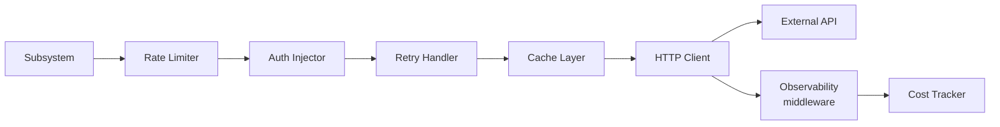

# Third-Party APIs — External API Usage Policy

> Policy and reference for every third-party HTTP API that AI Dev OS calls directly. This document is normative — implementations MUST satisfy every MUST clause below.

## Overview

Third-party APIs are remote HTTP endpoints called by the [Model Providers](./MODEL_PROVIDERS.md), [Integrations](./INTEGRATIONS.md), and [Research Engine](./RESEARCH_ENGINE.md) layers. Each API call passes through the HTTP client middleware stack (rate limiting, retry, metrics, tracing) defined here. This document covers the **what and how** of API consumption; configuration lives in the provider-specific doc linked from each row.

## Architecture

Every third-party API call flows through a middleware pipeline:



The pipeline is implemented as a composable middleware stack. Each layer can short-circuit (e.g., cache hit returns immediately, rate limiter delays or rejects). All layers emit metrics and traces. See [Tracing](./TRACING.md) for span propagation details.

## Requirements

- **MUST** enforce per-API rate limits defined in the dependency table below.
- **MUST** inject auth credentials from [Secrets Management](./SECRETS_MANAGEMENT.md); never inline keys.
- **MUST** apply a timeout per call; the timeout is specific to the API category.
- **MUST** retry on 5xx and network errors with exponential backoff (1 s base, 30 s max, 3 max attempts).
- **MUST** NOT retry on 4xx errors except 429 (rate-limited) and 408 (request timeout).
- **MUST** reject calls to APIs that are not in the dependency table unless explicitly enabled via [Feature Flags](./FEATURE_FLAGS.md).
- **SHOULD** cache GET responses according to [Caching Strategy](./CACHING_STRATEGY.md).
- **SHOULD** circuit-break after 10 consecutive 5xx errors within a 60-second window for a given endpoint.
- **MAY** batch concurrent identical requests within a 50 ms window to reduce API call volume.

## Failure Modes

| Mode | Detection | Response |
|------|-----------|----------|
| Rate limited (429) | HTTP 429 + Retry-After | Wait Retry-After seconds; if no Retry-After, wait 1 s; max 3 retries then escalate |
| Quota exhausted (403) | HTTP 403 with quota message | Fail immediately; route to fallback API; alert operator |
| Service unavailable (503) | HTTP 503 | Retry with backoff (3 attempts); then fallback |
| Timeout | No response within deadline | Retry once; if timeout persists, fail and alert |
| Circuit open | Consecutive errors > threshold | Fail fast (no call attempted) for 30 s; then half-open probe |
| DNS / TLS failure | Connection error | Retry once; if persistent, mark provider degraded and fallback |
| Unexpected payload | JSON parse error | Return `API_PARSE_ERROR`; log full response at debug level |

## API Usage Principles

1. **Cache aggressively** — GET responses SHOULD be cached with a TTL matching the API's `Cache-Control` headers or the staleness tolerance of the data. See [Caching Strategy](./CACHING_STRATEGY.md).
2. **Handle 429s** — every client MUST respect `Retry-After` headers and MUST NOT retry more than once per rate-limit window without backoff. Repeated 429s escalate to the operator via [Observability](./OBSERVABILITY.md).
3. **Respect `robots.txt`** — web-scraping APIs (SearXNG, Brave) MUST obey the target site's `robots.txt` and `Crawl-Delay` directives.
4. **Queue writes** — all mutating API calls (POST, PUT, PATCH, DELETE) from agent orchestration MUST go through the [Job Scheduler](./JOB_SCHEDULER.md) or [Event Bus](./EVENT_BUS.md) flush path — never from an agent's hot path.
5. **Timeout every call** — no unbounded waits. Default timeout is 30 s for LLM APIs, 10 s for search and registry APIs, 5 s for metadata and health checks.
6. **No secrets in URLs** — API keys in query parameters are forbidden. Use the `Authorization` header exclusively. See [Secrets Management](./SECRETS_MANAGEMENT.md).

## API Dependency Table

| API | Purpose | Rate Limits | Auth Method | Fallback | Config Doc |
|-----|---------|-------------|-------------|----------|------------|
| **OpenAI** | Chat completions, embeddings, STT | 5,000 RPM (tier 5) | `Authorization: Bearer <key>` | Route to Anthropic / Google | [OpenAI](./OPENAI_INTEGRATION.md) |
| **Anthropic** | Chat, extended thinking | 1,000 RPM | `x-api-key: <key>` | Route to OpenAI / Google | [Anthropic](./ANTHROPIC_INTEGRATION.md) |
| **Google Gemini** | Chat, embeddings | 1,500 RPM | `Authorization: Bearer <key>` | Route to OpenAI / Mistral | [Google](./GOOGLE_INTEGRATION.md) |
| **Mistral** | Chat, embeddings | 500 RPM | `Authorization: Bearer <key>` | Route to OpenAI | [Mistral](./MISTRAL_INTEGRATION.md) |
| **GitHub REST / GraphQL** | Code search, PR metadata, issues | 5,000 req/h (authenticated) | `Authorization: Bearer <pat>` | Return cached data | [GitHub](./GITHUB_ANALYSIS.md) |
| **npm registry** | Package metadata, dependencies | 400 req/min (unauthenticated) | None (public) | Return cached index | — |
| **PyPI JSON API** | Package metadata, dependencies | 100 req/min (unauthenticated) | None (public) | Return cached index | — |
| **arXiv API** | Paper search, abstracts | 1 req/3 s (no bulk) | None (public) | Return cached results | — |
| **SearXNG** | Federated web search | Configurable (instance limit) | None (self-hosted) | Route to Brave Search | — |

## Cost Tracking

Every third-party API call is cost-tracked at the middleware layer:

```
ApiCostRecord {
  provider:    string
  model?:      string       # for LLM APIs
  endpoint:    string       # path only, no query params
  tokens_in?:  u32
  tokens_out?: u32
  cost_usd:    f64          # computed from rate card
  timestamp:   rfc3339
  run_id:      string
}
```

Cost records are written to the [Audit Log](./AUDIT_LOG.md) and aggregated in [Cost Management](./COST_MANAGEMENT.md). Per-run cost is available via the Runs API.

## Monitoring

| Metric | Type | Source |
|--------|------|--------|
| `api_call_total{provider,endpoint,status}` | Counter | Every HTTP response |
| `api_call_seconds{provider,endpoint}` | Histogram | Request duration |
| `api_rate_limit_remaining{provider}` | Gauge | Remaining quota from response headers |
| `api_rate_limit_reset_seconds{provider}` | Gauge | Seconds until quota reset |
| `api_cost_usd_total{provider,model}` | Counter | Accumulated cost |
| `api_errors_total{provider,code}` | Counter | 4xx and 5xx responses |
| `api_cache_hit_ratio{provider}` | Gauge | Cache effectiveness |

Alert thresholds: > 5 % error rate over 5 min for any provider triggers a warning in [Observability](./OBSERVABILITY.md). > 20 % rate-limited requests over 5 min triggers a critical alert.

## Related Documents

- [Integrations](./INTEGRATIONS.md)
- [Model Providers](./MODEL_PROVIDERS.md)
- [Model Routing Policy](./MODEL_ROUTING_POLICY.md)
- [Caching Strategy](./CACHING_STRATEGY.md)
- [Cost Management](./COST_MANAGEMENT.md)
- [Rate Limiting](./RATE_LIMITING.md)
- [Secrets Management](./SECRETS_MANAGEMENT.md)
- [Observability](./OBSERVABILITY.md)
- [System Overview](./SYSTEM_OVERVIEW.md)
