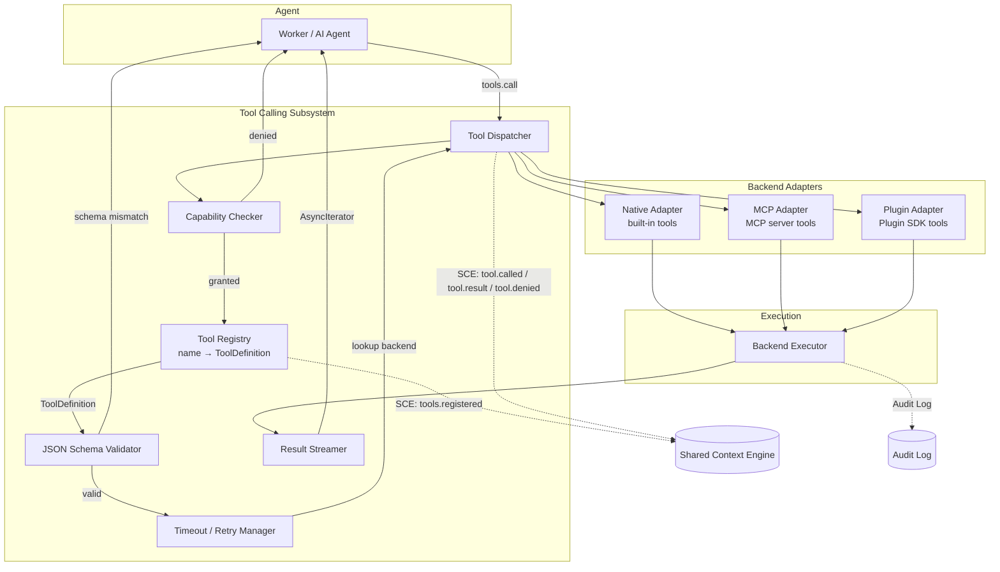

# Tool Calling

> Tool definition, registration, dispatch, and governance substrate for the AI Development Operating System. All AI agents interact with the OS exclusively through tools. This document is normative — implementations MUST satisfy every MUST clause below.

## Overview

Tool Calling is the bridge between AI agents and the AI Dev OS substrate. Every operation an agent performs — reading a file, querying memory, executing a shell command, fetching a web page — is modelled as a tool call. Agents do not import libraries or call OS APIs directly; they invoke named tools through a unified dispatcher that validates capability grants, enforces schemas, manages timeouts and retries, and streams results back.

Tools are defined in a single canonical `ToolDefinition` schema and backed by one of three backend types: **native** (built into the OS runtime), **MCP** (exposed by Model Context Protocol servers), or **plugin** (loaded through the Plugin SDK). The Tool Registry maintains the complete catalogue. The Tool Dispatcher resolves each call to the correct backend, executes it with the declared constraints, and emits structured events on every state transition so that observability, cost tracking, and audit subsystems stay synchronised without polling.

The Tool Calling subsystem is the outermost security boundary of the OS kernel: every tool invocation passes through a capability check before it reaches the executor. A denied tool call is never materialised — the agent receives a `capability_denied` error and the denial is published as a `tool_denied` event.

## Goals

- **Unified ToolDefinition schema** — Every tool, regardless of backend, shares the same shape: name, description, input/output JSON Schema, timeout, retry policy, capability gates, and cost metadata.
- **Three backend adapters** — Native tools (built in), MCP tools (discovered from MCP servers), and Plugin tools (registered via the Plugin SDK) are interchangeable from the caller's perspective.
- **Capability-gated dispatch** — Every tool call is checked against the calling worker's capability set before execution. A worker can only invoke tools whose `capabilities` intersect the worker's granted capability set.
- **Streaming tool results** — Long-running tool calls (shell commands, web searches, code analysis) stream intermediate results over an `AsyncIterator` so the agent can begin processing before the call completes.
- **Tool timeout and retry** — Every `ToolDefinition` carries a `timeout_ms`. Calls that exceed it are cancelled. An optional `retry_policy` controls automatic retries with exponential backoff.
- **Observable by default** — Every tool call, result, failure, and denial emits an event on the SCE and is recorded in the Audit Log.

## Non-Goals

- Implementing the backends themselves — native tools are defined here by contract; MCP integration is covered in [MCP](./MCP.md); Plugin integration is covered in [Plugin SDK](./PLUGIN_SDK.md).
- Tool chaining or DAG orchestration — that is the [Task Graph](./TASK_GRAPH.md) subsystem's responsibility.
- Tool versioning or deprecation lifecycle management — tools are identified by name and the registry tracks one active definition per name.
- Implementation code — this repository is documentation-only (see [AI Coding Rules](./AI_CODING_RULES.md)).

## Architecture



The Tool Dispatcher is the single entry point. It validates capability, resolves the tool definition, validates arguments against JSON Schema, wraps execution in timeout/retry, delegates to the correct backend adapter, and streams results back to the caller. Every transition emits a structured event.

## ToolDefinition Schema

Every tool exposed through the system conforms to a single canonical schema:

```
ToolDefinition {
  name:          string              # unique tool identifier; kebab-case
  description:   string              # human-readable purpose; consumed by LLM
  input_schema:  JSON Schema          # required arguments; MAY use $ref
  output_schema?: JSON Schema         # optional shape of the result payload
  backend:       "native" | "mcp" | "plugin"
  backend_ref?:  string               # native: omitted; mcp: "server/tool"; plugin: "plugin_id.tool"
  timeout_ms:    number               # hard deadline; execution cancelled after this
  retry_policy?: {
    max_retries:  number              # default 0 (no retry)
    backoff_ms:   number              # base backoff; applied with jitter (0.5x–1.5x)
  }
  capabilities:  string[]             # caller must hold at least one matching capability
  cost?: {
    tokens_per_call:  number          # estimated token overhead for LLM planners
    usd_per_call:     number          # estimated USD cost for budget tracking
  }
}
```

- `name` MUST be globally unique across all backends. Registration of a duplicate name replaces the previous definition and emits a `tools.updated` event.
- `input_schema` MUST be a valid JSON Schema (draft 2020-12 or later). The schema is used for both documentation (fed to LLM function-calling APIs) and runtime validation.
- `backend` determines resolution order and adapter selection. See *Tool Resolution Order* below.
- `capabilities` MUST contain at least one entry. A tool with an empty capabilities array is invisible to all callers.

## Built-in Native Tools

The following tools are built into the OS runtime and registered automatically at startup. They are available to any worker that holds the matching capability.

| Tool | Input | Output | Capability |
|------|-------|--------|------------|
| `file_read` | `path: string` | `content: string` | `filesystem.read` |
| `file_write` | `path: string, content: string` | `ack: boolean, path: string` | `filesystem.write` |
| `file_edit` | `path: string, old_string: string, new_string: string` | `ack: boolean, match_count: number` | `filesystem.write` |
| `file_search` | `pattern: string, path?: string` | `matches: { path: string, line: number, text: string }[]` | `filesystem.read` |
| `shell_exec` | `command: string, timeout_ms?: number` | `stdout: string, stderr: string, exit_code: number` | `shell.exec` |
| `web_search` | `query: string, num_results?: number` | `results: { title: string, url: string, snippet: string }[]` | `web.search` |
| `web_fetch` | `url: string, format?: "markdown"\|"text"\|"html"` | `content: string, url: string` | `web.fetch` |
| `memory_query` | `q: string, opts?: { limit?: number, threshold?: number }` | `records: { id: string, content: string, score: number }[]` | `memory.read` |
| `memory_write` | `entry: { content: string, tags?: string[], source?: string }` | `record: { id: string, ts: string }` | `memory.write` |
| `kb_query` | `q: string, scope?: string` | `entries: { id: string, title: string, excerpt: string }[]` | `knowledge.read` |
| `graph_query` | `cypher: string` | `results: object[]` | `graph.read` |
| `code_analyze` | `path: string, include?: "structure"\|"dependencies"\|"metrics"` | `analysis: object` | `code.analyze` |
| `git_status` | _(none)_ | `status: { branch: string, dirty: boolean, ahead: number, behind: number, files: string[] }` | `git.read` |
| `git_diff` | `paths?: string[]` | `diff: { path: string, hunks: { old_start, new_start, content }[] }` | `git.read` |

Each native tool's `timeout_ms` defaults to 30 000 (30 s). `shell_exec` honours an explicit `timeout_ms` argument over the definition default. `web_fetch` has a maximum timeout of 120 000 (120 s) enforced by the dispatcher.

The native tool set is not user-extensible. Custom tool implementations MUST use the MCP or Plugin backends.

## Tool Resolution Order

When a tool call arrives, the Dispatcher resolves the `ToolDefinition` by querying the Registry in this order:

1. **Native** — Search the built-in tool index. Match on exact `name`.
2. **MCP** — Search tools registered by connected MCP servers. Match on `name`. If multiple MCP servers expose the same name, the first-connected server wins; the agent MUST use `backend_ref` in the form `"server_name/tool_name"` to disambiguate.
3. **Plugin** — Search tools registered through the Plugin SDK. Match on `name`. Plugin tools MAY use a `backend_ref` of the form `"plugin_id.tool_name"` for explicit routing.
4. **Not found** — Return `TOOL_NOT_FOUND` error.

**First match wins.** If a native tool and an MCP server both register `file_read`, the native implementation is used unless the caller explicitly specifies a `backend_ref` that points to the MCP variant. This prevents accidental shadowing and lets operators override built-in behaviour when needed.

Resolution is a read-only Registry lookup; it does not execute the tool. The resolved `ToolDefinition` is then passed to the capability check and argument validation stages.

## Tool Dispatch Protocol

The full dispatch flow for a single `tools.call`:

```
1.  Worker calls tools.call(name, args, ctx)
2.  Dispatcher receives the call; creates ToolCall { id, name, args, ctx }
3.  Dispatcher publishes SCE event: tool.called { tool_call_id, name, worker_id, ts }
4.  Capability Checker evaluates:
      if ctx.capabilities ∩ tool_definition.capabilities == ∅:
        publish tool.denied { tool_call_id, reason: "capability_denied" }
        return ToolResult { ok: false, error: "capability_denied" }
5.  Tool Registry resolves ToolDefinition by name (see Resolution Order above)
      if not found:
        return ToolResult { ok: false, error: "tool_not_found" }
6.  JSON Schema Validator validates args against tool_definition.input_schema
      if invalid:
        return ToolResult { ok: false, error: "invalid_args", detail: validation_errors }
7.  Timeout / Retry Manager wraps the execution:
      context.with_timeout(tool_definition.timeout_ms)
      for attempt in 0..retry_policy.max_retries:
        try:
          result = await backend.execute(tool_definition, args, ctx)
          break
        catch TimeoutError:
          publish tool.timeout { tool_call_id, attempt, timeout_ms }
          if attempt < max_retries: wait(jitter(retry_policy.backoff_ms))
          else: return ToolResult { ok: false, error: "timeout" }
        catch BackendUnavailable:
          publish tool.backend_unavailable { tool_call_id, backend }
          return ToolResult { ok: false, error: "backend_unavailable" }
8.  Result Streamer:
      if result is async iterable:
        for chunk in result:
          yield ToolResultChunk { tool_call_id, chunk, done: false }
        yield ToolResultChunk { tool_call_id, done: true, full_result }
      else:
        yield ToolResult { tool_call_id, ok: true, data: result }
9.  Dispatcher publishes SCE event: tool.result { tool_call_id, ok, duration_ms, ... }
10. Dispatcher writes to Audit Log
11. Returns ToolResult to Worker
```

Steps 4–7 are atomic from the caller's perspective: if any stage fails, the tool call is not executed and the error is returned immediately. Partial execution (step 7 started but failed) still produces a `tool.result` event with `ok: false`.

## Interfaces

```
# Query the Registry
tools.list(filter?: {
  backend?:  "native" | "mcp" | "plugin"
  names?:    string[]
  capability?: string
}) → ToolDefinition[]

tools.get(name) → ToolDefinition | null
```

```
# Execute a tool
tools.call(
  name: string,
  args: object,
  ctx: ToolCallContext
) → ToolResult | AsyncIterator<ToolResultChunk>
```

`ToolCallContext` carries the caller's identity and capability set:

```
ToolCallContext {
  worker_id:      string
  run_id:         ulid
  capabilities:   string[]
  correlation_id: uuid
  metadata?:      { [key: string]: string }
}
```

```
# Register a tool (admin / Plugin SDK)
tools.register(definition: ToolDefinition) → { ok: boolean, error?: string }

# Subscribe to tool lifecycle events
tools.subscribe(filter?: { names?: string[], events?: ("called"|"result"|"denied"|"timeout")[] })
  → AsyncIterator<ToolLifecycleEvent>
```

All interfaces follow the envelope defined in [Agent Communication](./AGENT_COMMUNICATION.md) and the error contract defined in [API Spec](./API_SPEC.md).

## ToolCall and ToolResult Schemas

```
ToolCall {
  id:            ulid                # unique per call
  name:          string              # tool name
  args:          object              # validated against input_schema
  ctx:           ToolCallContext     # caller identity + capabilities
  ts:            rfc3339             # call submission timestamp
  backend:       "native"|"mcp"|"plugin"
  backend_ref?:  string
  correlation_id: uuid
}
```

```
ToolResult {
  ok:              boolean
  data?:           object             # present when ok === true
  error?:          string             # error code when ok === false
  detail?:         object             # additional error context (validation errors, etc.)
  tool_call_id:    ulid
  duration_ms:     number
  attempt_count:   number             # 1 + number of retries
  ts:              rfc3339
  correlation_id:  uuid
}

ToolResultChunk {
  tool_call_id:    ulid
  chunk?:          object             # partial payload; present when done === false
  done:            boolean
  full_result?:    ToolResult         # present when done === true
}
```

A streaming tool call emits zero or more `ToolResultChunk` values with `done: false`, followed by exactly one with `done: true` and the assembled `full_result`. The caller assembles chunks according to the tool's documented chunk protocol (e.g., stdout lines for `shell_exec`, incremental search results for `web_search`).

## Failure Modes

| Mode | Stage | Detection | Response |
|------|-------|-----------|----------|
| **timeout** | Execution | Wall-clock exceeds `timeout_ms` | Cancel execution; return `timeout` error; publish `tool.timeout` event |
| **invalid_args** | Schema validation | `args` fails JSON Schema validation | Return `invalid_args` error with `detail.validation_errors` array; no execution |
| **capability_denied** | Capability check | `ctx.capabilities ∩ tool.capabilities == ∅` | Return `capability_denied` error; publish `tool.denied` event |
| **backend_unavailable** | Execution | Backend adapter throws connection error | If `retry_policy` configured, retry with backoff; else return `backend_unavailable` error |
| **schema_mismatch** | Registration | `input_schema` is not valid JSON Schema | Reject registration with `schema_mismatch` error |
| **tool_not_found** | Resolution | No `ToolDefinition` matches `name` | Return `tool_not_found` error |
| **duplicate_name** | Registration | A tool with the same name already exists | Replace existing definition; publish `tools.updated` event |
| **backend_error** | Execution | Backend returns non-retriable error | Return error as-is; publish `tool.result { ok: false }` |

Every failure emits a structured event on the SCE and is recorded in the [Audit Log](./AUDIT_LOG.md). Degradation (retry, fallback) is preferred over hard failure whenever safety permits. A tool that has failed more than `max_retries` times within a single `tools.call` returns the last error to the caller and does not retry further.

## Security Considerations

- **All tool calls go through a capability check.** The Capability Checker runs before any backend adapter is invoked. A denied tool call never reaches the executor.
- **Denied calls emit `tool_denied` events.** The SCE `tool.denied` topic carries the `tool_call_id`, `name`, `worker_id`, and `reason`. The [Security Model](./SECURITY_MODEL.md) subsystem consumes these events to detect privilege escalation attempts.
- **Tool results are scoped to the caller's run.** The `ctx.run_id` and `ctx.correlation_id` are propagated to the executor; backends MUST NOT return data belonging to a different run.
- **Secrets are never tool arguments.** Tool definitions MUST NOT declare arguments that accept secrets. Secrets are read from [Secrets Management](./SECRETS_MANAGEMENT.md) and injected by the backend executor, not by the calling agent.
- **Shell execution is sandboxed.** The `shell_exec` native tool runs commands in a restricted environment (container or jailed process) with no network access unless explicitly granted. The `capability: "shell.exec"` is a sensitive grant and SHOULD be audited separately.
- **Plugin tools inherit the Plugin SDK's security boundary.** See [Plugin SDK](./PLUGIN_SDK.md) for sandboxing, validation, and capability inheritance rules.
- **MCP tools are untrusted until validated.** Tools exposed by MCP servers are treated as untrusted input; the [Architecture Guardian](./ARCHITECTURE_GUARDIAN.md) MAY veto their registration based on configured rules.
- **The Tool Registry is append-only for audit purposes.** Deregistration is a soft-delete (mark `deprecated: true`) so that historical `ToolCall` records remain resolvable.

## Observability

All metrics carry the `subsystem: "tool_calling"` label and conform to [Observability](./OBSERVABILITY.md).

| Metric | Labels | Description |
|--------|--------|-------------|
| `tool_calls_total` | `name`, `backend`, `ok` | Total tool calls dispatched |
| `tool_calls_seconds` | `name`, `backend` | Execution duration histogram |
| `tool_calls_denied_total` | `name`, `reason` | Tool calls rejected by capability check |
| `tool_calls_timeout_total` | `name`, `backend` | Tool calls that exceeded `timeout_ms` |
| `tool_calls_retry_total` | `name`, `attempt` | Retry attempts per tool call |
| `tool_calls_retry_exhausted_total` | `name` | Calls that used all retries and still failed |
| `tool_registry_size` | `backend` | Number of registered tools per backend |
| `tool_registration_total` | `backend`, `ok` | Tool registration attempts |

Traces: one span per `tools.call` invocation with `name`, `backend`, and `ok` as attributes. One child span per execution attempt (including retries). One child span per schema validation. See [Tracing](./TRACING.md).

Every `tool.result` event (including failures) carries `duration_ms` and `attempt_count` for cost accounting. The [Cost Management](./COST_MANAGEMENT.md) subsystem uses `ToolDefinition.cost` estimates and actual `duration_ms` to compute run-level tool expenditure.

## Acceptance Criteria

- Registering a native tool, an MCP tool, and a plugin tool with the same name causes the native tool to shadow the others. Calling the name without a `backend_ref` resolves to the native definition.
- Calling a tool with an argument that violates `input_schema` returns `invalid_args` with a `detail` object listing each schema violation path.
- Calling a tool without the required capability returns `capability_denied` and publishes a `tool.denied` event on the SCE.
- A `shell_exec` call whose command runs longer than the tool's `timeout_ms` is cancelled and returns `timeout`. Any partial stdout captured up to the timeout is included in the result's `detail`.
- A tool with `retry_policy: { max_retries: 2, backoff_ms: 100 }` that fails on the first two attempts succeeds on the third. The `ToolResult.attempt_count` is `3`.
- Calling `tools.list({ capability: "filesystem.read" })` returns all tools whose `capabilities` include `"filesystem.read"`, regardless of backend.
- A streaming tool call produces `ToolResultChunk` values incrementally; the final chunk carries `done: true` and the assembled `full_result`.
- Deregistering a tool via `tools.register` with a `deprecated` flag retains the definition in the Registry for historical `ToolCall` resolution but excludes it from `tools.list` results by default.

## Open Questions

- Whether `capabilities` should support boolean expressions (`AND`, `OR`, `NOT`) or remain a flat intersection check — tracked in [templates/ADR](../templates/ADR.md).
- Whether streaming chunk protocol metadata (MIME type, encoding, schema) should be part of `ToolResultChunk` or communicated out-of-band via the SCE.
- Whether tools should declare a `cost.max_usd_per_call` hard cap that the Dispatcher enforces before execution.

## Related Documents

- [System Overview](./SYSTEM_OVERVIEW.md) — where Tool Calling sits in the OS architecture
- [Main AI Kernel](./MAIN_AI_KERNEL.md) — the loop that consumes tools.call
- [Dynamic Workers](./DYNAMIC_WORKERS.md) — workers receive capability grants that gate tool access
- [MCP](./MCP.md) — MCP backend adapter specification
- [Plugin SDK](./PLUGIN_SDK.md) — Plugin backend adapter and tool registration API
- [Security Model](./SECURITY_MODEL.md) — capability-based security and the tool_denied event chain
- [Event Bus](./EVENT_BUS.md) — SCE topics consumed and produced by the subsystem
- [Audit Log](./AUDIT_LOG.md) — all tool calls are recorded
- [Cost Management](./COST_MANAGEMENT.md) — consumes tool cost estimates and metrics
- [Observability](./OBSERVABILITY.md) — metric and trace conventions
- [API Spec](./API_SPEC.md) — error contract and envelope format
- [Architecture Guardian](./ARCHITECTURE_GUARDIAN.md) — MAY veto MCP tool registration
