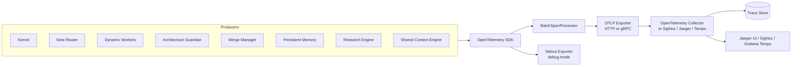
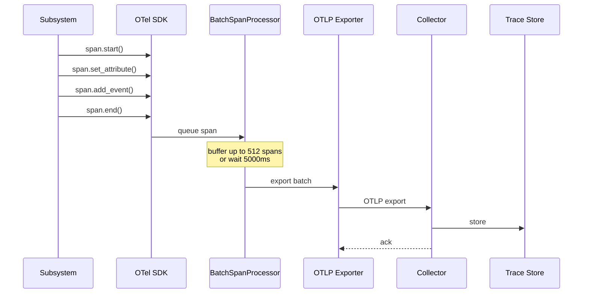

# Tracing

> OpenTelemetry-based distributed tracing — every subsystem emits spans tagged with correlation_id, subsystem name, and operation attributes. This document is normative — implementations MUST satisfy every MUST clause below.

## Overview

The Tracing subsystem provides end-to-end observability of every operation across the AI Dev OS kernel loop and its subsystems. Every meaningful unit of work — a Kernel run, a model discovery refresh, a memory query, a Guardian evaluation — is recorded as a **trace** (a tree of **spans**) that captures the operation's duration, parent-child relationships, and key attributes.

Traces are the third pillar of the observability stack alongside [Metrics](./METRICS.md) (aggregated counters) and [Logging](./LOGGING.md) (discrete events). They answer "why did this operation take 5 seconds?" and "which subsystem caused this failure?"

## Goals

- Every Kernel run produces a complete trace tree: from `kernel.run` at the root down to individual model calls, tool invocations, and database queries.
- Every span carries `correlation_id`, `subsystem`, and `operation` as attributes.
- Spans are exported via OpenTelemetry Protocol (OTLP) to a configurable collector.
- The default trace ratio is `1:100` (1% sampled) for production; `1:1` in development.
- Zero overhead when tracing is disabled: no allocation, no attribute processing.

## Non-Goals

- Aggregated metrics — use [Metrics](./METRICS.md).
- Structured logs — use [Logging](./LOGGING.md).
- Security audit trail — use [Audit Log](./AUDIT_LOG.md).
- Implementation code — this repo is documentation-only ([AI Coding Rules](./AI_CODING_RULES.md)).

## Span Schema

Every span in AI Dev OS follows this attribute schema:

| Attribute | Type | Required | Description |
|-----------|------|----------|-------------|
| `correlation_id` | string | yes | Propagated from the Kernel run |
| `subsystem` | string | yes | Dot-delimited subsystem name (e.g. `kernel.scheduler`, `nine-router.discovery`) |
| `operation` | string | yes | The operation being traced (e.g. `run`, `discover`, `query`, `check`) |
| `run_id` | string | no | ULID of the associated run |
| `provider` | string | no | Model provider name (for model call spans) |
| `model_id` | string | no | Model ID (for model call spans) |
| `ok` | boolean | no | Whether the operation succeeded |
| `error.type` | string | no | Error code if the operation failed |

Additional subsystem-specific attributes are documented in the "Tracing" section of each subsystem spec.

## Trace Context Propagation

AI Dev OS uses the [W3C TraceContext](https://www.w3.org/TR/trace-context/) standard (`traceparent` and `tracestate` headers) for context propagation:

- **In-process**: spans are propagated via OpenTelemetry's `Context` (a `Span` stored in a `ContextScope`).
- **Cross-process (IPC/MCP)**: the `traceparent` header is injected into every outgoing request and extracted from every incoming request.
- **Cross-thread**: `Context` is propagated via `AsyncLocalStorage` (Node.js) or `Scope` (Python).
- **To model providers**: the `traceparent` header is forwarded in HTTP requests to model APIs when the provider adapter supports it.

```
traceparent: 00-0af7651916cd43dd8448eb211c80319c-b7ad6b7169203331-01
              │  └────────────── trace_id ──────────────┘ └── span_id ──┘ │
              └ version                                                   └ trace_flags (01 = sampled)
```

## Sampling

| Environment | Default sample ratio | Strategy |
|------------|----------------------|----------|
| Development | `1:1` (100%) | Always sample |
| Production | `1:100` (1%) | Head-based consistent probability sampler |
| Production (ERROR) | `1:1` (100%) | Independent sampler: always sample if span has error flag |
| Production (critical path) | `1:10` (10%) | Independent sampler: Kernel.run, Guardian.check, MergeManager.merge |
| Test/CI | `1:1` (100%) | Always sample |

The sampler is configurable at startup via environment variable `AIDEVOS_TRACE_SAMPLE_RATIO` (float 0.0–1.0). ERROR spans always override the ratio.

## Architecture



The OpenTelemetry SDK runs in-process. Spans are collected by a `BatchSpanProcessor` that exports every `aid evos_export_interval_ms` (default 5000 ms). The exporter target is configurable; by default it writes to `stdout` in development and to `localhost:4318` (OTLP HTTP) in production.

## Exporter Configuration

```
[AIDEVOS_TRACE]
enabled = true
sample_ratio = 0.01                           # 1% in production
otlp_endpoint = "http://localhost:4318/v1/traces"  # OTLP HTTP
otlp_headers = ""                              # optional: "Authorization=Bearer xxx"
export_interval_ms = 5000                      # batch flush interval
export_timeout_ms = 30000                      # per-exporter timeout
stdout_enabled = false                         # also write to stdout (dev only)
```

## Subsystem Span Tables

Every subsystem spec with a "Tracing" section MUST declare its span table. Below are the spans for major subsystems:

### Main AI Kernel

| Span Name | Parent | Attributes | Events |
|-----------|--------|------------|--------|
| `kernel.run` | — | `run_id`, `goal_preview` | `run.started`, `run.completed` |
| `kernel.intake` | `kernel.run` | `run_id` | `budget.allocated` |
| `kernel.plan` | `kernel.run` | `run_id`, `task_count` | `plan.generated` |
| `kernel.route` | `kernel.run` | `run_id`, `role` | `model.assigned` |
| `kernel.execute` | `kernel.run` | `run_id`, `task_id` | `worker.spawned` |
| `kernel.critique` | `kernel.run` | `run_id` | `verdict.issued` |
| `kernel.merge` | `kernel.run` | `run_id`, `conflict_count` | `merge.completed` |
| `kernel.guard` | `kernel.run` | `run_id`, `violation_count` | `verdict.ok`, `verdict.veto` |
| `kernel.deliver` | `kernel.run` | `run_id` | `result.delivered` |

### Nine Router

| Span Name | Parent | Attributes | Events |
|-----------|--------|------------|--------|
| `nine-router.discover` | — | `provider` | `discovery.completed` |
| `nine-router.assign` | — | `role`, `model_id`, `scope` | `assignment.changed` |
| `nine-router.fallback` | `kernel.route` | `role`, `from_model`, `reason` | `fallback.activated` |

### Architecture Guardian

| Span Name | Parent | Attributes | Events |
|-----------|--------|------------|--------|
| `guardian.check` | `kernel.guard` | `artifact_id`, `rule_count` | `evaluation.started` |
| `guardian.rule` | `guardian.check` | `rule_id`, `severity` | `rule.passed`, `rule.violated` |
| `guardian.impact` | `guardian.check` | `artifact_id` | `impact.computed` |
| `guardian.auto_fix` | `guardian.check` | `rule_id`, `fix_kind` | `fix.applied` |

### Dynamic Workers

| Span Name | Parent | Attributes | Events |
|-----------|--------|------------|--------|
| `worker.execute` | `kernel.execute` | `task_id`, `role`, `model_id` | `task.started`, `task.completed` |
| `worker.tool_call` | `worker.execute` | `tool_name`, `tool_args_preview` | `tool.result`, `tool.error` |
| `worker.checkpoint` | `worker.execute` | `checkpoint_id` | `checkpoint.saved` |

### Persistent Memory

| Span Name | Parent | Attributes | Events |
|-----------|--------|------------|--------|
| `memory.query` | — | `tier`, `kind`, `k` | `query.completed` |
| `memory.write` | — | `tier`, `retention` | `write.completed` |
| `memory.retention` | — | `tier`, `deleted_count` | `retention.completed` |

## Trace Export and Storage



## Failure Modes

| Mode | Detection | Response |
|------|-----------|----------|
| Collector unreachable | Connection refused | Log WARN once per batch; drop batch; retry next interval |
| Span buffer full | >512 spans queued | Drop oldest spans; emit `aidevos_trace_dropped_total` counter |
| Sampling misconfiguration | Ratio > 1.0 | Clamp to 1.0; log WARN at startup |
| Trace ID collision | UUID v7 generation | Statistically negligible; if detected, log ERROR and generate new ID |
| Attribute overflow | >128 attributes per span | Trim to first 128; log WARN once per span name |

## Performance Budget

| Operation | p99 Target |
|-----------|------------|
| `span.start()` — no attributes | < 50 ns |
| `span.set_attribute("k", "v")` | < 100 ns |
| `span.end()` — no export | < 200 ns |
| Batch export of 512 spans (OTLP HTTP) | < 500 ms |
| `Context` propagation (in-process) | < 10 ns |

## Security Considerations

- Trace attributes are never redacted. Do not place secrets, PII, or credentials in span attributes or events. The Architecture Guardian `no-secrets-in-text` rule SHOULD verify this.
- In multi-tenant deployments, the OTLP endpoint SHOULD use mTLS to prevent unauthorised trace ingestion.
- Trace data can reveal internal system topology. Production deployments SHOULD route traces through a local collector before forwarding to a central backend.

## Acceptance Criteria

- A single `aidevos run "hello"` produces a trace tree with at least 15 spans (kernel → intake → plan → route → execute → deliver) visible in Jaeger UI.
- Every span in the tree has `correlation_id` and `subsystem` attributes.
- Setting `AIDEVOS_TRACE_SAMPLE_RATIO=0.5` results in approximately 50% of runs being sampled (measurable over 100 runs).
- An ERROR-level span (e.g. a model call that returns 503) is always sampled regardless of the ratio.
- Stopping the OTLP collector does not crash the Kernel; spans accumulate in the buffer and are retried on the next interval.

## Related Documents

- [Logging](./LOGGING.md) — structured event logs
- [Metrics](./METRICS.md) — aggregated counters and histograms
- [Observability](./OBSERVABILITY.md) — overall observability architecture
- [Audit Log](./AUDIT_LOG.md) — security audit trail
- [API Spec](./API_SPEC.md) — span context propagation headers
- [System Overview](./SYSTEM_OVERVIEW.md)
- [Main AI Kernel](./MAIN_AI_KERNEL.md)
