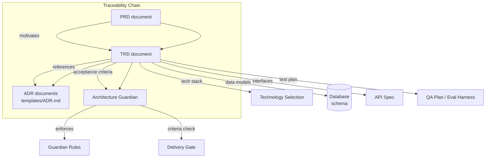

# Technical Requirements Document

> The TRD subsystem defines technical requirements that implement PRD decisions. This document is normative — implementations MUST satisfy every MUST clause below.

## Overview

The TRD (Technical Requirements Document) subsystem is the canonical registry of technical requirements across AI Dev OS. Every [PRD](./PRD.md) (product requirements) has at least one corresponding TRD that defines **how** the subsystem's requirements are implemented. Where PRDs answer "what must this do?", TRDs answer "what technology, architecture, and data models make it happen?"

TRDs are consumed by the [Planning Engine](./PLANNING_ENGINE.md) during task decomposition, by the [Architecture Guardian](./ARCHITECTURE_GUARDIAN.md) as a source of acceptance rules, and by AI agents when making technical decisions about a subsystem. They are the bridge between product intent and engineering execution.

## TRD Schema

```
TRD {
  id:                     string         # "TRD-001" or subsystem name
  title:                  string         # human-readable title
  status:                 TRDStatus      # lifecycle status
  version:                semver
  prd_id:                 string         # traces to a PRD
  tech_stack:             TechStack      # languages, frameworks, databases
  architecture_decisions: ADRRef[]       # links to ADR documents
  data_models:            DataModel[]    # key entities and their schemas
  interfaces:             Interface[]    # public API surface
  performance_targets:    PerfTarget[]   # latency, throughput, scale targets
  security_requirements:  SecurityReq[]
  test_plan:              TestPlanRef    # link to test plan or QA plan
  subsystem_ref:          string         # link to the subsystem spec doc
  created:                rfc3339
  updated:                rfc3339
}
```

## Status Lifecycle

```
draft ──→ reviewing ──→ approved ──→ implemented
                           │
                           └──→ deprecated
```

Same lifecycle as [PRD](./PRD.md#status-lifecycle). A TRD cannot be `approved` if its linked PRD is `draft`. A TRD cannot be `implemented` if its acceptance criteria have not passed the [Eval Harness](./EVAL_HARNESS.md).

## Relationship to PRD

Traceability is a first-class constraint:

- Every TRD has a `prd_id` that references exactly one PRD.
- A PRD MAY have multiple TRDs (if the product requirement spans multiple technical subsystems).
- The Architecture Guardian enforces that a change to a PRD's `acceptance_criteria` results in a corresponding TRD update.
- A TRD's `architecture_decisions` field links to [ADR documents](../templates/ADR.md) that capture the rationale behind each decision.

```
PRD-007: "Real-time collaboration"
  └── TRD-007a: "WebSocket sync engine" (tech_stack: Rust, tokio-tungstenite)
  │     ├── ADR-012: "Why WebSocket over SSE"
  │     └── ADR-013: "Why Rust over TypeScript for sync"
  └── TRD-007b: "CRDT merge layer" (tech_stack: TypeScript, yjs)
        └── ADR-014: "Why yjs over automerge"
```

## Tech Stack Decisions

AI Dev OS makes opinionated tech stack choices that are documented in TRDs:

| Component | Preferred Technology | Considered Alternatives |
|-----------|---------------------|------------------------|
| Core runtime | TypeScript (Node.js + tsc) | Go, Rust (for perf-critical subsystems only) |
| High-performance compute | Rust (via napi-rs) | C++, Zig |
| Primary database | SQLite (via better-sqlite3) | PostgreSQL, DuckDB |
| Vector index | usearch | pgvector, LanceDB, chromadb |
| Embedding pipeline | Local (Ollama/llama.cpp) or cloud API | Custom ONNX runtime |
| Observability | OpenTelemetry (OTLP) | Prometheus + Grafana (secondary dashboard) |
| Structured output | JSON Schema + Zod | Pydantic (Python), effect-ts |
| Runtime IPC | gRPC-web / SSE | REST, WebSocket (for streaming only) |
| Serialization | MessagePack (compact) / JSON (debug) | Protobuf, CBOR |
| Task queue | SQLite-backed FIFO + priority queue | RabbitMQ, Redis, ZeroMQ |

## Architecture Decision Records

Every significant technical decision in a TRD is recorded as an ADR. ADRs follow the template at [templates/ADR.md](../templates/ADR.md). Each ADR captures:

- **Context**: what prompted the decision
- **Options considered**: at least 2 alternatives with trade-offs
- **Decision**: the chosen option and rationale
- **Consequences**: what becomes easier or harder

ADRs are version-controlled alongside the docs. The Architecture Guardian MAY enforce that certain TRD sections (e.g. `tech_stack`) have corresponding ADRs.

## Integration with Architecture Guardian

The TRD's `acceptance_criteria` are translated into [Architecture Guardian](./ARCHITECTURE_GUARDIAN.md) rules. When a TRD transitions to `approved`, the Guardian loads its criteria as rule expressions:

```
TRD criterion: "All database writes must go through the SCE"
  → Guardian rule: event_published("sce.write", "database_write")

TRD criterion: "API latency must stay under 200ms p99"
  → Guardian rule: not(content_matches("await sleep\\("))
  → Monitoring alert: latency_violation if exceeded
```

This integration ensures that technical requirements are not just documented but actively enforced at the guard stage of every run.

## Requirements

- **MUST** be consumable by both humans and AI agents.
- **MUST** publish every state change to the [Shared Context Engine](./SHARED_CONTEXT_ENGINE.md).
- **MUST** pass every rule enforced by the [Architecture Guardian](./ARCHITECTURE_GUARDIAN.md).
- **MUST** be observable through the metrics defined in [Observability](./OBSERVABILITY.md).
- **MUST** provide traceability: every TRD references a `prd_id` that exists.
- **MUST** include `security_requirements` before transitioning to `approved`.
- **MUST** reject a TRD transition if its linked PRD is in `draft` status.
- **SHOULD** include at least one ADR reference for each major tech stack decision.
- **SHOULD** specify measurable `performance_targets` (latency, throughput, scale).
- **MAY** reference external standards documents (RFCs, OWASP guidelines, etc.).

## Performance Targets

TRD performance targets follow a standard template:

```
PerfTarget {
  name:        string       # e.g. "p99 API latency"
  target:      string       # e.g. "200ms"
  measurement: string       # e.g. "histogram over 1min window"
  condition:   string?      # e.g. "under 1000 req/s load"
  severity:    "warning" | "critical"
}
```

Example targets for a search subsystem TRD:

| Target | Value | Condition |
|--------|-------|-----------|
| p99 search latency | 500ms | Under 10,000 indexed entries |
| p95 search latency | 200ms | Under 10,000 indexed entries |
| Index throughput | 100 docs/s | Single writer |
| Concurrent queries | 50 | No degradation |
| Availability | 99.9% | 30-day rolling window |

## Test Plan Integration

Every TRD references a test plan via the `test_plan` field. The test plan validates:

1. **Unit tests**: Each data model and interface in the TRD has corresponding unit tests.
2. **Integration tests**: Subsystem interactions (e.g. TRD component → SCE → Guardian) are tested end-to-end.
3. **Performance tests**: `performance_targets` are validated under load via the [Eval Harness](./EVAL_HARNESS.md).
4. **Security tests**: `security_requirements` are validated by the Guardian and via targeted security tests.
5. **Acceptance tests**: TRD acceptance criteria map to [QA Plan](./QA_PLAN.md) test cases.

The Architecture Guardian enforces that no TRD in `implemented` status has failing tests. The [Eval Harness](./EVAL_HARNESS.md) provides a `trd.validate_tests(trd_id)` interface for this check.

## ADR Template

Architecture Decision Records follow this structure (stored at `templates/ADR.md`):

```markdown
# ADR-NNN: Title

## Status
proposed | accepted | deprecated | superseded

## Context
What is the issue motivating this decision?

## Options Considered
| Option | Pros | Cons |
|--------|------|------|
| Option A | ... | ... |
| Option B | ... | ... |

## Decision
Chosen option and rationale.

## Consequences
What becomes easier or harder as a result.

## References
Links to related ADRs, PRDs, TRDs.
```

## Architecture



## Interfaces

```
trd.get(subsystem: string) → TRD
trd.list(status?: TRDStatus) → TRD[]
trd.set(trd: TRD) → TRD
trd.transition(id: string, to_status: TRDStatus) → TRD
trd.validate(trd: TRD) → ValidationResult
trd.by_prd(prd_id: string) → TRD[]     // traceability lookup
trd.adrs(trd_id: string) → ADR[]
```

All interfaces follow [Agent Communication](./AGENT_COMMUNICATION.md) and [API Spec](./API_SPEC.md).

## Failure Modes

| Mode | Detection | Response |
|------|-----------|----------|
| TRD without PRD | `prd_id` references a non-existent PRD | Return `OrphanedTRD`; block transition to `approved` |
| PRD without TRD | `prd.list()` returns subsystems with no `trd.by_prd()` match | Emit `prd.trace_gap` warning; suggest creating a TRD |
| Breaking ADR change | ADR is updated without a corresponding TRD version bump | Guardian emits `high` violation; block delivery until aligned |
| Tech stack conflict | Two TRDs declare incompatible tech stacks for the same subsystem | Guardian detects via `tech_stack` comparison; emit conflict report |
| Performance target drift | Measured p99 exceeds declared `performance_targets` | Eval Harness marks as regression; TRD status MAY revert to `reviewing` |

## Security Considerations

- TRDs may contain sensitive architecture details (database schemas, security boundaries). Access is restricted per [AuthZ/RBAC](./AUTHZ_RBAC.md).
- ADR rationale MUST NOT include secrets or credential examples.
- The `security_requirements` field is mandatory for TRDs at `approved` status and above.
- See [Security Model](./SECURITY_MODEL.md).

## Observability

| Metric | Labels | Description |
|--------|--------|-------------|
| `trd_count` | `status` | TRD document count by status |
| `trd_traceability_gap` | — | PRD IDs without matching TRDs |
| `trd_transition_total` | `from_status`, `to_status` | Status transitions |
| `trd_adr_count` | — | ADR references per TRD |

## Acceptance Criteria

- Every TRD in `approved` status has a valid `prd_id` referencing an `approved` or `implemented` PRD.
- A TRD without any `architecture_decisions` can transition to `draft` but not to `reviewing`.
- `trd.by_prd("PRD-007")` returns all TRDs that trace to that PRD.
- Creating a new TRD with `prd_id: "non-existent"` triggers a validation error.

## Related Documents

- [PRD](./PRD.md) — product requirements that TRDs implement
- [Architecture Guardian](./ARCHITECTURE_GUARDIAN.md) — enforces TRD acceptance criteria
- [ADR template](../templates/ADR.md) — architecture decision records
- [System Overview](./SYSTEM_OVERVIEW.md) — architecture context
- [Implementation Roadmap](./IMPLEMENTATION_ROADMAP.md) — timeline for TRD delivery
- [QA Plan](./QA_PLAN.md) — test plan referenced by TRD
- [Eval Harness](./EVAL_HARNESS.md) — validates acceptance criteria
