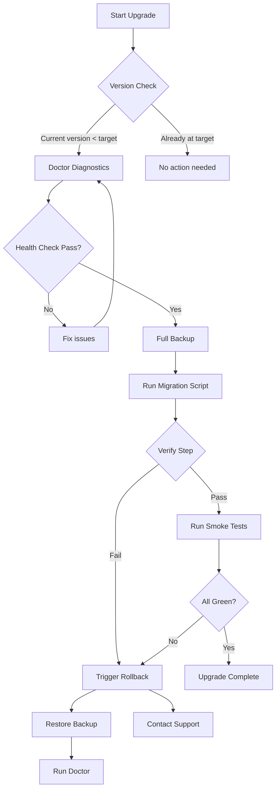

# Upgrade Notes

## Overview

This document contains version-specific upgrade instructions for AI Dev OS. Always consult the relevant notes before upgrading between major or minor versions.

If you are skipping versions, apply each upgrade step sequentially — do not jump directly to the latest version.

---

## Upgrade Checking

```bash
# Check current version and available upgrades
aidevos version --check-upgrade

# Run pre-upgrade diagnostics
aidevos doctor
```

`aidevos doctor` validates your environment, checks for breaking changes, and reports any configuration or data migrations required before upgrading.

---

## v0.1.0 → v0.2.0

*Notes will be added here when v0.2.0 is released.*

---

## Pre-v1 → v1.0 Migration

### Python to Rust Runtime

v1.0 replaces the Python runtime with a Rust native binary. The `aidevos` CLI is now a single statically-linked executable.

**Steps:**

1. Uninstall the Python package: `pip uninstall aidevos`
2. Download the v1.0 binary for your platform from the releases page
3. Verify the binary: `aidevos version`
4. Run migration tool: `aidevos migrate pre-v1-to-v1`

### SQLite Schema Migration

The internal SQLite database schema changed between pre-v1 and v1.0. The migration tool handles this automatically, but manual verification is recommended:

```bash
aidevos migrate pre-v1-to-v1 --dry-run  # preview changes
aidevos migrate pre-v1-to-v1            # apply migration
```

Backup your database before migrating:

```bash
cp ~/.local/share/aidevos/aidevos.db ~/.local/share/aidevos/aidevos.db.backup
```

### Prompt Format Changes

Custom prompt templates (`.aidevos/prompts/`) must be updated:

- `{{ variable }}` syntax changed to `{variable}`
- Tool call format changed from XML tags to JSON blocks
- System prompt sections are now order-independent

Run `aidevos doctor` to detect and report any incompatible prompt files.

### Config File Changes

| Pre-v1 | v1.0 | Notes |
|---|---|---|
| `[agent]` | `[runtime]` | Renamed |
| `memory.backend` | `[memory] backend` | Restructured |
| `logging.level` | `[log] level` | Restructured |
| `provider.api_key` | `[auth] credentials_file` | Moved — keys no longer stored in config |

The migration tool (`aidevos migrate`) automatically rewrites your config file. The original is saved as `config.toml.pre-v1.backup`.

---

## Rollback Instructions

If an upgrade fails or introduces regressions:

1. Restore the previous binary: keep the previous release tarball or use a package manager rollback.
2. Restore database: `cp aidevos.db.backup aidevos.db`
3. Restore config: `cp config.toml.pre-v1.backup config.toml`
4. Verify: `aidevos doctor`

Downgrading across a database schema change may require manual intervention. Contact support if the rollback path is unclear.

---

## Verifying Successful Upgrade

```bash
aidevos version        # confirm expected version
aidevos doctor         # check all systems green
aidevos run --help     # smoke test the CLI
```

Run a minimal test task to confirm the agent runtime works:

```bash
echo "say hello" | aidevos run --stdin
```

---

## Failure Modes

| Failure Mode | Description | Indicators | Mitigation | Recovery |
|---|---|---|---|---|
| **Partial upgrade** | Only some components upgraded; mixed-version state | Version mismatch between binaries, schema version drift, config format errors | Atomic upgrade scripts; version locking | Run `aidevos migrate --repair` or restore full backup |
| **Data incompatibility** | New schema/code cannot read old data | Migration tool crashes, `aidevos doctor` reports schema validation errors | Always run `--dry-run` first; backup before migration | Restore database from `.backup`; downgrade binary |
| **Rollback failure** | Downgrade fails due to irreversible schema change | `aidevos migrate --rollback` returns error; schema version unchanged | Use reversible migrations only; test rollback in staging | Manual SQLite intervention (contact support) |
| **Config corruption** | Auto-migration produces invalid config | `aidevos doctor` reports config parse errors; default config loaded | Keep `config.toml.pre-v1.backup`; validate with `--dry-run` | Restore backup config; manually re-apply changes |
| **Dependency breakage** | Plugin or extension incompatible with new version | Plugin load errors; `aidevos doctor --plugins` shows failures | Pin plugin versions; run compatibility matrix | Disable incompatible plugins; wait for plugin update |
| **Timeout during migration** | Large dataset migration exceeds expected time | Migration hangs; progress bar stalls beyond estimated time | Set `--timeout` flag; run in off-peak hours | Kill process; restore backup; re-run with chunked mode |

## Upgrade Flow Diagram



## Version Compatibility Matrix

| From \ To | v0.1.x | v0.2.x | v1.0.x | v1.1.x | v2.0 |
|---|---|---|---|---|---|
| **v0.1.x** | — | Auto | Manual | Manual | Not supported |
| **v0.2.x** | N/A | — | Auto | Auto | Manual |
| **v1.0.x** | N/A | N/A | — | Auto | Manual |
| **v1.1.x** | N/A | N/A | Auto | — | Auto |
| **v2.0** | N/A | N/A | N/A | N/A | — |

- **Auto:** In-place upgrade supported with zero downtime.
- **Manual:** Requires explicit migration command and verification steps.
- **Not supported:** Must upgrade through intermediate versions first.

## Pre-Upgrade Health Checklist

Before any upgrade, verify:

- [ ] `aidevos doctor` reports all systems green
- [ ] Database backup exists and checksum verified
- [ ] Config backup exists and validated
- [ ] Disk space ≥ 2x current data directory size
- [ ] Memory ≥ 512MB available for migration process
- [ ] No active agent runs in progress
- [ ] All plugins compatible with target version
- [ ] Rollback binary staged and tested
- [ ] Staging environment matches production configuration
- [ ] Communication sent to all affected users

## Migration Script Specification

Every migration script MUST implement:

| Method | Description |
|---|---|
| `validate()` | Runs pre-migration checks; returns pass/fail with reasons |
| `backup()` | Creates full backup of all data that will be modified |
| `migrate()` | Performs the migration; logs each step |
| `verify()` | Validates migrated data integrity post-migration |
| `rollback()` | Reverses migration using backup |
| `report()` | Generates summary of actions taken |

Scripts live in `scripts/migrations/` named `<from_version>_to_<to_version>.py` (or `.rs` for native).

## Data Migration Verification Procedure

1. **Checksum comparison:** `sha256sum` of all migrated tables vs expected hashes.
2. **Row count validation:** Source vs destination row counts match.
3. **Constraint gating:** All FK, UNIQUE, NOT NULL constraints pass.
4. **Semantic spot-check:** Sample 100 random records and verify field-by-field.
5. **Application smoke test:** Run `aidevos doctor` and a minimal agent session.

```bash
aidevos migrate --verify --deep   # full verification (slow)
aidevos migrate --verify --quick  # checksum + row count only (fast)
```

## Rollback Plan Template

```yaml
rollback_plan:
  version: <target_version>
  trigger: "Migration script exit code != 0 or doctor reports >= 1 RED"
  steps:
    - "Stop backend: `aidevos server stop`"
    - "Restore binary: cp /backup/aidevos-{old_version} $(which aidevos)"
    - "Restore database: cp {data_dir}/aidevos.db.backup {data_dir}/aidevos.db"
    - "Restore config: cp {config_dir}/config.toml.pre-upgrade {config_dir}/config.toml"
    - "Start backend: `aidevos server start`"
    - "Verify: `aidevos doctor`"
  rollback_test:
    - "Tested in staging: <date>"
    - "Test result: <pass/fail>"
```

## Upgrade Timeline Estimation

| Data Size | Schema-Only Migration | Data Migration | Full Upgrade (incl. verify) |
|---|---|---|---|
| < 100 MB | 1–2 min | 2–5 min | 5–10 min |
| 100 MB – 1 GB | 2–5 min | 5–15 min | 15–30 min |
| 1 GB – 10 GB | 5–15 min | 15–60 min | 1–2 hours |
| 10 GB+ | 15–30 min | 1–4 hours | 2–6 hours |

## Breaking Change Catalog Format

Each breaking change MUST be documented as:

```yaml
breaking_change:
  id: BC-2026-001
  title: "Prompt variable syntax change"
  version_introduced: v1.0
  affects: ["prompt_templates", "custom_plugins"]
  migration_steps:
    - "Replace `{{ variable }}` with `{variable}` in all .prompt files"
    - "Run `aidevos doctor --fix-prompts`"
  detection: "aidevos doctor flags templates with `{{ }}` syntax"
  rollback_complexity: low  # low | medium | high | irreversible
```

## Deprecation Notice Policy

| Stage | Label | Meaning | Duration |
|---|---|---|---|
| 1 | `deprecated` | Feature still works but will be removed | Announce + 2 minor releases |
| 2 | `sunset` | Feature logs warnings on use | 1 minor release |
| 3 | `removed` | Feature no longer exists | — |

Deprecation notices are published in CHANGELOG.md, displayed by `aidevos doctor`, and sent to the announcement mailing list.

## Upgrade Testing Requirements

- [ ] Dry-run migration on staging environment
- [ ] Full migration on staging environment
- [ ] Rollback from staging post-migration
- [ ] Smoke test all critical paths post-upgrade
- [ ] Verify all plugins load correctly
- [ ] Performance benchmark: P50/P95/P99 latency within 5% of pre-upgrade
- [ ] Data integrity: checksums match pre-computed values
- [ ] Security scan: no new CVEs introduced by dependency changes

## Communication Template for Upgrade Announcements

```
Subject: [AI Dev OS] Upgrade Scheduled: <old_version> → <new_version>

Date: <YYYY-MM-DD>
Affected: <workspaces/components>
Downtime: <estimated_window>

Changes:
- <key change 1>
- <key change 2>

Pre-upgrade actions required:
1. <action>
2. <action>

Rollback plan:
- <rollback summary>

Contact: <channel/email>
```

## Upgrade Observability Metrics

| Metric | Source | Alert Threshold | Description |
|---|---|---|---|
| `upgrade.duration_seconds` | Migration script | > 2x estimated time | Total upgrade time |
| `upgrade.verify.failures` | Verify step | > 0 | Records with invalid checksums |
| `upgrade.rollback.triggered` | Rollback hook | > 0 | Rollback was initiated |
| `doctor.status` | Doctor check | != "green" | System health post-upgrade |
| `schema.version` | Database | drift from expected | Schema version mismatch |
| `plugin.compatibility` | Plugin loader | any "incompatible" | Plugin broken by upgrade |

## Upgrade Acceptance Criteria

- [ ] `aidevos doctor` returns all green post-upgrade
- [ ] All database constraints validated
- [ ] Checksum verification passes on all migrated data
- [ ] Smoke test passes (CLI, agent run, config load)
- [ ] All plugins load without error
- [ ] Rollback procedure verified and tested
- [ ] Upgrade duration within estimated timeline
- [ ] No regression in P50/P95/P99 latency for critical paths
- [ ] Communication sent to affected stakeholders
- [ ] Deprecation warnings resolved or acknowledged

---

## Related Documents

- [Migration Guide](./MIGRATION_GUIDE.md)
- [Versioning Policy](./VERSIONING.md)
- [Release Process](./RELEASE_PROCESS.md)
- [Changelog](./CHANGELOG.md)
