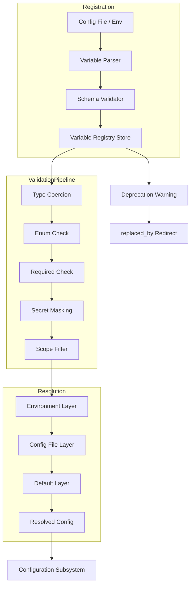
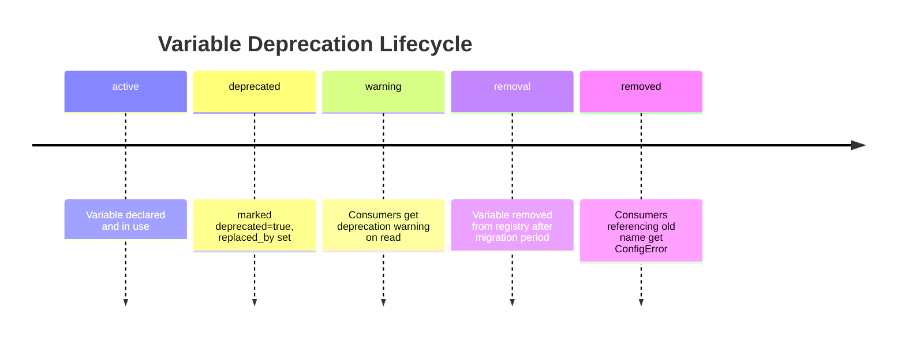

# Variable Registry

**Component ID:** core.variable-registry  
**Status:** Active  
**Version:** 1.0.0  
**Last Updated:** 2026-07-22

---

## Overview

The Variable Registry maintains a complete inventory of environment variables and configuration parameters used across the system. Every variable — whether consumed at build time, startup, or runtime — must be declared here to be recognized by the configuration loader.

This registry ensures that no configuration key is used before it is defined, that deprecations are visible across the codebase, and that secret-bearing variables are never logged or leaked. It is the single source of truth for the Configuration subsystem and the Environment Variables initialization pipeline.

---

## VariableDefinition Schema

```typescript
interface VariableDefinition {
  name: string;
  type: "string" | "number" | "boolean" | "path" | "json" | "duration" | "enum";
  default?: string | number | boolean;
  description: string;
  scope: "build" | "startup" | "runtime" | "all";
  secret: boolean;
  required: boolean;
  enum_values?: string[];
  deprecated?: boolean;
  replaced_by?: string;
  source: "env" | "config_file" | "both";
}
```

| Field          | Type                                      | Description                                    |
|----------------|-------------------------------------------|------------------------------------------------|
| `name`         | `string`                                  | Uppercase snake-case variable name             |
| `type`         | `"string" \| "number" \| "boolean" \| "path" \| "json" \| "duration" \| "enum"` | Value type |
| `default`      | `string \| number \| boolean`?            | Default if not set                             |
| `description`  | `string`                                  | Purpose and usage notes                        |
| `scope`        | `"build" \| "startup" \| "runtime" \| "all"` | When the variable is loaded               |
| `secret`       | `boolean`                                 | If true, never log, dump, or expose in errors  |
| `required`     | `boolean`                                 | Startup must fail if unset                     |
| `enum_values`  | `string[]`?                               | Allowed values for `type: "enum"`              |
| `deprecated`   | `boolean`?                                | Scheduled for removal                          |
| `replaced_by`  | `string`?                                 | Use this variable instead                      |
| `source`       | `"env" \| "config_file" \| "both"`        | Where the value is resolved from               |

---

## Standard Environment Variables

| Variable                  | Type      | Default    | Secret | Required | Scope     | Description                              |
|---------------------------|-----------|------------|--------|----------|-----------|------------------------------------------|
| `AIDEVOS_HOME`            | path      | `~/.aidevos` | false  | true     | startup   | Root directory for all runtime data      |
| `AIDEVOS_CONFIG`          | path      | `$AIDEVOS_HOME/config` | false | false | startup | Configuration file directory       |
| `AIDEVOS_LOG_LEVEL`       | enum      | `info`     | false  | false    | startup   | Log verbosity: `debug`, `info`, `warn`, `error` |
| `AIDEVOS_LOG_DIR`         | path      | `$AIDEVOS_HOME/logs` | false | false | startup   | Log file output directory           |
| `AIDEVOS_PLUGIN_DIR`      | path      | `$AIDEVOS_HOME/plugins` | false | false | startup | Plugin installation directory       |
| `AIDEVOS_TEMP_DIR`        | path      | `$AIDEVOS_HOME/tmp` | false   | false    | runtime   | Temporary file storage                   |
| `AIDEVOS_CACHE_DIR`       | path      | `$AIDEVOS_HOME/cache` | false  | false    | runtime   | Persistent cache storage                 |
| `AIDEVOS_MAX_TOKENS`      | number    | `4096`     | false  | false    | runtime   | Maximum LLM tokens per request           |
| `AIDEVOS_TIMEOUT_SECS`    | number    | `30`       | false  | false    | runtime   | Default operation timeout                |
| `AIDEVOS_SECRET_KEY`      | string    | —          | true   | true     | startup   | Master encryption key                    |
| `AIDEVOS_API_KEY`         | string    | —          | true   | false    | runtime   | External API authentication key          |
| `AIDEVOS_ENABLE_METRICS`  | boolean   | `true`     | false  | false    | runtime   | Enable Prometheus metrics endpoint       |
| `AIDEVOS_METRICS_PORT`    | number    | `9090`     | false  | false    | runtime   | Metrics server listen port               |
| `AIDEVOS_MCP_CONFIG`      | json      | `{}`       | false  | false    | startup   | MCP server connection configuration      |
| `AIDEVOS_DEV_MODE`        | boolean   | `false`    | false  | false    | startup   | Development-mode features and verbose logging |

---

## Integration with Configuration

The Configuration subsystem uses the Variable Registry as its schema for loading and validating config:

1. **Load** — Config loader iterates all `source: "env"` and `source: "both"` variables, reads them from environment, and applies defaults.
2. **Validate** — Each loaded value is type-checked against the variable's `type` field. Enum values are checked against `enum_values`. Required variables that are unset and lack a default raise `ConfigValidationError`.
3. **Coerce** — Values are cast to their declared types (e.g. `"true"` → `true` for booleans, `"30"` → `30` for numbers).
4. **Mask** — Variables with `secret: true` have their values replaced with `"****"` in all logs, error messages, and debug dumps.

---

## Validation Rules

- **Unknown variables** — Loading an environment variable not present in the registry emits a warning but does not fail. This allows forward-compatibility with external tooling.
- **Type mismatch** — If a value cannot be coerced to its declared type, the loader raises `TypeCoercionError` with the variable name and expected type.
- **Missing required** — Startup aborts if a required variable has no value and no default.
- **Deprecated usage** — Reading a variable marked `deprecated: true` emits a deprecation warning with the `replaced_by` target.

---

## Architecture



## Interface Definitions

```typescript
interface VariableRegistry {
  register(def: VariableDefinition): RegistrationResult;
  lookup(name: string, scope?: "build" | "startup" | "runtime"): VariableDefinition | null;
  list(options?: ListOptions): Array<VariableDefinition>;
  validate(value: unknown, def: VariableDefinition): ValidationResult;
  resolve(name: string): ResolvedVariable;
  get_deprecations(): Array<VariableDefinition>;
}

interface RegistrationResult {
  success: boolean;
  warnings: Array<string>;
  errors: Array<string>;
}

interface ListOptions {
  scope?: "build" | "startup" | "runtime" | "all";
  secret?: boolean;
  deprecated?: boolean;
  source?: "env" | "config_file" | "both";
}

interface ValidationResult {
  valid: boolean;
  coercedValue?: unknown;
  error?: string;
}

interface ResolvedVariable {
  name: string;
  value: unknown;
  source: "env" | "config_file" | "default" | "override";
  secret: boolean;
}
```

### `register(def: VariableDefinition): RegistrationResult`

Inserts or updates a variable definition. Validates schema constraints (name format, type validity, enum_values for enum type). Emits a warning if re-registering an existing variable with different properties.

### `lookup(name: string, scope?): VariableDefinition | null`

Resolves a variable definition. The optional scope filter restricts results to variables whose scope matches or includes the given value.

### `list(options?): Array<VariableDefinition>`

Returns all registered definitions, optionally filtered by scope, secret status, deprecation status, or source.

### `validate(value: unknown, def: VariableDefinition): ValidationResult`

Validates and coerces a raw value against a variable definition. Returns the coerced value on success or an error message on failure.

### `resolve(name: string): ResolvedVariable`

Resolves a variable's final value by walking the environment overrides hierarchy. Returns the value with its provenance source.

---

## Validation Algorithm

```text
FUNCTION validate(raw_value, def)
    IF raw_value IS null OR raw_value IS undefined THEN
        IF def.default IS NOT null THEN
            raw_value ← def.default
        ELSE IF def.required THEN
            RAISE ConfigValidationError("Missing required variable: " + def.name)
        ELSE
            RETURN null
        END IF
    END IF

    SWITCH def.type
        CASE "string"   → coerced ← string(raw_value)
        CASE "number"   → coerced ← parse_number(raw_value)
                          IF coerced IS NaN THEN RAISE TypeCoercionError
        CASE "boolean"  → IF raw_value IN ("true","1","yes") → coerced ← true
                          ELSE IF raw_value IN ("false","0","no") → coerced ← false
                          ELSE RAISE TypeCoercionError
        CASE "path"     → coerced ← resolve_path(string(raw_value))
        CASE "json"     → coerced ← parse_json(raw_value)
                          IF parse_failed THEN RAISE TypeCoercionError
        CASE "duration" → coerced ← parse_duration(raw_value)
                          IF parse_failed THEN RAISE TypeCoercionError
        CASE "enum"     → coerced ← string(raw_value)
    END SWITCH

    IF def.type = "enum" AND def.enum_values IS NOT null THEN
        IF coerced NOT IN def.enum_values THEN
            RAISE EnumValidationError("Value must be one of: " + join(def.enum_values))
        END IF
    END IF

    IF def.secret THEN
        masked ← mask_value(coerced)
        log("Resolved secret variable: " + def.name + " = ****")
    ELSE
        log("Resolved variable: " + def.name + " = " + string(coerced))
    END IF

    IF scope_of_loading NOT IN def.scope AND def.scope != "all" THEN
        RAISE ScopeMismatchError("Variable not available in current scope")
    END IF

    RETURN coerced
END FUNCTION
```

---

## Secret Masking Algorithm

```text
FUNCTION mask_value(value)
    string_val ← string(value)
    length ← len(string_val)

    IF length <= 4 THEN
        RETURN "****"
    ELSE IF length <= 12 THEN
        RETURN string_val[0] + "****" + string_val[-1]
    ELSE
        prefix ← string_val[0..3]
        suffix ← string_val[-4..-1]
        RETURN prefix + "****" + suffix
    END IF
END FUNCTION
```

Masking applies to:
- All log output (console, file, structured logs)
- Error messages and stack traces
- Debug dumps and introspection endpoints
- Configuration serialization (save/export)
- Metrics labels and tags

---

## Scope Resolution

| Scope    | Load Time     | Visibility             | Refresh Behavior             |
|----------|---------------|------------------------|------------------------------|
| build    | CI/build init | Build scripts, Makefile| Static per build invocation  |
| startup  | App init      | Main process           | Loaded once at boot          |
| runtime  | On demand     | Request handlers       | Reloadable via SIGHUP/config |
| all      | startup       | Everywhere             | Follows startup semantics    |

---

## Deprecation Lifecycle



1. **Active** — Variable is fully supported.
2. **Deprecated** — `deprecated: true` and `replaced_by` set. Reads emit a structured warning.
3. **Removal** — After a minimum of two release cycles, the variable may be removed from the registry.
4. **Error** — Any code referencing a removed variable receives `ConfigError` pointing to the replacement.

---

## Environment Overrides Hierarchy

```text
Override Precedence (highest to lowest):
  1. AIDEVOS_OVERRIDE_<NAME>
  2. --<name> CLI flag
  3. .env.local
  4. .env.<profile>
  5. .env
  6. OS environment variable
  7. config file value
  8. registry default
```

---

## Load Order Precedence

```text
Order of operations during configuration load:
  1. Load all scope: "build" variables
  2. Apply defaults for unset build variables
  3. Load all scope: "startup" variables
  4. Apply defaults for unset startup variables
  5. Validate all scope: "startup" variables (fail fast)
  6. Load all scope: "runtime" variables (lazy, on first access)
  7. Apply defaults for unset runtime variables
```

---

## Failure Modes

| Mode               | Cause                                       | Effect                                      | Mitigation                                  |
|--------------------|---------------------------------------------|---------------------------------------------|---------------------------------------------|
| Missing required   | Required var unset and no default           | Startup abort with ConfigError              | Documentation, init script validation       |
| Type coercion      | Value cannot be cast to declared type       | TypeCoercionError with expected type        | Schema validation before deployment         |
| Enum violation     | Value not in allowed enum_values set        | EnumValidationError                         | CI check, lint rule                         |
| Scope mismatch     | Variable accessed outside declared scope    | ScopeMismatchError                          | Static analysis, load-time guard            |
| Deprecated access  | Reading a deprecated variable               | Structured warning, no error                | Migration dashboard, metric alert           |
| Unknown variable   | Variable not in registry                    | Warning only, value passed through          | Registry audit CI check                     |
| Cycle in override  | Self-referential override chain             | Infinite resolution loop                    | Resolution depth limit (max 10)             |
| Secret leak        | Secret value emitted in log/error           | Security incident                           | Masking guard, pre-commit hook, audit       |

---

## Observability Metrics

| Metric Name                           | Type      | Labels                          | Description                                |
|---------------------------------------|-----------|---------------------------------|--------------------------------------------|
| `variable_registry_total`             | counter   | status (active/deprecated)      | Total registered variables                 |
| `variable_lookup_total`               | counter   | variable, result (hit/miss)     | Lookup operations by variable              |
| `variable_resolve_duration_seconds`   | histogram | variable                        | Time to resolve a variable                 |
| `variable_validation_total`           | counter   | variable, result (pass/fail)    | Validation outcomes                        |
| `variable_validation_duration_seconds`| histogram | variable                        | Time to validate a single variable         |
| `variable_deprecation_warnings_total` | counter   | variable                        | Deprecation warnings emitted               |
| `variable_secret_access_total`        | counter   | variable                        | Secret variable access count               |

---

## Acceptance Criteria

| ID     | Criterion                                           | Verification Method       |
|--------|------------------------------------------------------|---------------------------|
| VR-01  | Every env variable used at startup is in registry    | CI lint check             |
| VR-02  | Missing required variable blocks startup             | Integration test          |
| VR-03  | Type coercion errors surfaced with clear message     | Unit test                 |
| VR-04  | Secret values never appear in logs or dumps          | Regex scan + unit test    |
| VR-05  | Deprecated variable reads emit structured warning    | Unit test                 |
| VR-06  | Enum values outside allowed set are rejected         | Unit test                 |
| VR-07  | Override hierarchy is respected in resolution        | Integration test          |
| VR-08  | Registration accepts valid definitions               | Unit test                 |
| VR-09  | Lookup returns null for unregistered variable        | Unit test                 |
| VR-10  | Metrics emitted for every lookup and validation      | Integration test          |

---

## Security Considerations

1. **Secret handling** — All `secret: true` variables are masked at the point of resolution. The raw value exists only in the resolved config store and is never serialized, logged, or exposed via API.
2. **Override injection** — The override chain's highest-precedence layers (CLI flags, `.env.local`) accept input from user-adjacent surfaces. Validate sources cannot inject unexpected variable names.
3. **Access control** — The registry itself does not enforce access control; consumers are responsible for restricting access to secret-bearing variables based on caller context.
4. **Audit trail** — All secret variable accesses are logged as audit events (accessor identity, timestamp, variable name) for compliance.
5. **Denial of service** — Maximum resolution depth (10 levels) prevents infinite override chain loops. Maximum value size (1 MB) prevents memory exhaustion.
6. **Configuration injection** — Config file sources must be validated for schema conformance before loading. Malformed files should not corrupt the registry.
7. **Deprecation window** — A minimum two-release-cycle deprecation period before removal ensures downstream consumers have time to migrate.

---

## Related Documents

- SYMBOL_REGISTRY.md — General-purpose symbol tracking
- FUNCTION_REGISTRY.md — Function-specific registry layer
- CLASS_REGISTRY.md — Class/type definition catalog
- CONFIGURATION.md — Configuration loading and resolution
- ARCHITECTURE_GUARDIAN.md — System-wide architectural enforcement
