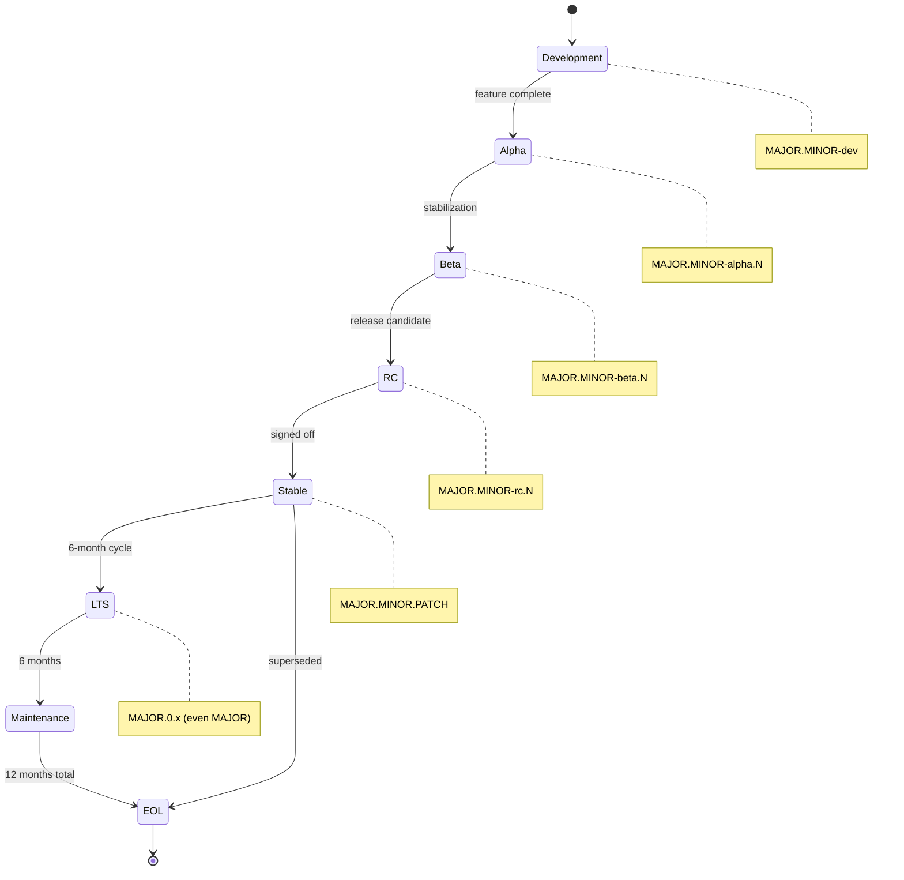

# Versioning

> Versioning strategy for AI Dev OS. Covers the platform binary, REST and WebSocket APIs, prompts, documentation, data schema, and provider adapters. All versioning follows [Semantic Versioning 2.0.0](https://semver.org/) unless otherwise noted.

## Overview

AI Dev OS tracks six independent versioned surfaces. Each surface has its own cadence and scope, but all are released together in a coordinated release bundle. The six surfaces are:

| Surface | Version source | Example |
|---------|---------------|---------|
| Platform (CLI/backend) | `aidevos version` | `0.1.0` |
| REST API | URL path prefix | `/v1/` |
| WebSocket API | Connection handshake | `version: 1` |
| Prompts | Front matter `version` field | `0.1.0` |
| Documentation | `docs/README.md` front matter | `0.1.0` |
| Data schema | SQLite `PRAGMA user_version` | `1` |

No two surfaces share a version number unless they are intentionally lockstepped in a coordinated release.

## Platform Versioning

The CLI and backend binary share a single version string: `MAJOR.MINOR.PATCH` with optional pre-release tags.

- **MAJOR** — breaking CLI flag/command removal, breaking config format changes, removal of a deprecated subsystem.
- **MINOR** — new commands, new flags, new subsystems, new provider adapters, non-breaking feature additions.
- **PATCH** — bug fixes, performance improvements, documentation regenerations, dependency bumps with no behavioral change.

Pre-release tags follow the semver convention: `0.1.0-alpha.1`, `0.1.0-beta.1`, `0.1.0-rc.1`. Pre-release versions are excluded from the "latest" stability guarantee.

The platform version is printed by `aidevos version` and embedded in user-agent strings for all outbound HTTP requests.

## API Versioning

### REST API

The REST API is versioned by URL path prefix: `/v1/models`, `/v1/runs`, `/v2/models`. The version in the path refers to the API contract only — it is independent of the platform version.

- A new API version is created when existing endpoints change in a backward-incompatible way.
- The previous API version is deprecated for one minor release cycle before removal.
- All API versions are documented in [API Spec](./API_SPEC.md).

### WebSocket API

The WebSocket API is versioned in the connection handshake. The client sends a `version: N` field in the connection payload. The server responds with `version: N, accepted: true/false`.

- Version `1` corresponds to the initial WebSocket contract (Phase 1–3).
- Version negotiation is handled at connection time; mismatched versions receive a `version_mismatch` error frame and the connection is closed.

### MCP

The Model Context Protocol follows upstream versioning. AI Dev OS documents which MCP spec version is supported in [MCP.md](./MCP.md). No separate version is maintained.

## Prompt Versioning

Every prompt file under `prompts/` carries a `version` field in its YAML front matter:

```yaml
---
role: kernel
version: 0.1.0
updated: 2025-07-22
---
```

The `MASTER_PROMPT` version is part of the Kernel identity — it is printed in `aidevos doctor` and logged at startup. A prompt version bump is required whenever:

- A prompt's instruction set changes in a way that alters agent behavior.
- A prompt's output format changes.
- A prompt is removed or replaced.

Prompt versions are independent of the platform version. A single platform release may update zero, one, or many prompts.

## Documentation Versioning

The documentation vault at `docs/` is versioned in `docs/README.md` front matter:

```yaml
---
title: AI Dev OS Documentation
version: 0.1.0
updated: 2025-07-22
---
```

- **PATCH** — typo fixes, link updates, formatting changes, new examples.
- **MINOR** — new documents, new sections in existing documents, significant rewrites that do not break existing cross-references.
- **MAJOR** — document removal, section removal that breaks cross-references, structural reorganization that breaks links.

Documentation version is decoupled from platform version but is tagged in the same release.

## Data Schema Versioning

The SQLite database schema version is stored in `PRAGMA user_version` as an integer. Migration files live in `migrations/` and follow the naming convention `{from_version}_{to_version}_{description}.sql`.

- Schema version `1` is the initial schema (Phase 1).
- Each migration bumps `user_version` by exactly 1.
- Backward compatibility is maintained for 2 minor platform versions. A database opened by platform version `X.Y` MUST be readable by platform version `X.(Y+1)` and `X.(Y+2)` without migration.
- Schema upgrades are applied automatically on `aidevos init` and `aidevos doctor`. Downgrades are not supported — a warning is printed if the database is newer than the binary.

## Provider Adapter Versioning

Each provider adapter (OpenAI, Anthropic, Ollama, etc.) has its own version string declared in its adapter module. Adapter versions are independent of the platform version.

```json
{
  "provider": "openai",
  "adapter_version": "1.2.3",
  "min_platform_version": "0.1.0"
}
```

An adapter's `min_platform_version` declares the oldest platform release it is compatible with. The Nine Router checks this at registration time and logs a warning if the platform is too old.

## Changelog Location

The authoritative changelog lives at [CHANGELOG.md](./CHANGELOG.md) in the repository root. It follows the [Keep a Changelog](https://keepachangelog.com/) format and covers all six versioned surfaces. Each platform release adds a new entry; prompt-only or doc-only patches may be grouped.

## Breaking Change Policy

| Change type | Bump | Surface |
|-------------|------|---------|
| API endpoint removed or renamed | MAJOR | REST API |
| API request/response schema changed | MAJOR | REST API |
| Database schema backward-incompatible change | MAJOR | Data Schema |
| Prompt output format changed | MAJOR | Prompt |
| CLI command or flag removed | MAJOR | Platform |
| New API endpoint added | MINOR | REST API |
| New CLI command added | MINOR | Platform |
| New prompt added | MINOR | Prompt |
| Bug fix with no contract change | PATCH | All |

Breaking changes across multiple surfaces are batched into a single MAJOR release whenever possible.

## Relationship to Releases

Every release tag encodes both the platform version and the documentation version:

```
v0.1.0+docs.0.1.0
```

The release build pipeline (see [Release Process](./RELEASE_PROCESS.md)) produces:
- Platform binaries tagged with `v{platform_version}`
- Documentation archive tagged with the same release tag
- CHANGELOG entry covering all surface changes

## Version Lifecycle Diagram



## Semantic Versioning Policy

All AI Dev OS versioned surfaces follow [Semantic Versioning 2.0.0](https://semver.org/) with the following clarifications:

- **MAJOR** (X.0.0): Breaking changes to the public API, CLI commands, configuration format, or data schema. Users MUST follow the migration guide.
- **MINOR** (0.Y.0): New features, new API endpoints, new CLI commands, new subsystem additions. Backward compatible with the same MAJOR version.
- **PATCH** (0.0.Z): Bug fixes, performance improvements, documentation updates, dependency bumps with no behavioral change.

Pre-release versions (`-alpha`, `-beta`, `-rc`) are excluded from the stability guarantee. Users running pre-release versions MUST expect breaking changes without notice.

## Breaking Change Detection

Breaking changes are detected and enforced through automated checks in CI:

1. **API contract check**: A previous-version OpenAPI spec is compared against the current spec. Removed endpoints, changed schemas, and new required fields are flagged.
2. **CLI sniff test**: The `--help` output of the previous binary is compared against the current binary. Removed commands or flags are flagged.
3. **Config compatibility**: Previous-version config files are parsed by the current binary. Parse failures are flagged.
4. **Database migration test**: A database created by the previous version is opened, queried, and closed by the current binary. Failures are flagged.
5. **Prompt format test**: Previous-version prompt outputs are parsed by the current prompt parser. Parsing failures are flagged.

If any check fails, the CI pipeline blocks the release and requires a MAJOR version bump.

## Dependency Version Resolution Algorithm

```
function resolveDependencies(platform_version, requirements):
    sorted = topologicalSort(requirements)
    for each dep in sorted:
        candidates = filter(available_versions, compatible(dep.constraint, platform_version))
        if candidates is empty:
            throw ResolutionError("No compatible version for " + dep.name)
        selected = selectBest(candidates, prefer_minor_upgrade)
        dep.version = selected
    return locked requirements

function compatible(constraint, platform_version):
    // constraint: ">=0.1.0 <1.0.0"
    // returns true if any version matching constraint exists
    return semver.satisfies(platform_version, constraint)
```

## Version Compatibility Matrix

| Platform Ver | DB Schema | REST API | WS API | Prompts | Docs |
|-------------|-----------|----------|--------|---------|------|
| 0.1.x | 1 | v1 | 1 | 0.1.x | 0.1.x |
| 0.2.x | 2 | v1 | 1 | 0.2.x | 0.2.x |
| 0.3.x | 3 | v1 | 1 | 0.3.x | 0.2.x |
| 1.0.x | 10 | v1 | 2 | 1.0.x | 1.0.x |

Database backward compatibility is maintained for 2 minor platform versions. API version `v1` is supported until `v3` ships.

## Migration Version Ordering

When multiple schema migrations exist, they MUST be applied in strict sequential order:

```
migrations/
├── 1_2_initial_schema.sql
├── 2_3_add_memory_table.sql
├── 3_4_add_vector_index.sql
├── 4_5_add_sce_topics.sql
└── 5_6_add_audit_log.sql
```

The migration runner reads `PRAGMA user_version`, applies all migrations with a higher version number in order, and commits each migration in a transaction.

## Failure Modes

| Mode | Detection | Response |
|------|-----------|----------|
| Schema migration fails | SQL error during migration | Roll back transaction; log error; exit with code 3 |
| Version mismatch (binary < DB) | user_version > expected | Warn user; refuse to write; allow read-only mode |
| Version mismatch (binary > DB) | user_version < expected | Apply pending migrations automatically |
| Breaking change undetected | CI comparison fails | Block release; require MAJOR bump |
| Pre-release version in production | Version contains `-alpha`/`-beta`/`-rc` | Warn on startup; exclude from "latest" |

## Acceptance Criteria

- Running a database from version 0.1.x on platform version 0.3.x succeeds with automatic migration applied.
- Running the binary against a newer database version prints a warning and enters read-only mode.
- CI blocks a PR that removes a CLI command without a MAJOR version bump.
- Upgrading from 0.1.0 to 0.2.0 applies all intermediate migrations exactly once.
- The `aidevos version` command outputs the platform version in semver format.

## Related Documents

- [Release Process](./RELEASE_PROCESS.md)
- [CHANGELOG](./CHANGELOG.md)
- [Migration Guide](./MIGRATION_GUIDE.md)
- [Upgrade Notes](./UPGRADE_NOTES.md)
- [API Spec](./API_SPEC.md)
