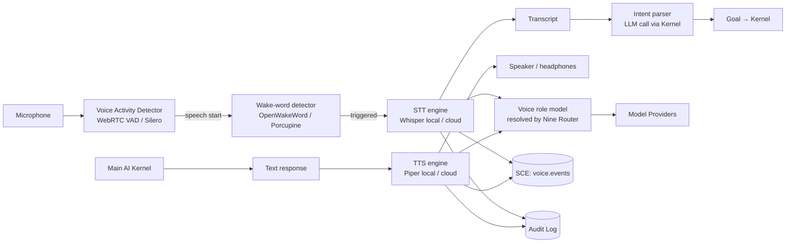

# Voice System

> Full-duplex speech I/O subsystem — STT, TTS, wake-word detection, and voice-to-goal routing — running locally by default with optional cloud provider fallback. This document is normative — implementations MUST satisfy every MUST clause below.

## Overview

The Voice System makes AI Dev OS accessible via natural speech. It handles the full pipeline from raw audio input to a structured `Goal` delivered to the [Main AI Kernel](./MAIN_AI_KERNEL.md), and from the Kernel's text response back to synthesised audio output. The system is local-first: Whisper (STT) and Piper (TTS) run on the local machine with no cloud dependency. Cloud STT/TTS providers can be configured as fallbacks behind the same interface.

The Voice System is the ninth of the Nine Roles ("Voice") in the [Nine Router](./NINE_ROUTER.md). A model can be assigned to the Voice role to govern which STT/TTS backend is active for the workspace. This means Voice is a first-class model assignment, not a hard-coded configuration.

## Goals

- Local-first: Whisper + Piper provide offline STT/TTS with no API key required.
- Cloud fallback: OpenAI Whisper API, ElevenLabs, Google Cloud Speech-to-Text can be configured as fallbacks.
- Wake-word detection: a lightweight always-on detector (OpenWakeWord or Porcupine) triggers the STT pipeline.
- Latency budget: < 500 ms from end of speech to first audio chunk of the TTS response.
- Voice-to-goal routing: transcribed speech is routed to the Kernel as a `Goal` with `source: "voice"`.
- Audio privacy: raw audio buffers are NEVER persisted unless the user explicitly opts in.

## Non-Goals

- Real-time conversation (< 100 ms latency) — the system targets a coding assistant workflow, not a real-time voice chat.
- Speaker diarisation or multi-speaker support in v1.
- Implementation code — this repository is documentation-only (see [AI Coding Rules](./AI_CODING_RULES.md)).

## Architecture



## STT Pipeline

### 1. Voice Activity Detection (VAD)

The VAD runs continuously at < 1% CPU (WebRTC VAD or Silero VAD). It detects the start and end of speech segments and gates the STT engine. It MUST NOT store or transmit any audio; it is a pure signal detector.

Configuration:
```
vad.mode:              "webrtc" | "silero"
vad.aggressiveness:    0–3  # WebRTC VAD aggressiveness (default 2)
vad.silence_timeout_ms: 800  # ms of silence before end-of-utterance
vad.min_speech_ms:     200   # minimum speech duration to trigger STT
```

### 2. Wake-Word Detection

When `wake_word.enabled: true`, the STT pipeline only activates after the wake word is detected. The wake-word detector runs as a subprocess with minimal resources.

Supported detectors:
- **OpenWakeWord** (MIT, local, default): `hey aidevos`
- **Porcupine** (Picovoice, local, free tier): custom wake words
- **Disabled**: STT activates on every VAD-detected speech segment (push-to-talk mode)

### 3. Speech-to-Text (STT)

STT converts the captured audio buffer to text. The active STT backend is determined by the **Voice role model binding** from the [Nine Router](./NINE_ROUTER.md):

| Backend | Model ID | Notes |
|---------|----------|-------|
| Whisper local (default) | `local/whisper-base.en` | ≤ 400 ms p95 on M1; fully offline |
| Whisper local (high quality) | `local/whisper-large-v3` | ≤ 2 s p95; offline |
| OpenAI Whisper API | `openai/whisper-1` | Cloud; requires API key |
| Google Cloud STT | `google/latest_long` | Cloud; streaming available |
| Deepgram | `deepgram/nova-2` | Cloud; lowest latency cloud option |

Audio format requirements: 16-bit PCM, 16 kHz sample rate, mono. The Voice System resamples if needed.

STT output:
```
Transcript {
  text:        string
  language:    string?       # ISO 639-1 detected language
  confidence:  number        # 0–1
  duration_ms: number        # audio duration
  words:       { word, start_ms, end_ms, confidence }[]?  # if model supports word timestamps
  backend:     string        # model ID used
}
```

### 4. Intent Parsing and Goal Routing

The transcript is sent to the Kernel as a lightweight `Goal` with `source: "voice"`. A fast, cheap model (typically the Router role) parses intent and determines whether to:
- Route to the full Kernel loop (complex request)
- Handle directly (simple query like "what model is assigned to Builder?")
- Request clarification ("Did you say X?")

```
voice.submit(transcript) → run_id    # full Kernel routing
voice.answer(text) → (synthesise TTS immediately, skip Kernel loop)
voice.clarify(question, options[]) → Clarification
```

## TTS Pipeline

### Text-to-Speech (TTS)

The TTS engine converts the Kernel's text response to audio. It MUST begin streaming audio within 500 ms of receiving the first text chunk (streaming TTS, not wait-for-full-response).

| Backend | Model ID | Notes |
|---------|----------|-------|
| Piper local (default) | `local/piper-en_US-amy-medium` | ≤ 150 ms first chunk; offline; multiple voices |
| OpenAI TTS | `openai/tts-1` | Cloud; `alloy`, `echo`, `fable`, `onyx`, `nova`, `shimmer` |
| ElevenLabs | `elevenlabs/<voice_id>` | Cloud; highest naturalness; streaming |
| Coqui TTS | `local/coqui-v2` | Local; cloneable voices |

TTS configuration:
```
tts.voice:        string          # e.g. "local/piper-en_US-amy-medium"
tts.speed:        0.5–2.0         # playback rate multiplier (default 1.0)
tts.volume:       0.0–1.0
tts.ssml:         boolean         # enable SSML markup for emphasis, pauses
tts.chunk_size:   number          # characters per TTS chunk for streaming
tts.interrupt:    boolean         # allow user speech to interrupt playback (default true)
```

### Interruption Handling

When `tts.interrupt: true`, the VAD monitors the microphone while TTS is playing. If speech is detected:
1. TTS playback is immediately stopped.
2. The in-progress Kernel run is cancelled via `kernel.cancel(run_id, "voice_interrupt")`.
3. The new speech is transcribed and routed as a fresh Goal.

## Interfaces

```
# Session management
voice.start_session(opts?) → VoiceSession
voice.end_session(session_id) → Ack

# Input
voice.listen(session_id) → Transcript              # blocks until utterance complete
voice.listen_stream(session_id) → AsyncIterator<TranscriptChunk>  # streaming partial transcripts
voice.submit(session_id, transcript) → run_id

# Output
voice.speak(session_id, text) → Ack               # fire-and-forget TTS
voice.speak_stream(session_id) → WritableStream    # streaming text in → streaming audio out
voice.stop_speaking(session_id) → Ack             # interrupt current TTS

# Configuration
voice.set_stt(model_id) → Ack
voice.set_tts(voice_id) → Ack
voice.calibrate() → CalibrationResult             # mic level, wake-word sensitivity
voice.test_tts(text) → Ack                        # play test phrase

# CLI equivalents
# aidevos voice listen     → one-shot push-to-talk
# aidevos voice say <text> → TTS playback
```

## Data Model

```
VoiceSession {
  id:          ulid
  state:       "idle"|"listening"|"processing"|"speaking"
  stt_model:   string
  tts_voice:   string
  wake_word:   string?
  started:     rfc3339
  last_activity: rfc3339
}

VoiceEvent {
  session_id:  ulid
  kind:        "wake_word_detected"|"speech_start"|"speech_end"|"transcript_ready"
             | "tts_start"|"tts_chunk"|"tts_end"|"interrupted"|"error"
  ts:          rfc3339
  payload:     object
}
```

**Audio privacy**: Raw audio buffers are NEVER included in any `VoiceEvent` payload. The `Transcript` record contains only text. Audio is discarded after STT completes unless `session.record_audio: true` (user opt-in, stored encrypted, subject to [Data Retention](./DATA_RETENTION.md) policy).

## Requirements

- **MUST** run local STT (Whisper base) and local TTS (Piper) with zero network egress on a fresh install.
- **MUST** achieve < 500 ms from end of speech (VAD silence timeout) to first TTS audio chunk for simple responses.
- **MUST** never persist raw audio buffers unless `session.record_audio: true` is explicitly set by the user.
- **MUST** support interruption: speaking into the mic while TTS is active stops playback and starts a new session.
- **MUST** publish all voice events (excluding audio buffers) to the SCE `voice.events` topic.
- **MUST** honour the Voice role model binding from the [Nine Router](./NINE_ROUTER.md) for both STT and TTS backend selection.
- **SHOULD** support streaming TTS: begin playing audio while the Kernel response is still streaming.
- **SHOULD** support wake-word detection as an alternative to push-to-talk.
- **MAY** support per-session language override for multilingual environments.
- **MAY** support SSML markup in TTS for control over emphasis, pauses, and pronunciation.

## Failure Modes

| Mode | Detection | Response |
|------|-----------|----------|
| Microphone permission denied | OS audio permission error | Surface clear consent prompt; disable voice features until granted |
| Whisper model not downloaded | Model file missing | Offer one-click download; fall back to cloud STT if configured |
| STT produces empty transcript | Confidence < `min_confidence` or empty string | Ask user to repeat; emit `voice.low_confidence` event |
| TTS audio device unavailable | Audio playback error | Fall back to text-only output; emit `voice.tts_unavailable` |
| Cloud STT/TTS unavailable | API error | Fall back to local model; emit `voice.cloud_fallback` |
| Wake-word false positives | High false-positive rate | Reduce VAD aggressiveness; surface tuning suggestions |
| Latency budget exceeded | First audio chunk > 500 ms | Log `voice.latency_exceeded`; switch to faster model automatically if configured |

Every failure emits a structured event on the SCE and is recorded in the [Audit Log](./AUDIT_LOG.md).

## Security Considerations

- Audio is the most privacy-sensitive input. Raw audio MUST NOT leave the device unless the user explicitly chooses a cloud STT provider.
- Wake-word detectors run locally; the keyword itself is never transmitted.
- Cloud provider calls go through the Kernel-proxied HTTP client; they appear in the [Audit Log](./AUDIT_LOG.md).
- Voice sessions are scoped to a workspace; cross-workspace voice routing is not permitted.
- See [Privacy](./PRIVACY.md), [Security Model](./SECURITY_MODEL.md), and [Data Retention](./DATA_RETENTION.md).

## Observability

| Metric | Labels | Description |
|--------|--------|-------------|
| `voice_session_total` | `state` | Session starts/ends |
| `voice_stt_seconds` | `backend` | STT latency histogram |
| `voice_tts_first_chunk_ms` | `backend` | Time to first audio chunk |
| `voice_interrupt_total` | — | TTS interruption events |
| `voice_wake_word_total` | `detected=true\|false` | Wake-word detections |
| `voice_confidence_p50` | `backend` | Median transcript confidence |
| `voice_cloud_fallback_total` | `direction=stt\|tts` | Cloud fallback events |

Traces: one span per voice session from speech_start to tts_end. See [Tracing](./TRACING.md).

## Acceptance Criteria

- `aidevos voice say "Hello"` produces audible TTS output within 500 ms on a machine with Piper installed.
- `aidevos voice listen` captures a push-to-talk utterance and returns a `Transcript` with non-empty `text`.
- Speaking while TTS is playing stops playback and starts a new STT session within 200 ms.
- Disconnecting from the network while using a local STT/TTS model produces no errors and no network calls.
- A Transcript with `confidence < 0.5` triggers a clarification request rather than routing to the Kernel.

## Open Questions

- Whether to support real-time streaming STT (partial transcripts while speaking) for lower perceived latency — tracked in [templates/ADR](../templates/ADR.md).
- Wake-word licensing: OpenWakeWord (MIT, limited accuracy) vs. Porcupine (free tier, better accuracy but commercial for high volume).

## Related Documents

- [Nine Router](./NINE_ROUTER.md) — Voice role model binding
- [Main AI Kernel](./MAIN_AI_KERNEL.md) — receives Goals from Voice
- [UI/UX](./UI_UX.md) — push-to-talk UI, voice visualiser
- [Privacy](./PRIVACY.md)
- [Local Models](./LOCAL_MODELS.md) — Whisper and Piper local model management
- [CLI](./CLI.md) — `aidevos voice` subcommands
- [System Overview](./SYSTEM_OVERVIEW.md)
- [Architecture Guardian](./ARCHITECTURE_GUARDIAN.md)
