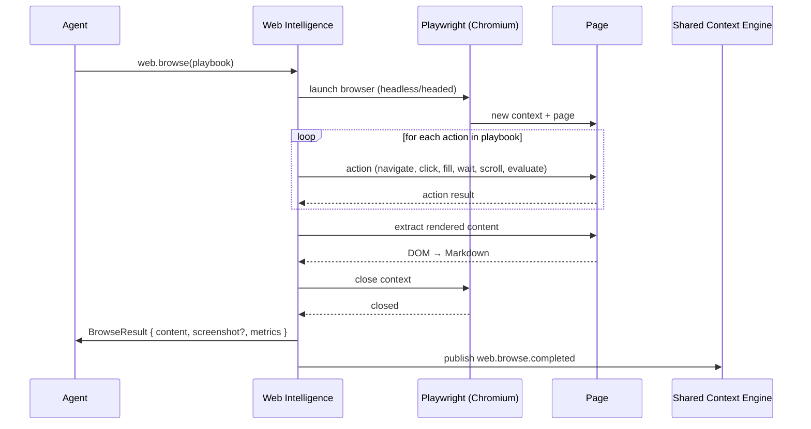

# Web Intelligence

> Playwright-based browser automation for fetching rendered content from JavaScript-heavy websites. This document is normative — implementations MUST satisfy every MUST clause below.

## Overview

Web Intelligence is the live-browser subsystem of AI Dev OS. While the [Research Engine](./RESEARCH_ENGINE.md) handles scheduled, offline-friendly content crawling, Web Intelligence is designed for **on-demand, interactive browsing** — pages that require JavaScript execution, infinite scroll, "Load More" clicks, form submissions, or login flows. It wraps a headless (or headed) Chromium instance via Playwright and exposes a simple action-oriented playbook interface.

The subsystem is invoked in two ways:
- **Directly** — an agent calls `web.browse(playbook)` with a sequence of browser actions.
- **Delegated** — the [Research Engine](./RESEARCH_ENGINE.md) or [Internet Search](./INTERNET_SEARCH.md) hands off to Web Intelligence when a source requires JS rendering.

## Goals

- Execute a declarative playbook of browser actions against a target URL.
- Extract rendered DOM content as clean Markdown.
- Execute arbitrary JavaScript in page context for advanced extraction or state inspection.
- Support resource limits (timeout, page count, data volume) so the Kernel can bound cost.
- Operate in both headless and headed mode for debugging and CAPTCHA-heavy scenarios.
- Never inject agent credentials into the browser session.

## Non-Goals

- Replacing a full crawling framework — Web Intelligence is for **targeted** browsing, not bulk crawl.
- Storing session state across calls — every `web.browse` call starts a fresh context (unless a session ID is provided).
- Bypassing CAPTCHAs — the subsystem alerts the caller and stops; it does not attempt automated solving.

## Architecture



## Playbook Format

A playbook is a JSON array of actions executed sequentially. Each action has a `type` and optional parameters:

```
Action {
  type:           "navigate" | "click" | "fill" | "wait" | "scroll" | "evaluate" | "screenshot" | "extract"
  selector?:      string       # CSS selector (click, fill, extract)
  value?:         string       # text to fill or JS expression (evaluate)
  wait_for?:      string       # selector or "networkidle" | "domcontentloaded"
  wait_time?:     number       # milliseconds
  scroll_to?:     "top" | "bottom" | { selector, block }
  screenshot?:    bool         # capture full-page after this action
  extract_rules?: ExtractRule[]
}

ExtractRule {
  name:           string       # field name in output
  selector:       string       # CSS selector
  attribute?:     string       # "text" | "href" | "src" | "innerHTML"
  multiple?:      bool         # return all matches vs. first
}
```

### Example Playbook

```
web.browse({
  url: "https://example.com/blog",
  playbook: [
    { type: "navigate", wait_for: "networkidle" },
    { type: "wait", wait_time: 1000 },
    { type: "scroll", scroll_to: "bottom" },
    { type: "wait", wait_for: ".load-more" },
    { type: "click", selector: ".load-more button", wait_for: "networkidle" },
    { type: "extract", extract_rules: [
      { name: "posts", selector: "article.post-title", attribute: "text", multiple: true },
      { name: "links", selector: "article a", attribute: "href", multiple: true }
    ]}
  ],
  timeout_ms: 30000
})
```

## Source Configuration

When used via the [Research Engine](./RESEARCH_ENGINE.md) integration, sources can declare `web_intelligence` settings:

```
ResearchJob.source.web_intelligence = {
  playbook:       Action[]        # required: the playbook to execute
  headless:       bool            # default true
  viewport:       { width, height }  # default 1280x720
  user_agent?:    string          # custom UA string
  locale?:        string          # e.g. "en-US", "ja-JP"
  extra_headers?: { string: string }
}
```

## Rendered Content Extraction

After playbook execution, Web Intelligence extracts the page's rendered DOM. The extraction pipeline:

1. **Remove** non-content elements: `<script>`, `<style>`, `<nav>`, `<footer>`, `<header>`, `[aria-hidden="true"]`.
2. **Convert** the cleaned DOM to Markdown via a readability algorithm (turndown or similar).
3. **Truncate** to `max_content_bytes` (default 512 KB) — content beyond the limit is discarded with a `truncated` flag.

The extracted content **SHOULD** preserve structure: headings, lists, code blocks, tables, and links.

## JavaScript Execution

Arbitrary JS can be executed in page context via the `evaluate` action type:

```
{ type: "evaluate", value: "document.querySelector('meta[name=description]').content" }
```

Return values MUST be JSON-serializable. The evaluation runs inside the page's origin — it has access to `window`, `document`, and any page-level globals. Evaluation is subject to the same `timeout_ms` budget as the rest of the playbook.

## Resource Limits

Every `web.browse` call enforces these bounds:

| Limit | Default | Maximum | Description |
|-------|---------|---------|-------------|
| `timeout_ms` | 30 000 | 120 000 | Total wall-clock time for the playbook |
| `max_pages` | 1 | 5 | Number of distinct pages navigated to |
| `max_content_bytes` | 524 288 | 2 097 152 | Rendered content size before truncation |
| `max_screenshot_bytes` | 1 048 576 | — | Screenshot PNG size limit |
| `action_timeout_ms` | 10 000 | 30 000 | Per-action timeout |

If a limit is exceeded the browser context is closed immediately and a partial result is returned with the `truncated: true` and/or `timed_out: true` flags.

## Headless vs Headed Mode

| Mode | Use Case |
|------|----------|
| **Headless** (default) | Production — fastest, lowest resource usage |
| **Headed** | Debugging — pass `headless: false` to watch the browser interact with the page |
| **Headed + slow-mo** | CAPTCHA-heavy sites — `headless: false, slow_mo_ms: 500` slows all actions to human speed |

Headed mode binds to a random local display port. In containerised deployments, headed mode requires `DISPLAY` or `WAYLAND` to be available.

## Failure Modes

| Mode | Detection | Response |
|------|-----------|----------|
| CAPTCHA / bot challenge | Page contains "cf-challenge", "captcha", "hcaptcha", or similar | Fail with `captcha_detected`; return partial content; emit `web.captcha` metric |
| Timeout | Total execution exceeds `timeout_ms` | Close context; return partial result with `timed_out: true` |
| JS evaluation error | Playwright throws `Error` from `page.evaluate` | Skip action; continue playbook; include error in `action_errors[]` |
| Navigation error | HTTP 4xx/5xx, DNS failure, certificate error | Fail with `navigation_error`; include HTTP status and URL; emit `web.nav_error` |
| Layout change | Playwright action times out finding selector | Fail action with `selector_not_found`; optionally continue with remaining actions |
| Browser crash | Playwright process exits unexpectedly | Retry once with a fresh browser instance; fail on second crash |
| Resource limit exceeded | Any limit from the table above | Close context; return partial result with `truncated/timed_out` flags |
| Popup / new window | Page triggers `window.open` | Block the popup; log warning; continue on original page |

Every failure emits a structured event on the SCE and is recorded in the [Audit Log](./AUDIT_LOG.md).

## Integration with Research Engine and Internet Search

```
Research Engine ──→ source.web_intelligence detected ──→ delegates to Web Intelligence
                                                              │
Internet Search ──→ result page requires JS rendering ──────→ delegates to Web Intelligence
                                                              │
Web Intelligence ──→ returns BrowseResult ──→ back to caller
```

When the Research Engine encounters a source with `web_intelligence` config, it posts a `research.needs_browse` event. The Web Intelligence service picks it up, executes the playbook, and posts a `research.browse_completed` event with the extracted content.

## Security Considerations

- All browser contexts are created in a **sandboxed** environment (Chromium's `--no-sandbox` is **never** set in production). On Linux this uses `user namespaces`; on Windows it uses AppContainer isolation.
- Agent credentials are **never** injected into the browser session. If a site requires authentication, use `extra_headers` (for API tokens) or a dedicated session profile stored in [Secrets Management](./SECRETS_MANAGEMENT.md).
- The browser is launched with `--disable-extensions`, `--disable-plugins`, `--disable-sync`, and `--disable-features=TranslateUI,ChromeWhatsNewUI`.
- Navigation is restricted to HTTP/HTTPS schemes; `file://`, `data://`, `blob:` are blocked.
- See [Security Model](./SECURITY_MODEL.md) and [Privacy](./PRIVACY.md).

## Observability

| Metric | Labels | Description |
|--------|--------|-------------|
| `web_browse_total` | `status=success\|failure` | Total browse calls |
| `web_browse_seconds` | — | Duration histogram |
| `web_action_total` | `action_type` | Actions executed |
| `web_action_error_total` | `action_type`, `error` | Action failures |
| `web_captcha_total` | — | CAPTCHA detections |
| `web_content_bytes` | — | Rendered content size histogram |
| `web_browser_crash_total` | — | Browser process crashes |
| `web_pages_per_call` | — | Pages visited per call |

Traces: one span per `web.browse` call, with child spans for each action and content extraction.

## Acceptance Criteria

- A playbook that navigates to a SPA, scrolls to the bottom, and clicks "Load More" returns the full list of rendered items.
- A playbook targeting a page with a bot challenge returns `captcha_detected` with partial content within the timeout.
- An `evaluate` action that reads `document.title` returns the correct title string.
- Setting `max_content_bytes` to 1024 truncates the returned content and sets `truncated: true`.
- Setting `timeout_ms` to 100 causes the call to return with `timed_out: true`.

## Related Documents

- [Research Engine](./RESEARCH_ENGINE.md)
- [Internet Search](./INTERNET_SEARCH.md)
- [GitHub Analysis](./GITHUB_ANALYSIS.md)
- [Shared Context Engine](./SHARED_CONTEXT_ENGINE.md)
- [Secrets Management](./SECRETS_MANAGEMENT.md)
- [Security Model](./SECURITY_MODEL.md)
- [Observability](./OBSERVABILITY.md)
- [Audit Log](./AUDIT_LOG.md)
- [System Overview](./SYSTEM_OVERVIEW.md)
- [Main AI Kernel](./MAIN_AI_KERNEL.md)
