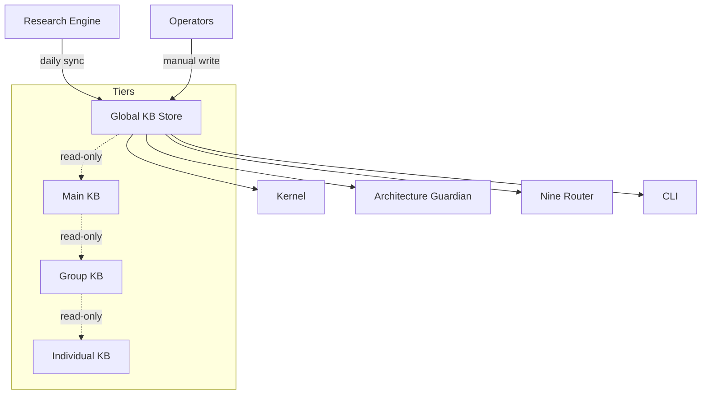

# Global Knowledge Base

> Cross-workspace knowledge shared by every project and every agent on this installation.

## Architecture Overview



## Scope

- Language references, framework docs, standards (RFCs, W3C).
- Model provider docs and capability tables.
- Universal coding rules and safety policies.
- System-wide invariants enforced by the Architecture Guardian.
- Provider registry (available model providers and their configuration).
- Global prompt templates and base system instructions.
- Security policies and credential handling rules.

## Access Control

### Write Access Model

| Role | Write Access | Notes |
|------|-------------|-------|
| Operator | Full CRUD | Via Kernel or KB API |
| Kernel | Create, Update | No delete |
| Architecture Guardian | Create (rules only) | Safety policy entries |
| Research Engine | Create (research only) | Auto-ingested results |
| Agent | None | Read-only |

### Read Access

All agents across all workspaces have read access. No read filtering — all Global KB entries are visible to every agent.

## Record Schema

### MemoryRecord

```typescript
interface MemoryRecord {
  id: string;                    // UUID v4
  workspace: "_global";          // Constant for Global KB
  project: null;                 // Not project-scoped
  group_id: null;                // Not group-scoped
  agent: null;                   // Not agent-scoped

  kind: KnowledgeRecordKind;     // See table below
  content: string;               // Markdown body
  metadata: RecordMetadata;      // Structured metadata

  embedding: Float32Array;       // Vector for similarity search
  embedding_model: string;       // Model used for embedding

  created_at: number;            // Unix ms
  updated_at: number;            // Unix ms
  expires_at: number | null;     // Null for "forever" retention
  last_accessed_at: number;

  source: string;                // Origin identifier
  source_url: string | null;     // Link to original
  checksum: string;              // SHA-256 of content
  version: number;               // Monotonic version counter

  tags: string[];
  references: string[];          // IDs of related records
  signature?: string;            // Optional operator signature
}

interface RecordMetadata {
  author: string;
  reviewed_by: string | null;
  reviewed_at: number | null;
  applicable_versions: string;   // Semver range
  deprecated: boolean;
  superseded_by: string | null;  // ID of replacement record
}
```

### Knowledge Record Kinds

| Kind | Description | Retention | Example |
|------|-------------|-----------|---------|
| `language_ref` | Language/framework docs | forever | "TypeScript 5.5 handbook" |
| `provider_doc` | Model provider docs | forever | "OpenAI API reference" |
| `standard` | RFC/W3C standards | forever | "HTTP Semantics (RFC 9110)" |
| `rule` | Universal coding rule | forever | "No secrets in artifacts" |
| `policy` | Safety/security policy | forever | "Credential handling policy" |
| `invariant` | System invariant | forever | "All events have unique IDs" |
| `provider_registry` | Provider config | forever | "OpenAI provider entry" |
| `prompt_template` | Base system prompt | forever | "Default Kernel instructions" |
| `research` | Research Engine output | 90d | "Comparison of embedding models" |

## Query Interface

```typescript
interface GlobalKBQuery {
  text: string;                              // Natural language query
  scope: { workspace: "_global" };
  kinds?: KnowledgeRecordKind[];             // Filter by kind
  tags?: string[];                           // Filter by tags
  k: number;                                 // Top-k results (max 20)
  min_score?: number;                        // Similarity threshold (0-1)
  include_expired?: boolean;                 // Default false
}

interface GlobalKBResult {
  records: ScoredRecord[];
  total: number;
  query_duration_ms: number;
}

interface ScoredRecord {
  record: MemoryRecord;
  score: number;                             // Cosine similarity (0-1)
  matched_on: "semantic" | "keyword" | "tag";
}
```

## Ingestion Pipeline

```
Research Engine
  └─ scheduled job (default: daily)
       └─ fetches provider /models endpoints
       └─ scrapes language documentation updates
       └─ checks W3C/RFC errata feeds
       └─ generates embeddings for new content
       └─ writes to Global KB with kind="research", retention=90d

Operator (manual)
  └─ via Kernel CLI: `kb write --global <path>`
       └─ validates schema
       └─ generates embedding
       └─ writes with kind, retention, signature
       └─ commits change to docs repo

Architecture Guardian
  └─ via KB API: POST /kb/global/rules
       └─ writes safety rules with kind="rule", retention="forever"
```

## Retention Policy

| Kind | Default Retention | Max Retention | Auto-Delete |
|------|------------------|---------------|-------------|
| language_ref | forever | forever | No |
| provider_doc | forever | forever | No |
| standard | forever | forever | No |
| rule | forever | forever | No |
| policy | forever | forever | No |
| invariant | forever | forever | No |
| provider_registry | forever | forever | No |
| prompt_template | forever | forever | No |
| research | 90d | 180d | Yes |

Retention enforcement runs daily. Expired records are soft-deleted (marked with `expires_at` in the past) and purged after a 7-day grace period.

## Example Records

```typescript
// Example 1: Language reference
{
  id: "gkb-001",
  workspace: "_global",
  kind: "language_ref",
  content: "# TypeScript 5.5\n\n## Isolated Declarations\n\n...",
  metadata: {
    author: "research-engine",
    reviewed_by: null,
    reviewed_at: null,
    applicable_versions: ">=5.5",
    deprecated: false,
    superseded_by: null
  },
  retention: "forever",
  tags: ["typescript", "language-reference"],
  source: "https://www.typescriptlang.org/docs/handbook/release-notes/typescript-5-5.html"
}

// Example 2: Universal rule
{
  id: "gkb-042",
  workspace: "_global",
  kind: "rule",
  content: "## Credential Redaction Rule\n\n...",
  metadata: {
    author: "architecture-guardian",
    reviewed_by: "security-team",
    reviewed_at: 1735689600000,
    applicable_versions: ">=1.0.0",
    deprecated: false,
    superseded_by: null
  },
  retention: "forever",
  tags: ["security", "credentials", "auto-fix"],
  source: "internal"
}

// Example 3: Research output (auto-expiring)
{
  id: "gkb-203",
  workspace: "_global",
  kind: "research",
  content: "## Embedding Model Comparison\n\n...",
  metadata: {
    author: "research-engine",
    reviewed_by: null,
    reviewed_at: null,
    applicable_versions: "*",
    deprecated: false,
    superseded_by: null
  },
  retention: "90d",
  expires_at: 1743465600000,
  tags: ["research", "embeddings", "evaluation"],
  source: "research-engine-daily-run-2025-01-15"
}
```

## Failure Modes

| Failure Mode | Description | Impact | Mitigation |
|-------------|-------------|--------|------------|
| Sync delay | Research Engine job fails | Entries stale up to 24h | Alert on job failure; retry with backoff |
| Write conflict | Two operators edit same record | Last-writer-wins loses one edit | Optimistic locking via `version` field |
| Tier escalation miss | Group KB entry should be promoted to Global but isn't | Knowledge siloed | Weekly review job finds un-promoted entries |
| Embedding failure | New entry fails to embed | Not searchable until next retry | Queue for retry; fallback to keyword search |
| Provider API change | Model provider changes schema | Parsing errors in ingestion | Schema versioning + validation |
| Retention leak | Expired records not purged | Storage bloat, stale results | Daily enforcement + monitoring |
| Embedding model drift | Embedding model changes | Similarity scores degrade | Re-embed on version change |

## Observability Metrics

| Metric | Type | Description |
|--------|------|-------------|
| `kb.global.entries_total` | Gauge | Total active entries |
| `kb.global.entries_by_kind` | Gauge | Entry count per kind |
| `kb.global.query_duration_ms` | Histogram | Query latency |
| `kb.global.query_errors_total` | Counter | Query failure count |
| `kb.global.sync_duration_ms` | Histogram | Research Engine sync latency |
| `kb.global.sync_errors_total` | Counter | Sync failure count |
| `kb.global.retention_expired_total` | Counter | Records expired per run |
| `kb.global.embedding_lag_ms` | Gauge | Time since last successful embed |
| `kb.global.staleness_hours` | Gauge | Age of oldest un-refreshed entry per kind |

## Acceptance Criteria

1. All agents across all workspaces can query Global KB entries and receive results within 500ms for top-5 queries.
2. Research Engine sync completes within 5 minutes for a full refresh of all provider catalogs.
3. Retention enforcement removes expired research entries within 24 hours of expiry.
4. Write conflicts are detected and reported; no silent data loss.
5. Embedding failures are retried at least 3 times before escalation.
6. The query interface returns consistent results regardless of which agent performs the query.
7. No agent can write to Global KB without operator, Kernel, or Guardian privileges.

## Security Considerations

- All Global KB entries are world-readable. Never store secrets, credentials, or private keys.
- Write operations require authentication (operator API key or Kernel JWT).
- The `research` kind auto-ingests from external URLs. URLs are validated against an allowlist.
- Entries are checksummed to detect tampering. The checksum is verified on read.
- The retention grace period (7 days before hard delete) allows recovery of accidentally expired entries.
- All mutations are logged to the audit trail with actor identity and timestamp.

## Related Documents

- [Main KB](./MAIN_KB.md) — project-wide knowledge
- [Group KB](./GROUP_KB.md) — group-specific knowledge
- [Individual KB](./INDIVIDUAL_KB.md) — per-agent knowledge
- [Knowledge System](../KNOWLEDGE_SYSTEM.md)
- [Persistent Memory](../PERSISTENT_MEMORY.md)
- [Research Engine](../RESEARCH_ENGINE.md)
