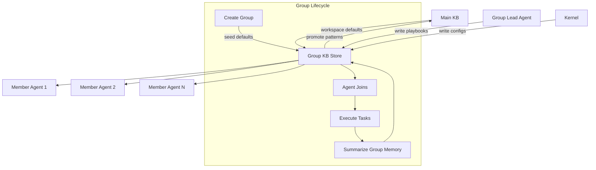

# Group Knowledge Base

> Per-AI-Group knowledge shared by every agent within a group.

## Architecture Overview



## Scope

- Role-specific playbooks (e.g. the Builder group's refactor recipes).
- Shared prompt fragments and few-shot examples for the group.
- Group-scoped memory summarizations.
- Group-specific tool configurations and MCP server bindings.
- Task templates commonly used by the group.
- Group-level routing hints for model selection.
- Collaboration protocols (handoff conventions, review cadence).
- Group-specific safety rules and quality gates.

## Group-Scoped Knowledge Lifecycle

```
1. Group Created
   └─ Seed from Main KB: workspace conventions, global rules
   └─ Initialize empty playbook store

2. Agent Joins Group
   └─ Group KB shares existing playbooks and templates
   └─ Agent contributes initial findings to Individual KB

3. Task Execution
   └─ Agent queries Group KB for relevant playbooks
   └─ Agent writes task observations to Individual KB

4. Group Memory Summarization
   └─ Periodically (default: 7d), Kernel summarizes individual findings
   └─ High-value patterns promoted to Group KB
   └─ Low-value observations expire per retention

5. Promotion to Main KB
   └─ Group Lead or Kernel identifies cross-group patterns
   └─ Entry summarized, promoted to Main KB with credit to source group
```

## Member Read/Write Model

| Role | Read | Write | Delete | Notes |
|------|------|-------|--------|-------|
| Group Lead | All | All entries | Own entries | Can manage playbooks |
| Agent member | All | Own observations | Own entries | Cannot delete group playbooks |
| Kernel | All | All entries | Yes | Administrative |
| Guardian | All | Safety rules only | No | Read-only for review |
| External agent | No | No | No | Must be group member |

Write isolation: an agent's entries are tagged with their `agent_id` and cannot be modified by another agent (except Kernel administrative override).

### Read/Write Scoping

```typescript
interface GroupKBScope {
  workspace: string;
  group_id: string;
  agent_id?: string;  // If specified, limits to that agent's entries
}

// Agent reads group playbooks
const playbooks = await groupKB.query({
  text: "code review checklist",
  scope: { workspace: "my-ws", group_id: "code-reviewer" },
  kinds: ["playbook"],
  k: 5
});

// Agent writes their own observation
await groupKB.write({
  scope: { workspace: "my-ws", group_id: "code-reviewer" },
  kind: "observation",
  content: "Noticed pattern: all API routes use validate() middleware",
  agent_id: "agent-abc",  // Auto-tagged
  retention: "30d"
});
```

## Playbook Management

Playbooks are the primary knowledge artifact in Group KB. They follow a standard schema:

```typescript
interface Playbook {
  id: string;
  group_id: string;
  name: string;
  description: string;
  version: string;           // Semver
  steps: PlaybookStep[];
  trigger: PlaybookTrigger;  // When to suggest this playbook
  tags: string[];
  created_at: number;
  updated_at: number;
  author: string;            // Agent or Kernel
}

interface PlaybookStep {
  order: number;
  action: string;            // Brief action description
  tool?: string;             // Optional tool to use
  prompt_template?: string;  // Optional prompt to inject
  timeout_ms?: number;       // Max duration for this step
  critical: boolean;         // If true, step cannot be skipped
}

type PlaybookTrigger =
  | { kind: "task_type"; task_type: string }
  | { kind: "file_pattern"; pattern: string }
  | { kind: "error_signal"; error_regex: string }
  | { kind: "manual" };
```

Playbooks are versioned. When a playbook is updated, agents using the old version receive a notification suggesting they adopt the new version.

## Template Storage

Group KB stores reusable templates for common tasks:

```typescript
interface TaskTemplate {
  id: string;
  group_id: string;
  name: string;
  kind: "prompt_template" | "tool_config" | "mcp_binding" | "review_checklist";
  content: string;             // Markdown or JSON body
  parameters: string[];        // Template variables, e.g. ["$PROJECT", "$FEATURE"]
  default_parameters?: Record<string, string>;
  version: string;
}

// Example: MCP binding template for code reviewer group
{
  id: "tpl-004",
  group_id: "code-reviewer",
  name: "Static Analysis MCP",
  kind: "mcp_binding",
  content: `{
    "server": "code-analyzer",
    "tools": ["lint", "complexity", "security-scan"],
    "config": { "project": "$PROJECT" }
  }`,
  parameters: ["$PROJECT"],
  version: "1.0.0"
}
```

## Group-Specific Routing Hints

Groups can define routing hints that influence the Nine Router's model selection within that group's context:

```typescript
interface GroupRoutingHint {
  group_id: string;
  preferred_provider?: string;     // e.g. "ollama"
  preferred_model?: string;        // e.g. "llama3.2:3b"
  capability_overrides?: {
    require_capabilities: string[];  // e.g. ["code_generation"]
    exclude_capabilities: string[];  // e.g. ["vision"]
  };
  cost_budget?: {                   // Optional cost constraints
    max_per_token: number;          // USD
    max_per_task: number;           // USD
  };
  priority: number;                 // Higher = more influence (0-100)
  overrideable: boolean;            // Can individual tasks override?
}
```

Hints are resolved during role assignment. If a group has a hint with `overrideable: false`, the Router must respect it even if a cheaper option exists. All provider routing goes through Nine Router — cloud providers are configured within Nine Router, not hard-coded here.

## Failure Modes

| Failure Mode | Description | Impact | Mitigation |
|-------------|-------------|--------|------------|
| Stale playbook | Playbook references deprecated APIs | Incorrect agent behavior | Version tracking; deprecation warnings |
| Template drift | Template variables change but template doesn't | Broken task execution | Parameter validation at use time |
| Write isolation breach | Agent modifies another agent's entry | Data integrity violation | Strict agent_id check on write; audit alert |
| Group KB bloat | Excessive observations never summarized | Degraded query performance | Retention enforcement; summarization job |
| Routing hint conflict | Group hint contradicts workspace override | Unexpected model selection | Priority scoring; conflict detection at write time |
| Member ejection data loss | Agent leaves group, their entries deleted | Knowledge loss | Group lead can retain entries; transfer ownership |
| Playbook update silence | Playbook updated, agents not notified | Inconsistent behavior | Notification on version change; opt-in auto-update |

## Observability Metrics

| Metric | Type | Description |
|--------|------|-------------|
| `kb.group.entries_total` | Gauge | Total entries per group |
| `kb.group.entries_by_kind` | Gauge | Entries by kind per group |
| `kb.group.playbooks_total` | Gauge | Playbook count per group |
| `kb.group.playbook_versions` | Gauge | Distinct playbook versions in use |
| `kb.group.query_duration_ms` | Histogram | Query latency |
| `kb.group.write_latency_ms` | Histogram | Write operation latency |
| `kb.group.member_count` | Gauge | Active members per group |
| `kb.group.promotions_to_main` | Counter | Entries promoted to Main KB |
| `kb.group.summarization_duration_ms` | Histogram | Memory summarization latency |
| `kb.group.template_use_count` | Counter | Template instantiation count |
| `kb.group.routing_hint_hits` | Counter | Routing hints applied |
| `kb.group.staleness_days` | Gauge | Days since last group KB update |

## Acceptance Criteria

1. All group members can query group playbooks and receive results within 300ms.
2. A new group member immediately sees all existing playbooks and templates on first query.
3. Playbook version updates notify all active group members within 60 seconds.
4. Write isolation prevents agent A from modifying agent B's entries; violation attempts are logged and escalated.
5. Group memory summarization runs at least once every 7 days and promotes relevant patterns to Main KB.
6. Routing hints are resolved in under 50ms during model assignment.
7. When a member is removed, their entries can be bulk-transferred to the group lead via a single command.

## Related Documents

- [Global KB](./GLOBAL_KB.md) — cross-workspace knowledge
- [Main KB](./MAIN_KB.md) — project-wide knowledge
- [Individual KB](./INDIVIDUAL_KB.md) — per-agent knowledge
- [Knowledge System](../KNOWLEDGE_SYSTEM.md)
- [AI Groups](../AI_GROUPS.md)
- [Persistent Memory](../PERSISTENT_MEMORY.md)
