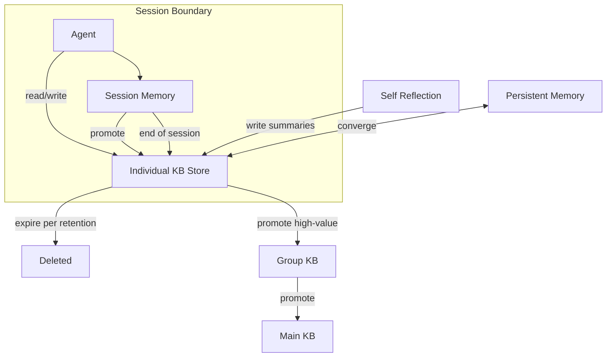

# Individual Knowledge Base

> Per-agent private knowledge — the agent's own notes, scratchpads, and reflections.

## Architecture Overview



## Scope

- Working memory promoted to durable notes.
- Self-reflection outputs (see [Self Reflection](../SELF_REFLECTION.md)).
- Personal few-shot library the agent maintains for itself.
- Intermediate findings and partial artifact drafts.
- Task-specific tool call histories and observations.
- Personal preferences (response format, verbosity level).
- Per-project scratchpads.
- Learning history: what worked, what didn't.

## Session-Scoped Knowledge Lifecycle

```
1. Session Start
   └─ Load Individual KB entries with retention = "session"
   └─ Load Persistent Memory for long-term context

2. During Session
   └─ Agent writes observations (kind = "observation", retention = "session")
   └─ Agent discovers patterns (kind = "fact", retention = "7d")
   └─ Agent generates summaries (kind = "summary", retention = "30d")

3. Session End
   └─ All "session" retention entries are marked expired
   └─ Kernel may promote high-value entries before expiry
   └─ Remaining entries are soft-deleted and purged after grace period

4. Cross-Session
   └─ "7d" and "30d" entries persist across sessions
   └─ Entry is refreshed on access (extends lifetime by retention period)
   └─ Entry with 0 access in retention period is auto-expired
```

## Write-Before-Read Guarantees

Individual KB enforces **write-before-read** for session consistency:

```
function writeBeforeRead(agentId, sessionId):
    // 1. Agent writes an observation
    record = individualKB.write({
        agent: agentId,
        content: "Found flaky test: user_login_test fails intermittently",
        kind: "observation",
        retention: "session"
    })

    // 2. Immediate subsequent read MUST find this record
    //    (strong consistency within the session)
    results = individualKB.query({
        text: "flaky test",
        scope: { agent: agentId },
        k: 5
    })
    assert results contains record  // Guaranteed

    // 3. Cross-session: eventual consistency is acceptable
    //    (index replication may lag)
```

Implementation: writes are committed to the local SQLite store synchronously. Reads within the same session always hit the local store first, then fall back to the distributed index. This ensures write-before-read within a session without requiring distributed consensus.

## Convergence with Persistent Memory

Individual KB and Persistent Memory share the same underlying store but serve different purposes:

| Aspect | Individual KB | Persistent Memory |
|--------|--------------|-------------------|
| Write trigger | Agent explicit write | Implicit from working memory |
| Schema | Structured (MemoryRecord) | Structured (MemoryRecord) |
| Retention | Explicit per entry | Implicit via recency/importance |
| Read pattern | Query with scope filter | Auto-loaded on session start |
| Lifecycle | Write → expire/promote | Auto-summarize → distill |
| Volume | High (explicit notes) | Low (distilled essence) |

Convergence happens at session boundaries:
1. During session, agent writes to Individual KB explicitly.
2. Persistent Memory passively collects working memory signals.
3. At session end, Kernel merges: Individual KB entries with similar content to Persistent Memory entries are deduplicated (content similarity > 0.9).
4. The merged entry retains the longer of the two retention periods.

## Retention Enforcement Algorithm

```
Algorithm: EnforceRetention
Input: agentId, currentTime
Output: number of records expired

01  cursor ← openExpiryCursor(agentId)
02  expired ← 0
03  grace_period_ms ← 7 * 24 * 60 * 60 * 1000  // 7 days

04  for each record in cursor:
05      if record.expires_at <= currentTime:
06          if record.last_accessed_at + grace_period_ms < currentTime:
07              // Hard delete after grace period
08              hardDelete(record.id)
09              expired ← expired + 1
10          else:
11              // Soft delete (still recoverable)
12              softDelete(record.id)
13              expired ← expired + 1
14      elif record.retention == "session" and sessionEnded(agentId, record.session_id):
15          setExpiry(record.id, currentTime)  // Mark for next cycle
16      elif record.retention == "7d" and record.access_count == 0:
17          // No accesses in 7 days — likely low value
18          softDelete(record.id)
19          expired ← expired + 1

20  return expired
```

The enforcement job runs every hour per agent. Agents with no active session are skipped.

## Privacy Isolation

Individual KB entries are strictly isolated per agent:

```typescript
// Enforcement at storage layer
interface IndividualKBStoragePolicy {
  // Partition key: (workspace_id, agent_id)
  partition_key: [string, string];

  // Read guard
  canRead(agentId: string, record: MemoryRecord): boolean {
    return record.agent === agentId
      || hasRole(agentId, "kernel")
      || hasRole(agentId, "critic");
  }

  // Write guard
  canWrite(agentId: string, record: MemoryRecord): boolean {
    return record.agent === agentId;
  }

  // Query guard
  filterQuery(query: IndividualKBQuery, agentId: string): IndividualKBQuery {
    if (hasRole(agentId, "kernel") || hasRole(agentId, "critic")) {
      return query;  // Kernel/Critic can read any agent
    }
    return {
      ...query,
      scope: { ...query.scope, agent: agentId }
    };
  }
}
```

Agents cannot enumerate other agents' entries. Even the count of entries is hidden. Kernel and Critic roles have read-only access for review and promotion purposes, and their reads are logged.

## Promotion Path

Individual KB entries can be promoted to higher tiers by the agent or Kernel:

1. Agent writes note to Individual KB (retention: session/7d).
2. Agent or Kernel identifies high-value entry (heuristics: access count > 5, cross-project relevance).
3. Entry is summarized and re-written to Group KB or Main KB with longer retention.
4. Original Individual entry expires per its retention policy.

Promotion heuristics:

```typescript
interface PromotionHeuristic {
  entry: MemoryRecord;
  access_count: number;
  cross_project_relevance: boolean;   // Referenced from 2+ projects
  cross_agent_interest: boolean;      // Other agents referenced it
  contains_actionable_insight: boolean; // Not just observational
  confidence: number;                  // Agent's self-assessed confidence
}

function shouldPromote(h: PromotionHeuristic): boolean {
  let score = 0;
  if (h.access_count >= 5) score += 30;
  if (h.cross_project_relevance) score += 25;
  if (h.cross_agent_interest) score += 25;
  if (h.contains_actionable_insight) score += 15;
  if (h.confidence > 0.8) score += 5;

  return score >= 60;  // Threshold for promotion
}
```

## Failure Modes

| Failure Mode | Description | Impact | Mitigation |
|-------------|-------------|--------|------------|
| Write before read violation | Read returns stale data after write | Agent acts on stale context | Local-first read; sync writes to local store |
| Retention miss | Entry not expired on schedule | Storage bloat | Hourly enforcement job; 7d grace period |
| Privacy leak | Agent A reads agent B's entry | Information exposure | Storage-layer partition key; role-based guard |
| Convergence data loss | Merge with Persistent Memory loses data | Knowledge loss | Deduplication uses similarity > 0.9 threshold |
| Promotion failure | High-value entry never promoted | Knowledge siloed | Weekly review job; access-count heuristics |
| Session boundary leak | Session entries persist beyond session | Stale context next session | Mark all session entries on session end |
| Storage corruption | SQLite WAL corruption | Partial/total data loss | WAL mode; hourly backups; integrity checks |
| Excessive write volume | Agent writes too many low-value entries | Query noise, storage cost | Rate limit (100 writes/hour/agent); size limit per entry |

## Observability Metrics

| Metric | Type | Description |
|--------|------|-------------|
| `kb.individual.entries_total` | Gauge | Total entries per agent |
| `kb.individual.entries_by_retention` | Gauge | Entries by retention bucket |
| `kb.individual.writes_per_session` | Histogram | Write count per session |
| `kb.individual.query_duration_ms` | Histogram | Query latency |
| `kb.individual.write_latency_ms` | Histogram | Write latency |
| `kb.individual.retention_expired_total` | Counter | Records expired per run |
| `kb.individual.promotions_total` | Counter | Entries promoted to Group/Main KB |
| `kb.individual.convergence_merges_total` | Counter | Merges with Persistent Memory |
| `kb.individual.privacy_violation_attempts` | Counter | Guard violations (alert-worthy) |
| `kb.individual.storage_bytes` | Gauge | Storage per agent |
| `kb.individual.session_entries_cleared` | Counter | Entries cleared at session end |

## Acceptance Criteria

1. An agent's write is immediately visible on the next read within the same session (write-before-read guarantee).
2. Session-scoped entries are cleared within 60 seconds of session end.
3. Retention enforcement expires entries within 1 hour of their expiry timestamp.
4. Agent A cannot read, list, or infer the existence of agent B's entries.
5. Kernel read access to any agent's entries is logged with actor identity and timestamp.
6. Promotion heuristics correctly identify high-value entries with >90% precision (measured over 100 test entries).
7. Convergence with Persistent Memory deduplicates entries with >0.9 content similarity; no data loss for entries below the threshold.
8. An agent writing more than 100 entries in 1 hour is rate-limited and warned.

## Related Documents

- [Global KB](./GLOBAL_KB.md) — cross-workspace knowledge
- [Main KB](./MAIN_KB.md) — project-wide knowledge
- [Group KB](./GROUP_KB.md) — group-specific knowledge
- [Knowledge System](../KNOWLEDGE_SYSTEM.md)
- [Agent Memory](../AGENT_MEMORY.md)
- [Persistent Memory](../PERSISTENT_MEMORY.md)
