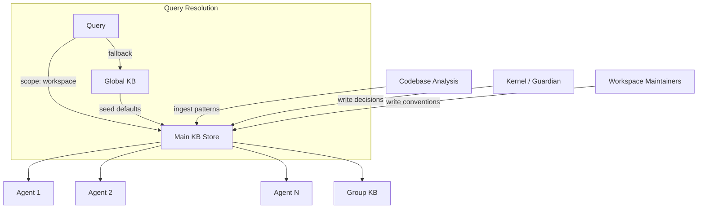

# Main Knowledge Base

> Workspace-level knowledge shared by every project inside a workspace.

## Architecture Overview



## Scope

- Organizational conventions, brand voice, preferred libraries.
- Shared architectural decisions (ADRs promoted from projects).
- Workspace-wide secrets metadata (never the secret values themselves).
- Project-specific model routing overrides.
- Codebase patterns and idioms used across the workspace.
- Workspace-specific prompt prefixes and instructions.
- Shared tool configurations and MCP server definitions.
- Cross-project dependency maps.

## Project-Scoped Query Resolution

Queries can be scoped to a specific project within the workspace. Resolution follows this algorithm:

```
function resolveMainKB(text, workspaceId, projectId):
    // 1. Try project-scoped match first
    results = query({
        text,
        scope: { workspace: workspaceId, project: projectId },
        k: 5
    })
    if results.length >= required_k:
        return results

    // 2. Fall back to workspace-wide (project=null)
    results = query({
        text,
        scope: { workspace: workspaceId, project: null },
        k: 5 - results.length
    })

    // 3. If still insufficient, consult Global KB
    if results.length < required_k:
        global_results = globalKB.query({ text, k: 3 })
        results.push(...global_results)

    return results
```

## Relationship to Other KB Tiers

```
Global KB (cross-workspace)
   └─ seeds Main KB with default language references, policies
       └─ Main KB (workspace-scoped)
            ├─ seeds Group KB with workspace conventions
            │    └─ Group KB (group-scoped)
            │         └─ seeds Individual KB with group playbooks
            └─ Individual KB entries promoted UP to Main KB
```

Main KB is the central tier: it receives promoted entries from Group/Individual KBs and pushes curated entries down to group scope. It is the authoritative source for workspace-level truth.

## Access Control

| Role | Read | Write | Delete |
|------|------|-------|--------|
| Agent (in workspace) | Yes | No | No |
| Kernel | Yes | Yes | Yes |
| Guardian | Yes | Yes (decisions only) | No |
| Workspace Maintainer | Yes | Yes | Yes |
| External agent | No | No | No |

## Ingestion from Codebase Analysis

```typescript
interface CodebaseAnalysisIngestion {
  source: "codebase-analysis";
  trigger: "post-commit" | "scheduled" | "manual";
  analysis_types: AnalysisType[];
}

type AnalysisType =
  | "dependency_graph"     // Cross-project dependency map
  | "pattern_discovery"    // Common code patterns/idioms
  | "api_surface"          // Public API documentation
  | "test_patterns"        // Testing conventions found
  | "config_patterns";     // Config file conventions

// Ingestion pipeline
async function ingestFromCodebase(workspaceId: string): Promise<void> {
  const analysis = await runCodebaseAnalysis(workspaceId);

  for (const pattern of analysis.patterns) {
    if (pattern.confidence > 0.8 && pattern.occurrence_count > 3) {
      await mainKB.write({
        workspace: workspaceId,
        project: pattern.project_id,
        kind: "codebase_pattern",
        content: pattern.description,
        retention: "90d",  // Patterns may become stale
        tags: ["codebase-pattern", pattern.language],
      });
    }
  }

  for (const decision of analysis.architectural_decisions) {
    await mainKB.write({
      workspace: workspaceId,
      project: decision.project_id,
      kind: "decision",
      content: decision.adr_body,
      retention: "forever",
      tags: ["decision", decision.domain],
    });
  }
}
```

## Knowledge Decay and Promotion Policy

### Decay

Records in Main KB have a `confidence` score that decays over time unless refreshed:

| Kind | Initial Confidence | Decay Rate | Refresh Trigger |
|------|-------------------|------------|-----------------|
| `decision` | 1.0 | None (forever) | Manual review |
| `convention` | 0.9 | -0.1/month | Codebase analysis |
| `codebase_pattern` | 0.8 | -0.15/month | Pattern re-discovery |
| `routing_override` | 1.0 | None | On model change |
| `research_result` | 0.7 | -0.2/month | Research Engine re-run |
| `secrets_metadata` | 1.0 | None | On credential rotation |

Records below `confidence < 0.3` are marked for review and auto-deleted after 30 days if not refreshed.

### Promotion

```typescript
interface PromotionRule {
  source_tier: "group" | "individual";
  target_tier: "main" | "global";
  conditions: {
    min_access_count: number;     // Accessed at least N times
    min_confidence: number;       // Confidence > threshold
    reviewed: boolean;            // Human/Kernel reviewed
    cross_project: boolean;       // Relevant to >1 project
  };
  action: "promote" | "summarize_and_promote" | "notify";
}
```

## Cross-Project KB Sharing Model

Projects within the same workspace can share KB entries via explicit sharing:

```
// Share a decision across projects
POST /kb/workspace/{ws}/share
{
  record_id: "mkb-045",
  target_projects: ["web-app", "mobile-app", "api-gateway"],
  share_mode: "reference"    // Reference (read-only copy)
            | "fork"         // Fork (writable copy, diverges)
            | "mirror"       // Mirror (stays in sync)
}

// Shared entries appear in queries for those projects
// References are resolved dynamically — updating the source updates all references
```

## Failure Modes

| Failure Mode | Description | Impact | Mitigation |
|-------------|-------------|--------|------------|
| Stale decision | ADR is outdated but not marked | Wrong architectural guidance | Add `superseded_by` field; review workflow |
| Pattern false positive | Codebase analysis infers wrong pattern | Misleading conventions | Confidence threshold > 0.8; manual review gate |
| Cross-project conflict | Two projects share conflicting entries | Ambiguous guidance | Detect conflicts at share time; flag for review |
| Decay deletion of active entry | Entry confidence < 0.3 but still used | Knowledge loss | Access count boosts confidence; 30d grace period |
| Promotion thrashing | Entry promoted then demoted repeatedly | Unstable KB | Cooldown period after promotion (7d) |
| Workspace boundary leak | Entry visible outside workspace | Information exposure | Strict scope filter enforcement |

## Observability Metrics

| Metric | Type | Description |
|--------|------|-------------|
| `kb.main.entries_total` | Gauge | Total active entries |
| `kb.main.entries_by_project` | Gauge | Entries per project |
| `kb.main.entries_by_kind` | Gauge | Entries per kind |
| `kb.main.query_duration_ms` | Histogram | Query latency |
| `kb.main.query_scope_misses` | Counter | Scope fallback to Global KB |
| `kb.main.ingestion_duration_ms` | Histogram | Codebase analysis ingestion |
| `kb.main.decay_flagged_total` | Counter | Entries flagged for decay |
| `kb.main.promotions_total` | Counter | Entries promoted to/from tiers |
| `kb.main.share_references_total` | Gauge | Active cross-project shares |
| `kb.main.staleness_by_kind` | Gauge | Days since last refresh per kind |

## Acceptance Criteria

1. Every agent in the workspace can query Main KB scoped to their project and receive relevant results within 500ms.
2. Codebase analysis ingestion completes within 10 minutes for a workspace with 50 projects.
3. Decay policy flags entries within 24 hours of crossing the 0.3 threshold.
4. Cross-project sharing reflects updates to source entries within 60 seconds.
5. No entry from workspace A is visible in workspace B queries.
6. Promotion from Group KB requires at least 5 access events across 2+ agents before qualifying.
7. The fallback chain (project → workspace → Global) never exceeds 3 underlying queries per user query.

## Related Documents

- [Global KB](./GLOBAL_KB.md) — cross-workspace knowledge
- [Group KB](./GROUP_KB.md) — group-specific knowledge
- [Individual KB](./INDIVIDUAL_KB.md) — per-agent knowledge
- [Knowledge System](../KNOWLEDGE_SYSTEM.md)
- [Persistent Memory](../PERSISTENT_MEMORY.md)
